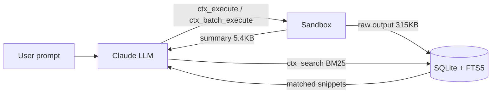

## 들어가며

Claude Code 로 엔진 소스나 그래픽스 파이프라인을 탐색하다 보면 context window 가 금방 바닥난다. `Read` 로 수천 줄 헤더를 긁어오고, 셰이더 컴파일 로그를 붙여 넣고, `UnrealBuildTool` 출력을 덤프하는 순간 남은 컨텍스트가 사라진다. `/compact` 로 눌러 담다가 편집 중이던 파일이나 진행 중 task 맥락을 잃는 것도 잦다.

이 글은 그 문제를 구조적으로 다루는 플러그인 **`context-mode`** ([mksglu/context-mode](https://github.com/mksglu/context-mode)) 를 정리한다. 공식 README 의 주장을 직접 인용하고, UE / C++ 그래픽스 관점에서 어떻게 매핑되는지, 설치 · 사용 · 제거 절차, 그리고 **쓰지 말아야 할 지점**까지 같이 기록했다.

> 이 글의 모든 수치 · 인용문은 `mksglu/context-mode` README (설치 버전 1.0.75) 에서 직접 가져온 것이다. 개인 관찰은 **"일반적 관찰"** 이라고 별도 표기했다. 비판 · 비교 관점은 박재홍, "MCP 도구 출력이 컨텍스트 창을 잡아먹는 문제" (박재홍의 실리콘밸리, 2026-03-02) 를 통해 HN 토론을 정리했다.
{: .prompt-info }

## TL;DR

- **문제** : MCP 도구 호출 하나에 56~86 KB 가 컨텍스트로 쏟아진다. 30분이면 40% 가 도구 출력물로 채워진다.
- **해법** : `context-mode` 는 (1) 원시 데이터를 **샌드박스에 격리**, (2) **SQLite + FTS5 + BM25** 로 필요한 것만 복원, (3) LLM 을 "데이터 처리자" 가 아닌 "코드 생성자" 로 고정.
- **효과** : README 기준 단일 작업 98% 절감, 반복 분석 100x 절감.
- **UE / 그래픽스 핏** : 대형 헤더 탐색, 셰이더 로그 파싱, GPU 프로파일 집계, 빌드 실패 추적 같은 반복 분석 작업에 특히 유리.
- **주의** : "추출 스크립트의 해상도 = 결과 품질" 이라는 구조적 가정, BM25 단독 검색의 한계, ELv2 라이선스.
- **설치** : `/plugin marketplace add mksglu/context-mode` → `/plugin install context-mode@context-mode` → `/reload-plugins` → `/context-mode:ctx-doctor`.

## 1. 문제 — context window 는 어떻게 새는가

### 1.1 README 가 말하는 숫자

README 는 문제를 이렇게 정의한다.

> "Every MCP tool call dumps raw data into your context window. A Playwright snapshot costs 56 KB. Twenty GitHub issues cost 59 KB. One access log — 45 KB. After 30 minutes, 40% of your context is gone."
>
> — `mksglu/context-mode` README, "The Problem"

### 1.2 UE / 그래픽스 관점에서는 더 가혹하다

- 엔진 헤더 하나(`UnrealEngine/Source/Runtime/Engine/...`) 를 열기만 해도 수천 줄.
- 셰이더 컴파일 에러 로그, HLSL/GLSL preprocessor 출력, `ShaderCompileWorker` 메시지는 수백 KB 단위.
- RHI / 렌더 스레드 디버그 출력, `stat unit`, `stat gpu` 덤프, PIX / RenderDoc 캡처 메타데이터는 JSON 수 MB 수준까지 간다.
- `UnrealBuildTool`, `UBA`, linker 출력은 긴 경로와 반복 문자열로 토큰을 낭비한다.

LLM 이 "읽고 기억" 해야 할 건 대부분 **특정 심볼 / 특정 에러 줄** 뿐이다. 하지만 `Read` / `Bash` 흐름은 구분 없이 전부 컨텍스트에 쏟아붓는다.

### 1.3 양방향 소비 — 입력과 출력을 동시에 먹는다

> 이 문제는 **양방향**이다. 도구 정의(input) 와 도구 출력(output) 둘 다 토큰을 먹는다. Cloudflare 의 *Code Mode* 가 입력측(도구 정의 99.9% 압축) 을 공략한 사례라면, `context-mode` 는 출력측을 공략한다. 같은 원리, 다른 방향.
>
> — 박재홍, "MCP 도구 출력이 컨텍스트 창을 잡아먹는 문제" 정리

## 2. 해결 원리 — 세 가지 축

README 는 세 가지 축으로 문제를 정의한다. 모두 원문 인용이다.

### 2.1 Context Saving — 원시 데이터를 샌드박스에 격리

> "Sandbox tools keep raw data out of the context window. **315 KB becomes 5.4 KB. 98% reduction.**"

`ctx_execute` / `ctx_execute_file` / `ctx_batch_execute` 는 명령을 샌드박스에서 실행하고, 결과 전체가 아닌 `console.log()` 로 찍어낸 **요약만** 컨텍스트로 올린다. 실제 원시 출력은 로컬 SQLite 지식베이스에 저장되고 필요할 때 검색으로 끌어온다.

### 2.2 Session Continuity — compact 후에도 맥락 유지

> "Every file edit, git operation, task, error, and user decision is tracked in SQLite. When the conversation compacts, context-mode doesn't dump this data back into context — **it indexes events into FTS5 and retrieves only what's relevant via BM25 search**."

대화가 압축되어도 편집 이력 · 태스크 · 사용자 결정은 SQLite + FTS5 에 남아 있고, 필요한 키워드에 대해서만 BM25 로 복원된다.

### 2.3 Think in Code — LLM 을 데이터 처리기가 아닌 코드 생성기로

> "**The LLM should program the analysis, not compute it.** Instead of reading 50 files into context to count functions, the agent writes a script that does the counting and `console.log()`s only the result. **One script replaces ten tool calls and saves 100x context.**"

가장 중요한 패러다임이다. "파일 50개를 읽고 요약해줘" 가 아니라 "파일 50개를 훑는 스크립트를 짜서 결과만 출력해줘" 가 기본 동작이 된다.

## 3. 아키텍처 — 구성 요소와 데이터 흐름

### 3.1 구성 요소 세 계층

`context-mode` 는 MCP 서버이자 Claude Code 플러그인이다. 핵심은 세 계층.

1. **Sandbox MCP 도구 6종**
   - `ctx_batch_execute` : 여러 명령 병렬 실행 + 자동 인덱싱 + 검색 (연구/조사용 1차 도구)
   - `ctx_execute`, `ctx_execute_file` : JS / TS / Python / Shell 샌드박스 실행
   - `ctx_index` : Markdown / JSON 을 지식베이스에 인덱싱
   - `ctx_search` : BM25 기반 검색
   - `ctx_fetch_and_index` : 웹 리소스를 받아 인덱싱 (WebFetch 대체)
2. **Hook 4종** : `PreToolUse`, `PostToolUse`, `SessionStart`, `PreCompact` — 라우팅 / 인덱싱 / 복원을 자동화
3. **지식베이스** : `better-sqlite3` + FTS5 풀텍스트 인덱스 + BM25 랭킹

### 3.2 데이터 흐름



핵심은 **원시 데이터는 D 에 남고, B(LLM) 는 요약 또는 검색 결과만 본다**.

### 3.3 샌드박스 디테일

샌드박스는 격리된 서브프로세스를 띄우고 **stdout 만 캡처해 컨텍스트로 전달**한다. 원시 데이터(로그, API 응답, 스냅샷) 는 샌드박스 밖으로 나가지 않는다.

- **10개 런타임** : JS / TS / Python / Shell / Ruby / Go / Rust / PHP / Perl / R
- **Bun 감지 시 JS·TS 실행 3~5배 가속**
- **Credential passthrough** : `gh` / `aws` / `gcloud` 같은 인증 CLI 는 환경변수와 설정 경로를 서브프로세스에 상속

### 3.4 지식베이스 디테일

`ctx_index` 는 마크다운을 **헤딩 기준으로 청킹하되 코드 블록은 온전히 보존**한 뒤 FTS5 가상 테이블에 저장한다. 인덱싱 시 **Porter 스테밍**을 적용해 `running` / `runs` / `ran` 이 같은 어간으로 매칭된다.

> §3.3 · 3.4 의 런타임 · 스테밍 · passthrough 디테일은 박재홍 글 "작동 방식: 샌드박스와 지식 베이스 이중 구조" 단락 정리.
{: .prompt-info }

## 4. UE / C++ 그래픽스에 끼워 넣기

추상 원리를 실제 작업에 매핑하면 이득이 분명하다. 이 단락은 공식 문서에 없는 **일반적 관찰**.

- **대형 헤더 · 소스 탐색** : `Source/Runtime/RHI`, `Source/Runtime/RenderCore` 를 `ctx_batch_execute` 로 인덱싱 → BM25 검색으로 `FRHICommandList::SetGraphicsPipelineState` 같은 심볼만 회수. 수천 줄을 컨텍스트에 올리지 않는다.
- **셰이더 컴파일 로그 파싱** : `ShaderCompileWorker` 출력을 `ctx_execute(language: "shell", ...)` 로 받아서, LLM 에는 에러 줄과 파일 경로만 전달.
- **렌더링 프로파일 분석** : `stat unit`, GPU timestamp JSON, RenderDoc export 를 파이썬 스크립트로 집계 → 결과 수치만 컨텍스트로 진입.
- **빌드 실패 원인 추적** : `UnrealBuildTool` 출력 전체를 읽지 않고 에러 패턴만 스크립트로 필터링.
- **패러다임 전환** : "이 파일들 읽고 뭐가 잘못됐는지 말해줘" → "이 파일들에서 X 를 찾는 스크립트를 짜서 실행해줘". 코드베이스가 클수록 이득이 커진다.

## 5. 운영 — 설치 · 사용 · 제거

### 5.1 전제 조건

> "Claude Code v1.0.33+ (`claude --version`). If `/plugin` is not recognized, update first: `brew upgrade claude-code` or `npm update -g @anthropic-ai/claude-code`."

```bash
claude --version
```

### 5.2 설치

Claude Code 세션 안에서 슬래시 커맨드 두 줄로 끝난다.

```text
/plugin marketplace add mksglu/context-mode
/plugin install context-mode@context-mode
```

설치 후 재시작하거나:

```text
/reload-plugins
```

### 5.3 설치 검증

```text
/context-mode:ctx-doctor
```

> "All checks should show `[x]`. The doctor validates runtimes, hooks, FTS5, and plugin registration."

런타임 · 훅 · FTS5 · 플러그인 등록 상태를 점검한다. 모든 항목이 `[x]` 이면 정상.

### 5.4 사용

세션에서 얼마나 컨텍스트를 아꼈는지 tool 별로 확인.

```text
/context-mode:ctx-stats
```

유지 · 관리 커맨드는 두 개.

- `/context-mode:ctx-upgrade` — GitHub 에서 최신 버전 pull, 재빌드, 훅 재설정. 런타임/훅 스펙 갱신 시 주기적으로 실행.
- `/context-mode:ctx-doctor` — 문제 발생 시 진단용으로 언제든 재실행 가능.

> `/compact` 나 `/clear` 이후에도 지식베이스와 세션 통계는 유지된다. 완전히 초기화하고 싶을 때만 `ctx-purge` 를 쓰자.
{: .prompt-warning }

### 5.5 제거

**지식베이스 → 플러그인 → marketplace → (선택) 잔여 파일** 순서. 슬래시 커맨드는 플러그인이 제거되면 쓸 수 없으므로 `ctx-purge` 를 **먼저** 실행해야 한다.

**① 지식베이스 정리 (되돌릴 수 없음)**

```text
/context-mode:ctx-purge
```

> "Permanently delete all indexed content from the knowledge base."
>
> — README, Slash Commands 표

개인 코드나 API 키가 로그로 들어갔을 가능성이 있다면 플러그인 제거 전에 반드시 실행.
{: .prompt-warning }

**② 플러그인 제거**

```text
/plugin uninstall context-mode@context-mode
```

또는 CLI:

```bash
claude plugin uninstall context-mode@context-mode
# 동의어: claude plugin remove context-mode@context-mode
```

**③ marketplace 제거**

플러그인 자체를 제거해도 marketplace 등록은 남는다.

```text
/plugin marketplace remove context-mode
```

```bash
claude plugin marketplace remove context-mode
# 동의어: claude plugin marketplace rm context-mode
```

`add` 시 입력한 `mksglu/context-mode` 는 source 이고, 등록되는 marketplace 이름은 `context-mode` 다. `claude plugin marketplace list` 로 확인.

**④ 잔여 파일 정리 (선택)**

플러그인 캐시와 marketplace 메타데이터는 보통 다음 경로에 남는다 (환경에서 직접 확인한 경로).

```text
~/.claude/plugins/cache/context-mode/
~/.claude/plugins/marketplaces/context-mode/
```

`/plugin uninstall` · `marketplace remove` 로 대부분 정리되지만, 잔여 디렉토리가 남았다면 수동 삭제.

```bash
rm -rf ~/.claude/plugins/cache/context-mode
rm -rf ~/.claude/plugins/marketplaces/context-mode
```

> 위 경로는 Claude Code 기본 플러그인 저장 위치이며 공식 README 에 명시된 경로는 아니다. 환경에 따라 다를 수 있으므로 삭제 전에 `ls` 로 먼저 확인하자.
{: .prompt-warning }

### 5.6 (대안) MCP-only 설치

훅 · 슬래시 커맨드 없이 **샌드박스 도구 6종만** 쓰고 싶다면:

```bash
claude mcp add context-mode -- npx -y context-mode
```

자동 라우팅이 비활성화되어, 모델이 `Bash` / `Read` / `WebFetch` 대신 `ctx_*` 를 쓰도록 강제되지 않는다. "전체 플러그인 도입 전 사전 체험" 용도.

## 6. 한계 · 반론 — 쓰지 말아야 할 지점

무조건 좋은 도구는 없다. 구조적 한계 → 운영 제약 → 메타 의문 순으로 정리.

### 6.1 정확도 트레이드오프 — "추출 코드를 선제적으로 짜야 한다" 가정

HN 토론의 핵심 반론. 98% 압축은 모델이 *데이터를 보기 전에* 정확한 추출 스크립트를 짤 수 있다는 가정에 기댄다.

> "모델이 `git log --oneline | wc -l` 을 작성했는데 실제로 필요한 건 특정 커밋 메시지였다면, 그 정보는 영영 사라진다."
>
> — HN 토론, 박재홍 글 "정확도 트레이드오프" 단락 정리

`ctx_execute` 로 153 커밋을 107B 로 압축하는 게 인상적이긴 하지만, **출력 스크립트의 해상도가 결과 품질을 좌우한다**. 불완전한 추출은 컨텍스트에 들어가 모델 판단을 왜곡할 수 있다. 즉 "무엇을 버려도 되는가" 를 모델에게 떠넘기는 구조라는 점을 의식하고 써야 한다.

UE / 그래픽스로 옮기면: "셰이더 컴파일 로그에서 에러 줄만 추출" 처럼 **패턴이 명확한 작업은 안전**하고, "RHI 캡처에서 이상 징후 찾기" 처럼 **탐색형 작업은 한 번에 최적 스크립트를 짜기 어렵다**.

### 6.2 BM25 의 한계 — 구조화 데이터 + 자연어 혼합

지식베이스 검색이 BM25 단독이라는 점도 약점이다. 도구 출력은 JSON · 테이블 · 설정 같은 **구조화 데이터**와 댓글 · 에러 메시지 · docstring 같은 **자연어**가 섞여 있는데, 키워드 매칭 기반 BM25 는 구조화 데이터 절반에서 무너진다.

HN 에서 제안된 차기 아키텍처는 **하이브리드 검색**. Model2Vec(potion-base-8M, 256차원 임베딩) + `sqlite-vec` 벡터 검색을 FTS5 BM25 와 **RRF(Reciprocal Rank Fusion)** 로 결합하는 방식이다. RRF 는 두 검색의 순위 목록을 점수 보정 없이 병합해 BM25 의 **식별자 · 함수명 정확 매칭** 강점과 벡터 검색의 **의미론적 매칭** 강점을 동시에 얻는다. (출처: 박재홍 글 "BM25 의 한계와 하이브리드 검색의 가능성" 정리)

엔진 코드처럼 식별자 매칭이 결정적인 경우 BM25 가 더 잘 맞을 때도 많지만, 자연어 비중이 높은 디자인 문서 · 컴파일러 메시지에는 한계가 있다.

### 6.3 디버깅 가시성 저하 (일반적 관찰)

샌드박스 실행 결과는 요약만 컨텍스트로 올라오므로, 스크립트가 잘못된 판단을 내렸을 때 **원인 파악이 한 단계 더 필요하다**. 공식 문서에 명시된 단점이 아니라 구조상 예상되는 트레이드오프다. 지식베이스를 직접 열어보거나 `ctx_search` 로 원문을 다시 끌어오는 절차가 생긴다.

### 6.4 라이선스 — Elastic License v2.0 (ELv2)

MIT / Apache 가 아닌 **ELv2** 다. 관리형 서비스 형태의 재판매를 제한한다. 개인 · 사내 사용에는 통상 문제가 없지만, 회사 정책이나 내부 플랫폼 통합 시에는 라이선스 팀과 사전 확인이 필요하다.

### 6.5 플랫폼별 편차

README 에 명시된 한계.

- **Cursor**, **OpenCode** 는 `SessionStart` 훅을 지원하지 않아 라우팅 규칙 파일(`.cursor/rules/context-mode.mdc` 등) 을 프로젝트에 직접 두어야 한다.
- Claude Code, Gemini CLI, VS Code Copilot 등은 훅으로 자동 주입되므로 프로젝트 루트가 깨끗하게 유지된다.

### 6.6 생태계 의존성

npm · Claude Code plugin marketplace · `better-sqlite3` 네이티브 빌드 · 각 플랫폼의 훅 스펙에 의존한다. 런타임 업데이트 시 `ctx-doctor` 로 상태 확인, `ctx-upgrade` 는 정기적으로 실행.

### 6.7 더 근본적인 의문 — 출력 압축이 정답인가

박재홍 글이 정리한 HN 의 메타 반론 네 가지. 이 도구를 **쓸지 말지**보다 **언제 쓸지** 를 정할 때 참고할 만하다.

1. **"애초에 80개 이상의 도구를 컨텍스트에 넣어야 하는가"** — 압축 대신 서브에이전트로 관심 영역을 분리하면 되지 않냐는 시각. "컨텍스트는 금이고, 현재 문제와 무관한 정보는 아무리 압축해서 넣어도 결과 품질이 떨어진다" 는 주장.
2. **MCP 대신 CLI 직접 사용** — `gh` 같은 GitHub CLI 는 GitHub MCP 와 같은 일을 하면서 토큰 비용은 훨씬 적다. MCP 표준화의 비용을 굳이 지불할 이유가 없는 영역도 있다.
3. **이미 줄어든 문제 규모** — Claude Code 최신 버전이 MCP 출력을 25K 토큰으로 제한하고 bash 파이프 연산자로 전체 출력을 읽는 방식을 쓴다는 제보. 사실이라면 `context-mode` 가 해결하려는 격차의 절대 크기는 공식적으로 일부 줄어든 셈.
4. **샌드박스 라우팅 공격성** — 모든 `curl` / `wget` / `WebFetch` 를 일괄 라우팅하는 방식은 56 KB Playwright 스냅샷에는 합리적이지만, `curl api.example.com/health` 가 200B 를 반환하는 경우에는 오버헤드만 추가한다. **선별적 라우팅**이 다음 단계로 지적된다.

UE / 그래픽스 관점으로 옮기면 4번이 특히 와닿는다. 작은 stat 출력까지 전부 샌드박스를 거치게 만들면 디버깅 사이클이 느려진다. **출력 크기 임계치 기반 패스스루**가 향후 개선 포인트.

## 7. 정리 — 언제 쓰고 언제 피할까

**쓸 때 이득이 크다**

- 대형 코드베이스 전역 심볼 / 패턴 검색 (`UnrealEngine/Source/...`)
- 셰이더 컴파일 로그, 빌드 로그, 프로파일 덤프 등 **대용량 · 구조적 텍스트** 집계
- 반복 분석 (`"50개 파일에서 X 를 세라"` 류)

**피하거나 조심할 때**

- 탐색형 작업 — "뭐가 이상한지 모르겠는데 일단 훑어봐" 에는 추출 스크립트를 사전에 짜기 어렵다
- 200B 수준의 작은 출력 — 샌드박스 라우팅이 오버헤드만 더한다
- ELv2 가 걸리는 상용 배포 / 관리형 서비스 재판매 맥락

**한 줄 요약**

- **문제** : LLM context window 는 대규모 엔진 코드 · 셰이더 로그 · 프로파일 덤프를 감당하지 못한다.
- **해법** : 원시 데이터를 샌드박스에 격리하고, SQLite + FTS5 + BM25 로 필요한 것만 복원하며, LLM 을 "데이터 처리자" 가 아닌 "코드 생성자" 로 고정한다.
- **근거** : README 기준 단일 작업 98% 절감, 반복 분석 100x 절감.
- **비용** : ELv2 라이선스, 플랫폼별 훅 지원 편차, 샌드박스 요약으로 인한 디버깅 가시성 저하.
- **조심할 점** : 출력 스크립트의 해상도 = 결과 품질, BM25 단독은 구조화 + 자연어 혼합에서 한계, 80개 도구 자체가 필요한가 같은 메타 의문.

"압축률 98%" 를 정보 손실 없이 달성되는 수치로 받아들이기보다는, **정확도와 압축률 사이의 최적점을 각자의 워크플로에서 찾아야 하는 도구**로 보는 편이 현실적이다. 대규모 코드베이스와 대용량 로그를 다루는 UE / C++ 그래픽스 개발 환경에서는 이 트레이드오프가 대체로 이득 쪽으로 기운다.

## 참고

- <https://github.com/mksglu/context-mode>
- <https://wikidocs.net/blog/@jaehong/8547/>
