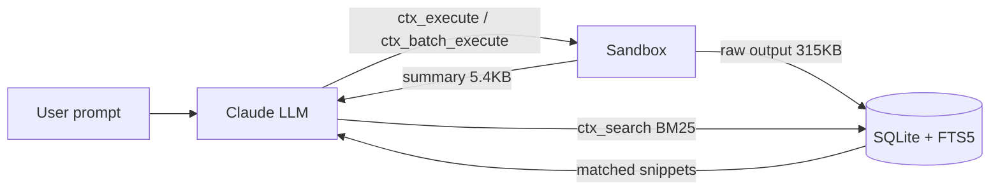

## 들어가며

Claude Code 로 대규모 엔진 소스나 그래픽스 파이프라인을 탐색하다 보면, 금방 context window 가 바닥난다. `Read` 로 수천 줄 헤더를 긁어오고, 셰이더 컴파일 로그를 붙여 넣고, `UnrealBuildTool` 출력을 덤프하는 순간 남은 컨텍스트가 사라진다. 이후 대화는 `/compact` 로 눌러 담다가, 편집 중이던 파일이나 진행 중이던 task 맥락을 잃어버리는 일이 잦다.

이 글은 그 문제를 구조적으로 다루는 플러그인 **`context-mode`** ([mksglu/context-mode](https://github.com/mksglu/context-mode)) 를 정리한다. 공식 README 의 주장을 직접 인용하고, UE / C++ 그래픽스 관점에서 왜 유용한지, 어떻게 설치 · 사용 · 제거하는지, 그리고 어떤 제약이 있는지 같이 기록했다.

> 이 글의 모든 수치 · 인용문은 `mksglu/context-mode` 저장소의 `README.md` (설치 버전 기준 1.0.75) 에서 직접 가져온 것이다. 개인 관찰로 덧붙인 부분은 명시적으로 "일반적 관찰" 이라고 표기했다.
{: .prompt-info }

## 1. 왜 필요한가 — context window 포화 문제

README 는 문제를 이렇게 정의한다.

> "Every MCP tool call dumps raw data into your context window. A Playwright snapshot costs 56 KB. Twenty GitHub issues cost 59 KB. One access log — 45 KB. After 30 minutes, 40% of your context is gone."
>
> — `mksglu/context-mode` README, "The Problem"

UE / 그래픽스 개발자 입장에서 이 시나리오는 실질적으로 훨씬 가혹하다.

- 엔진 헤더 하나(`UnrealEngine/Source/Runtime/Engine/...`) 를 열기만 해도 수천 줄.
- 셰이더 컴파일 에러 로그, HLSL/GLSL preprocessor 출력, `ShaderCompileWorker` 메시지는 수백 KB 단위.
- RHI / 렌더 스레드 디버그 출력, `stat unit`, `stat gpu` 덤프, PIX/RenderDoc 캡처 메타데이터는 JSON 수 MB 수준까지 간다.
- `UnrealBuildTool`, `UBA`, linker 출력은 긴 경로와 반복 문자열로 토큰을 낭비한다.

이 모든 데이터를 LLM 이 "읽고 기억" 해야 할 필요는 거의 없다. 대부분은 **특정 심볼 / 특정 에러 줄** 만 필요하다. 하지만 일반적인 `Read` / `Bash` 흐름은 그 구분을 하지 않고 전부 컨텍스트에 쏟아붓는다.

## 2. context-mode 가 해결하는 3가지

README 는 세 가지 축으로 문제를 정의한다. 모두 원문 인용이다.

### 2.1 Context Saving — 원시 데이터를 샌드박스에 격리

> "Sandbox tools keep raw data out of the context window. **315 KB becomes 5.4 KB. 98% reduction.**"

`ctx_execute` / `ctx_execute_file` / `ctx_batch_execute` 는 명령을 샌드박스에서 실행하고, 결과 전체가 아닌 `console.log()` 로 찍어낸 **요약만** LLM 컨텍스트로 올린다. 실제 원시 출력은 로컬 SQLite 지식베이스에 저장되고 필요할 때 검색으로 끌어온다.

### 2.2 Session Continuity — compact 후에도 맥락 유지

> "Every file edit, git operation, task, error, and user decision is tracked in SQLite. When the conversation compacts, context-mode doesn't dump this data back into context — **it indexes events into FTS5 and retrieves only what's relevant via BM25 search**."

즉 대화가 압축되어도, 편집 이력 / 태스크 / 사용자 결정은 SQLite + FTS5 인덱스에 남아 있고, 필요한 키워드에 대해서만 BM25 로 복원된다.

### 2.3 Think in Code — LLM 을 데이터 처리기가 아닌 코드 생성기로

> "**The LLM should program the analysis, not compute it.** Instead of reading 50 files into context to count functions, the agent writes a script that does the counting and `console.log()`s only the result. **One script replaces ten tool calls and saves 100x context.**"

이게 가장 중요한 패러다임이다. "파일 50개를 읽고 요약해줘" 가 아니라 "파일 50개를 훑는 스크립트를 짜서 결과만 출력해줘" 가 기본 동작이 된다.

## 3. 어떻게 동작하는가 — 구성 요소

`context-mode` 는 MCP 서버이자 Claude Code 플러그인이다. 핵심 구성요소는 세 가지다.

1. **Sandbox MCP 도구 6종**
   - `ctx_batch_execute` : 여러 명령 병렬 실행 + 자동 인덱싱 + 검색 (연구/조사용 1차 도구)
   - `ctx_execute`, `ctx_execute_file` : JS / TS / Python / Shell 샌드박스 실행
   - `ctx_index` : Markdown / JSON 을 지식베이스에 인덱싱
   - `ctx_search` : BM25 기반 검색
   - `ctx_fetch_and_index` : 웹 리소스를 받아 인덱싱 (WebFetch 대체)
2. **Hook 4종** : `PreToolUse`, `PostToolUse`, `SessionStart`, `PreCompact` — 라우팅 / 인덱싱 / 복원을 자동화
3. **지식베이스** : `better-sqlite3` + FTS5 풀텍스트 인덱스 + BM25 랭킹



핵심은 **원시 데이터는 D 에 남고, B(LLM) 는 요약 또는 검색 결과만 본다** 는 점이다.

## 4. 설치 (Claude Code)

### 4.1 전제 조건

README 가 요구하는 최소 조건은 다음과 같다.

> "Claude Code v1.0.33+ (`claude --version`). If `/plugin` is not recognized, update first: `brew upgrade claude-code` or `npm update -g @anthropic-ai/claude-code`."

즉 `/plugin` 슬래시 커맨드를 인식하려면 Claude Code 1.0.33 이상이 필요하다.

```bash
claude --version
```

### 4.2 설치

Claude Code 세션 안에서 슬래시 커맨드 두 줄로 끝난다. README 의 공식 절차다.

```text
/plugin marketplace add mksglu/context-mode
/plugin install context-mode@context-mode
```

설치가 끝나면 Claude Code 를 재시작하거나 세션에서 다음을 실행한다.

```text
/reload-plugins
```

### 4.3 설치 검증

README 의 검증 절차는 `ctx-doctor` 한 줄이다.

```text
/context-mode:ctx-doctor
```

> "All checks should show `[x]`. The doctor validates runtimes, hooks, FTS5, and plugin registration."

런타임 · 훅 · FTS5 · 플러그인 등록 상태를 점검한다. 모든 항목이 `[x]` 이면 정상.

### 4.4 (대안) MCP-only 설치

훅과 슬래시 커맨드 없이 **샌드박스 도구 6종만** 쓰고 싶다면 이 방식이 있다. README 에 명시된 대안 설치다.

```bash
claude mcp add context-mode -- npx -y context-mode
```

이 경우 자동 라우팅이 비활성화되어, 모델이 `Bash` / `Read` / `WebFetch` 대신 `ctx_*` 를 쓰도록 강제되지 않는다. "전체 플러그인을 도입하기 전에 먼저 써 보고 싶을 때" 용도다.

## 5. 사용

### 5.1 컨텍스트 절약량 확인

세션에서 얼마나 컨텍스트를 아꼈는지 tool 별로 본다.

```text
/context-mode:ctx-stats
```

### 5.2 유지 · 관리

- `/context-mode:ctx-upgrade` — GitHub 에서 최신 버전 pull, 재빌드, 훅 재설정. 런타임/훅 스펙이 갱신될 때 주기적으로 실행.
- `/context-mode:ctx-doctor` — 문제 발생 시 진단용으로 언제든 재실행 가능.

> `/compact` 나 `/clear` 이후에도 지식베이스와 세션 통계는 유지된다. 완전히 초기화하고 싶을 때만 `ctx-purge` 를 쓰자.
{: .prompt-warning }

## 6. 제거

완전 제거는 **지식베이스 → 플러그인 → marketplace** 순서로 진행한다. 슬래시 커맨드는 플러그인이 제거되면 더 이상 쓸 수 없으므로 `ctx-purge` 를 **먼저** 실행해야 한다.

### 6.1 지식베이스 정리 (`ctx-purge`)

인덱싱된 모든 콘텐츠를 삭제한다. **되돌릴 수 없다.**

```text
/context-mode:ctx-purge
```

> "Permanently delete all indexed content from the knowledge base."
>
> — README, Slash Commands 표

개인 코드나 API 키가 로그로 들어갔을 가능성이 있다면, 플러그인 제거 전에 반드시 실행.
{: .prompt-warning }

### 6.2 플러그인 제거

```text
/plugin uninstall context-mode@context-mode
```

또는 CLI:

```bash
claude plugin uninstall context-mode@context-mode
# 동의어: claude plugin remove context-mode@context-mode
```

### 6.3 marketplace 제거

플러그인 자체를 제거해도 marketplace 등록은 남는다. 완전히 지우려면:

```text
/plugin marketplace remove context-mode
```

또는 CLI:

```bash
claude plugin marketplace remove context-mode
# 동의어: claude plugin marketplace rm context-mode
```

`add` 시 입력한 `mksglu/context-mode` 는 source 이고, 등록되는 marketplace 이름은 `context-mode` 다. `claude plugin marketplace list` 로 확인 가능.

### 6.4 잔여 파일 정리 (선택)

플러그인 캐시와 marketplace 메타데이터는 보통 다음 경로에 남는다 (사용자 환경에서 직접 확인한 경로).

```text
~/.claude/plugins/cache/context-mode/
~/.claude/plugins/marketplaces/context-mode/
```

`/plugin uninstall` · `marketplace remove` 로 대부분 정리되지만, 잔여 디렉토리가 남았다면 수동 삭제한다.

```bash
rm -rf ~/.claude/plugins/cache/context-mode
rm -rf ~/.claude/plugins/marketplaces/context-mode
```

> 위 경로는 Claude Code 의 기본 플러그인 저장 위치이며 공식 README 에 명시된 경로는 아니다. 환경에 따라 다를 수 있으므로 삭제 전에 `ls` 로 먼저 확인하자.
{: .prompt-warning }

## 7. UE / C++ 그래픽스 개발자에게 특히 유용한 지점

앞선 원칙을 실제 작업에 매핑하면 이득이 분명하다. (이 단락은 공식 문서에는 없는 **일반적 관찰** 이며, 위의 원리에서 유도한 응용 예시다.)

- **대형 헤더 / 소스 탐색** : `Source/Runtime/RHI`, `Source/Runtime/RenderCore` 같은 디렉토리를 `ctx_batch_execute` 로 인덱싱한 뒤, BM25 검색으로 `FRHICommandList::SetGraphicsPipelineState` 같은 심볼만 회수. 수천 줄을 컨텍스트에 올리지 않는다.
- **셰이더 컴파일 로그 파싱** : `ShaderCompileWorker` 출력을 `ctx_execute(language: "shell", code: "...")` 로 받아서, LLM 에는 에러가 난 줄과 파일 경로만 전달.
- **렌더링 프로파일 분석** : `stat unit`, GPU timestamp JSON, RenderDoc export 등을 파이썬 스크립트로 집계 → 결과 수치만 컨텍스트로 진입.
- **빌드 실패 원인 추적** : `UnrealBuildTool` 출력 전체를 읽지 않고, 에러 패턴만 스크립트로 필터링.
- **패러다임 전환** : "이 파일들 읽고 뭐가 잘못됐는지 말해줘" 대신 "이 파일들에서 X 를 찾는 스크립트를 짜서 실행해줘" 가 기본 동작이 된다. 이건 코드베이스가 클수록 이득이 커진다.

## 8. 단점 · 제약 · 주의할 점

무조건 좋은 도구는 없다. 실제로 확인된 제약과, 사용하면서 염두에 둘 점을 함께 기록한다.

### 8.1 라이선스 — Elastic License v2.0 (ELv2)

`context-mode` 는 MIT / Apache 가 아닌 **ELv2** 다. ELv2 는 관리형 서비스 형태로 재판매하는 행위를 제한한다. 개인 · 사내 사용에는 통상 문제가 없지만, 회사 정책이나 내부 플랫폼 통합 시에는 라이선스 팀과 사전 확인이 필요하다.

### 8.2 학습 곡선 — 사고 방식 전환이 강제됨

README 는 "Think in Code" 를 **"mandatory paradigm"** 이라고 표현한다. 즉 `Bash` / `Read` / `WebFetch` 에 익숙한 습관을 버리고 `ctx_execute` / `ctx_search` / `ctx_fetch_and_index` 를 우선 쓰는 흐름에 적응해야 한다. 훅이 이를 강제하지만, 익숙해지기 전까지는 의도와 다른 경로로 동작한다고 느낄 수 있다.

### 8.3 플랫폼별 편차

README 에 명시된 한계다.

- **Cursor**, **OpenCode** 는 `SessionStart` 훅을 지원하지 않아, 라우팅 규칙 파일 (`.cursor/rules/context-mode.mdc` 등) 을 프로젝트에 직접 두어야 한다.
- Claude Code, Gemini CLI, VS Code Copilot 등은 훅으로 자동 주입되므로 프로젝트 루트가 깨끗하게 유지된다.

### 8.4 디버깅 가시성 저하 (일반적 관찰)

샌드박스 실행 결과는 요약만 컨텍스트로 올라오므로, 스크립트가 잘못된 판단을 내렸을 때 **원인 파악이 한 단계 더 필요하다**. 이 부분은 공식 문서에 명시된 단점이 아니라 구조상 예상되는 트레이드오프다. 지식베이스를 직접 열어보거나 `ctx_search` 로 원문을 다시 끌어오는 절차가 생긴다.

### 8.5 생태계 의존성

npm / Claude Code plugin marketplace, `better-sqlite3` 네이티브 빌드, 각 플랫폼의 훅 스펙에 의존한다. 런타임 업데이트 시 `ctx-doctor` 로 상태를 확인해야 하며, `ctx-upgrade` 는 정기적으로 돌려 주는 게 안전하다.

## 9. 정리

- **문제**: LLM context window 는 대규모 엔진 코드 / 셰이더 로그 / 프로파일 덤프를 감당하지 못한다.
- **해법**: `context-mode` 는 (1) 원시 데이터를 샌드박스에 격리하고, (2) SQLite + FTS5 + BM25 로 필요한 것만 복원하며, (3) LLM 을 "데이터 처리자" 가 아닌 "코드 생성자" 로 고정한다.
- **근거**: README 기준 단일 작업에서 98% 컨텍스트 절감, 반복 분석에서 100x 절감을 주장한다.
- **비용**: ELv2 라이선스, 사고 방식 전환, 플랫폼별 훅 지원 편차, 샌드박스 요약으로 인한 디버깅 가시성 저하.

대규모 코드베이스와 대용량 로그를 다루는 UE / C++ 그래픽스 개발 환경에서, 이 트레이드오프는 대체로 이득 쪽으로 기운다. 특히 "50개 파일을 읽어서 X 를 세라" 류의 반복 분석 작업에서 체감 효과가 크다.

## 참고

- GitHub: <https://github.com/mksglu/context-mode>
- 작성자: Mert Koseoğlu
- 라이선스: Elastic License v2.0
- 설치 버전(이 글 기준): 1.0.75
