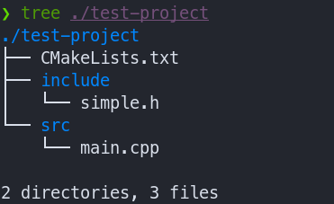
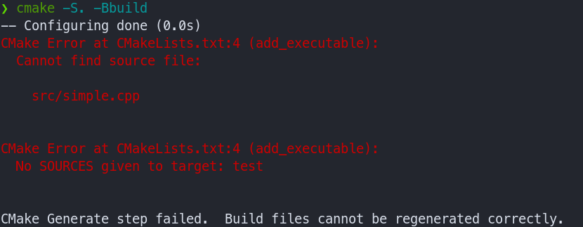
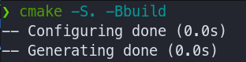
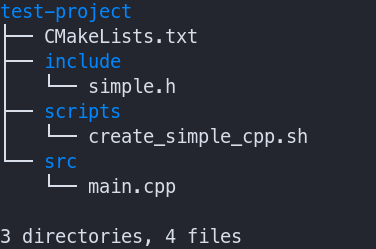
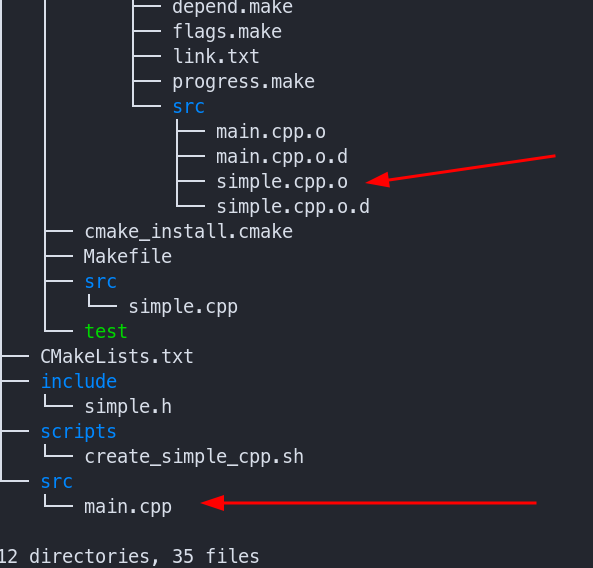
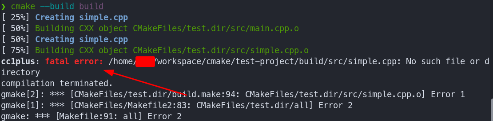

## CMake의 목적과 기능범위

`빌드 시스템(build system)`이 하는 일은 연속적인 이벤트(`컴파일러/링커 호출`)를 통해 최종적으로 프로그램을 생성하는 것이다. 빌드 시스템 파일, 혹은 프로젝트 파일은 프로그래머의 의도에 맞게 컴파일러/링커 호출을 조직화한 명령서라고 할 수 있다.
`CMake`가 중심이 되는 프로젝트라면, 이를 활용해 빌드에 필요한 소스 파일까지 생성할 수 있다.

- `CMake의 목적`
  - 프로젝트(빌드 시스템) 파일 생성
- `CMake의 실제 지원 범위`
  - 프로젝트 생성 및 속성, 의존성 설정
    - `add_library`, `add_executable`, `set_target_properties`, `add_dependencies`, ...
  - 프로그램 호출
    - [add_custom_command](https://cmake.org/cmake/help/latest/command/add_custom_command.html#generating-files)
    - [add_custom_target](https://cmake.org/cmake/help/latest/command/add_custom_target.html)

## [CMake에서 Build로 이어지는 과정](https://cgold.readthedocs.io/en/latest/tutorials/cmake-stages.html)

`CMake`를 사용해 빌드 시스템 파일을 생성하는 과정 `2 pass assembler`와 유사하다고 할 수 있다.

- __`Configuration`__
  - `CMakeLists.txt` 문법 검사
  - Macro, Function 실행
  - CMake Cache 생성
- __`Generation`__
  - `Target`에서 Build System Project 생성

`Configuration` 단계에서는 `CMakeLists.txt`를 해석하고, 재사용 가능한 값을 토대로 `CMakeCache.txt`를 생성한다. `CMakeFiles` 디렉토리 역시 이 단계에서 생성된다. `CMakeFiles` 디렉토리 안에는 CMake의 `log`, `변경`을 확인하는 `stamp` 파일들이 보관된다.

`Generation`은 `Configuration`의 정보를 바탕으로 Build System에서 사용하는 `Project 파일`을 생성한다. `TargetDirectories.txt`와 같은 디렉토리 목록도 이 단계에서 생성된다.

## 파일 생성

위의 `지원 범위`에서 CMake는 `소스 파일`을 생성할 수 있다고 말하였다. 여기에 사용되는 것이 바로 `command`이다.

만약 존재하지 않는 파일이 `CMakeLists.txt`에 명시되면, `CMake`는 이를 오류로 처리한다.



위의 프로젝트는 `src` 디렉토리에 `main.cpp` 밖에 없다. 이때, `CMakeLists.txt`의 내용이 아래와 같다면

```cmake
cmake_minimum_required(VERSION 3.20)
project(test-project VERSION 1.0 LANGUAGES CXX)

add_executable(test
    include/simple.h

    src/main.cpp
    src/simple.cpp  # <-- 알 수 없음.
)

target_link_directories(test
PRIVATE
    ${CMAKE_CURRENT_SOURCE_DIR}/include
)
```

다음과 같은 오류를 출력할 것이다.



`Build System` 파일을 만들기 전에 `CMake`에서 소스 파일이 존재하지 않는다고 경고하는 내용이다. 

여기에서 `스크립트 파일`을 호출하여 `simple.cpp` 파일을 만들어 빌드에 사용해 보자.

### [add_custom_command](https://cmake.org/cmake/help/latest/command/add_custom_command.html#command:add_custom_command)

먼저 `CMakeLists.txt`에 새로운 내용이 추가되어야 한다.

```cmake
cmake_minimum_required(VERSION 3.20)
project(test-project VERSION 1.0 LANGUAGES CXX)

# 주어진 명령으로 파일 생성
add_custom_command(
    # output path
    OUTPUT src/simple.cpp
    # command + args
    COMMAND echo "my first command!"
)

add_executable(test
    include/simple.h

    src/main.cpp
    src/simple.cpp
)

target_link_directories(test
PRIVATE
    ${CMAKE_CURRENT_SOURCE_DIR}/include
)
```



하지만 echo 명령이 실제로 파일을 생성하지는 않기 때문에, 빌드를 시도하면 `No such file or directory` 메시지와 함께 실패할 것이다.

`add_custom_command` 함수는 기본적으로 `OUTPUT`과 `COMMAND` 인자만 제공하면 동작하지만, 보다 정확한 의도를 반영하기 위해서는 여러가지 인자를 제공해야 한다.

먼저, 소스 파일을 생성하는 스크립트를 작성해서 `COMMAND`에서 이를 호출하도록 하여 파일이 생성되는 위치를 확인할 수 있다.



소스 파일을 생성하는 스크립트의 내용은 다음과 같다.

```terminal
# create_simple_cpp.sh
echo "extern const int version = 5;" > src/simple.cpp;
```

```cmake
if(WIN32)
    add_custom_command(
        OUTPUT src/simple.cpp
        COMMAND call ${CMAKE_CURRENT_SOURCE_DIR}/scripts/create_simple_cpp.sh
        COMMENT "Creating simple.cpp"
    )
elseif(UNIX)
    # 주어진 명령으로 파일 생성
    add_custom_command(
        # output path
        OUTPUT src/simple.cpp
        # command + args
        COMMAND terminal ${CMAKE_CURRENT_SOURCE_DIR}/scripts/create_simple_cpp.sh
        COMMENT "Creating simple.cpp"
    )
endif()
```

`Windows`에서는 `Powershell`이 아니라 `Command Prompt`를 사용하면 된다.

***`CMake`를 실행하면, `Comment`가 출력되지 않는 것을 볼 수 있다.*** 이는 `Configuration/Generation` 단계에서는 `command`가 실행되지 않는다는 의미이다.

실제로 `빌드` 했을 때, `comment`가 출력된 것을 볼 수 있다.

```terminal
...
[ 75%] Building CXX object CMakeFiles/test.dir/src/simple.cpp.o
...
```

그리고 지금까지는 `상대경로`를 사용하면, `CMakeLists.txt` 파일을 기준으로, 즉 `SOURCE_DIR`을 기준으로 파일을 참조하였다. 하지만 `add_custom_command`의 생성 파일은 `빌드 디렉토리(BINARY_DIR)`를 기준으로 한다.

만약, 스크립트 실행 중 `no such file or directory` 오류가 발생한다면, 이것은 `build` 디렉토리 내에 `src` 디렉토리가 없기 때문이다. (create_simple_cpp.sh 스크립트에는 디렉토리를 생성하는 내용이 없기 때문)
그런 경우 `src` 디렉토리를 생성한 뒤 다시 시도하자.

```terminal
$ make build/src
```

프로젝트 디렉토리를 `tree`로 조회하면, `src` 디렉토리에는 여전히 `main.cpp`만 존재하는 것을 확인할 수 있다.



이런 경우, 빌드 과정에서 생성하는 파일을 어떻게 관리할 것인지 생각해봐야 한다. 

- `Working Directory 지정`
- `Script에 인자 제공`

#### Working Directory + add_custom_command

`CLI` 환경에서 `working directory`는 명령을 호출한 위치를 의미한다. `terminal`에서는 `pwd`, `powershell`에서는 `Get-Location` 명령으로 확인할 수 있다. 바로 위에서 실행한 `tree`의 경우, `/path/to/test`가 `working directory`가 된다.

`add_custom_command`는 선택 인자로 [WORKING_DIRECTORY](https://cmake.org/cmake/help/latest/command/add_custom_command.html)를 명시할 수 있다. 이 경로를 `SOURCE_DIR`로 바꿔서 실행시켜 보자.

```cmake
if(WIN32)
    add_custom_command(
        OUTPUT src/simple.cpp
        COMMAND call ${CMAKE_CURRENT_SOURCE_DIR}/scripts/create_simple_cpp.sh
        WORKING_DIRECTORY ${CMAKE_CURRENT_SOURCE_DIR}
        COMMENT "Creating simple.cpp"
    )
elseif(UNIX)
    # 주어진 명령으로 파일 생성
    add_custom_command(
        # output path
        OUTPUT src/simple.cpp
        # command + args
        COMMAND terminal ${CMAKE_CURRENT_SOURCE_DIR}/scripts/create_simple_cpp.sh
        WORKING_DIRECTORY ${CMAKE_CURRENT_SOURCE_DIR}
        COMMENT "Creating simple.cpp"
    )
endif()
```

이렇게 수정하면 아래와 같이 `오류`가 발생할 것이다.



오류 메시지의 경로를 확인해보면, 두 경우 모두 `build` 디렉토리에서 `src/simple.cpp`를 찾으려 했다는 것을 알 수 있다. ***이는 `add_custom_command`의 OUTPUT이 묵시적으로 `BINARY_DIR`를 기준으로 하기 때문이다.*** 
`OUTPUT` 인자를 `절대경로`로 변경하면, 빌드가 성공하는 것을 확인할 수 있다.

```cmake
cmake_minimum_required(VERSION 3.20)
project(test-project VERSION 1.0 LANGUAGES CXX)

if(WIN32)
    add_custom_command(
        OUTPUT ${CMAKE_CURRENT_SOURCE_DIR}/src/simple.cpp
        COMMAND call ${CMAKE_CURRENT_SOURCE_DIR}/scripts/create_simple_cpp.sh
        WORKING_DIRECTORY ${CMAKE_CURRENT_SOURCE_DIR}
        COMMENT "Creating simple.cpp"
    )
elseif(UNIX)
    # 주어진 명령으로 파일 생성
    add_custom_command(
        # output path
        OUTPUT ${CMAKE_CURRENT_SOURCE_DIR}/src/simple.cpp
        # command + args
        COMMAND terminal ${CMAKE_CURRENT_SOURCE_DIR}/scripts/create_simple_cpp.sh
        WORKING_DIRECTORY ${CMAKE_CURRENT_SOURCE_DIR}
        COMMENT "Creating simple.cpp"
    )
endif()

add_executable(test
    include/simple.h

    src/main.cpp
    src/simple.cpp
)

target_link_directories(test
PRIVATE
    ${CMAKE_CURRENT_SOURCE_DIR}/include
)
```


`src` 디렉토리에 `main.cpp`와 `simple.cpp`가 함께 위치하는 것도 화인할 수 있다.

#### Script with Arguments + add_custom_command

다르게 생각해보면, 코드 생성 스크립트가 너무 단순하다는 것도 문제의 원인일 수 있다.

스크립트 파일의 위치, 혹은 프로젝트 디렉토리와 같이 묵시적인 정보를 기반으로 (상대경로를 사용해서) 내용을 작성했지만, 실제 스크립트는 완전히 다른 경로에서 실행되고 있을 수 있다는 점을 간과한 것이다. 
스크립트가 현재 실행되는 위치와 무관하게 동작해야 할 수도 있다. 절대 경로를 인자로 제공받는다면 이 문제를 해결할 수 있다.

```terminal
PROJECT_DIR=$1

echo "extern const int version = 5;" > ${PROJECT_DIR}/src/simple.cpp
```

이제 `COMMAND`를 통해 스크립트에서 인자를 전달하면 된다. 하지만 앞서 `working directory`에서 확인한 것처럼, `CMake`가 생성한 프로젝트는 여전히 `build/simple.cpp`를 찾을 것이다. 따라서 `OUTPUT`에는 `절대 경로`가 필요하다.

```cmake
cmake_minimum_required(VERSION 3.20)
project(test-project VERSION 1.0 LANGUAGES CXX)

if(WIN32)
    add_custom_command(
        OUTPUT ${CMAKE_CURRENT_SOURCE_DIR}/src/simple.cpp
        COMMAND call ${CMAKE_CURRENT_SOURCE_DIR}/scripts/create_simple_cpp.sh ${CMAKE_CURRENT_SOURCE_DIR}
        COMMENT "Creating simple.cpp"
    )
elseif(UNIX)
    # 주어진 명령으로 파일 생성
    add_custom_command(
        # output path
        OUTPUT ${CMAKE_CURRENT_SOURCE_DIR}/src/simple.cpp
        # command + args
        COMMAND terminal ${CMAKE_CURRENT_SOURCE_DIR}/scripts/create_simple_cpp.sh ${CMAKE_CURRENT_SOURCE_DIR}
        COMMENT "Creating simple.cpp"
    )
endif()

add_executable(test
    include/simple.h

    src/main.cpp
    src/simple.cpp
)

target_link_directories(test
PRIVATE
    ${CMAKE_CURRENT_SOURCE_DIR}/include
)
```

두 방법의 `차이점`은 `working directory` 방법이 순수하게 `CMakeLists.txt`의 변경만으로 해결된 반면, `Script Argument` 방법은 스크립트 파일도 변경해야 했다는 부분에 있다.
이는 단점이 될 수 있지만, `out-of-tree` build가 기본 빌드 시나리오인 경우, 혹은 다수의 스크립트가 함께 사용되는지에 따라 더 타당한 판단이 될 수 있다.

---

## Target

> `CMake`에서 `Target`은 `Configuration의 대상`을 말하며, 이는 최종적으로 `Build System`에서 사용하는 `Project`로 `Generation` 된다.
> 
> 쉽게 말해, ***CMake에서의 `빌드 단위`*** 라고 요약할 수 있다.

Project파일은 `명령서`와 같다고 할 수 있다. 보통 이 `명령`은 컴파일러/링커 호출을 의미하지만, 조금 더 일반적인 일도 포함될 수 있다. 
이를테면 `Unix Makefiles` 프로젝트들은 보통 `install/uninstall`을 지원하며, `Visual Studio`는 [Build Event](https://learn.microsoft.com/en-us/cpp/build/understanding-custom-build-steps-and-build-events?view=msvc-170&viewFallbackFrom=vs-2017)에 사용자 커맨드를 호출할 수 있도록 지원한다.

`Command`와 `Target`은 의존성을 설정할 수 있고, `CMake` 파일의 작성자가 실행 내용(`COMMAND`)을 명시한다는 점이 유사하다. 
하지만 `Target`은 `Name`, `Property`를 가진 보다 복잡한 개체를 의미한다. [CMake 공식문서](https://cmake.org/cmake/help/latest/manual/cmake-buildsystem.7.html)에서는 `Target`을 다음과 같이 구분한다.

- `Binary Target`
  - executable
  - library
- `Pseudo Target`
  - Imported Target
    - pre-existing dependency
  - Alias Target
    - read-only name

이 중 `Binary Target`은 실제로 빌드 시스템 파일을 생성하는 경우를 의미하며, `Pseudo Target`은 이미 존재하는 파일을 사용하는 경우만을 의미한다.

> - **`Binary Target`**
>   - 실제 빌드 시스템 파일 생성하는 경우를 의미.
> - **`Pseudo Target`**
>   - 이미 존재하는 파일을 사용하는 경우를 의미.

## Pseudo Target

### Imported Target

`add_executable`, `add_library` 모두 `IMPORTED` 옵션을 지원한다.

```cmake
add_executable(test IMPORTED /usr/bin/test)

add_library(xxx IMPORTED SHARED)
add_library(yyy IMPORTED STATIC)
```

`add_executable(IMPORTED)`는 `add_custom_command`의 `COMMAND`로 사용한다.

이미 빌드 된 라이브러리가 있는 경우, `add_library(IMPORTED)`를 사용한다. 해당 라이브러리가 `CMake`가 아닌 빌드 툴을 사용해서 빌드를 수행했더라도, 별도의 `CMake` 파일을 작성하여 이를 `CMake` 프로젝트에 `결합`시킬 수 있다.

다만 이때는 소스 파일에서부터 빌드를 수행하는 것이 아니기 때문에, `CMakeLists.txt`가 아닌 다른 `cmake 설정(config) 파일`을 작성하게 된다.

`CMakeLists.txt`가 아닌 다른 파일을 작성한다는 것에 의아할 수 있겠지만, 라이브러리가 미리 빌드되었다는 것은 아래와 같은 정보를 전달받아야 한다는 의미이므로, **빌드와는 의미가 달라지기 때문**이라고 해석할 수 있다.

- 헤더 파일을 찾을 디렉토리 (`target_include_directories`)
- 라이브러리 의존성 (`target_link_libraries`)
- 빌드할 당시에 사용한 옵션 (`target_compile_options`)

이는 `find_package()` 부분에서 살펴보자.

### Alias Target

이 부분은 [OpenMP](https://cmake.org/cmake/help/latest/module/FindOpenMP.html)를 예로 든 예제이다.

```cmake
cmake_minimum_required(VERSION 3.20)

// 소스 파일 목록없이 타겟 생성
add_library(xyz IMPORTED SHARED)

find_package(OpenMP)
if(OpenMP_FOUND)
    set_target_properties(xyz 
    PROPERTIES
        COMPILE_FLAGS "${OpenMP_CXX_FLAGS}"
    )

    if(ANDROID)
        set_target_properties(xyz
        PROPERTIES
            INTERFACE_LINK_LIBRARIES omp  # <-- ??
        )
    else()
        set_target_properties(xyz
        PROPERTIES
            INTERFACE_LINK_LIBRARIES OpenMP::OpenMP_CXX # <-- ??
        )
    endif()
endif()
```

플랫폼에 따라서 `omp.dll`, `omp.lib`, `libomp.a`, `libomp.so`, `libomp.dylib` 등이 될 것이다.

이 점을 생각하면 `omp`가 `CMake Target`의 `이름`이라는 것을 알 수 있다. `CMake` 파일들은 특정 플랫폼에서 사용하는 이름, 확장자에 대해 거의 신경을 쓰지 않으며, 가능한 그렇게 되도록 작성한다. 달리 말해, `CMake`의 방식을 우선적으로 고려한다.

```cmake
target_link_libraries(foo
PRIVATE
	xyz
)
```

별다른 주석이 없다면, `CMake`와 그 파일의 사용자는 위 내용에 대해서 다음과 같은 생각을 할 것이다.

- `xyz`라는 이름의 `CMake Target`이 존재한다.
- 만약 `xyz`가 `Target`이 아니라면, `xyz`는 라이브러리를 의미한다.
  - `lib[xyz].a` 혹은 `lib[xyz].so`와 같은 이름의 파일이 `link_directories` 혹은 `target_link_directories` (CMake 3.13부터 지원)로 지정한 디렉토리들 안에 존재한다.

이것이 의미하는 바는, `xyz`라는 이름만으로는 **혼동의 여지가 있다**는 것이다. 위의 `OpenMP` 예시에서 `::`을 사용한 부분이 있었다. 이를 `Namespace`라고 한다. 아래와 같이 사용할 수 있다.

```cmake
...
elseif(NOT WIN32)
	set_target_properties(custom_mp
    PROPERTIES
    	INTERFACE_LINK_LIBRARIES OpenMP::OpenMP_CXX
    )
endif()
```

이런 `ALIAS`를 발견한다면, `CMake`와 읽는 이 모두 이것이 `Target`의 이름이라고 확신할 수 있다. `Alias Target`은 아래와 같이 매우 간단한 방법으로 추가할 수 있다.

```cmake
add_library(foo INTERFACE)

add_library(Foo::foo ALIAS foo)
```

### Custom Target

[add_custom_target()](https://cmake.org/cmake/help/latest/command/add_custom_target.html) 함수와 [add_custom_command()](https://cmake.org/cmake/help/latest/command/add_custom_command.html)의 결정적인 `차이점`은 `add_custom_command`는 **파일을 생성하기 위한(`OUTPUT`) 기능**이고, `add_custom_target`은 **여러 명령을 (이름으로) 묶어서 실행하기 위한 기능**이라는 점이다. 그리고 `Target`이기 때문에 `add_dependencies()`의 대상이 될 수 있다는 점이 있다.

예를 들어, html 파일을 하나 다운로드 받아, 이를 첨부하여 메일을 보내는 일은 아래처럼 작성할 수 있다. 두 기능 모두 `curl`를 사용해 진행한다.

```cmake
// CMakeLists.txt

cmake_minimum_required(VERSION 3.20)

add_custom_target(get_index_html
	COMMAND curl -L "https://cmake.org/cmake/help/latest/"
    			-o "index.html"
    WORKING_DIRECTORY ${CMAKE_CURRENT_SOURCE_DIR}
)

add_custom_target(mail_index_html
	COMMAND curl --url 'smtps://smtp.gmail.com:465'
    			--ssl-reqd --mail-from 'sender@mail.com'
                --mail-rcpt 'receiver@mail.com'
                --upload-file "${CMAKE_CURRENT_SOURCE_DIR}/index.html"
                --user 'sender@mail.com:$ENV{sender_password}'
	WORKING_DIRECTORY ${CMAKE_INSTALL_PREFIX}
)

add_dependencies(mail_index_html get_index_html)
```

위에서 보면, `$ENV{sender_password}`를 사용해 `CMake` 변수가 아니라 시스템 환경변수를 참조하는 것을 볼 수 있다. 아래와 같이 `CMake`를 호출하기 전에 환경변수의 값을 정해주면 문제가 없다.

예를 들어, `terminal` 사용자라면:
```terminal
export send_password="password"
```

`powershell` 사용자라면:
```terminal
$env:sender_password="password"
```

처럼 환경변수를 설정할 수 있다.

위의 예시는 `UNIX/Linux` `curl`을 사용하므로, `CMake`를 바로 다음에 호출하면 아래와 같은 내용을 볼 수 있다.

> 주의: powershell에서 curl명령은 `Invoke-webRequest`의 Alias입니다.
{: .prompt-danger }

빌드를 수행하지 않는 예시이기 때문에 간단히 `WSL(Windows Subsystem for Linux)`를 사용하면, `Linux curl`을 실행할 수 있다.

`mail_index_html`은 `Target`의 이름이므로, 이를 실행하려면 `--target` 파라미터를 명시하는 것으로 충분하다.

```terminal
cmake --build . --target mail_index_html
```

## 📒 정리

- https://gist.github.com/luncliff/6e2d4eb7ca29a0afd5b592f72b80cb5c
