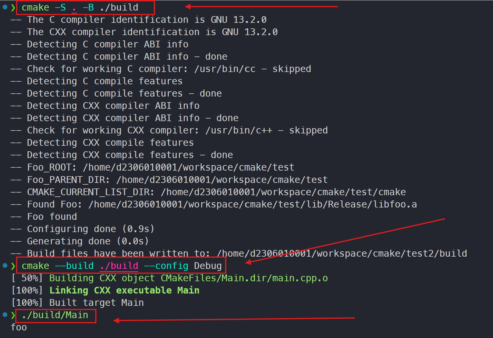

만약 어떠한 라이브러리를 새로운 프로젝트에서 사용하고 싶은데 어떻게 사용하는 것이 좋을까?

- `Visual Studio` 솔루션을 만들고 경로 지정하는 방법
- `CMake` 프로젝트를 만들어서 타겟의 속성을 설장하는 방법

한 두개의 라이브러리라면 위의 방법 중 하나를 선택해서 처리하면 그만이다. 허나 저런 반복 작업을 수 많은 프로젝트에 대해서 해야 한다면 골치가 아플것이다.

`CMake`는 이런 상황을 위해서 설치한 내용들을 쉽게 사용할 수 있도록, `CMake Package`라는 개념을 통해 자동화하는 방법을 제공한다.

> `Package`는 CMake 기반의 빌드 시스템에 종속성 정보를 제공한다.
> `find_package( )` 명령을 통해 `Package` 들을 검색할 수 있다. 
> `find_package( )`를 사용한 결과는 `IMPORTED` 타겟 집합이나 빌드와 연관된 정보에 대한 변수들의 집합이다.

- `downstream` : 설치된 모듈을 사용하는 모듈 칭한다.
- `upstream` : 설치된 모듈 칭한다.

`CMake`에서 직접적으로 접근할 수 있는 `Package` 들에는 두 가지 종류가 있다.

- `Config-File Package`
  - `downstreawm`에서 사용할 `upstream`에 의해서 제공되는 파일들의 집합을 의미
- `Find-Module Package`
  - 주요 헤더 파일이나 라이브러리들 같은 종속성들을 검색하는데 사용할 규칙 집합을 가진 파일이다.
  - 일반적으로 `Find-Module`은 `upstream`이 CMake를 사용해 빌드되지 않았을 때나 `package configuration` 파일들을 제대로 포함하고 있지 않은 경우에 사용된다.

## Find-Module Package

`Module`은 `Find<PackageName>.cmake`라는 이름을 가진 `CMake` 스크립트 파일을 의미한다. 이것은 `find_package()` 명령을 통해 실행된다.

예를 들어, `FindFoo.cmake`라는 package가 존재한다면 다음과 같이 사용하게 된다.

```cmake
find_package(Foo)
```

`Find-Module` package의 주요 기능은 `변수`, `매크로`, `imported target` 등을 제공하는 것이다. 예를 들어 ***타겟들의 이름들, include 디렉토리들의 경로 같은 것들을 제공***할 수 있다.

일반적으로 정해져 있는 표준적인 변수명들이 있다. 예를 들어 `find_pakcage()` 호출을 통해 `FindXXX.cmake`라는 파일을 찾아서 실행하게 되면 다음과 같은 변수들을 채워줘야 한다. 더 많은 표준 변수들은 [이곳](https://cmake.org/cmake/help/latest/manual/cmake-developer.7.html)에서 찾아보면 된다.

- `XXX_FOUND`
  - `find_package()` 호출이 성공했을 때, `true`로 설정된다.
- `XXX_INCLUDE_DIRS`
  - 최종 include directory의 경로들이다.
- `XXX_LIBRARIES`
  - 해당 모듈과 함께 사용될 라이브러리들이다. CMake `target`이 될 수도 있고, `library binary`의 절대 경로가 될 수도 있다. 링커가 자신의 경로에서 검색해야 하는 library의 이름이 될 수도 있다.
- `XXX_DEFINITIONS`
  - 해당 모듈을 사용하는 코드를 컴파일할 때 사용할 `compile definition` 들이다.
- `XXX_ROOT_DIR`
  - 해당 모듈의 `base directory` 경로이다.

예를 들어 `FindFoo.cmake`에 대한 `find_package()`가 성공했을 때, 다음과 같이 할 수 있다.

```cmake
project(Sample)

// Foo module 검색
find_package(Foo)
// 만약 찾았다면
if(Foo_FOUND)
    // SampleMain executable 생성
    add_executable(SampleMain main.cpp)
    // header file의 include 경로 지정
	target_include_directories("${Foo_INCLUDE_DIR}")
    // SampleMain에 Foo 링크
    target_link_libraries(SampleMain "${Foo_LIBRARIES}")
endif()
```

## Find-Module 위치

`Find-Module` package는 어디에 존재해야 할까?

좋은 라이브러리 개발자들은 `target`을 `install`할 때, `Find-Module` package와 `Config-File` package를 같이 배포해 준다.

하지만 그냥 헤더와 라이브러리만 배포할 수도 있다. 이 경우 일반적으로는 설치 디렉토리나 본인의 소스 트리내에 `cmake`라는 디렉토리를 만들고, 그곳에다가 `Find-Module` package를 생성하면 된다.

설치된 라이브러리가 여러 프로젝트에서 `재사용`될 수 있는 확률이 높으므로, 그곳에 `Find-Module` package를 만들면 편하게 재사용이 가능해진다.

## Find-Module 작성

- **Cache Variables (CMakeLists.txt에서 사용할 수 없음)**
  - `Foo_ROOT` : foo 라이브러리 설치 directory
  - `Foo_LIBRARY` : 현재 구성에서 선택된 library
  - `Foo_LIBRARY_DEBUG` : Debug 구성을 위한 library
  - `Foo_LIBRARY_RELEASE` : Release 구성을 위한 library
  - `Foo_INCLUDE_DIR` : include directory
- **Non-cache Variables (CMakeLists.txt에서 사용할 수 있음)**
  - `Foo_FOUND` : foo 라이브러리를 찾았는지 여부. 찾았으면 TRUE, 아니면 FALSE
  - `Foo_LIBRARIES` : 찾은 타겟 라이브러리의 경로
  - `Foo_INCLUDE_DIRS` : 찾은 타겟 라이브러리의 include 경로

```cmake
// FindFoo.cmake

// 아래 include() 명령은 CMake 코드를 파일이나 모듈에서 로드하고 실행해 준다.

// FindFoo.cmake는 cmake 디렉토리에 있으므로 부모 디렉토리를 찾는다.
get_filename_component(
    Foo_PARENT_DIR
    "${CMAKE_CURRENT_LIST_DIR}" DIRECTORY
)
// 부모 디렉토리를 Foo_ROOT로 설정한다.
set(Foo_ROOT "${Foo_PARENT_DIR}" CACHE PATH "${Foo_ROOT}")

message(STATUS "Foo_ROOT: ${Foo_ROOT}")
message(STATUS "Foo_PARENT_DIR: ${Foo_PARENT_DIR}")
message(STATUS "CMAKE_CURRENT_LIST_DIR: ${CMAKE_CURRENT_LIST_DIR}")

// NAMES에 있는 파일을 포함하는 directory를 검색하여 Foo_LIBRARY_RELEASE와 Foo_LIBRARY_DEBUG를 채워준다.
find_library(
    Foo_LIBRARY_RELEASE NAMES "foo"
    PATHS "${Foo_ROOT}/lib/Release" REQUIRED
)

find_library(
    Foo_LIBRARY_DEBUG NAMES "foo_d"
    PATHS "${Foo_ROOT}/lib/Debug" REQUIRED
)

// 구성에 따라서 Foo_LIBRARY_RELEASE와 Foo_LIBRARY_DEBUG 중 하나를 선택해 주는 매크로
// 최종적으로 Foo_LIBRARY를 채워 준다.
include(SelectLibraryConfigurations)
select_library_configurations(Foo)

// NAMES에 있는 파일들을 포함하는 directory를 검색하여 Foo_INCLUDE_DIR를 채워준다.
find_path(Foo_INCLUDE_DIR NAMES "foo.h"
    PATHS "${Foo_ROOT}/include" REQUIRED
)

// Foo_LIBRARY, Foo_INCLUDE_DIR이 유효한지 확인해서 Foo_FOUND를 설정해 준다.
include(FindPackageHandleStandardArgs)
find_package_handle_standard_args(
    Foo
    FOUND_VAR Foo_FOUND
    REQUIRED_VARS Foo_LIBRARY Foo_INCLUDE_DIR
)

// Foo_FOUND가 true이면 외부에 노출해줄 변수들을 설정해 준다.
if(Foo_FOUND)
    set(Foo_LIBRARIES ${Foo_LIBRARY})
    set(Foo_INCLUDE_DIRS ${Foo_INCLUDE_DIR})
endif()

```

결론적으로 `FindFoo.cmake`가 `find_package()` 명령에 의해 실행되면, `Foo_FOUND`, `Foo_LIBRARIES`, `Foo_INCLUDE_DIR` 등의 변수를 사용할 수 있게 된다. 어떤 변수들을 더 제공할지는 이 `Find-Module` package를 작성한 사람의 마음대로이며, 일반적으로 표준 변수명들을 사용해 라이브러리 사용자에게 정보를 제공한다.

이렇게 만들어진 `Find-Module` package는 여러 프로젝트에서 재사용될 수 있다.

## 소스 트리 구성

위의 `FindFoo Package`를 사용하는 `executable target`을 만들어 보자. 소스 트리의 구성은 다음과 같다.

```bash
test2
	CMakeLists.txt
    main.cpp
```

```cmake
// CMakeLists.txt

cmake_minimum_required(VERSION 3.20)

project(find_test)

# FooFind가 있는 경로를 CMAKE_MODULE_PATH에 추가한다.
list(APPEND CMAKE_MODULE_PATH "/home/d2306010001/workspace/cmake/test/cmake")

# FooFind를 실행한다.
find_package(Foo)

if(Foo_FOUND)
    message(STATUS "Foo found")

    add_executable(Main main.cpp)
    # FooFind가 제공한 include 경로 추가
    target_include_directories(Main PRIVATE ${Foo_INCLUDE_DIRS})
    # FooFind가 제공한 라이브러리 링크
    target_link_libraries(Main PRIVATE ${Foo_LIBRARIES})
else()
    message(STATUS "Foo not found")
endif()
```

```cmake
// main.cpp

#include <foo.h>

int main() {
    ShowLibraryName();

    return 0;
}
```

## 빌드 트리 구성

```terminal
cmake -S . -B ./build
cmake --build ./build --config Debug
./build/Main
```



`FindFoo.cmake` 패키지를 잘 불러와서 컴파일과 실행이 잘 된 것을 확인할 수 있다.

--- 

## 📒 정리

- CMake 타겟을 설치했을 때, `Find-Module Package`를 사용하면 재사용성을 높일 수 있다.
- `Find-Module Package`는 작성하기 어렵기 때문에 배포하는 개발자가 해당 패키지를 같이 배포해 주는 것이 좋다.
- 배포하는 개발자가 같이 배포해 주지 않았어도 직접 `Find-Module Package`를 만들어 여러 프로젝트에서 재사용할 수 있다.
