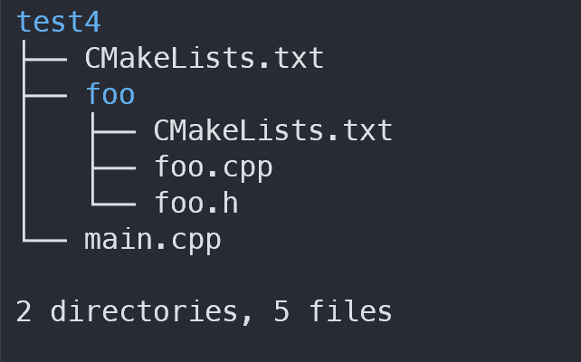
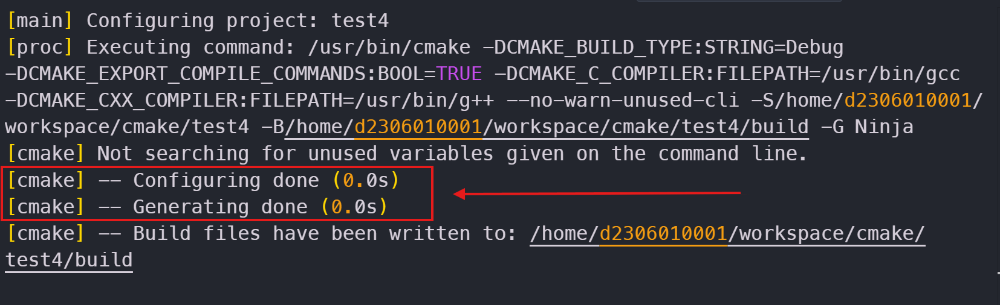
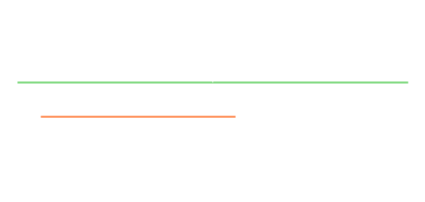
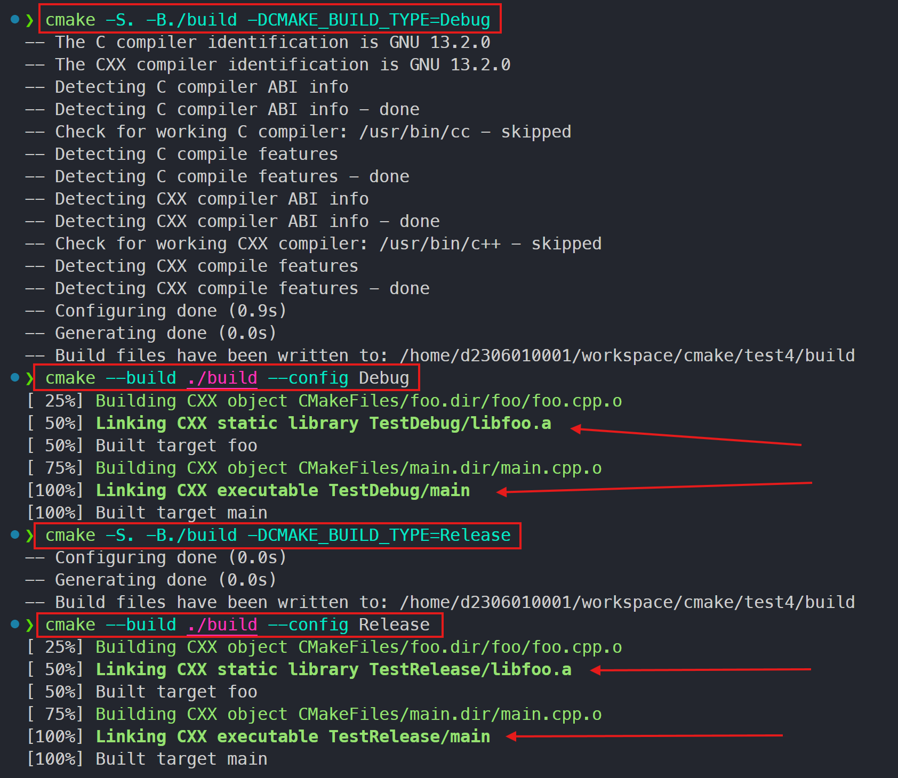
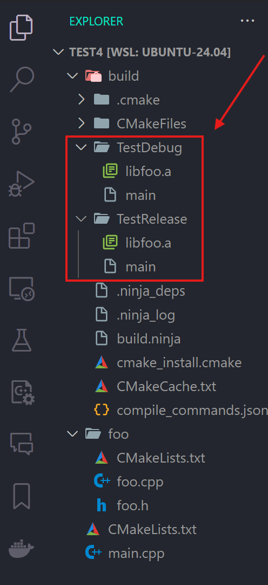
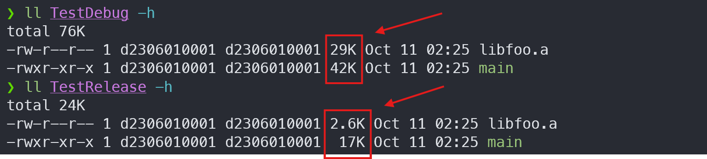
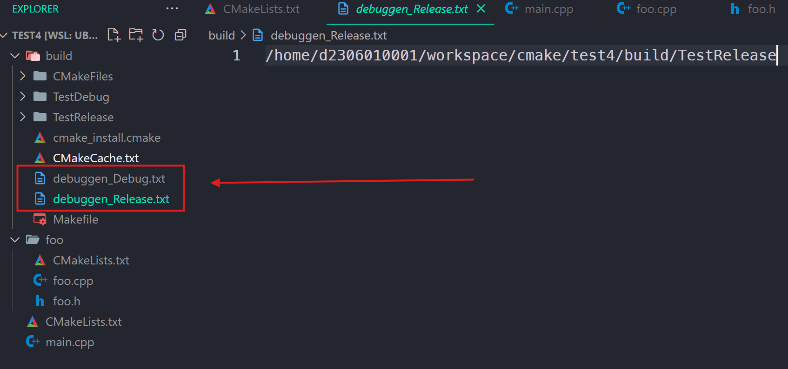
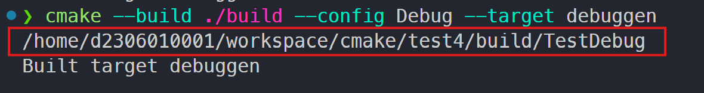

## Generator Expression 개요

`CMake`의 생성기 표현식은 빌드 시스템 생성기를 위한 표현식이다.

생성기 표현식은 `$<...>`의 형태를 띄고 있다. `CMake` parser가 메타 함수인 `cmake_language()` 처럼 `...`의 내용을 해석해서 생성 작업을 대신해 준다고 생각하면 된다. 이것은 특정 빌드 구성을 위해서 정보를 생성하는 역할을 해 준다.

그런데 생성기 표현식은 어느곳에서나 사용할 수 있는 것이 아니라 `생성 단계`와 `빌드 단계`에서만 사용할 수 있다. `CMakeLists.txt`를 사용하는 빌드 시스템의 전체 프로세스는 세 가지 단계로 나뉜다.

1. `구성 단계 (Configuration Stage)`
2. `생성 단계 (Generation Stage)`
3. `빌드 단계 (Build Stage)`

## 실행 단계들

일반적으로 소스 트리에 있는 `CMakeLists.txt`를 가지고 빌드 트리를 구성하면, `구성 단계`와 `생성 단계`를 동시에 실행하게 된다. 그래서 보통은 `구성 단계`와 `생성 단계`를 구분하지 않는다. 하지만 실제로는 확실하게 구분되어 있다.

{: width="400" }

```cpp
// foo.h

#ifndef __FOO_FOO_H__
#define __FOO_FOO_H__

void ShowFoo();

#endif
```

```cpp
// foo.cpp

#include "foo.h"
#include <iostream>

void ShowFoo() {
    std::cout << "Hello, Foo!" << std::endl;
}
```

```cpp
// main.cpp

#include <iostream>
#include "foo/foo.h"

int main() {
    std::cout << "Hello, World!" << std::endl;
    ShowFoo();

    return 0;
}
```

다음은 `CMakeLists.txt` 파일들의 내용이다.

```cmake
# foo/CMakeLists.txt

add_library(foo STATIC foo.cpp)
```

```cmake
# CMakeLists.txt

cmake_minimum_required(VERSION 3.20)
project(test4-proj)

add_subdirectory(./foo)

add_executable(main main.cpp)

target_link_libraries(main foo)
```

위에서 보면, 두 개의 `CMakeLists.txt` 파일이 존재한다. `foo` 디렉토리의 `CMakeLists.txt` 파일은 `root` 디렉토리의 `CMakeLists.txt` 파일에서 `add_subdirectory()` 명령으로 불러들인다.



`Configuring done`과 `Generating done` 이라는 것이 보인다.

`구성 단계 (Configuration)`에서는 `CMakeLists.txt` 파일을 소스 트리에서 읽어들여, 빌드 트리에 `CMakeCache.txt` 파일을 생성한다. **이 단계가 끝나면, `Configuring done` 이라는 메시지가 출력**된다.

`생성 단계 (Genration)`에서는 `CMakeLists.txt`와 `CMakeCache.txt` 파일로부터 정보를 얻어와 실제 빌드 시스템을 생성한다. **이 단계가 끝나면, `Generating done` 이라는 메시지가 출력**된다. 

`빌드 단계 (Build)`에서는 실제 빌드 툴을 실행(`cmake --build`)하게 된다.

---

## 생성기 표현식의 존재 이유

> 생성기 표현식은 `$<...>`의 형태를 띄고 있다. 

`CMakeLists.txt`와 `*.cmake`에서 실행했던 대부분의 명령들은 `구성 단계 (Configuration)`와 `생성 단계 (Generation)`에서 실행될 수 있는 명령들이다. 하지만 ***`생성기 표현식`은 `생성 단계 (Generation)`와 `빌드 단계 (Build)`에서만 실행되는 명령이다.***

> *왜 이런 표현식이 필요한걸까? *
>
> `CMake` 실행 과정에서 어떤 정보를 `생성 단계`나 `빌드 단계`에서만 알 수 있는 경우가 존재하기 때문이다.

예를 들어, 바이너리를 `BB` 구성일 때는 `AA/BB` 디렉토리에 넣기로 했다고 해보자. 현재 `Debug` 구성을 빌드하는 지 아니면 `Release` 구성을 빌드하는지는 `빌드 단계`에서만 알 수 있다. `빌드 구성`이라는 것이 `Debug`와 `Release`만 존재하는 것도 아니고 사용자가 원하는 만큼 존재할 수 있다.

그런데 `빌드 단계`에서는 어떤 구성이 빌드될 지 모른다. 그 이유는 개발자가 무엇을 빌드할 지 예상되지 않기 때문이다.

예를 들어 개발자가 `Debug` 빌드만 수행하고 싶을 수 있다.

```terminal
cmake --build ./build --config Debug
```

이 경우 *어느 곳을 바이너리 출력 디렉토리로 하느냐* 를 `--config Debug`라는 정보를 보고 `동적`으로 `결정`할 필요가 있다.

그렇기에 `$<..>` 형식의 생성기 표현식들은 `구성 단계`에서는 평가되지 않고 지연되어 있다가, `생성 단계`와 `빌드 단계`에 도달해야만 실제로 평가된다.

## 표현식의 종류 및 해석

생성기 표현식은 크게 `Boolean` 표현식과 `String-Valued` 표현식으로 나뉜다. 그리고 생성기 표현식 내부에는 다른 생성기 표현식이 내포(`nested`)될 수 있기 때문에, 아래와 같이 매우 신기한 표현식이 나오는 경우도 있다. 
그러므로 한 생성기 표현식의 범위가 어디까지이고, 그 결과가 무엇인지를 잘 이해하는 것이 중요하다.

```css
$<$<LINK_LANGUAGE:C>:-opt_c>
```

### Boolean 표현식

`Boolean` 표현식은 `0`이나 `1`로 평가된다. 일반적으로 `조건 표현식`을 위해 사용된다.

- `논리 연산자`
- `문자열 비교`
- `변수 질의`

`Boolean` 표현식의 논리 연산자 중 `BOOL`이라는 것이 있다. 다음과 같은 형태를 띈다.

```css
$<BOOL:string>
```

이것은 `$<AA:BB>`로 단순화해서 말하자면, ***AA 함수에 BB 인자를 넣는다*** 라고 해석할 수 있다. 따라서 위의 경우, ***`BOOL` 명령에 `string` 인자를 넣는다*** 라고 해석할 수 있다.

다음과 같은 조건에서 `0 (false)`으로 평가된다. 그 외에는 모두 `1 (true)`로 평가된다.

- `string`이 비어있다.
- `string`이 대소문자 구분없이 `0`, `FALSE`, `OFF`, `N`, `NO`, `IGNORE`, `NOTFOUND` 이다.
- `string`이 대소문자 구분하여 `-NOTFOUND` 라는 `접미어`로 끝난다.

### String-Valued 표현식

> `String-Valued` 표현식은 그 결과가 문자열이 된다.

`String-Valued` 표현식 중에 `condition`이라는 것이 있다. 

```css
$<condition:true_string>
```

이것은 ***`condition`이 `참`이면, `true_string`이다*** 라고 해석할 수 있다.

`condition`은 `Boolean` 표현식을 받는다. 이것의 결과가 `참(1)`이면 `true_string`이 반환되고, 그렇지 않으면 `빈 문자열`이 반환된다.

예를 들어, `Debug` 구성이면, `DEBUG_MODE`라는 문자열을 삽입한다고 해보자. 그러면 표현식은 다음과 같이 작성하면 된다.

```css
$<$<CONFIG:Debug>:DEBUG_MODE>
```

위의 표현식 중 `CONFIG`는, `Boolean` 표현식 중 `변수 질의 (Variable Query)` 표현식이다.

```css
$<CONFIG:cfgs>
```

`cfgs`는 콤마로 구분된 리스트이며, 이것의 요소 중 하나라도 존재하면 `1`로 평가되고, 그렇지 않으면 `0`으로 평가된다. 그러므로 위에서 제시한 중첩된 표현식은 다음과 같이 해석된다.



그런데 이러한 표현식은 결과나 인자가 여러개 존재할 수 있다.

```css
$<COMPILE_LANG_AND_ID:language,compiler_ids>
```

또한 `이스케이프 문자`도 존재한다.

```
$<ANGLE-R>    # >
$<ANGLE-L>    # <
$<COMMA>      # ,
$<SEMICOLON>  # ;
```

다양한 표현식은 [공식 문서](https://cmake.org/cmake/help/latest/manual/cmake-generator-expressions.7.html)에서 확인할 수 있다.

---

## 소스 트리 구성

`생성기 표현식`이 어떤 식으로 사용되는지 살펴보자.

예를 들어 구성(config)이 달라졌을 때, 서로 다른 `execuable`과 `library`를 생성하도록 해보자. 

- Debug 구성
  - `TestDebug/foo.lib` 와 `TestDebug/main.exe`
- Release 구성
  - `TestRelease/foo.lib` 와 `TestRelease/main.exe`

참고로 `CMake`를 실행할 때, 아무런 행위를 하지 않으면 타겟들은 `Debug`, `Release` 디렉토리를 사용하게 된다.

위의 구성에 맞게 `CMakeLists.txt`를 수정하자.

```cmake
# CMakeLists.txt

cmake_minimum_required(VERSION 3.20)
project(test4-proj)

add_library(foo STATIC ./foo/foo.cpp)
set(foo_genexpr "$<TARGET_PROPERTY:foo,BINARY_DIR>/Test$<CONFIG>")
set_property(TARGET foo PROPERTY
    ARCHIVE_OUTPUT_DIRECTORY ${foo_genexpr}
)

add_executable(main main.cpp)
set(main_genexpr "$<TARGET_PROPERTY:main,BINARY_DIR>/Test$<CONFIG>")
set_property(TARGET main PROPERTY
    RUNTIME_OUTPUT_DIRECTORY ${main_genexpr}
)

target_link_libraries(main foo)
```

- `set_property()` 명령은 **특정 타겟의 프로젝트 속성을 수정**한다.
- `ARCHIVE_OUTPUT_DIRECTORY`는 **library target의 출력 디렉토리를 지정**한다.
- `RUNTIME_OUTPUT_DIRECTORY`는 **executable target의 출력 디렉토리를 지정**한다.

이러한 속성들은 [cmake-properties](https://cmake.org/cmake/help/latest/manual/cmake-properties.7.html) 문서에 잘 나와있다.

위의 `CMakeLists.txt` 파일을 해석하면 다음과 같다.

`$<TARGET_PROPERTY:target,prop>`는 **`target`의 `prop`를 얻어 오는 `String-Valued` 표현식**이다. 그리고 **`$<CONFIG>`는 현재 구성을 얻어 오는 `String-Valued` 표현식**이다.

- ***$<TARGET_PROPERTY:foo,BINARY_DIR>***
  - `foo` 타겟의 `BINARY_DIR` 속성을 얻어 온다. 이것은 `빌드 트리의 경로`를 반환한다.
- ***$<CONFIG\>***
  - `/Test`와 `$<CONFIG>`를 붙여, `xxx/TestDebug`와 `xxx/TestRelease` 등의 디렉토리 경로를 만들어 낸다.

다음의 결과를 보면 알겠지만, 이것은 실제 각 구성을 생성하기 전까지는 결정되지 않은 정보들이다. 하지만 하나의 `set_property()` 명령으로 각 타겟의  구성을 위한 설정 작업을 수행할 수 있다.



{: width="300" }

`Debug`와 `Release`의 파일 사이즈가 확연히 나타난다.



---

## Debugging (생성기 표현식)

생성기 표현식은 보다시피 복잡하다. 그래서 `Debugging`은 필수이다. 생성기 표현식을 디버깅하는 방법은 2가지가 있다.

1. file(GENERATE ...) 명령을 이용한 디버깅 --> 파일 생성
2. add_custom_target() 명령을 이용한 디버깅 --> 콘솔 출력

### file(GENERATE ...) 명령을 이용한 디버깅

```cmake
file(GENERATE OUTPUT <filename> "$<...>")
```

`file()` 명령의 `GENERATE` 모드는 생성기 표현식을 출력하기 위한 것이다. 이 명령을 실행하면 `<filename>` 파일이 빌드 트리에 생성된다. 
`"$<...>"` 이것은 출력하고자 하는 생성기 표현식이다. 자세한 옵션은 [CMake File](https://cmake.org/cmake/help/latest/command/file.html)에서 확인할 수 있다.

### add_custom_target() 명령을 이용한 디버깅

`커스텀 타겟 (custom target)`이라는 것은 일반 바이너리 타겟들과 다르게 출력을 생성하지 않는다. 단순하게 `*.vcxproj` 파일만을 생성하고, 항상 갱신된(`out-of-date`) 상황이라는 가정으로 빌드가 수행된다 (매번 빌드 수행). 그러므로 ***생성기 표현식을 디버깅하려고 하는 목적으로 자주 사용된다.***

```cmake
add_custom_target(<name> COMMAND ${CMAKE_COMMAND} -E echo "$<...>")
```

`<name>` 이라는 타겟을 생성해서 `$<...>"`를 출력해준다. 자세한 내용은 [add_custom_target](https://cmake.org/cmake/help/latest/command/add_custom_target.html)에서 확인할 수 있다.

### 디버깅 시작

`파일 생성 디버깅`, `Custom Target 생성 디버깅` 이 두가지를 모두 사용하는 예는 다음과 같다.

```cmake
cmake_minimum_required(VERSION 3.20)
project(test4-proj)

add_library(foo STATIC ./foo/foo.cpp)
set(foo_genexpr "$<TARGET_PROPERTY:foo,BINARY_DIR>/Test$<CONFIG>")
set_property(TARGET foo PROPERTY
    ARCHIVE_OUTPUT_DIRECTORY ${foo_genexpr}
)

add_executable(main main.cpp)
set(main_genexpr "$<TARGET_PROPERTY:main,BINARY_DIR>/Test$<CONFIG>")
set_property(TARGET main PROPERTY
    RUNTIME_OUTPUT_DIRECTORY ${main_genexpr}
)

target_link_libraries(main foo)

# file 생성 디버깅
file(GENERATE OUTPUT "debuggen_$<CONFIG>.txt" CONTENT "${foo_genexpr}")

# custom target 디버깅
add_custom_target(debuggen COMMAND ${CMAKE_COMMAND} -E echo "${main_genexpr}")
```

빌드 트리의 `debuggen_$<CONFIG>.txt`에다가 `foo_genexpr`을 출력하고, `debuggen 커스텀 타겟`에다가는 `main_genexpr`을 출력한다.

파일은 실제 구성들을 빌드하지 않아도 `Generation` 단계에서 바로 생성된다. 또한 파일에 해당 구성을 위한 경로가 기록되어 있는 것을 볼 수 있다.



그런데, `debuggen 커스텀 타겟`은 특별한 종속성을 걸지 않는 이상 직접 빌드해야 한다. 실제 타겟이기 때문에 `빌드`를 해야 결과를 출력해준다.

```terminal
cmake --build ./build --config Debug --target debuggen
```



상황에 맞게 적절한 디버그 방법을 선택하면 된다.

---

## 📒 정리

- `CMakeLists.txt`의 실행 단계는 두 단계로 나뉜다.
  - Configuration
  - Generation
- `Generation` 단계와 `Build` 단계에서는 `생성기 표현식`을 사용할 수 있다.
- `생성기 표현식`을 사용하는 이유는 `Generation` 혹은 `Build` 단계에서만 알 수 있는 정보들이 존재하기 때문이다.
- `생성기 표현식`은 `$<...>` 형태를 띄며, `Boolean` 표현식과 `String-Valued` 표현식으로 나뉜다.
- `생성기 표현식`을 `디버깅`하는 것은 두 가지 방식이 있다. 
  - file(GENERATE ...)
  - add_custom_target(...)

---

## 🔗 References

- [CMake 공식 문서](https://cmake.org/cmake/help/latest/manual/cmake-generator-expressions.7.html)
