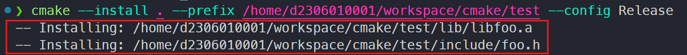

일반적으로 배포 할 `binary` 혹은 `header`들을 특정 디렉토리에 모으기 위해 `copy` 명령을 사용한다. 
`Visual Studio`의 경우, VS 프로젝트의 `Build Event`나 `Copy Task` 같은 것을 이용하게 된다. 

- [Copying Binaries on Pre and Post-Build Macros](https://aaronstannard.com/visualstudio-pre-build-tasks/)
- [Copy task](https://learn.microsoft.com/en-us/visualstudio/msbuild/copy-task?view=vs-2022)

하지만 다른 빌드 도구에서는 다른 방법을 사용한다. 그래서 `CMake`에는 설치를 위한 기능과 규칙이 따로 존재한다.

`CMake`는 필요한 `헤더`와 `라이브러리` 등을 배포하기 위해 `install` 타겟을 만든다. 

## install( )

`install()` 명령의 시그니처는 다음과 같다.

```cmake
install(TARGETS <target>... [...])
install(IMPORTED_RUNTIME_ARTIFACTS <target>... [...])
install({FILES | PROGRAMS} <file>... [...])
install(DIRECTORY <dir>... [...])
install(SCRIPT <file> [...])
install(CODE <code> [...])
install(EXPORT <export-name> [...])
install(RUNTIME_DEPENdENCY_SET <set-name> [...])
```

이런 명령들은 CMake 프로젝트에 대한 `설치 규약 (installation rule)`들을 생성한다.

`install()` 명령에는 몇 가지 옵션들이 추가적으로 붙을 수 있다.

## DESTINATION

`DESTINATION` 옵션은 파일이 설치될 디스크상의 `디렉토리`를 지정한다. 인자는 `상대 경로`나 `절대 경로`가 될 수 있다. 만약 `상대 경로`가 지정된다면 `CMAKE_INSTALL_PREFIX` 변수의 값에 대해 상대적으로 해석된다.

## PERMISSIONS

`PERMISSIONS` 옵션은 설치될 파일들에 대한 `권한`을 지정한다. `OWNER_READ`, `OWNER_WRITE`, `OWNER_EXECUTE`, `GROUP_READ`, `GROUP_WRITE`, `GROUP_EXECUTE`, `WORLD_READ`, `WORLD_WRITE`, `WORLD_EXECUTE`, `SETUID`, `SETGID` 등이 설정될 수 있다.

## CONFIGURATIONS

`CONFIGURATIONS` 옵션은 설치 규칙이 적용될 `빌드 구성 (Debug, Release 등)`들을 지정한다.
주의해야 할 것은 이 옵션을 위해서 지정된 값들은 반드시 `CONFIGURATIONS` 옵션 뒤에 나와야 한다는 것이다. 그러므로 `Debug`와 `Release`에 대해서 따로 설치 규칙을 설정한다고 하면 다음과 같이 개별적으로 지정한다.

```cmake
install(TARGETS target CONFIGURATIONS Debug RUNTIME DESTINATION Debug/bin)
install(TARGETS target CONFIGURATIONS Release RUNTIME DESTINATION Release/bin)
```

## COMPONENT

`COMPONENT` 옵션은 설치 규칙과 연관되는 `설치 컴포넌트 이름`을 지정한다. 예를 들면 `runtime` 이나 `development` 같은 것들을 지정할 수 있다. 컴포넌트에 특화된 설치를 하는 동안에는 주어진 컴포넌트 이름과 연관된 설치 규칙만이 실행된다. 전체 설치를 하는 동안에는 모든 컴포넌트들이 설치가 된다. 
이 때, `EXCLUDE_FROM_ALL`이 지정된 것은 설치가 안된다. 기본 컴포넌트 이름은 `CMAKE_INSTALL_DEFAULT_COMPONENT_NAME` 변수에 의해 제어된다.

## EXCLUDE_FROM_ALL

`EXCLUDE_FROM_ALL` 옵션은 해당 파일이 전체 설치에서는 배제되고 특정 넘포넌트 설치에서만 설치되어야 한다는 것을 지정한다.

## RENAME

`RENAME` 옵션은 설치된 파일의 이름이 원본 파일의 이름과 달라진다는 것을 지정한다. 이 옵션은 **단일 파일을 설치하고 있을 때만 지정할 수 있다.**
`CONFIGURATIONS`에서 그랬던 것처럼 파일마다 따로 `install()` 명령을 수행해야 한다는 의미이다.

## OPTIONAL

`OPTIONAL` 옵션은 해당 파일에 대해서 설치된 파일이 존재하지 않아도 에러가 아니라는 것을 지정한다.

--- 

## install( ) 명령을 통한 배포

### 소스 트리 구성

다음과 같은 소스 트리를 구성해보자.

```terminal
cmake_test
  foo
    include
      foo.h
    src
      foo.cpp
    CMakeLists.txt
  CMakeLists.txt
```

`foo`라는 `정적 라이브러리`를 생성하여 배포하고자 한다.

```cpp
// foo.h

#ifndef __FOO_H__
#define __FOO_H__

void ShowLibraryName();

#endif
```

```cpp
// foo.cpp

#include "foo.h"
#include <iostream>

void ShowLibraryName() {
    #if defined(_DEBUG)
    std::cout << "debug mode: foo_d" << std::endl;
    #else
    std::cout << "release mode: foo" << std::endl;
    #endif
}
```

```cpp
// foo/CMakeLists.txt

add_library(foo STATIC "./src/foo.cpp")
target_include_directories(foo PUBLIC "./include")
```

위의 내용은 `static` 타겟을 추가하고 `foo.h`를 참조하기 위한 `include` 디렉토리를 설정하였다.

```cmake
// CMakeLists.txt

cmake_minimum_required(VERSION 3.22)

project(install_prac VERSION 1.0 LANGUAGES CXX)

set(CMAKE_CONFIGURATION_TYPES "Debug;Release")
set(CMAKE_DEBUG_POSTFIX "_d") 

add_subdirectory(./foo)
```

`foo` 타겟을 `sub-directory`로 추가해준다. `Debug`와 `Release` 구성만을 생성할 것이고, `Debug`일 때 `foo_d.lib`를, 그렇지 않을 땐 `foo.lib`를 생성하도록 구성하였다.

### 빌드 트리 구성

소스 트리의 루트로 가서 빌트 트리를 구성해 보자.

```terminal
cmake -S . -B ./build
```

이제 빌드를 진행 해 보자. `Debug`와 `Release`를 각각 빌드하는 명령은 다음과 같다. `--config` 를 지정하지 않으면 기본적으로 `Debug`로 빌드 된다.

```terminal
cmake --build ./build --config Debug
cmake --build ./build --config Release
```

이렇게 하면 다음과 같은 파일들이 생성된다.

```terminal
cmake_test
  build
    foo
      Debug
        foo_d.lib
      Release
        foo.lib
```

### 배포

참고로 프로젝트를 생성할 때 빌드 트리에는 `cmake_install.cmake`라는 파일이 하나 생성되어 있다. 보통 다음과 같이 사용하게 된다.
이 파일은 명령들을 인자로 받아서 자동화해 주는 역할을 한다. `CMakeLists.txt`에다가 설치와 관련한 명령을 따로 입력하지 않았다면, 그냥 자동으로 생성된다.

```cmake
// foo/CMakeLists.cpp

add_library(foo STATIC "./src/foo.cpp")
target_include_directories(foo PUBLIC "./include")

install(TARGETS foo DESTINATION lib)
install(FILES "./include/foo.h" DESTINATION include)
```

foo 라이브러리를 lib에 복사하고, foo.h를 include에 복사하는 예이다.



```terminal
cmake --install . --prefix <path> --config <Debug | Release>
```

만약 `INSTALL` 타겟이 존재하지 않는다면 위의 명령들은 아무 것도 수행하지 않는다. 

`install(TARGETS)` 명령의 시그니처는 다음과 같다.

```cmake
install(TARGETS targets...
	[EXPORT <export-name>]
    [RUNTIME_DEPENDENCIES args... | RUNTIME_DEPENDENCY_SET <set-name>]
    [[ARCHIVE|LIBRARY|RUNTIME|OBJECTS|FRAMEWORK|BUNDLE|PRIVATE_HEADER|PUBLIC_HEADER|RESOURCE|FILESET <set-name>]
    [DESTINATION <dir]
    [PERMISSION permissions...]
    [CONFIGURATIONS [Debug|Release|...]]
    [COMPONENT <component>]
    [OPTIONAL]
    [EXCLUDE_FROM_ALL]
    [NAMELINK_ONLY|NAMELINK_SKIP]]
    [...]
    [INCLUDES DESTINATION [<dir> ...]])
```

`TARGETS` 모드는 여러 가지를 한 번에 수행할 수 있는 옵션들을 제공한다. 여기서 중요한 것을 3가지이다.

1. `CONFIGURATIONS` : 어떤 구성에서 설치 작업을 수행할지 지정
2. `DESTINATION` : 설치할 디렉토리 지정
3. `ARCHIVE ~ FILSET` : 어떤 종류의 파일을 복사할지 지정

파일의 종류는 다음과 같다.

- `ARCHIVE`
  - static library, DLL import library 등을 의미.
- `LIBRARY`
  - shared library를 의미. 
- `RUNTIME`
  - executable을 의미.

그래서 설치 코드는 다음과 같이 변경될 수 있다.

```cmake
// debug libraries
install(
  TARGETS foo 
  CONFIGURATIONS Debug 
  ARCHIVE DESTINATION lib/Debug
)

// release libraries
install(
  TARGETS foo
  CONFIGURATIONS Release
  ARCHIVE DESCTINATION lib/Release
)

// PDBs
install(
  FILES "$<TARGET_FILE_DIR:foo>/$<TARGET_FILE_BASE_NAME:foo>.pdb"
  DESTINATION "lib/$<CONFIG>" OPTIONAL
)

// headers
install(
  FILES "./include/foo.h"
  DESTINATION include
)
```

`ARCHIVE`나 `RUNTIME`처럼 `PDB` 같은 것이 존재하면 좋겠지만 존재하지 않는다. 그래서 `생성기 표현식(generator expression)`을 사용해 직접 파일을 복사해 줘야만 한다.

이 외에도 `디렉토리`를 복사한다던가 `패턴`이나 `정규표현식`을 지정한다던가 하는 여러 가지 기능이 있다. 
