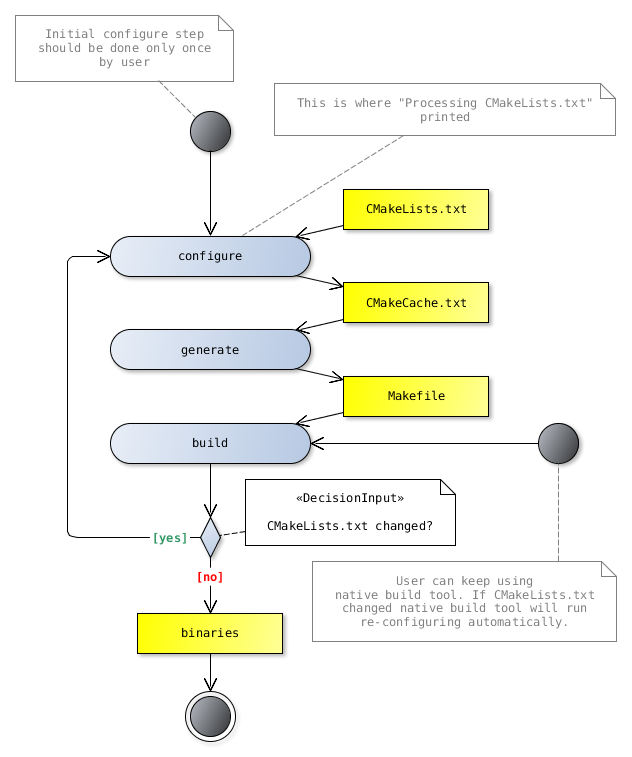
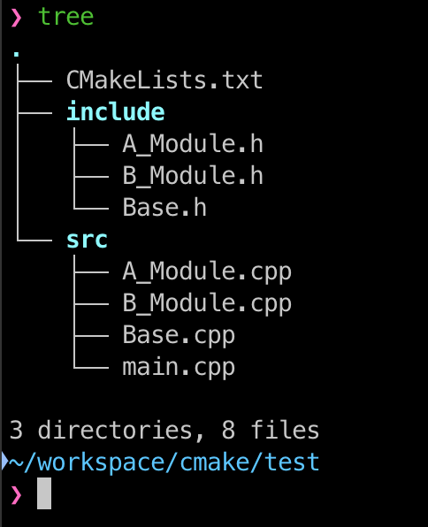
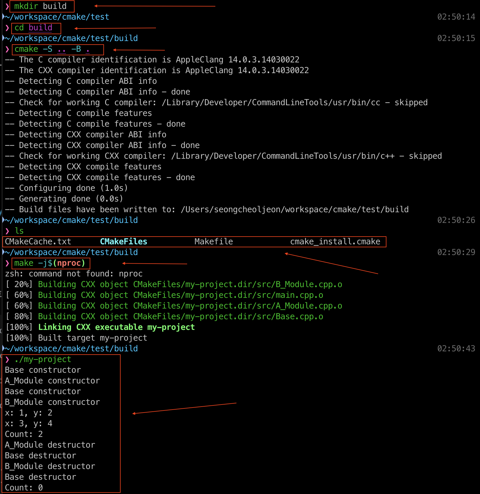
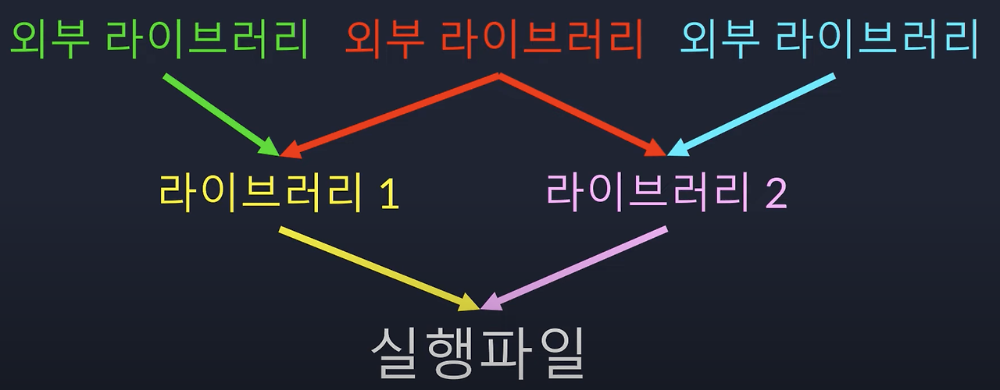
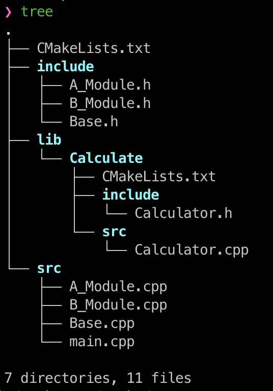
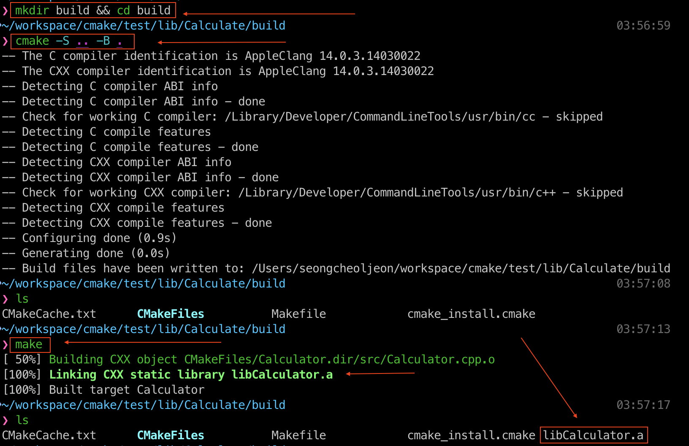
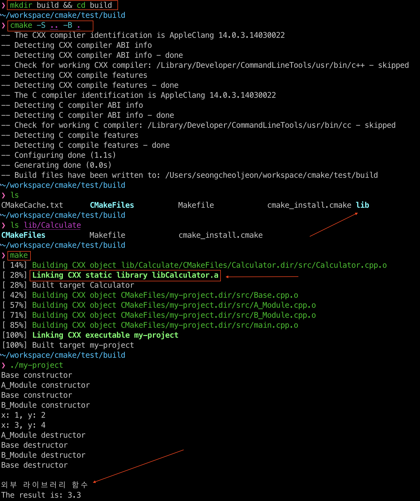

## CMake란?

[CMake](https://cmake.org/)란, `make`의 빌드 관리 시스템을 만들기 위한 오픈소스 프로젝트이다. 즉, `CMake`를 통해서 프로젝트를 빌드하는 것이 아니라 `CMake`를 통해 빌드 파일을 생성하면 빌드 프로그램을 통해서 프로젝트를 빌드하는 것이다.
예를 들어 `make`를 사용한다면 `CMake`를 통해 `Makefile`을 생성할 것이고, [Ninja](https://ninja-build.org/)를 사용한다면 `CMake`를 통해 `.ninja` 빌드 파일을 만들어 준다.

`Makefile`은 간단한 프로젝트를 관리하기 좋지만, 프로젝트 크기가 커질 경우, 아니면 해당 프로젝트를 여러 플랫폼에서 배포하기 위해서는 불편한 점이 많다. 이러한 문제를 해결하기 위해 나타난 것이 바로 `CMake`이다.

`CMake`는 `Makefile` 자동 생성 및 관리를 해준다. 지정한 운영체제에 맞는 `Makefile`을 생성해줘서 소스코드 빌드를 편리하게 할 수 있다. 또한 의존성 정보를 일일이 기술해주지 않아도 되므로 빌드 스크립트 관리가 효율적이다.

`make`가 무엇인 궁금하다면 아래의 링크를 통해 확인할 수 있다.
[Make & Makefile](https://velog.io/@seongcheoljeon/Make-Makefile)

> `CMake`는 `Makefile`을 만들기 위한 툴이다. 즉, `CMake`는 빌드 프로그램이 아니라 빌드 파일을 생성하는 툴인셈이다.
{: .prompt-tip}

`CMake`의 실행 및 빌드 명령어는 다음과 같은 형식이다.

```shell
$ cmake -S<source_dir> -B<build_dir> -DCMAKE_BUILD_TYPE=[Debug|Release]

$ cmake --build <build_dir> --config [Debug|Release]
```

## CMake 개요

`CMake`를 사용하는 모든 프로젝트에는 반드시 프로젝트 최상위 디렉토리에 `CMakeLists.txt` 파일이 있어야 한다. 해당 파일에는 `CMake`가 빌드 파일을 생성하는데 필요한 정보들이 들어 있다. 따라서 보통의 컴파일 과정은 다음과 같이 진행된다.


`CMakeLists.txt`파일을 `cmake` 명령으로 실행하면, `Makefile`이 생성된다. 생성된 `Makefile`을 `make` 명령으로 실행하면 실행파일이 만들어지는 구조이다.

```terminal
cmake CMakeLists.txt
```

위의 명령을 실행하면 다음과 같은 파일들이 생성된다.



- __Makefile__
- __CMakeCache.txt__
- __cmake_install.cmake__
- __CMakeFiles__
  - 이곳에 `목적 파일(obj)`들이 만들어진다.

`cmake` 명령은 소스파일을 추가하지 않는 이상 최초로 한번만 실행하면 된다. 만약, 소스파일이 수정되었을 경우에는 `make` 명령으로 빌드만 하면 된다.

- __소스 파일이 추가 된 경우__
  - `cmake` 명령 실행
- __소스 파일의 수정만 된 경우__
  - `make` 명령으로 빌드만 다시 실행

> 참고로 `CMake`로 반드시 `Makefile`을 만들 필요는 없다. 원하는 빌드 프로그램을 선택하여 만들 수 있다.
{: .prompt-info}

- `Configuration`
  - `CMakeLists.txt` 파일 해석
- `Generation`
  - 해석 결과를 바탕으로 `Project 파일` 생성

다음의 명령어는 각 플랫폼에서 주로 사용되는 IDE에 맞는 파일을 생성하는 것을 보여준다.

**windows**
```console
# Generate for VS
cmake -S . -B ./build -G "Visual Studio 17 2022 Win64"
```

**unix/linux**
```terminal
# Generate for Ninja
cmake -S . -B ./build -G Ninja
```

**MacOS**
```terminal
# Generate for XCode
cmake -S . -B ./build -G XCode
```

## 빌드 시스템 및 툴체인

거듭 강조하자면, `CMake`의 목적은 파일을 생성하는데 있으며, 프로그램 빌드를 하지는 않는다.

다만 아래와 같이 명령어에서 `-G` 옵션으로 지정한 [빌드 시스템](https://cmake.org/cmake/help/latest/manual/cmake-buildsystem.7.html)을 호출하도록 명령할 수는 있다.

```shell
# 지정된 툴을 사용해 빌드 진행
cmake --build ./build

# 병렬 빌드
cmake --build ./build --parallel

# 빌드에 성공하면 설치까지 진행
cmake --build ./build --target install

# Debug로 빌드
cmake --build ./build --config Debug
```

[툴체인](https://cmake.org/cmake/help/latest/manual/cmake-toolchains.7.html#cmake-toolchains-7) 파일은 `CMake`가 지원하는 다양한 기능들을 사용해 빌드를 수행할 수 있도록 미리 지정된 파일을 의미한다.

대표적으로 `Android NDK`에서는 여러 아키텍처로의 크로스 컴파일에 필요한 설정들이 작성된 `android.toolchanin.cmake` 파일이 함께 제공되며, `CMake`를 사용한 빌드를 수행시에 Gradle에 의해서 자동으로 지정된다.

`iPhone`을 대상으로 하는 경우에는 [iOS-CMake](https://github.com/leetal/ios-cmake)를 사용해 `XCode` 프로젝트를 생성하기도 한다. 

그리고 [vcpkg](https://github.com/Microsoft/vcpkg)와 같이 라이브러리 탐색에 특화된 툴체인 파일을 사용하는 경우도 있다.

```console
# vcpkg에서 제공하는 cmake 툴체인의 경로 제공
cmake -S . -B ./build -G "Visual Studio 17 2022 Win64" -DCMAKE_TOOLCHAIN_FILE="<vcpkg 경로>/scripts/buildsystems/vcpkg.cmake"
```

---

## CMakeLists.txt 작성

최상위 `CMakeLists.txt` 파일에는 반드시 아래 두 개의 내용이 들어가야 한다.

```cmake
# CMake 프로그램의 최소 버전
cmake_minimum_required(VERSION 3.30)

# 프로젝트 정보
project(my-project
    VERSION 1.0
    DESCRIPTION "나의 cmake프로젝트"
    LANGUAGES CXX
)
```

```cmake
cmake_minimum_required(VERSION 3.30)
```

`CMakeLists.txt` 최상단에는 해당 프로젝트에서 사용할 `CMake`의 최소 버전을 명시해준다. 그 이유는 `CMake`의 버전에 따라 그 차이가 상당히 크다. 옛 버전(특히 2.x 대의 버전)의 CMake를 사용할 경우 지원하지 않는 기능이 많이 있다. 그래서 cmake의 version을 명시하는 것이다.

```cmake
project(my-project
    VERSION 1.0
    DESCRIPTION "나의 cmake프로젝트"
    LANGUAGES CXX
)
```

그 다음으로 프로젝트의 정보를 간단히 명시할 수 있다. 프로젝트의 이름을 필수로 들어가야하고 나머지는 옵션이다.
참고로 `LANGUAGES` 부분의 경우, `C`프로젝트이면 `C`를 명시하고 `C++`프로젝트면 `CXX`를 명시하면 된다. 만일 아무것도 명시하지 않을 경우 디폴트로 `C`와 `CXX`가 설정된다. 그 외에도 `CUDA`, `CSharp`, `Swift` 등등이 가능하다. 자세한 내용은 [여기](https://cmake.org/cmake/help/latest/command/project.html)를 참고하자.

## 자주 사용되는 명령

| 명령어 | 한줄 요약 |
|--------|----------|
| [`project`](#project) | 프로젝트 이름 설정 |
| [`cmake_minimum_required`](#cmake_minimum_required) | CMake 최소 버전 지정 |
| [`set`](#set) | 변수 및 목록 설정 |
| [`target_include_directories`](#target_include_directories) | 타겟별 헤더 경로 지정 |
| [`add_compile_options`](#add_compile_options) | 전역 컴파일 옵션 추가 |
| [`target_compile_options`](#target_compile_options) | 타겟별 컴파일 옵션 추가 |
| [`add_executable`](#add_executable) | 실행 파일 생성 |
| [`add_library`](#add_library) | 라이브러리 생성 |
| [`add_subdirectory`](#add_subdirectory) | 서브 디렉토리 통합 |
| [`add_dependencies`](#add_dependencies) | 빌드 의존성 제어 |
| [`cmake_cxx_compiler`](#cmake_cxx_compiler) | 컴파일러 경로 지정 |
| [`message`](#message) | 콘솔 메시지 출력 |
| [`install`](#install) | 설치 동작 지정 |
| [`target_link_libraries`](#target_link_libraries) | 라이브러리 링크 |

---

### `project`

프로젝트 이름을 설정한다.

```cmake
project(<프로젝트 이름>)
```

---

### `cmake_minimum_required`

빌드에 필요한 CMake 최소 버전을 지정한다.

```cmake
cmake_minimum_required(VERSION <버전>)
```

---

### `set`

변수 또는 목록 변수를 설정한다.

```cmake
# 단일 변수
set(<변수 이름> <값>)

# 목록 변수
set(<목록 변수 이름> <항목1> <항목2> ...)

# C++ 표준 버전 설정
set(CMAKE_CXX_STANDARD <버전>)

# 빌드된 실행 바이너리 출력 디렉토리 지정
set(CMAKE_RUNTIME_OUTPUT_DIRECTORY <디렉토리>)
```

**예시**

```cmake
set(SRC_FILES main.cpp A_Module.cpp B_Module.cpp)
set(CMAKE_CXX_STANDARD 17)
```

---

### `target_include_directories`

특정 타겟에만 헤더 파일 경로를 지정한다.  
전역 함수인 `include_directories`보다 명시적이므로 **권장되는 방식**이다.

```cmake
target_include_directories(<target> <PRIVATE|PUBLIC|INTERFACE> <dir> ...)
```

| 접근 제어 | 설명 |
|----------|------|
| `PRIVATE` | 해당 타겟 내에서만 사용 |
| `PUBLIC` | 해당 타겟 + 이를 링크하는 타겟에서도 사용 |
| `INTERFACE` | 해당 타겟은 사용 안 함, 링크하는 타겟에서만 사용 |

**예시**

```cmake
target_include_directories(my_target PUBLIC ${CMAKE_SOURCE_DIR}/include)
```

---

### `add_compile_options`

프로젝트 내 **모든 타겟**에 동일한 컴파일 옵션을 추가한다.

```cmake
add_compile_options(<옵션1> <옵션2> ...)
```

**예시**

```cmake
add_compile_options(-g -Wall -O2)
```

---

### `target_compile_options`

**특정 타겟**에만 컴파일 옵션을 추가한다.

```cmake
target_compile_options(<target> <PRIVATE|PUBLIC|INTERFACE> <옵션1> <옵션2> ...)
```

| 접근 제어 | 설명 |
|----------|------|
| `PRIVATE` | 해당 타겟에만 적용, 의존하는 타겟에 전파되지 않음 |
| `PUBLIC` | 해당 타겟 + 의존하는 타겟에도 적용 |
| `INTERFACE` | 해당 타겟에는 적용 안 함, 의존하는 타겟에만 적용 |

**예시**

```cmake
target_compile_options(test.out PRIVATE -Wall -O2)
```

---

### `add_executable`

빌드의 최종 결과물로 **실행 파일**을 생성한다.

```cmake
add_executable(<실행 파일 이름> <소스 파일> ...)
```

**예시**

```cmake
add_executable(test.out main.cpp A_Module.cpp B_Module.cpp)

# 또는 변수 활용
add_executable(test.out ${SRC_FILES})
```

---

### `add_library`

빌드의 최종 결과물로 **라이브러리**를 생성한다.  
링킹 형태를 명시하지 않으면 `BUILD_SHARED_LIBS` 변수에 따라 결정된다.

```cmake
add_library(<라이브러리 이름> [STATIC | SHARED | MODULE] <소스파일> ...)
```

| 타입 | 설명 |
|------|------|
| `STATIC` | 정적 라이브러리 (`.a` / `.lib`) |
| `SHARED` | 동적 라이브러리 (`.so` / `.dll`) |
| `MODULE` | 런타임에 동적으로 로드되는 라이브러리 |

---

### `add_subdirectory`

서브 디렉토리의 `CMakeLists.txt`를 호출하여 빌드 시스템에 통합한다.  
다중 디렉토리로 구성된 모듈화 프로젝트에서 주로 사용한다.

```cmake
add_subdirectory(<디렉토리 경로> [binary_dir] [EXCLUDE_FROM_ALL])
```

| 인자 | 설명 |
|------|------|
| `<디렉토리 경로>` | `CMakeLists.txt`가 존재하는 서브 디렉토리 경로 |
| `[binary_dir]` | 빌드 아티팩트 출력 디렉토리 (선택) |
| `[EXCLUDE_FROM_ALL]` | `make all` 실행 시 해당 디렉토리의 타겟 제외 |

---

### `add_dependencies`

여러 타겟 간의 **빌드 순서 의존성**을 명시적으로 제어한다.

```cmake
add_dependencies(<target> <dependency1> <dependency2> ...)
```

---

### `cmake_cxx_compiler`

컴파일 및 링크 과정에서 사용할 **컴파일러 경로**를 지정한다.  
> ⚠️ `project()` 또는 `enable_language()` **호출 이전**에 설정해야 효과가 있다.

```cmake
# C++ 컴파일러 지정
set(CMAKE_CXX_COMPILER "g++")

# C 컴파일러 지정
set(CMAKE_C_COMPILER "gcc")
```

---

### `message`

CMake 구성 시 **콘솔에 메시지**를 출력한다.

```cmake
message(<메시지>)
```

---

### `install`

`make install` 실행 시의 **설치 동작**을 정의한다.

```cmake
install(...)
```

---

### `target_link_libraries`

컴파일된 실행 파일이나 라이브러리에 **외부 라이브러리 또는 다른 타겟을 링크**한다.

```cmake
target_link_libraries(<target> <item1> <item2> ...)
```

| 인자 | 설명 |
|------|------|
| `<target>` | 링크 대상 (실행 파일 또는 라이브러리 이름) |
| `<item>` | 링크할 라이브러리 또는 타겟 이름 |

**예시**

```cmake
target_link_libraries(test.out my_library another_library)
```

[Makefile로 작성했던 것](https://velog.io/@seongcheoljeon/Make-Makefile)을 `CMakeLists.txt` 파일로 다시 작성해보자. 파일 구조는 다음과 같다.

{: width="300" }

`CMakeLists.txt` 파일의 내용은 다음과 같다.

```cmake
# 최소 cmake 버전 설정
cmake_minimum_required(VERSION 3.30.3)

# 프로젝트 이름 및 버전 설정
project(my-project VERSION 1.0.0 LANGUAGES CXX)

# C++17 표준을 사용
set(CMAKE_CXX_STANDARD 17)
set(CMAKE_CXX_STANDARD_REQUIRED ON)

# 소스 파일 목록 설정
set(
    SOURCES
    src/Base.cmake
    src/A_Module.cmake
    src/B_Module.cmake
    src/main.cmake
)

# 실행 파일 생성
add_executable(
    ${PROJECT_NAME}
    ${SOURCES}
)

# compile 옵션
target_compile_options(${PROJECT_NAME} PUBLIC -Wall -Werror -O2)

# include 디렉토리 추가 (헤더 파일 경로)
target_include_directories(${PROJECT_NAME} BEFORE include)
```

위의 경우 `실행 파일`을 빌드할 때 컴파일 옵션으로 `-Wall (모든 경고 표시)`과 `-Werror (경고는 컴파일 오류로 간주)`를 준다는 의미이다. 



위의 그림에서 보다시피 아주 간단하게 작성한 `CMakeLists.txt` 파일로 실행파일을 만들어냈다. 기존의 `Makefile`과는 비교할 수 없을 정도로 간단해졌다. 😄

다음은 실행 파일을 만들어냈던 명령어이다.

```shell
$ mkdir build
$ cd build
$ cmake -S .. -B .
$ make -j$(nproc)
```

`Makefile`을 만들어 냈던 `cmake -S .. -B .` 명령을 살펴보자.

- __`-S`__
  - 이 옵션은 `소스 디렉토리(Source Directory)`를 지정하는 옵션이다. 여기서 `..`로 현재 디렉토리의 상위 디렉토리를 소스 디렉토리로 지정하고 있다.
  - 즉, `cmake`가 `CMakeLists.txt` 파일을 찾기 위해 상위 디렉토리를 소스 디렉토리로 사용한다.
- __`-B`__
  - `빌드 디렉토리(Build Directory)`를 지정하는 옵션이다. 여기서 `.`으로 현재 디렉토리를 빌드 디렉토리로 설정하고 있다.
  - 즉, 컴파일된 파일들과 중간 파일들이 현재 디렉토리에 생성된다.
- __`-D`__
  - `특정 변수 설정`을 할 수 있도록 해준다. 이 옵션은 `-D<변수>=<값>` 형식으로 사용되며, 프로젝트의 빌드 과정에서 변수 값을 정의하거나 특정 옵션을 `활성화/비활성화`하는 데 유용하다.
  - ex)
    - cmake -DCMAKE_BUILD_TYPE=Release
    - cmake -DCMAKE_INSTALL_PREFIX=/usr/local
    - cmake -DENABLE_TESTS=ON
  
> `cmake -S .. -B .` 명령은, 상위 디렉토리에 있는 `CMakeLists.txt`를 찾아 현재 디렉토리에 빌드 파일을 생성하라는 의미이다.
{: .prompt-tip}

## CMake에서의 기본 개념 Target과 Property

`target_compile_options` 명령을 통해 `실행 파일`을 빌드할 때 컴파일 옵션을 줄 수 있었다. 그렇다면 `CMake`에서 말하는 `타겟(target)`이란 무엇을 말하는 것일까? 

쉽게 말해서 `타겟`이란 ***프로그램을 구성하는 요소들*** 이라고 보면 된다. 예를 들어 위에서 처럼 `실행 파일`이 될 수도 있고, `라이브러리 파일`이 될 수도 있다.

`CMake`의 모든 명령어들은 이 타겟들을 기준을 돌아간다. 그리고 각 타겟에는 `속성(Property)`을 정의할 수 있는데, 위와 같이 컴파일 옵션을 주는 것도 `실행 파일`이라는 `타겟`에 `컴파일 옵션 속성`을 설정하는 것이라고 볼 수 있다. 
그 외에도, 어떠한 라이브러리를 링크할 것인지, `include` 하는 파일은 어디서 보는지 등등의 여러가지 속성들을 정의해줄 수 있다.

모든 `CMake` 명령은 그냥 `타겟`을 정의하고 (`add_executable` 과 같이), 해당 타겟들의 `속성`을 지정하는 명령들(`target_compile_options` 처럼)로 이루어진 것이라 보면 된다.

### include 경로 지정

`CMake`에서는 컴파일 시에 헤더 파일들을 찾을 경로의 위치를 지정할 수 있다. 보통 컴파일러는 `#include <>`의 형태로 `include`되는 헤더 파일들은 `시스템 경로`에서 찾고, `#include ""`의 형태로 `include`된 헤더 파일의 경우는 따로 지정하지 않는 이상 `현재 코드의 위치`를 기준으로 찾는다.

하지만 경우에 따라서 (특히 라이브러리를 만들 시) 헤더 파일들을 다른 곳에 위치시키는 경우가 있는데, 컴파일러가 해당 파일들을 찾기 위해서는 컴파일 시에 따로 경로를 지정해줘야 한다. 따라서 `CMakeLists.txt`에 `include` 디렉토리를 헤더 파일 경로 탐색 시 확인해라 라고 알려줘야 한다.

```cmake
target_include_directories(MyTarget PUBLIC ${CMAKE_SOURCE_DIR}/include)
```

사용 방법은 아래와 같다.

```cmake
target_include_directories(<실행 파일 이름> PUBLIC <경로 1> <경로 2> ...)
```
위의 경우 `${CMAKE_SOURCE_DIR}/include` 를 헤더 파일 탐색 경로에 추가하고 있다. 한 가지 중요한 점은 `CMake`에서 디렉토리의 경로를 지정할 때, 왠만하면 절대 경로를 쓰지 않는 것이 중요하다. 그 이유는 `CMake`의 가장 큰 장점이 여러 플랫폼에서 사용할 수 있는 것인데, 절대 경로로 설정하면 다른 시스템에서 사용할 수 없기 때문이다.

`${CMAKE_SOURCE_DIR}`은 `CMake`에서 기본으로 제공하는 변수로, 최상위 `CMakeLists.txt`, 즉 `cmake ..` 할 때 읽어들이는 `CMakeLists.txt`의 경로를 의미한다. 다시 말해 프로젝트의 경로라고 볼 수 있다. 따라서 `${CMAKE_SOURCE_DIR}/include` 는 현재 프로젝트 경로 안에 `include` 디렉토리라고 보면 된다.

## 빌드 관계 설정

### 의존성 (Dependency)

프로젝트 내에서 여러 라이브러리를 빌드한다면, 그리고 서로 의존성이 있다면 이를 제어하는 것도 가능하다. 이 과정은 보통 해당 sub-project들을 모두 확인할 수 있는 `CMakeLists.txt` 파일에서 수행하게 된다.

의존성은 [add_dependencies](https://cmake.org/cmake/help/latest/command/add_dependencies.html) 함수를 사용해 명시하게 된다. 이름에서 알 수 있듯이 다수를 지정할 수 있다.

만약 target이 module1과 module2가 필요하다면 다음과 같이 구성할 수 있다.

```cmake
add_dependencies(target module1 module2)
```

### 별명(alias) 붙이기

라이브러리들의 수가 많아지거나 경우에 따라 달라지면 `별명(alias)`을 붙여서 상위의 `CMakeLists.txt`에서 조금 더 편하게 사용할 수 있도록 구성할 수 있다.

```cmake
# sub-project CMakeLists.txt

add_library(my_custom_logger_lib ...)

add_library(module::logger ALIAS my_custom_logger_lib)
```

디버그 모드와 릴리즈 모드에서 라이브러리 이름이 바뀌는 경우, 이는 굉장히 유용한 기능이 된다.

```cmake
# higher-project CMakeLists.txt

add_subdirectory(some_exe)
add_subdirectory(custom_logger)

add_dependencies(some_exe module::logger)
```

### Linking

빌드 순서를 제어하기 위해서 `add_dependencies`를 사용했다면, 프로그램 생성 시, 링킹에 필요한 정보들이 공유되도록 하기 위해서는 [target_link_libraries](https://cmake.org/cmake/help/latest/command/target_link_libraries.html)를 사용하게 된다.

```cmake
add_library(my_custom_logger_lib ...)

target_link_libraries(my_custom_logger_lib
	PUBLIC 
    	spdlog fmt
    PRIVATE
    	utf8proc
)
```

특히 `target_link_libraries` 함수는 `target`의 의존성을 전파시키는 역할도 수행한다. 위와 같은 경우, `PRIVATE`과 `PUBLIC`을 사용해 이를 제어하고 있다. `C++` class의 `멤버 접근 한정자(Access Qualifier)`와 유사하게 생각할 수 있다.

위와 같이 작성하면 다른 프로젝트에서 `my_custom_logger_lib`를 `link`하는 경우, `spdlog`와 `fmt`에 있는 **헤더파일을 include하기 위한 경로**와 **빌드 결과 생성되는 라이브러리**에 접근할 수 있게 된다. 
하지만 `PRIVATE`으로 선언된 `utf8proc`는 이와 같은 정보를 차단한다.

```cmake
add_executable(some_test_program ...)

target_link_libraries(some_test_program
	PUBLIC
    	# spdlog와 fmt이 적혀있지 않지만 자동으로 추가된다.
    	my_custom_logger_lib
)
```

- 의존성이 공유되어야 하는 경우, 혹은 기타 라이브러리와 함께 사용하는 라이브러리라면 `PUBLIC`으로 설정한다.
- 내부 구현에만 사용되고 공개되지 않는 경우라면 `PRIVATE`에 배치하는 것이 적합하다.

### 🚨 주의 사항

반드시 ***빌드 파일 용의 디렉토리를 만든 다음에 해당 디렉토리에서 `CMake`를 실행하자.*** 

`CMake`는 실행시, 여러 가지 `파일들(캐시 용도)`을 생성하는데 이 때문에 프로젝트 디렉토리가 엉망이 될 수 있다. **특히 이미 존재하는 파일을 덮어 씌울 수 있는 <span class="hl-red">위험</span>이 있다.**


---

## 외부 라이브러리 사용

규모가 큰 프로젝트를 진행할 때, 하나의 파일이 아닌 여러개의 라이브러리들로 쪼개서 진행한다. 
그 이유는? 하나의 파일에서 진행할 경우, 수정이 생기면 커다란 전체 소스코드를 다시 컴파일해야 하는데 이러면 컴파일 시간이 너무 오래 걸려 개발 속도가 느려지기 때문이다.
따라서 라이브러리로 쪼개서 수정된 부분만 다시 컴파일 하는 구조로 프로젝트를 진행한다.
즉, 다음과 같은 구조로 진행된다.



라이브러리들로 쪼개서 프로젝트를 관리하게되면, 바뀐 부분만 컴파일하고 링킹하면 되므로 컴파일 시간이 비약적으로 빨라지며 개발 속도 또한 빨라지게된다. 그리고 테스트하기도 용이하다.

이러한 구조로 된 큰 프로젝트인 경우, `make`로만 관리하면 힘들 것이다. 이때 힘을 발휘하는 것이 바로 `cmake`이다.

테스트를 위한 라이브러리를 작성해 보자. 파일&디렉토리 구조는 다음과 같다.

{: width="300" }
_directory 구조_

다음은 Calculate 라이브러리의 파일 내용이다.

```cpp
// Caculator.h

#ifndef __CALCULATOR_H__
#define __CALCULATOR_H__

double Add(double, double);
void PrintResult(double);

#endif // __CALCULATOR_H__
```

```cpp
// Caculator.cmake

#include "Calculator.h"

#include <iostream>

using std::cout;
using std::endl;


double Add(double a, double b)
{
    return a + b;
}

void PrintResult(double result)
{
    cout << endl;
    cout << "외부 라이브러리 함수" << endl;
    cout << "The result is: " << result << endl;
}
```

```cpp
// main.cmake

#include "Base.h"
#include "A_Module.h"
#include "B_Module.h"
#include "Calculator.h"

#include <iostream>

int main(){
    Base* a = new A_Module(1, 2);
    Base* b = new B_Module(3, 4); 

    a->ShowValues();
    b->ShowValues();

    delete a;
    delete b;

    PrintResult(Add(1.1, 2.2));

    return 0;
}
```

나머지 파일들의 내용은 [여기(click me)](https://velog.io/@seongcheoljeon/Make-Makefile)에 가면 볼 수 있다.

라이브러리 생성은 보통 다음과 같은 `CMakeLists.txt` 파일의 내용은 갖는다.

```cmake
# 정적 라이브러리 생성
add_library(MyLib STATIC mylib.cmake)

# 해당 라이브러리 컴파일 시 사용할 헤더파일 포함
target_include_directories(MyLib PUBLIC ${CMAKE_SOURCE_DIR}/include)

# 해당 라이브러리를 컴파일 할 옵션
target_compile_options(MyLib PRIVATE -Wall -Werror)
```

`add_library` 명령을 통해서 만들어낼 라이브러리 파일을 추가한다. `add_library`의 사용법은 다음과 같다.

```cmake
add_library(<라이브러리 이름> [STATIC | SHARED | MODULE] <소스 1> <소스 2> ...)
```

중간에 어떠한 형태의 라이브러리를 만들지 설정할 수 있는데 `STATIC` 으로 명시하면 `정적 라이브러리`를, `SHARED` 로 설정하면 동적으로 링크되는 `동적 라이브러리`를, `MODULE` 로 설정하면 동적으로 링크되지는 않지만 `dlopen` 과 같은 함수로 런타임시에 불러올 수 있는 라이브러리를 생성한다.

- `STATIC`
  - 정적 라이브러리 생성
- `SHARED`
  - 동적 라이브러리 생성
- `MODULE`
  - `dlopen`과 같은 함수로 런타임시, 불러올 수 있는 라이브러리 생성

`정적 라이브러리`는 프로그램 실행 파일 생성시, `라이브러리 코드`가 전부 들어가는 것이고, `동적 라이브러리`는 프로그램 실행 파일 생성시, `라이브러리 코드`가 포함되는 것이 아닌 `메모리`에 라이브러리가 따로 올라가는데 이를 참조하는 형태이다.
보통 정적으로 링크하면 실행 파일의 크기가 커지는 대신 동적 라이브러리를 사용할 때 보다 더 빠르다.

```cmake
# 해당 라이브러리 컴파일 시 사용할 헤더파일 경로
target_include_directories(MyLib PUBLIC ${CMAKE_SOURCE_DIR}/include)

# 해당 라이브러리를 컴파일 할 옵션
target_compile_options(MyLib PRIVATE -Wall -Werror)
```

위에서 눈여겨 봐야할 부분은 `PUBLIC`과 `PRIVATE`의 차이이다.

기본적으로 `CMake`에서 만약 `A Library`가 `B Library`를 사용한다면 `A`는 `B`의 컴파일 옵션들과 헤더 파일 탐색 디렉토리 목록을 물려받게 된다. 정확히 말하면 `PUBLIC`으로 설정된 것은 물려 받고, `PRIVATE`으로 설정된 것은 물려받지 않는다. 

```cmake
target_include_directories(MyLib PUBLIC ${CMAKE_SOURCE_DIR}/include)
```

따라서 위의 문장 의미는 다음과 같다.

1. `MyLib`를 컴파일 할 때, 헤더 파일 검색 경로에 `${CMAKE_SOURCE_DIR}/include`를 추가해라.
2. `MyLib`를 참조는 타겟의 헤더 파일 검색 경로에 `${CMAKE_SOURCE_DIR}/include`를 추가해라.

그래서 예를 들어, `target`이 `MyLib`를 사용한다면, `target`을 컴파일 할 때 헤더 파일 검색 경로에 `${CMAKE_SOURCE_DIR}/include`가 자동으로 추가된다.

```cmake
target_compile_options(MyLib PRIVATE -Wall -Werror)
```

반면, 라이브러리를 컴파일 하는 옵션은 `PRIVATE`으로 설정되어 있다. 그 이유는 `MyLib`를 빌드할 때에는 `-Wall`과 `-Werror` 옵션을 사용하고 싶지만, `MyLib`를 사용하는 `target`들에게까지 이 옵션을 강제하고 싶지 않기 때문이다.

일단, 생성한 라이브러리 컴파일이 잘되는지 확인해 볼 필요가 있다. 



위의 그림에서 보다시피 `libCalculator.a`라는 라이브러리가 만들어진 것을 볼 수 있다.
이제 최상위 `CMakeLists.txt`파일에 통합해보자.

```cmake
# 최소 cmake 버전 설정
cmake_minimum_required(VERSION 3.30.3)

# 프로젝트 이름 및 버전 설정
project(my-project VERSION 1.0.0 LANGUAGES CXX)

# C++17 표준을 사용
set(CMAKE_CXX_STANDARD 17)
set(CMAKE_CXX_STANDARD_REQUIRED ON)

# lib 디렉토리 추가 (라이브러리 빌드)
# lib 디렉토리내의 CMakeLists.txt 파일을 참조하여 Caculator 라이브러리 빌드
add_subdirectory(lib/Calculate)

# compile 옵션
add_compile_options(-std=c++17 -Wall -Wextra -Werror -O2)

# 소스 파일 목록 설정
set(
    SOURCES
    src/Base.cmake
    src/A_Module.cmake
    src/B_Module.cmake
    src/main.cmake
)

# 실행 파일 생성
add_executable(
    ${PROJECT_NAME}
    ${SOURCES}
)

# include 디렉토리 추가 (헤더 파일 경로)
target_include_directories(${PROJECT_NAME} BEFORE include)

# 라이브러리 링크
target_link_libraries(
    ${PROJECT_NAME}
    Calculator
)
```

`add_subdirectory` 명령을 통해서 `CMake`가 추가로 확인해야 할 디렉토리의 경로를 지정해준다. 그러면 `CMake` 실행 시에, 해당 디렉토리로 들어가서 그 안에 있는 `CMakeLists.txt`도 실행할 것이다.

```cmake
target_link_libraries(${PROJECT_NAME} Calculator)
```

그리고 위와 같이 `target`을 빌드할 때, `Calculator` 라이브러리를 링크시켜 준다. 참고로 실행 파일은 `PUBLIC` 혹은 `PRIVATE`의 여부는 크게 중요하지 않다. 왜냐하면 실행 파일은 다른 `target`이 참조할 수 없기 때문이다.
그래서 위와 같이 간단하게 작성해도 상관없다.

최상위 `CMakeList.txt` 파일의 실행 명령은 다음과 같다.

```console
mkdir build && cd build
cmake -S .. -B .
make
```



위의 그림처럼 `Linking CXX static library libCaculator.a` 라는 문구가 나오며 잘 실행된 것을 볼 수 있다.
실제로 `build` 디렉토리를 확인해보면, `libCalculator.a` 파일이 생긴 것을 볼 수 있다. 참고로 `CMake`는 라이브러리를 만들게 되면, 앞에 `lib`를 붙인 라이브러리 파일을 생성한다.

이처럼 `cmake`를 이용하면 외부 라이브러리도 쉽게 적용하여 컴파일하고 링킹하여 실행 파일을 생성할 수 있다. 😃

> ❗주의 사항
>
> 오래된 버전의 `CMake`에서는 앞에 `target_`이 빠진 `include_directories`, `link_directories`와 같은 명령들이 사용되었는데 이는 **최신의 `CMake`에서는 사용이 권장되지 않는 명령들이다.**
>
> 현재의 `CMake` 패러다임은 `타겟`들을 기준으로 돌아가기 때문에 꼭 ***`target_*` 형태의 명령을 사용하는 것이 좋다.***

---

## Make 이외의 빌드 시스템 사용

`CMake`에서 따로 설정하지 않았다면 기본으로 `Make`가 선택되지만 경우에 따라선 다른 빌드 프로그램을 선택해야 한다. 

예를 들어, 많이 사용하는 [Ninja](https://ninja-build.org/)를 사용하고 싶을 수도 있고 아니면 [Visual Studio](https://learn.microsoft.com/en-us/cmake/build/projects-and-build-systems-cmake?view=msvc-170)를 사용할 경우 `Visual Studio`용 빌드 파일을 생성해야 한다.

이 경우 아래와 같이 `CMake` 명령을 사용하면 된다.

```console
cmake -S.. -B. -DCMAKE_GENERATOR=Ninja
```

`CMAKE_GENERATOR` 인자로 원하는 빌드 시스템을 전달하면 된다. 빌드 시스템의 전체 목록은 [여기](https://cmake.org/cmake/help/latest/manual/cmake-generators.7.html)에서 볼 수 있다.

`CMake`에서 지원하는 대표적인 빌드 시스템은 다음과 같다.

- `Unix Makefiles` <default\>
- `Ninja`
- `Visual Studio`
- ...

등등을 사용할 수 있다.

> 참고로 한 가지 중요한 점은 ***이미 빌드 시스템을 설정하였다면 바꿀 수 없다는 것***이다. 새로운 디렉토리를 만들어서 `CMake` 명령을 다시 실행하거나, 기존 디렉토리 안의 파일들을 모두 삭제해야 한다.
{: .prompt-warning}

---

## 💥 주의 사항

`STATIC`, `SHARED`, `MODULE`, `PRIVATE`, `PUBLIC`, `INTERFACE` 등등은 `대문자`인 점에 주의하자.

***CMake 파일은 대소문자를 신경써서 사용해야만 한다.*** `CMake` 함수들(`project`, `add_executable` 등)은 `소문자`를 사용해도 괜찮다. 하지만 일부 `예약된 단어(sub-command)`들은 `대문자`만을 사용해야 한다.

**가독성**을 고려하여 일관성있게 작성하는 것이 좋다. `CMake` 기반 프로젝트에서는 개발자들이 서로의 `CMakeLists.txt` 파일을 주의 깊게 살펴보는 경우가 많다. 보고 배울만한 `CMake` 사례들을 모아두고 따라서 만들어보는 것이 좋을것이다.

---

## 정리

`CMake`는 상당히 방대하다. 이를 테면 여타 다른 언어들처럼 변수를 정의할 수 있고, `if`, `else`, `for` 문 모두 사용 가능하다. 

그래서 [공식 사이트](https://cmake.org/cmake/help/v3.0/manual/cmake-language.7.html#control-structures)을 통해 학습을 진행하면 좋을 것이다.

---

## 🔗 References

- [CMake 공식 문서](https://cmake.org/cmake/help/latest/index.html)
- [Daniel Pfeifer "Effective CMake"](https://www.youtube.com/watch?v=bsXLMQ6WgIk)
- [cgold](https://cgold.readthedocs.io/en/latest/index.html)
  - 해당 tutorial을 먼저 학습 후 아래의 문서를 학습하는 것이 좋다.
- [CMake 할 때 쪼오오금 도움이 되는 문서](https://gist.github.com/luncliff/6e2d4eb7ca29a0afd5b592f72b80cb5c)
