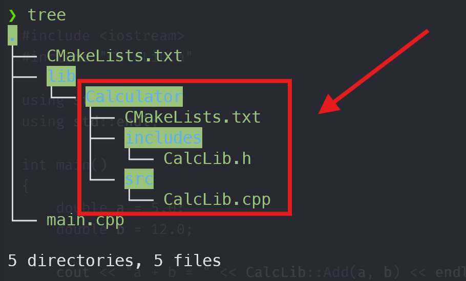
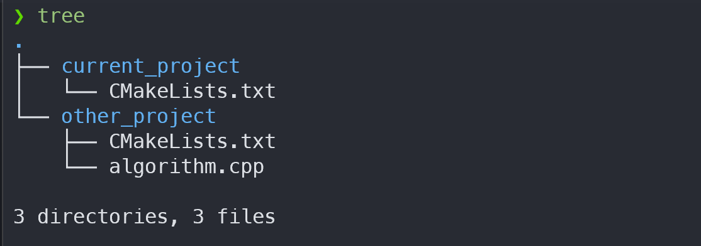
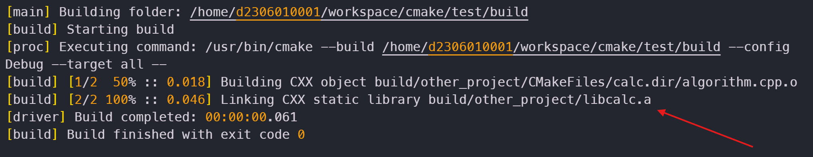
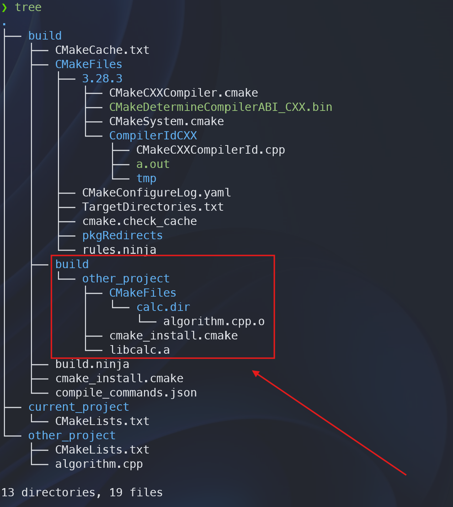

## 다른 라이브러리를 사용하는 라이브러리

예를 들어 다음과 같은 라이브러리에서 `thread` 라이브러리를 사용한다고 가정해보자.

{: width="600" }

```cpp
// main.cpp

#include <iostream>
#include "CalcLib.h"

using std::cout;
using std::endl;

int main()
{
    double a = 5.0;
    double b = 12.0;

    cout << "a + b = " << CalcLib::Add(a, b) << endl;

    return 0;
}
```

```cpp
// CalcLib.h

#ifndef CALCLIB_H
#define CALCLIB_H

class CalcLib
{
public:
    static double Add(const double &a, const double &b);
};

#endif // CALCLIB_H
```

```cpp
// CalcLib.cpp

#include "CalcLib.h"
#include <iostream>
#include <thread>

using std::cout;
using std::endl;

double CalcLib::Add(const double &a, const double &b)
{
    std::thread t([]() { cout << endl << "Thread ID: " << std::this_thread::get_id() << endl; });
    t.join();

    return a + b;
}
```

다음은 최상위의 `CMakeLists.txt` 파일의 내용이다.

```cmake
# 최상위 CMakeLists.txt

cmake_minimum_required(VERSION 3.29)
project(test VERSION 1.0 LANGUAGES CXX)

set(CMAKE_CXX_STANDARD 17)

set(SRC_FILES
        main.cpp
        lib/Calculator/src/CalcLib.cpp
        lib/Calculator/includes/CalcLib.h
)

add_subdirectory(lib/Calculator)

add_executable(${PROJECT_NAME}
        ${SRC_FILES}
)

target_link_libraries(
        ${PROJECT_NAME}
        PRIVATE
        Calculator
)
```

다음은 라이브러리의 `CMakeLists.txt` 파일의 내용이다.

```cmake
# lib/Calculator/CMakeLists.txt

cmake_minimum_required(VERSION 3.29)

project(Calculator VERSION 1.0 LANGUAGES CXX)

add_library(${PROJECT_NAME} STATIC
        src/CalcLib.cpp
        includes/CalcLib.h
)

set_target_properties(${PROJECT_NAME} PROPERTIES
        CXX_STANDARD 17
        CXX_STANDARD_REQUIRED YES
        CXX_EXTENSIONS NO
)

target_compile_options(Calculator PRIVATE -Wall -Wextra -Wpedantic)
target_include_directories(${PROJECT_NAME} PUBLIC ${CMAKE_CURRENT_SOURCE_DIR}/includes)

## thread 라이브러리 링크
target_link_libraries(${PROJECT_NAME} PRIVATE pthread)
```

리눅스의 경우 보통 `thread` 라이브러리를 사용하려면 `pthread` 라이브러리를 링크시켜줘야 한다. 따라서 `Calc`의 `CMakeLists.txt`를 수정해주어야 한다.

위와 같이 `target_link_libraries`를 통해서 `CalcLib`에 `pthread` 라이브러리를 추가해준 것을 알 수 있다. `target_link_libraries`로 `의존 라이브러리(dependency library)`를 추가할 수 있는데 추가 방식은 세 가지가 있다.
그 세 가지는 `PRIVATE`, `PUBLIC`, `INTERFACE`이며 다음과 같은 가이드라인을 따르면 좋을 것이다.

만약, `A` 라이브러리를 참조한다고 가정해보자.

- `A`를 헤더 파일과 구현 내부에서 모두 사용한다.
  - __`PUBLIC`__
- `A`를 내부 구현에서만 사용하고, 헤더 파일에서는 사용하지 않는다.
  - __`PRIVATE`__
- `A`를 헤더 파일에서만 사용하고, 내부 구현에서는 사용하지 않는다.
  - __`INTERFACE`__

이런식으로 명시하면 된다.

위의 경우 `<thread>`를 내부 구현(`CalcLib.cpp`)에서만 사용하고, 헤더 파일(`CalcLib.h`)에서는 사용하고 있지 않다. 따라서 이 경우 `pthread`를 `PRIVATE`으로 링크해주는 것이 옳은 선택이다. ***이를 통해 `CalcLib`를 사용하는 다른 라이브러리가 불필요하게 `pthread`를 링크해주는 일을 막을 수 있다.***

### 외부 경로 가져오기

경우에 따라선 필요한 `CMakeLists.txt` 파일이 `Root CMakeLists.txt`의 하위에 없을 수도 있다. 이런 경우를 `out-of-tree build`라고 한다.

아래와 같은 경우를 생각해보자.

{: width="600" }

다음은 `current_project/CMakeLists.txt` 파일의 내용이다.
```cmake
# current_project/CMakeLists.txt

cmake_minimum_required(VERSION 3.20)

project(my_project VERSION 1.0 LANGUAGES CXX)

# 상대 경로를 사용해 접근
add_subdirectory(
    ../other_project
)
```

다음은 `other_project/CMakeLists.txt` 파일의 내용이다.

```cmake
# other_project/CMakeLists.txt

add_library(calc STATIC algorithm.cpp)
```

여기서 `current_project/CMakeLists.txt` 파일은 `add_subdirectory`로 하위 디렉토리가 아닌 `다른 위치`를 참조 하고 있다.

이대로 `CMake`를 실행하면, 다음과 같은 오류가 발생한다.


다행히 [add_subdirectory](https://cmake.org/cmake/help/latest/command/add_subdirectory.html)를 하는 `CMakeLists.txt` 파일에서 **경로를 조정하는 방법**을 사용할 수 있다. 

```cmake
add_subdirectory(source_dir [binary_dir] [EXCLUDE_FROM_ALL] [SYSTEM])
```
{: .nolineno}

`When spcifying an out-of-tree source a binary directory must be explicitly specified.` 문장을 다시 한번 살펴보자. ***`binary directory`를 명시할 것을 요구하고 있다.***

```cmake
# current_project/CMakeLists.txt

cmake_minimum_required(VERSION 3.20)

project(my_project VERSION 1.0 LANGUAGES CXX)

add_subdirectory(
    ../other_project        # CMakeLists.txt 파일이 위치한 source dir
    ./build/other_project   # 빌드 결과물을 배치할 binary dir을 지정
)
```

위와 같이 `binary directory`를 지정한 후 `CMake`를 실행하면 오류 없이 정상적으로 동작할 것이다.



지정한 `build directory` 경로에 빌드 파일들이 생성된 것을 확인할 수 있다.



---

## 파일들을 한꺼번에 추가

`CMake`에서 타겟을 빌드하는데 필요한 소스 파일들을 명시하기 위해서는 다음과 같이 명시해야 한다.

```cmake
add_library(${PROJECT_NAME} STATIC src/CalcLib.cpp includes/CalcLib.h)
```
{: .nolineno }

위와 같이 해당 라이브러리를 빌드하는데 필요한 파일들을 명시해야 한다. 하지만 이 방법은 파일들이 새로 추가할 때마다 위의 `add_library`를 수정해줘야 하는 번거로움이 있다. 

이런 불필요한 작업은 `CMake`의 도움을 받으면 해소할 수 있다. 즉, `CMake`에게 **해당 디렉토리에 있는 파일들을 모두 이 라이브러리를 빌드하는데 사용해라.** 라고 명령할 수 있다는 것이다.

그 명령은 [file](https://cmake.org/cmake/help/latest/command/file.html)이라는 명령이다.

```cmake
file(GLOB_RECURSE SRC_FILES CONFIGURE_DEPENDS
	${CMAKE_CURRENT_SOURCE_DIR}/*.cpp
)

add_library(${PROJECT_NAME} STATIC ${SRC_FILES})
```

- __`file` 명령__
  - `CMake`에서 파일 관련해서 다룰 때 사용하는 명령이다. 
- __`GLOB_RECUSE` 옵션__
  - 인자로 주어진 디렉토리와 해당 디렉토리 안에 있는 모든 하위 디렉토리까지 `재귀적`으로 살펴본다는 의미이다.

> `CMake`에서 모든 변수들은 `${변수 이름}`과 같은 식으로 참조한다. `Make`와 비슷하다. 하지만 `Make`는 `소괄호( )`로 감싸주는 반면, `CMake`는 `중괄호{ }`로 감싸준다.
{: .prompt-tip }

이 때 주어진 디렉토리는 `${CMAKE_CURRENT_SOURCE_DIR/*.cpp`인데, `${CMAKE_CURRENT_SOURCE_DIR}`는 CMake에서 기본으로 제공하는 변수로 현재의 `CMakeLists.txt`가 위치한 디렉토리를 말한다. 즉, `CMakeLists.txt` 파일의 기준으로 `현재 디렉토리`를 의미한다.

따라서 위의 명령은 **현재 디렉토리 안에 있는 모든 `.cpp`로 끝나는 파일들(하위 디렉토리 포함)** 을 모두 모아서 `SRC_FILES` 라는 변수를 구성하라는 의미이다.

만일 하위 디렉토리를 포함하고 싶지 않다면, `GLOB_RECURSE` 대신하여 `GLOB` 를 주면 된다.

마지막으로 `CONFIGURE_DEPENDS` 옵션을 준다면, `GLOB`로 불러오는 파일 목록이 이전과 다를 경우(ex: 추가 혹은 제거 등), `CMake`를 다시 실행해서 빌드 파일을 재생성 하라는 의미가 된다.
따라서 만약, 디렉토리 안에 파일이 추가 되더라도 `cmake ..`을 다시 실행할 필요 없이 그냥 `make` 명령만 실행해도 `CMake`가 다시 실행되면서 **빌드 파일을 재작성한다.**

```cmake
add_library(${PROJECT_NAME} STATIC ${SRC_FILES})
```
{: .nolineno }

그러면 위의 `SRC_FILES` 변수 안에는 파일들의 목록이 모두 들어가 있을 것이다. 그래서 `target`을 빌드하는데, 필요한 파일들을 모두 지정할 수 있다.

```cmake
# lib/Calculator/CMakeLists.txt

cmake_minimum_required(VERSION 3.29)

project(Calculator VERSION 1.0 LANGUAGES CXX)

file(GLOB_RECURSE SRC_FILES CONFIGURE_DEPENDS
        src/*.cpp
        includes/*.h
)

add_library(${PROJECT_NAME} STATIC ${SRC_FILES})

set_target_properties(${PROJECT_NAME} PROPERTIES
        CXX_STANDARD 17
        CXX_STANDARD_REQUIRED YES
        CXX_EXTENSIONS NO
)

target_compile_options(Calculator PRIVATE -Wall -Wextra -Wpedantic)
target_include_directories(${PROJECT_NAME} PUBLIC ${CMAKE_CURRENT_SOURCE_DIR}/includes)

# thread 라이브러리 링크
target_link_libraries(${PROJECT_NAME} PRIVATE pthread)
```

위에서 바뀐 부분은 다음과 같다.

```cmake
file(GLOB_RECURSE SRC_FILES CONFIGURE_DEPENDS
        src/*.cpp
        includes/*.h
)

add_library(${PROJECT_NAME} STATIC ${SRC_FILES})
```

### ⚠️ 주의 사항

`CMake`에서는 위의 명령(`file`)으로 파일들을 읽어들이는 것을 권장하지 않는다. 그 이유는 파일이 추가되더라도 `CMake`가 생성한 빌드 파일 안에 명시된 파일들이 바뀌는 것이 아니기 때문이다. 그래서 `CMake`를 통해서 빌드 파일을 다시 생성해야 한다. 

물론 `CONFIGURE_DEPENDS` 옵션을 설정하면 되지만, 모든 빌드 시스템에서 안정적으로 작동하지는 않는다고 한다.

> Note We do not recommend using GLOB to collect a list of source files from your source tree. If no CMakeLists.txt file changes when a source is added or removed then the generated build system cannot know when to ask CMake to regenerate. The CONFIGURE_DEPENDS flag may not work reliably on all generators, or if a new generator is added in the future that cannot support it, projects using it will be stuck. Even if CONFIGURE_DEPENDS works reliably, there is still a cost to perform the check on every rebuild. [[link](https://cmake.org/cmake/help/v3.15/command/file.html?highlight=glob#glob-recurse)]

하지만 매번 CMakeLists.txt에 파일을 추가하는 번거로움을 없앨 수 있는 편리함이 상당하여 정말 중요한 프로젝트가 아니라면, 해당 명령어(`file`)를 사용하는 것이 좋을 듯 싶다.

참고로 `Make`와 `Ninja` 빌드 시스템을 사용했을 때는 문제 없이 잘 작동한다고 한다.

---

## 원하는 라이브러리를 설치하는 FetchContent

요즘 나오는 언어들은 대부분 외부 라이브러리를 쉽게 불러오고 설치하는 프로그램이 기본으로 제공된다. 예를 들어 `Python`에서는 `PIP`가 있고, `Rust`에는 `Cargo`가 있다. 

하지만 `C++`에는 언어 상 제공하는 기능이 없기 때문에 외부 라이브러리를 불러오거나 설치하는 것이 굉장히 불편하다.

이러한 불편한 문제를 해결하기 위하여 `CMake`에서 제공하는 명령어가 있다. 그것은 바로 [FetchContent](https://cmake.org/cmake/help/latest/module/FetchContent.html) 이다. 
`FetchContent`를 사용하면, 왠만한 `외부 라이브러리`를 쉽게 불러오고 설치할 수 있다. 

다음은 `FetchContent` 명령으로 `fmt` 라이브러리를 불러와서 사용하는 예이다.

```cmake
include(FetchContent)
FetchContent_Declare(
        Fmt
        GIT_REPOSITORY "https://github.com/fmtlib/fmt.git"
        GIT_TAG "11.0.2"
)
FetchContent_MakeAvailable(Fmt)
```

위는 간단히 `fmt` 라이브러리를 `CMake`를 통해 불러오고 설치하는 명령이다. 

```cmake
include(FetchContent)
```
{: .nolineno }

`include`를 통해서 `FetchContent` 모듈을 불러와야 한다. 그 후

```cmake
FetchContent_Declare(
        Fmt
        GIT_REPOSITORY "https://github.com/fmtlib/fmt.git"
        GIT_TAG "11.0.2"
)
```

위와 같이 어디에서 데이터를 볼러올지를 명시힌다. 위의 경우 `github`에서 특정 릴리즈를 가져오는 명령이다. (11.0.2 버전)

마지막으로 

```cmake
FetchContent_MakeAvailable(Fmt)
```
{: .nolineno }

위와 같이 `fmt` 라이브러리를 사용할 수 있도록 설정하면 된다. 

> 참고로 `FetchContent`로 불러온 라이브러리는 `프로젝트 전체`에서 사용 가능하다.
{: .prompt-info }

이제 `CalcLib` 라이브러리에서 `fmt`를 사용하고 싶다면 다음과 같이 `fmt` 라이브러리를 추가하기만 하면 된다.

```cmake
target_link_libraries(CalcLib PRIVATE pthread fmt)
```
{: .nolineno }

### ⚠️ 주의 사항

`FetchContent`를 사용하기 위해서는 최소한 `3.11` 이상 버전의 `CMake`를 사용해야 한다. 그 이전의 `CMake`를 사용하고 있다면, `ExternalProject` 모듈을 사용해도 된다. 

> 참고로 `FetchContent`는 `CMake`를 `실행`하는 시점에서 외부 라이브러리들을 불러오는 반면, `ExternalProject`는 `빌드 타임`에 불러온다는 차이가 있다.

---

## FetchContent와 ExternalProject

`CMake`에서 `FetchContent`와 `ExternalProject`는 모두 외부 프로젝트나 라이브러리를 빌드 시스템에 포함시키기 위한 도구이다. 그러나 각각의 용도가 다르고, 사용 상황에 따라 장단점이 있다. 어느 것을 사용할지는 프로젝트 요구 사항에 따라 달라질 수 있다.

### FetchContent

`FetchContent`는 `CMake 3.11`부터 도입된 기능으로, 외부 라이브러리나 프로젝트를 `CMake 실행 시점 (Configure Time)`에 소스로 가져와서 현재 빌드 트리에 통합하는 방식이다. 

특징으로는 다음과 같은 것들이 있다.

- `간편함`
  - 소스를 로컬에 다운로드하고, CMake의 빌드 트리 안에서 일반적인 CMake 타겟처럼 다룬다.
  - 매우 간단하게 설정할 수 있고, 외부 라이브러리를 직접 CMake 프로젝트의 일부로 통합할 수 있다.
- `빌드 트리 내 통합`
  - 외부 프로젝트가 마치 로컬 소스처럼 취급되어, 같은 빌드 트리에서 함께 빌드된다.
  - CMake의 `add_subdirectory()`처럼 작동하여 의존성을 쉽게 관리할 수 있다.
- `주요 사용 사례`
  - 비교적 가벼운 외부 라이브러리나 프로젝트를 소스 코드로 가져와 함께 빌드해야 할 때 적합하다.
  - 외부 종속성을 같은 빌드 트리 내에서 빌드하고 관리할 수 있다.

```cmake
include(FetchContent)

# 외부 프로젝트 가져오기
FetchContent_Declare(
	googletest
    GIT_RESPOSITORY https://github.com/google/googletest.git
    GIT_TAG 	release-1.11.0
)

# 외부 프로젝트 다운로드 및 빌드
FetchContent_MakeAvailable(googletest)

# 프로젝트에 외부 타겟 추가
add_executable(MyTestApp test.cpp)
target_link_libraries(MyTestApp gtest gtest_main)
```

### ExternalProject

`ExternalProject`는 외부 프로젝트를 독립된 빌드 시스템으로 관리할 때 사용한다. `FetchContent`와 달리, 외부 라이브러리를 `build time (MakeFile을 활용하여 make하는 시점)`에 가져온다. 따라서 외부 라이브러리는 현재 `CMake` 빌드 트리 외부에서 빌드되고, 결과물만 프로젝트에서 사용한다.

특징으로는 다음과 같은 것들이 있다.

- `빌드 시스템 분리`
  - 외부 프로젝트가 현재 프로젝트와 독립적으로 빌드된다.
  - 별도의 빌드 디렉토리에서 빌드된 후 결과물(라이브러리, 헤더파일 등)만 사용한다.
- `유연성`
  - 다양한 외부 빌드 시스템을 지원하며, CMake를 사용하지 않는 프로젝트에도 적용할 수 있다.
  - 매우 큰 프로젝트나 빌드 과정이 복잡한 프로젝트에 적합하다.
- `주요 사용 사례`
  - 빌드 시간이 길거나 매우 복잡한 외부 프로젝트를 관리해야 할 때 사용한다.
  - 외부 프로젝트와 현재 프로젝트의 빌드 시스템을 분리하고 싶을 때 사용한다.
  - 외부 프로젝트가 CMake를 사용하지 않거나, 특정 설치 과정이 필요한 경우에 사용한다.

```cmake
include(ExternalProject)

ExternalProject_Add(
	MyExternalProject
    PREFIX ${CMAKE_BINARY_DIR}/my_external_project
    GIT_REPOSITORY https://github.com/external/project.git
    GIT_TAG 	v1.0.0
    CMAKE_ARGS -DCMAKE_INSTALL_PREFIX=<INSTALL_DIR>
)

# 외부 프로젝트에서 빌드된 라이브러리 연결
add_executable(MyApp main.cpp)
add_dependencies(MyApp MyExternalProject)
target_link_libraries(MyApp ${CMAKE_BINARY_DIR}/my_external_project/lib/libexternal.a)
```

## ✨ FetchContent VS ExternalProject

| 특성 | FetchContent | ExternalProject |
| :--- | :--- | :--- |
|시점|CMake 실행 시점|Makefile 빌드 시점|
|빌드 통합|프로젝트 빌드 트리 내에서 빌드 됨|독립된 빌드 디렉토리에서 빌드됨|
|빌드 시스템|CMake 기반 프로젝트에 적합|CMake 외의 빌드 시스템(Autotools, Makefile 등)도 지원|
|간단함|설정과 사용이 비교적 간단|설정이 복잡할 수 있음|
|빌드 시간|적은 의존성이나 가벼운 프로젝트에 적합|큰 프로젝트나 복잡한 프로젝트에 적합|
|재사용성|빌드 트리 안에서만 재사용 가능|외부 디렉토리나 다른 프로젝트에서 쉽게 재사용 가능|
|유연성|외부 프로젝트가 CMake로 빌드 가능할 때 유리|외부 프로젝트가 CMake를 사용하지 않거나 특수 빌드일 때 유리|

## 📒 정리

### 언제 무엇을 사용할까?

- ***작은 라이브러리나 단순한 의존성*** 을 통합해야 하고, 외부 프로젝트가 `CMake 기반`이라면 `FetchContent`를 사용하는 것이 좋다. 설정이 간단하고, 라이브러리를 빌드 트리 안에서 쉽게 통합할 수 있기 때문이다.
- 외부 라이브러리가 ***CMake를 사용하지 않거나, 독립된 빌드 과정*** 을 통해 빌드되어야 하는 경우, 특히 빌드 시간이 오래 걸리는 `큰 프로젝트`인 경우에는 `ExternalProject`를 사용하는 것이 좋다. 이 방식은 빌드 시스템을 분리해 관리할 수 있고, `CMake` 외의 다양한 빌드 도구도 사용할 수 있다.

결론적으로, **간단한 의존성 관리**는 `FetchContent`, **복잡하고 큰 외부 프로젝트**는 `ExternalProject`를 사용하는 것이 일반적이다.
