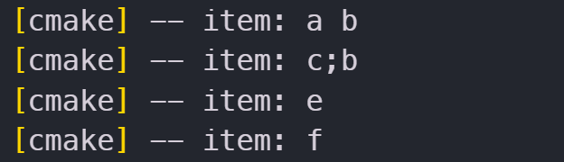
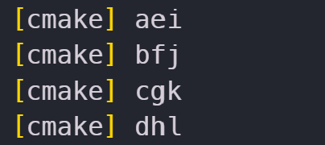

CMake의 반복 블럭은 `foreach()/endforeach()`와 `while()/endwhile()` 명령에 의해서 제공된다.

블록의 끝에 도달하지 않고 다음 반복으로 넘어가기 위해서는 `continue()` 명령을 사용하고, 반복을 종료하고 블록을 벗어나기 위해서는 `break()` 명령을 사용한다.

## foreach

`foreach`는 리스트 내의 각 변수들에 접근하기 위해 사용된다.

```cmake
foreach(<loop_var> <items>)
	<commend>
endforeach()
```

`<loop_var>`는 `<items>`의 요소들에 접근할 때 사용할 변수이다.

`<items>`는 아이템의 리스트이다. `; (세미콜론)` 혹은 `공백 (whitespace)`으로 구분된다. 

예를 들어, `a, b, c, d`라는 문자열을 순차적으로 출력하고 싶다면 다음과 같이 작성하면 된다.

```cmake
foreach(item a b;c d)
	message(${item})
endforeach()
```

### RANGE <stop\>

`foreach`에서 `RANGE <stop>`을 넣는 형식은 다음과 같다.

```cmake
foreach(<loop_var> RANGE <stop>)
```

`RANGE <stop>`은 반복이 종료될 `offset`을 정해 놓고 루프를 실행하기 위해 사용한다. `C++`로 치자면 다음의 코드와 같다.

```cpp
for(loo_var=0; loop_var<=stop; loop_var++)
```

만약 특정 리스트의 offset 3번 변수까지 순회를 하고 싶다면 다음과 같이 할 수 있다.

```cmake
set(my_list a b c d e)
foreach(i RANGE 3)
    list(GET my_list ${i} item)
    message(STATUS "item: ${item}")
endforeach()
```

### RANGE <start\> <stop\>

`RANGE <start> <stop>`은 `<start>`부터 `<stop>`까지를 순회한다.

```cmake
foreach(<loop_var> RANGE <start> <stop> [<step>])
```

`C++`로 표현하면 다음과 같다.

```cpp
for(loop_var=start; loop_var<stop; loop_var+=step)
```

만약 `<step>`을 따로 지정하지 않으면 `1`이라고 간주한다.

```cmake
set(my_list a b c d e)
list(LENGTH my_list my_list_len)
math(EXPR loop_stop "${my_list_len} - 1")

foreach(i RANGE 0 ${loop_stop} 2)
    list(GET my_list ${i} item)
    message(STATUS "item: ${item}")
endforeach()
```

`math()`는 사칙연산이나 논리연산을 수행해준다.

```cmake
math(EXPR <variable> "<expression>" [OUTPUT_FORMAT <format>])
```

`<format>`으로는 `HEXADECIMAL`과 `DECIMAL`을 지정하는 것이 가능하다. 

```cmake
math(EXPR value "100 * 0xA" OUTPUT_FORMAT DECIMAL) 		# value is set to "1000"
math(EXPR value "100 * 0xA" OUTPUT_FORMAT HEXADECIMAL)  # value is set to "0x3e8"
```

## IN LISTS <lists\>

이것은 값들이 리스트라고 가정하고 반복문을 수행하도록 돕는다.

```cmake
set(A "a b")
set(B "c\;b")
set(C "e;f")

foreach(item IN LISTS A B C)
    message(STATUS "item: ${item}")
endforeach()
```

실행 결과는 다음과 같다.

{: width="500" }

## IN ITEMS <items\>

`IN ITEMS`는 `IN LISTS`와 유사하다. 차이라면, `IN LISTS`는 변수를 받고, `IN ITEMS`는 역참조를 받는다.

예를 들어 `IN LISTS A`는 `IN ITEMS ${A}`와 같다. 

```cmake
set(A "a b")
set(B "c\;b")
set(C "e;f")

foreach(item IN ITEMS ${A} ${B} ${C})
    message(STATUS "item: ${item}")
endforeach()
```

## IN ZIP_LISTS <lists\>

`ZIP`이라는 단어가 알려주듯이, 리스트들을 `하나의 묶음`으로 해석한다.

```cmake
foreach(<loop_var>... IN ZIP_LISTS <lists>)
```

이 옵션은 마치 하나의 리스트에 여러 개의 슬롯이 존재하는 것처럼 해석한다.

```cmake
set(A a b c d)
set(B e f g h)
set(C i j k l)

foreach(item IN ZIP_LISTS A B C)
    message(${item_0} ${item_1} ${item_2})
endforeach()
```

{: width="400" }

그리고 다음과 같이 `foreach` 문을 작성해도 된다.

```cmake
...
foreach(a b c IN ZIP_LISTS A B C)
	message(${a} ${b} ${c})
    ...
```

## continue & break

`continue()`와 `break()` 문은 `C++`과 동일하다.

## 📒 정리

- `foreach()` & `endforeach()` 문으로 `루프 블록`을 정의한다.
- `RANGE <stop>`은 `0번 요소`부터 `<stop> 요소`까지 순회한다.
- `RANGE <start> <stop> [<step>]`은 `<start> 요소`부터 `<stop> 요소`까지를 `<step>` 만큼 증가하면서 순회한다.
- `IN LISTS <lists>`는 리스트 변수들의 모든 아이템들을 순회한다.
- `IN ITEMS <items>`는 리스트 변수들을 `역참조`하여 모든 아이템들을 순회한다.
- `IN ZIP_LISTS <lists>`는 리스트 변수들을 하나로 묶어서 아이템들을 동시에 순회한다.

---

## while

`while` 반복 블록은 `while() & endwhile()` 명령에 의해 구성된다. 블록의 끝에 도달하지 않고 다음 반복으로 넘어 가기 위해서는 `continue()` 명령을 사용하고, 반복 종료를 위해서는 `break()` 명령을 사용한다.

```cmake
while(<condition>)
	<command>
endwhile()
```

다음은 루프를 돌면서 리스트의 아이템들을 출력하는 예이다.

```cmake
set(my_lists a b c d e f g)
list(LENGTH my_lists my_lists_length)
set(count 0)

while(${count} LESS ${my_lists_length})
    list(GET my_lists ${count} item)
    message(STATUS "item: ${item}")
    math(EXPR count "${count} + 1")
endwhile()
```
