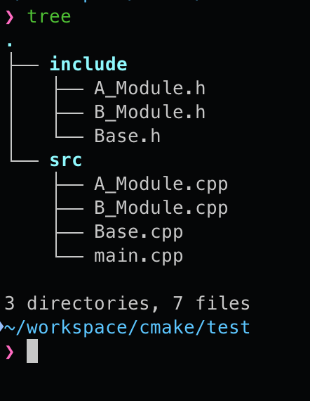
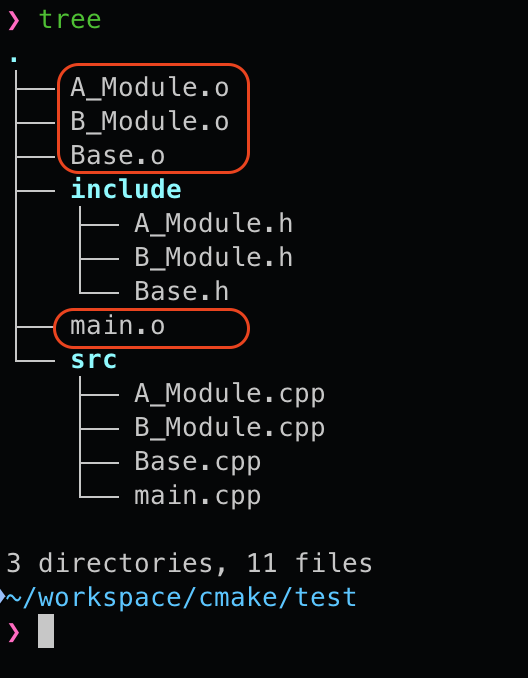
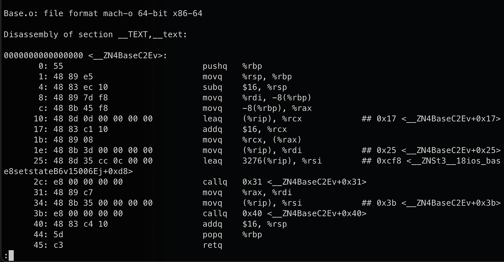
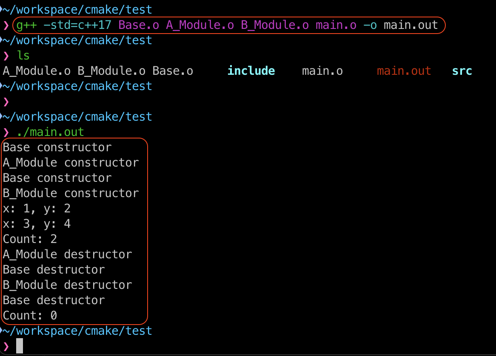
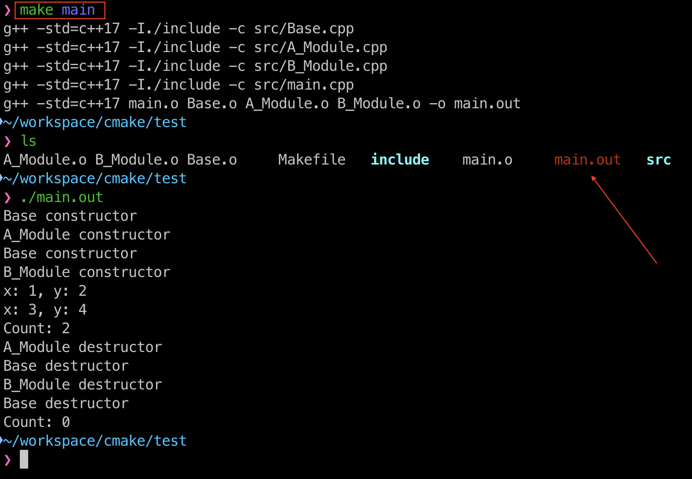
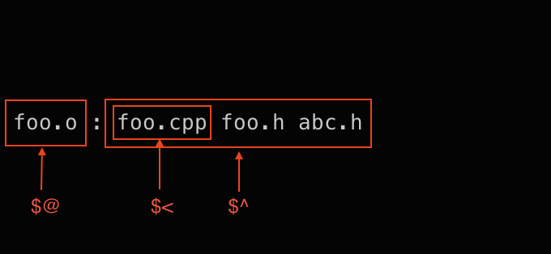
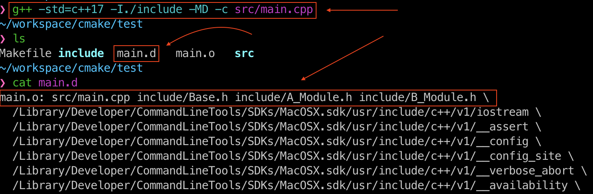
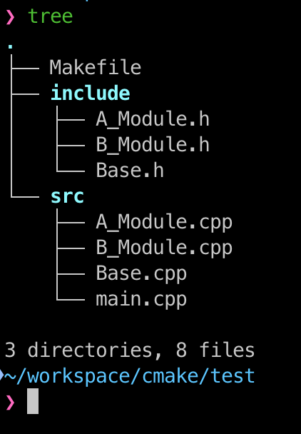
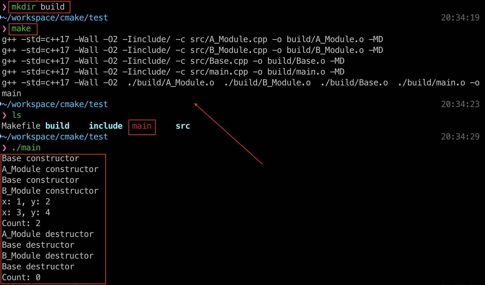

## Make & Makefile 시작 전, 용어 및 컴파일 단계 정리

`gcc`, `g++` 컴파일 과정은 `전처리` -> `컴파일` -> `어셈블` -> `링크` 이렇게 4단계로 이루어진다.

- __전처리 (Preprocessing)__
  - `#include`, `#define` 등과 같은 전처리 지시문 처리
- __컴파일 (Compilation)__
  - 소스코드 -> 어셈블리 코드(assembly)
    - 소스코드 파일(.cpp)을 어셈블리 코드파일(.s)로 변환
- __어셈블 (Assemble)__
    - 어셈블리어를 목적 코드(.o)로 변환
- __링크 (Linking)__
  - 목적 코드(.o)를 라이브러리나 다른 객체 파일과 결합하여 최종 실행 파일을 생성

## Make

make는 소프트웨어 개발을 위해 유닉스 계열 운영체제에서 주로 사용되는 프로그램 빌드 도구이다.
여러 파일들까지의 의존성과 각 파일에 필요한 명령을 정의함으로써 프로그램을 컴파일할 수 있으며, 최종 프로그램을 만들 수 있는 과정을 서술할 수 있는 표준적인 문법을 가지고 있다.

> 참고로 gmake는 리눅스에서 make와 같다. 즉, `gmake == make`
{: .prompt-info }

간단한 예제를 만들어서 살펴보도록 하자. 다음과 같은 파일구조로 되어 있다.
{: width="400" }
_directory tree_

해당 파일들의 내용은 다음과 같다.

`Base` 파일 내용

```cpp
// Base.h

#ifndef __BASE_H__
#define __BASE_H__

class Base{
    public:
    Base();
    virtual ~Base();
    virtual void ShowValues() const = 0;
    static int GetCount();

    protected:
    static int count;
};

#endif // __BASE_H__
```
{: file='Base.h' }

```cpp
// Base.cpp

#include "Base.h"
#include <iostream>

using namespace std;

Base::Base(){
    cout << "Base constructor" << endl;
}

Base::~Base(){
    cout << "Base destructor" << endl;
}

int Base::GetCount() {
    return count;
}

int Base::count = 0;
```
{: file='Base.cpp' }

`A_Module` 파일 내용

```cpp
// A_Module.h

#ifndef __A_MODULE_H__
#define __A_MODULE_H__

#include "Base.h"


class A_Module : public Base{
    public:
    A_Module(int x, int y);
    ~A_Module() override;
    void ShowValues() const override;

    private:
    int x;
    int y;
};

#endif // __A_MODULE_H__
```
{: file='A_Module.h' }

```cpp
#include "A_Module.h"

#include <iostream>

using namespace std;


A_Module::A_Module(int x, int y) : x(x), y(y){
    cout << "A_Module constructor" << endl;
    count++;
}

A_Module::~A_Module(){
    cout << "A_Module destructor" << endl;
    count--;
}

void A_Module::ShowValues() const{
    cout << "x: " << x << ", y: " << y << endl;
}
```
{: file='A_Module.cpp' }

`B_Module` 파일 내용

```cpp
// B_Module.h

#ifndef __B_MODULE_H__
#define __B_MODULE_H__

#include "Base.h"


class B_Module : public Base{
    public:
    B_Module(int x, int y);
    ~B_Module() override;
    void ShowValues() const override;

    private:
    int x;
    int y;
};

#endif // __B_MODULE_H__
```
{: file='B_Module.h' }

```cpp
#include "B_Module.h"

#include <iostream>

using namespace std;


B_Module::B_Module(int x, int y) : x(x), y(y){
    cout << "B_Module constructor" << endl;
    count++;
}

B_Module::~B_Module(){
    cout << "B_Module destructor" << endl;
    count--;
}

void B_Module::ShowValues() const{
    cout << "x: " << x << ", y: " << y << endl;
}
```
{: file='B_Module.cpp' }

`main.cpp` 파일 내용

```cpp
#include "Base.h"
#include "A_Module.h"
#include "B_Module.h"

#include <iostream>

int main(){
    Base* a = new A_Module(1, 2);
    Base* b = new B_Module(3, 4); 

    a->ShowValues();
    b->ShowValues();

    std::cout << "Count: " << Base::GetCount() << std::endl;

    delete a;
    delete b;

    std::cout << "Count: " << Base::GetCount() << std::endl;

    return 0;
}
```
{: file='main.cpp' }

`make`를 사용하지 않고 `g++`을 사용하는 방법은 다음과 같다.

```terminal
g++ -std=c++17 -I./include src/A_Module.cpp src/B_Module.cpp src/Base.cpp src/main.cpp -o main.out
```

위와 같은 명령어를 실행하면 `main.out`이라는 실행파일이 생성된다. 그런데 만약, `A_Module.cpp`파일에서 수정이 생겼다고 가정해보자.
이런 상황에서 다시 한번 위와 같은 명령을 실행하면, 수정하지 않은 소스코드들까지도 컴파일이 진행된다. 🥺

현재는 간단한 예제로 만들어 컴파일을 진행하므로 컴파일 시간이 오래걸리지 않지만 소스코드가 상당히 많으면 컴파일 시간이 비약적으로 늘어난다. 그런데 수정될때마다 매번 많은 소스코드를 컴파일하는 것은 매우 비효율적이다.

따라서 이럴때는 `목적 파일(obj)`을 생성해 놓고, 수정된 파일만 다시 컴파일하는 방안을 고려해야 한다. 이러면 실행파일을 생성하기 위한 시간을 상당히 줄일 수 있다. 😆

다음은 `목적파일(obj)`을 생성하는 명령어이다.

```terminal
g++ -std=c++17 -I./include -c src/A_Module.cpp src/B_Module.cpp src/Base.cpp src/main.cpp
```

{: width="350" }
_목적파일이 생성된 모습_

위의 사진을 보면, 모든 소스 코드들을 목적 파일로 만든 것을 볼 수 있다. 이렇게 미리 컴파일 해 놓고, 수정된 파일만 다시 컴파일하면 컴파일 시간을 비약적으로 줄일 수 있는 장점이 있다.

참고로 `소스 파일(.cpp)`은 `목적 파일(obj)`인 `어셈블리어`로 컴파일 된다. 다음은 목적 파일의 내용(어셈블리어)을 살펴보는 명령어이다.

```terminal
objdump -S Base.o
```



만들어 놓은 `목적 파일(obj)`로 `실행 파일`을 만들어 보자.

```terminal
g++ -std=c++17 Base.o A_Module.o B_Module.o main.o -o main.out
```

{: .normal }

`링커`로 목적 파일들을 실행 파일로 생성하면, 아주 빠르게 만들 수 있다. 그런데 현재 문제가 있다. 
그 문제는 프로젝트가 커지면 shell에 입력해야 할 명령어들이 많아진다는 문제이다. 
이 문제를 타파하는 좋은 솔루션이 바로 `make`와 `Makefile`이다.

---

## Makefile

`make`는 주어신 shell 명령어들을 조건에 맞게 실행하는 프로그램이라고 볼 수 있다. 이 때 어떠한 조건으로 명령어를 실행할 지 담은 파일을 `Makefile`이라고 부르며, `make`를 터미널 상에서 실행하게 된다면 해당 위치에 있는 `Makefile`을 찾아서 읽어들이게 된다.

- __구조__
  - __목적파일 (Target)__
    - 명령어가 수행되어 나온 결과를 저장할 파일
  - __의존성 (Dependency)__
    - 목적 파일을 만들기 위해 필요한 재료
  - __명령어 (Command)__
    - 실행 되어야 할 명령어들
  - __매크로 (Macro)__
    - 코드를 단순화 시키기 위한 방법

### Makefile이 조건을 기술하는 방식

```make
target ... : prerequisites ...
(탭) recipe
...
...
```

`Makefile`은 기본적으로 위와 같이 3가지 요소로 구성되어 있다.

#### target

`make`를 실행할 때, `make abc`와 같이 어떠한 것을 `make`할 지 전달하게 되는데, 이를 `target`이라고 부른다. 만일 `make abc`를 하였을 경우 `target`중에 `abc`를 찾아 이에 대응되는 명령을 실행해준다.

#### recipes (실행할 명령어)

주어진 `target`을 `make`할 때, 실행할 명령어들의 나열이다. 한 가지 __중요한 점__ 은 `recipe`자리에 명령어를 쓸 때, 반드시 `Tab(탭)` 한 번으로 `들여쓰기`를 해 줘야만 한다는 점이다. 
보통 요즘의 편집기의 경우, 자동으로 `Tab`을 `Space`로 바꿔주는 옵션이 활성화되어 있을텐데 `make`가 `Makefile`을 제대로 읽어들이기 위해서는 ***반드시 `Tab(탭)`을 사용해야 한다.***

#### prerequisites (필요 조건들)

주어진 `target`을 `make`할 때, 사용될 **파일들의 목록**이다. 다른 말로 `의존 파일(denpendency)`라고도 한다. 왜냐하면 해당 `target`을 처리하기 위해 건드려야 할 파일들을 써 놓은 것이기 때문이다.
만일 주어진 파일들의 `수정 시간`보다 `target`이 더 나중에 수정되었다면 해당 `target`의 명령어를 실행하지 않는다. 그 이유는 이미 이전에 `target`이 만들져있다고 간주하기 때문이다.

예를 들어 `target`이 `main.o`이고, 명령어가 `g++ -c main.cpp`라면, 필요 조건들은 `main.cpp`, `A_Module.h`, `B_Module.h`, `Base.h`가 된다. 왜냐하면 이들 파일들 중 하나라도 바뀐다면 `main`을 새로 컴파일해야 하기 때문이다. 
반면 `main.o`의 생성 시간이 `main.cpp`, `A_Module.h`, `B_Module.h`, `Base.h`들의 마지막 수정 시간 보다 나중이라면, 굳이 `main.o`를 다시 컴파일 할 필요가 없다.

그렇다면 위 내용을 바탕으로 `Makefile`을 간단하게 구성해 보자.

```make
Base.o : src/Base.cpp include/Base.h
	g++ -std=c++17 -I./include -c src/Base.cpp

A_Module.o : src/A_Module.cpp include/A_Module.h
	g++ -std=c++17 -I./include -c src/A_Module.cpp

B_Module.o : src/B_Module.cpp include/B_Module.h
	g++ -std=c++17 -I./include -c src/B_Module.cpp

main.o : src/main.cpp include/Base.h include/A_Module.h include/B_Module.h
	g++ -std=c++17 -I./include -c src/main.cpp

main : Base.o A_Module.o B_Module.o main.o
	g++ -std=c++17 main.o Base.o A_Module.o B_Module.o -o main.out

clean:
	rm -f *.o main.out
```

그 후 해당 `Makefile`을 실행하여 `main.out`이라는 실행파일을 생성하자.

```terminal
make main
```



위의 사진에서 보다시피 `main.out`이라는 실행파일이 만들어진 것을 볼 수 있다. `make`는 `main.out`이라는 실행파일을 생성하기 위해 필요한 소스들을 추적하여 **수정 시간을 비교해 수정된 소스들만 재컴파일한다.** 고로 실행파일을 만들기 위한 컴파일 시간이 획기적으로 줄어든다. 😌

### Makefile - Macro

#### 변수 정의

`Makefile`내에서 변수를 정의할 수 있다. 다음과 같이 말이다.
```make
CXX = g++
```
{: .nolineno }

위 경우 `CXX`라는 변수를 정의하였는데, 이제 `Makefile`내에서 `CXX`를 사용하게 된다면 해당 변수의 문자열인 `g++`로 치환된다. 이 때 변수를 사용하기 위해서는 `$(CXX)`와 같이 `$( )`안에 사용하고자 하는 변수의 이름을 지정하면 된다.

참고로 `Makefile`에서 변수를 정의하는 방법으로 `=`, `:=` 이렇게 두 가지의 방법이 있다.

##### "="을 사용한 변수 정의

`=`를 사용하면 변수를 정의하였을 때, 정의에 다른 변수가 포함되어 있다면 해당 변수가 정의될 때까지 변수의 값이 정해지지 않는다. 예를 들어 다음과 같은 문장이 있다고 가정해보자.

```make
B = $(A)
C = $(B)
A = "abc"
```
{: .nolineno }

`C`의 경우 `B`의 값을 참조하고 있고, `B`의 경우 `A`의 값을 참조하고 있다. 하지만 `B =`를 실행한 시점에서 `A`가 정의되지 않았으므로 `B`는 그냥 빈 문자열이 되어야 하지만, `=`로 정의했기에 `A`가 실제로 정의될 때 까지 `B`와 `C`가 결정되지 않는다.
결국 마지막에 `A = "abc"`를 통해 `A`가 `"abc"`로 대응되어야 `C`가 `"abc"`로 결정된다.

##### ":="을 사용한 변수 정의

반면에 `:=`로 변수를 정의할 경우, 해당 시점에서의 변수 값만 확인한다. 따라서 위 경우 `B`는 그냥 빈 문자열이 된다.
대부분의 상황에서는 `=`, `:=` 중 아무거나 사용해도 상관 없다.

- 만일 변수들의 정의 순서에 크게 구애받고 싶지 않다면, `=`를 사용하는 것이 편하다.
  - `Makefile`의 변수 정의 순서가 중요하지 않다? 그렇다면 `=`
- `A = `와 같이 자기 자신을 수정하고 싶다면 `:=`를 사용해야만 무한 루프를 피할 수 있다.
  - `Makefile`의 변수 정의 순서가 중요하다? 그렇다면 `:=`

#### 변수를 이용한 Makefile 작성

그러면 변수를 이용하여 `Makefile`의 내용을 변경해보자.

```make
CXX = g++
CXXFLAGS = -std=c++17 -Wall -O2 
INCLUDE = -I./include
OBJS = Base.o A_Module.o B_Module.o main.o

Base.o : src/Base.cpp include/Base.h
	$(CXX) $(CXXFLAGS) $(INCLUDE) -c src/Base.cpp

A_Module.o : src/A_Module.cpp include/A_Module.h
	$(CXX) $(CXXFLAGS) $(INCLUDE) -c src/A_Module.cpp

B_Module.o : src/B_Module.cpp include/B_Module.h
	$(CXX) $(CXXFLAGS) $(INCLUDE) -c src/B_Module.cpp

main.o : src/main.cpp include/Base.h include/A_Module.h include/B_Module.h
	$(CXX) $(CXXFLAGS) $(INCLUDE) -c src/main.cpp

main : $(OBJS)
	$(CXX) $(CXXFLAGS) $(OBJS) -o main.out

clean:
	rm -f main.out $(OBJS)
```

`CC`, `CXX`와 `CFLAGS`, `CXXFLAGS`는 `Makefile`에서 자주 사용되는 변수로 보통 `CC`, `CXX`에는 사용하는 **`컴파일러 이름`** 을, `CFLAGS`, `CXXFLAGS`에는 **`컴파일러 옵션`** 을 주는 것이 일반적이다.

이 경우 `g++`컴파일러를 사용하며, 옵션으로 `Wall(모든 컴파일러 경고 표시)`과 `O2(최적화 레벨2)`를 주었다.

#### PHONY

`Makefile`에 흔히 추가하는 기능으로 빌드 관련 파일들(*.o 파일들)을 모두 제거하는 명령을 넣는다.

```make
clean:
	rm -f main.out $(OBJS)
```
{: .nolineno }

`make clean`명령을 실행해보면 생성된 모든 목적 파일과 `main.out`을 제거하는 것을 볼 수 있다.

그런데 만약, `clean`이라는 파일이 디렉토리에 생성되어 존재한다면 `make clean`명령을 무시하게 된다. 이러한 상황을 막기 위해선 `clean`을 `PHONY`라고 등록하면 된다.

> PHONY는 `가짜의`, `허위의`라는 뜻이다.
{: .prompt-info }

```make
.PHONY : clean
clean :
	rm -f main.out $(OBJS)
```
{: .nolineno }

이제 `make clean`을 하게 되면, `clean`파일의 유무와 상관 없이 언제나 해당 타겟의 명령을 실행하게 된다.

#### 패턴 매칭 사용

위의 경우 파일이 몇개 없어 다행이다. 허나 실제 프로젝트에서는 수십 ~ 수백 개의 파일들을 다루게 된다. 그런데 각각의 파일들에 대해서 모두 빌드 방식을 명시해준다면 `Makefile`의 크기가 엄청 커지게 된다.

이럴 때, `패턴 매칭`을 통해 특정 조건에 부합하는 파일들에 대해서 간단하게 `recipe`를 작성할 수 있다.

```make
foo.o : foo.cpp foo.h
	$(CXX) $(CXXFLAGS) -c foo.cpp
    
bar.o : bar.cpp bar.h
	$(CXX) $(CXXFLAGS) -c bar.cpp
```

위의 명령들을 다음과 같이 나타낼 수 있다.

```make
%.o : %.cpp %.h
	$(CXX) $(CXXFLAGSOP) -c $<
```

- __%.o__
  - 와일드카드로 따지면 `*.o`와 같다고 볼 수 있다. 즉, `.o`로 끝나는 파일 이름들이 타겟이다. 예를 들어 `foo.o`가 타겟이라면 `%`에는 `foo`가 들어갈 것이다.
  - 해당 패턴은 타겟과 `prerequisite` 부분에만 사용할 수 있다. `recipe` 부분에는 패턴을 사용할 수 없다.
- __$<__
  - `prerequisite`에서 첫 번째 파일의 이름에 대응되어 있는 변수이다. 위의 경우 `foo.cpp`가 되겠다.

`Makefile`에서 제공하는 자동 변수로는 아래와 같이 `$@`, `$<`, `$^` 등등이 있다.



- __$@__
  - target 이름에 대응된다.
- __$<__
  - 의존 파일 목록에 첫 번째 파일에 대응된다.
- __$^__
  - 의존 파일 목록 전체에 대응된다.
- __$?__
  - target 보다 최신인 의존 파일들에 대응된다.
- __$+__
  - `$^`와 비슷하지만, 중복된 파일 이름들까지 모두 포함한다.
  
하지만 위의 패턴들로는 아래와 같은 것을 표현하기에는 부족하다.

```make
main.o : main.cpp foo.h bar.h
	$(CXX) $(CXXFLAGS) -c main.cpp
```

그 이유는 의존 파일 목록에 `main.h`이 없기 때문이다. `Makefile` 구조의 의존 파일 목록을 보면 ***해당 소스 파일이 어떠한 헤더파일을 포함하고 있냐*** 로 결정된다. 
즉, `main.cpp`에는 `foo.h`, `bar.h`를 include 하고 있기 때문에 `main.o`의 `prerequisite`로 `main.cpp` 외에도 `foo.h`, `bar.h`가 들어가있는 것이다.

소스 파일에 해더 파일을 추가할 때마다 `Makefile`을 바꾸는 것은 너무 비효율적이다. 그래서 이럴 때에는 **컴파일러의 도움을 받아 의존 파일 목록 부분을 작성할 수 있다.**

### 자동으로 prerequisite 만들기

컴파일 시, `-MD` 옵션을 추가해서 컴파일을 해보자.

```terminal
g++ -std=c++17 -I./include -MD -c src/main.cpp
```

`main.d`라는 파일이 생성되었을 것이다. 해당 파일 내용을 살펴보면 다음과 같다.



마치 `Makefile`의 `target : prerequisite`인 것 처럼 생겼다. 
즉, 컴파일 시에 `-MD` 옵션을 추가해주면, 목적 파일 말고도 컴파일 한 소스 파일을 타겟으로 하는 `의존 파일 목록`을 담은 파일을 생성해준다.

이렇게 생성된 `main.d` 파일을 `Makefile`에 포함하도록 해보자.

```make
CXX = g++
CXXFLAGS = -std=c++17 -Wall -O2 
INCLUDE = -I./include
OBJS = Base.o A_Module.o B_Module.o main.o

%.o : src/%.cpp include/%.h
	$(CXX) $(CXXFLAGS) $(INCLUDE) -c $<

main : $(OBJS)
	$(CXX) $(CXXFLAGS) $(OBJS) -o main.out

.PHONY : clean
clean :
	rm -f main.out $(OBJS)

include main.d
```

위의 `include main.d`는 `main.d`라는 파일의 내용을 `Makefile`에 포함하라는 의미이다. 그렇다면 다음과 같은 부분을 컴파일러가 생성한 `.d`파일로 대체하도록 하자.

```make
%.o : %.cpp %.h
	$(CXX) $(CXXFLAGS) $(INCLUDE) -c $<
```

이 부분을 컴파일러가 생성한 `.d` 파일로 대체하면 아주 효율적인 `Makefile`이 될 것이다.

```make
CXX = g++
CXXFLAGS = -std=c++17 -Wall -O2 
INCLUDE = -I./include
OBJS = Base.o A_Module.o B_Module.o main.o

%.o : src/%.cpp include/%.h
	$(CXX) $(CXXFLAGS) $(INCLUDE) -c $<

main : $(OBJS)
	$(CXX) $(CXXFLAGS) $(OBJS) -o main.out

.PHONY : clean
clean :
	rm -f main.out $(OBJS)

-include $(OBJS:.o=.d)
```

`$(OBJS:.o=.d)` 부분은 `OBJS`에서 `.o`로 끝나는 부분을 `.d`로 모두 대체하라는 의미이다. 즉, 해당 부분은 `-include main.d Base.d A_Module.d B_Module.d` 가 될 것이다.

그리고 `include`에서 `-include`로 바뀌었는데, `-include`의 경우 포함하고자 하는 파일이 존재하지 않아도 `make` 메시지를 출력하지 않는다.

{: width="300" }

위와 같은 파일 구조가 있다.모든 소스 파일은 `src`에 들어가 있고, 해더 파일은 `include`에 들어가 있으며, 빌드 파일들은 `build`라는 디렉토에 들어갈 것이다. 
이런 구조에서 항상 만족하며 사용할 수 있는 `Makefile`은 다음과 같다.

```make
CXX = g++

# C++ 컴파일러 옵션
CXXFLAGS = -std=c++17 -Wall -O2

# 링커 옵션
LDFLAGS = 

# 헤더 파일 경로
INCLUDE = -Iinclude/

# 소스 파일 디렉토리
SRC_DIR = ./src

# 빌드 파일 디렉토리
BUILD_DIR = ./build

# 생성하고자 하는 실행 파일 이름
TARGET = main

# Make할 소스 파일들
# wildcard로 sRC_DIR에서 *.cpp로 된 파일들 목록을 가져온 뒤 그것을 notdir로 파일명만 추출
# ex) $(notdir $(wildcard $(SRC_DIR)/*.cpp)) -> main.cpp Base.cpp A.cpp B.cpp
SRCS = $(notdir $(wildcard $(SRC_DIR)/*.cpp))

OBJS = $(SRCS:.cpp=.o)

# OBJS안의 object 파일들 이름 앞에 $(BUILD_DIR)/을 붙인다.
OBJECTS = $(patsubst %.o, $(BUILD_DIR)/%.o, $(OBJS))
DEPS = $(OBJECTS:.o=.d)

all: main

$(BUILD_DIR)/%.o : $(SRC_DIR)/%.cpp
	$(CXX) $(CXXFLAGS) $(INCLUDE) -c $< -o $@ -MD $(LDFLAGS)

$(TARGET) : $(OBJECTS)
	$(CXX) $(CXXFLAGS) $(OBJECTS) -o $(TARGET) $(LDFLAGS)

.PHONY: clean all
clean:
	rm -f $(OBJECTS) $(DEPS) $(TARGET)

-include $(DEPS)
```

이것을 실행하는 명령은 다음과 같다.

```terminal
mkdir build && make
```



실행이 잘 된 것을 볼 수 있다.

## ⚡️ 멀티 코어로 Make 속도를 올리자

단순히 `make`를 실행하게 되면, 단 한개의 스레드인 `싱글 코어`만 실행되어서 속도가 상당히 느리다. 특히 `GCC`나 `커널`을 컴파일 할 경우, 한 두시간은 그냥 넘어가게 된다.
이럴 때 `멀티 코어`로 `make`를 실행할 수 있다. 이를 위해서는 인자로 `-j` 뒤에 *몇 개의 스레드* 를 사용할 지 숫자를 적어서 전달하게 된다.

```terminal
make -j8
```

위와 같이 `8`을 전달하게되면, `8개의 스레드`에 나뉘어서 실행된다. 만약 현재 컴퓨터의 코어 개수를 자동으로 입력하고 싶다면 다음과 같은 명령을 실행하면 된다.

```terminal
make -j$(nproc)
```

## 🚨 Make 실행 시 자주 발생하는 에러

### Makefile:18: ***missing separator. Stop

해당 에러가 발생한다면, `command`앞에 `Tab(탭)`을 사용하지 않았을 경우이다.


### make: *** No rule to make target \`A_Module.h\` needed by \`A_Module.o\`. Stop.

해당 에러가 발생한다면, `A_Module.o`가 `A_Module.h`에 의존하는데, `A_Module.h`를 찾을 수 없을 경우이다. 
즉, 의존 관계 문제이다.
