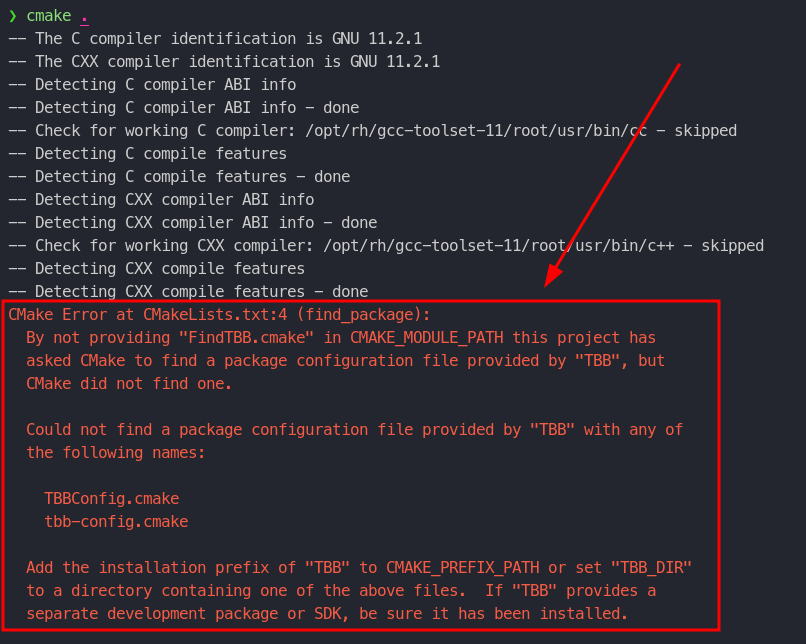
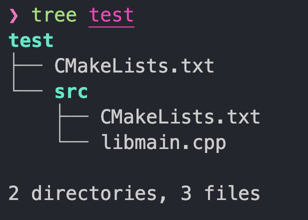
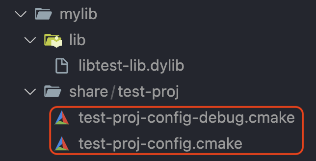

## Package의 구성

보통 패키지라고 하면 `RPM`, `Brew` 처럼 관리 소프트웨어를 통해 `다운로드/설치/업데이트`해서 사용하는 프로그램들을 말하는데, `C++` 개발자들에게 `패키지`란 개발에 필요한 `Library + Manifest`에 가까운 것 같다.

- `일반적인 패키지`
  - 실행 프로그램 (excecutable)
  - 문서 파일 (license, manual, readme 등)
- `프로그래밍 패키지 <일반 패키지 및 개발에 필요한 요소들>`
  - 서브 프로그램 (library)
  - 실행 프로그램 (test tools, script 등)
  - 소스 코드 (include, example 등)

`C++`에서는 미리 빌드된 서브 프로그램 뿐만 아니라 소스 코드가 포함된다는 점(`include`)이 특이하다고 볼 수 있다. 
비단 `템플릿 프로그래밍`의 비중이 늘어난 것 뿐만 아니라 `크로스 컴파일`과 `링킹`에 손이 많이 가기 때문이기도 할 것이다.

지금은 많은 `C++` 프로젝트들이 [UNIX FileSystem](https://en.wikipedia.org/wiki/Unix_filesystem)에서 표준 C 라이브러리를 배치할 때 사용하던 파일트리 구조를 적용하고 있다.
굳이 이런 배치에 어떤 의미가 부여되어있다기 보다는, **`CMake`의 초창기부터 `UNIX 시스템`에 빌드 된 라이브러리를 설치하면서 관례를 따르던 것이 현재까지 이어지고 있다** 정도로 생각하면 될 것 같다.

- __`bin`__
  - 실행 프로그램 (executable)
- __`lib`__
  - 미리 빌드된 라이브러리 (\*.so, \*.lib 등)
- __`include`__
  - 소스 코드 (header)
- __`share`__
  - 기타 필요한 파일들 <주로 빌드 지원 파일>
  - __`docs`__
    - 문서가 있는 경우

## CMake의 Package 찾기

### [find_package](https://cmake.org/cmake/help/latest/command/find_package.html)

이미 설치된 패키지를 찾는 기능으로 `CMake`는 `find_package`를 제공하고 있다. 

> ✔️ *참고*
>
> 사용하는 라이브러리가 `CMake`를 지원하는데 `find_package()`가 매끄럽게 사용되지 않는다?
>
> 이럴 때는 `add_subdirectory()`를 사용하는 것이 **정확한** 해결책이 될 수 있다. 
> `Package Export`에 문제가 있는 경우, ***Import하는 쪽에서 수정하기가 어렵기 때문이다.***

`find_package()` 함수는 일반적으로 아래와 같이 이름과 버전을 인자로 사용한다. 탐색에 성공하면 `name_FOUND` 변수가 생성된다. 아래의 예처럼 이름으로 `OpenCV`를 사용했다면, 성공여부는 `OpenCV_FOUND`로 확인할 수 있다.

```cmake
find_package(OpenCV 3.3)
if(OpenCV_FOUND)
	// ...
    // target_source: Add OpenCV related source codes...
    // target_compile_option: Enable RTTI for OpenCV...
    // ...
endif()

find_package(OpenCV 3.3 REQUIRED)
```

조금 더 상세하게 패키지 탐색을 위한 정보를 제공하는 경우, [`CONFig`를 사용해 Config Mode로 호출](https://cmake.org/cmake/help/latest/command/find_package.html#full-signature-and-config-mode)하게 된다.

`PATHS`를 수정하여도 제대로 찾지 못한다면, `CMake Cache`의 문제일 가능성이 높다. 그런 경우 `CMakeCache.txt`를 제거하고 다시 `CMake`를 실행해보자.

```cmake
find_package(fmt 5.3
CONFIG
	REQUIRED
    PATHS 		/home/user/vcpkg/installed/x64-linux
    			C:/vcpkg/installed/x64-windows
)
```

수 많은 컴포넌트를 가진 `Boost`에서 필요한 모듈만 가져다 쓴다면, 아래처럼 작성하면 될 것이다. 분명히 설치 되었음에도 `CMake`에서 찾지 못한다면 `CONFIG`를 지우고 다시 시도해보면 찾을 수도 있
다.

```cmake
find_package(Boost 1.59
// 만약 cmake가 실패하면, CONFIG 제거 후 다시 시도
CONFIG
	REQUIRED
    COMPONENTS system thread timer
)
```

`CMake`에서 `find_package()`를 호출하면, 해당 함수는 `Package`를 찾고, 그 안에 있는 `Target`들을 가져온다(`add_library(IMPORTED)`).
물론 `executable`과 `링킹`을 하지는 않기 때문에, 가져온 `Target`들을 `add_library(INTERFACE)` 혹은 `add_library(SHARED)`로 만들어진 결과물들이다. 따라서 이들을 소비하는 함수는 `target_link_libraries()`이다.

```cmake
find_package(gRPC CONFIG REQUIRED)
// ...
target_link_libraries(main
PRIVATE
	gRPC::gpr gRPC::grpc gRPC::grpc++ gRPC::grpc_cronet
)
```

여기에는 하나의 전제가 있다. 해당 라이브러리가 `CMake`에서 `Import`할 수 있도록 적절하게 `config` 파일을 작성해 놓았거나, `CMake`의 `export` 함수를 사용해 `CMake`를 위한 `config` 파일을 생성해 놓은 것이다.

어떤 파일을 제공해야 하는지 알아보기 위해 아래와 같이 `CMakeLists.txt`를 작성해 실행해보자.

```cmake
cmake_minimum_required(VERSION 3.30)

find_package(TBB REQUIRED)
```

[Intel TBB](https://github.com/oneapi-src/oneTBB)가 설치되지 않은 환경에서 `find_package()`가 실패하면서 아래와 같이 오류를 출력할 것이다.



이를 통해 확인할 수 있는 것은 `find_package()`에서 `TBB`라는 이름으로 대소문자가 혼합된 경우(`TBBConfig.cmake`)와 소문자만 사용된 경우(`tbb-config.cmake`)를 고려하여 `config` 파일을 찾으려 했다는 것을 알 수 있다.

#### xxx-config.cmake

`TBB`를 설치하면, `TBBConfig.cmake`가 생성된 것을 확인할 수 있다. 다행히 `TBB`의 `xxx-config.cmake` 파일은 비교적 짧은 편에 속한다. 

```cmake
/*
# Copyright (c) 2017-2019 Intel Corporation
#
# Licensed under the Apache License, Version 2.0 (the "License");
# you may not use this file except in compliance with the License.
# You may obtain a copy of the License at
#
#     http://www.apache.org/licenses/LICENSE-2.0
#
# Unless required by applicable law or agreed to in writing, software
# distributed under the License is distributed on an "AS IS" BASIS,
# WITHOUT WARRANTIES OR CONDITIONS OF ANY KIND, either express or implied.
# See the License for the specific language governing permissions and
# limitations under the License.

# TBB_FOUND should not be set explicitly. It is defined automatically by CMake.
# Handling of TBB_VERSION is in TBBConfigVersion.cmake.
*/

if (NOT TBB_FIND_COMPONENTS)
    set(TBB_FIND_COMPONENTS "tbb;tbbmalloc;tbbmalloc_proxy")
    foreach (_tbb_component ${TBB_FIND_COMPONENTS})
        set(TBB_FIND_REQUIRED_${_tbb_component} 1)
    endforeach()
endif()

// Add components with internal dependencies: tbbmalloc_proxy -> tbbmalloc
list(FIND TBB_FIND_COMPONENTS tbbmalloc_proxy _tbbmalloc_proxy_ix)
if (NOT _tbbmalloc_proxy_ix EQUAL -1)
    list(FIND TBB_FIND_COMPONENTS tbbmalloc _tbbmalloc_ix)
    if (_tbbmalloc_ix EQUAL -1)
        list(APPEND TBB_FIND_COMPONENTS tbbmalloc)
        set(TBB_FIND_REQUIRED_tbbmalloc ${TBB_FIND_REQUIRED_tbbmalloc_proxy})
    endif()
endif()

set(TBB_INTERFACE_VERSION 11007)

get_filename_component(_tbb_root "${CMAKE_CURRENT_LIST_FILE}" PATH)
get_filename_component(_tbb_root "${_tbb_root}" PATH)
get_filename_component(_tbb_root "${_tbb_root}" PATH)

foreach (_tbb_component ${TBB_FIND_COMPONENTS})
    set(_tbb_release_lib "${_tbb_root}/lib/${_tbb_component}.lib")
    set(_tbb_debug_lib "${_tbb_root}/debug/lib/${_tbb_component}_debug.lib")

    if (EXISTS "${_tbb_release_lib}" OR EXISTS "${_tbb_debug_lib}")
        add_library(TBB::${_tbb_component} UNKNOWN IMPORTED)
        set_target_properties(TBB::${_tbb_component} PROPERTIES
                              INTERFACE_INCLUDE_DIRECTORIES "${_tbb_root}/include")

        if (EXISTS "${_tbb_release_lib}")
            set_target_properties(TBB::${_tbb_component} PROPERTIES
                                  IMPORTED_LOCATION_RELEASE "${_tbb_release_lib}")
            set_property(TARGET TBB::${_tbb_component} APPEND PROPERTY IMPORTED_CONFIGURATIONS RELEASE)
        endif()

        if (EXISTS "${_tbb_debug_lib}")
            set_target_properties(TBB::${_tbb_component} PROPERTIES
                                  IMPORTED_LOCATION_DEBUG "${_tbb_debug_lib}")
            set_property(TARGET TBB::${_tbb_component} APPEND PROPERTY IMPORTED_CONFIGURATIONS DEBUG)
        endif()

        // Add internal dependencies for imported targets: TBB::tbbmalloc_proxy -> TBB::tbbmalloc
        if (_tbb_component STREQUAL tbbmalloc_proxy)
            set_target_properties(TBB::tbbmalloc_proxy PROPERTIES INTERFACE_LINK_LIBRARIES TBB::tbbmalloc)
        endif()

        list(APPEND TBB_IMPORTED_TARGETS TBB::${_tbb_component})
        set(TBB_${_tbb_component}_FOUND 1)
    elseif (TBB_FIND_REQUIRED AND TBB_FIND_REQUIRED_${_tbb_component})
        message(STATUS "Missed required Intel TBB component: ${_tbb_component}")
        set(TBB_FOUND FALSE)
        set(TBB_${_tbb_component}_FOUND 0)
    endif()
endforeach()

unset(_tbbmalloc_proxy_ix)
unset(_tbbmalloc_ix)
unset(_tbb_lib_path)
unset(_tbb_release_lib)
unset(_tbb_debug_lib)
```

크게 3가지 정도 눈여결 볼 수 있다.

- `add_library(IMPORTED)`를 사용해서 `CMake Target`을 생성한다. 이름으로는 `TBB::${_tbb_component}`를 사용해서 이것이 `CMake Target`이라는 점을 분명히 드러내고 있다.
- `set_property()` 함수를 사용해서 `DEBUG/RELEASE` 설정으로 빌드되었다는 정보를 추가하는 것을 볼 수 있다.
- `set_target_properties()` 함수에서 `IMPORTED_LOCATION`을 사용해 `.lib` 파일의 위치를 지정하거나, `INTERFACE_LINK_LIBRARIES`를 사용해 `TBB::tbbmalloc_proxy`에서 `TBB::tbbmalloc`을 링킹하도록(의존하도록) 만들고 있다.

요약하면, `find_package()`가 하는 일은 `target_link_libraries()`에서 적합한 정보(`property`)를 받아서 실제 `Build System`에서 필요로 하는 `Linking` 정보를 생성할 수 있도록 하는 `Target Builder`라고 할 수 있다.

## [Property](https://cmake.org/cmake/help/latest/manual/cmake-properties.7.html)

[CMake에서는 굉장히 많은 Property를 정의하고 있다.](https://cmake.org/cmake/help/v3.14/manual/cmake-properties.7.html) 특히 이들을 사용하기 어렵게 만드는 것은, `Target`의 타입에 따라 사용할 수 있는 `property`가 달라진다는 것이다.

### [set_property()](https://cmake.org/cmake/help/latest/command/set_property.html) / [get_property](https://cmake.org/cmake/help/latest/command/get_property.html)

> `define_property`, `set_property`, `get_property`를 사용하는 경우는, `xxx-config.cmake`를 제외하고 많이 사용되고 있지는 않는 듯 하다.

```cmake
cmake_minimum_required(VERSION 3.20)
add_library(xyz UNKNOWN IMPORTED)

set_property(TARGET xyz APPEND PROPERTY
	IMPORTED_CONFIGURATIONS RELEASE
)

get_property(xyz_import_config TARGET xyz PROPERTY
	IMPORTED_CONFIGURATIONS
)

message(STATUS ${xyz_import_config})
```

### [set_target_properties](https://cmake.org/cmake/help/latest/command/set_target_properties.html)

3.x 버전의 `CMake`에서 `export`된 `xxx-config.cmake` 파일들을 대부분 아래와 같은 `Property`들을 설정한다.

- **`INTERFACE_INCLUDE_DIRECTORIES`**
  - 헤더 파일이 위치한 디렉토리들
  - `/usr/local/include;/usr/include` 형태로 `;`을 사용해서 여러 디렉토리를 지정할 수 있다.
- **`INTERFACE_LINK_LIBRARIES`**
  - 현재 `Target`의 의존성을 보여주는 부분이다.
  - `target_link_libraries()`에서 필요로 하는 인자, 즉 다른 `CMake Target`들의 이름을 `;`로 구분되는 목록을 사용해서 지정한다.
- **`IMPORTED_LOCATION`**
  - 서브 프로그램의 위치를 `절대 경로`로 지정한다.
  - 대부분 `상대 경로`로 해결할 수 있으나, 여기서는 `절대 경로`만을 허용하는 이유가 있다. 그것은 `find_package()`하는 대상이 ***이미 설치되었기 때문일 것이다.***
- **`IMPORTED_IMPLIB`**
  - `Windows`의 경우, 링킹을 위해 `.lib`파일이 필요하다. (다른 플랫폼에서는 잘 사용되지는 않는 듯)

실제 사용하는 모습은 다음과 같다.

```cmake
add_library(xyz UNKNOWN IMPORTED)

set_target_properties(xyz
PROPERTIES
	INTERFACE_INCLUDE_DIRECTORIES 	${INTERFACE_DIR}
    INTERFACE_LINK_LIBRARIES 		"OpenMP::OpenMP_CXX"
)

set_target_properties(xyz
PROPERTIES
	IMPORTED_LOCATION 	${LIBS_DIR}/iphone/libxyz.a
)

set_target_properties(xyz
PROPERTIES
	IMPORTED_IMPLIB 	${LIBS_DIR}/windows/xyz.lib
    IMPORTED_LOCATION 	${LIBS_DIR}/windows/xyz.dll
)
```

덧붙여, `Build Target`을 작성할 때 개발자는 언제나 `CXX_STANDARD`를 명시한다. 이는 `target_compile_options()` 함수로 `/std:c++latest` 혹은 `gnu++2a`를 추가하지 않아도 자동으로 추가하도록 해준다. 이 `Property`의 최대 값은 `CMake` 버전의 따라 결정된다.

```cmake
cmake_minimum_required(VERSION 3.14)

add_library(my_modern_cpp_lib
	src/libmain.cpp
)

set_target_properties(my_modern_cpp_lib
PROPERTIES
	CXX_STANDARD 20
)
```

> 🔆 ***참고***
>
> `CMake 3.14`부터 `C++20`을 명시할 수 있다.
> set_target_properties(foo PROPERTIES CXX_STANDARD 20)

## [CMAKE_CURRENT_LIST_FILE](https://cmake.org/cmake/help/latest/variable/CMAKE_CURRENT_LIST_FILE.html)

`절대 경로`를 지정해야 하는 경우, `/usr/local`과 같이 잘 알려진 경로면 좋겠지만 그렇지 못한 경우 해당 `xxx-config.cmake`를 기준으로 탐색을 해야 할 수도 있다. 여기에는 보통 `CMAKE_CURRENT_LIST_FILE` 변수가 사용된다.
이 변수는 `include` 되는 `.cmake` 파일의 위치를 저장하고 있다. 물론 `CMakeLists.txt`도 예외가 아니다.

아래와 같이 파일이 배치되었다고 가정해보자.

```terminal
$ tree $(pwd)
/path/to
  CMakeLists.txt
  cmake/
    print-current-path.cmake
    print-parent-path.cmake

1 directory, 3 files
```

각각의 내용이 아래와 같다면:

```cmake
// cmake/print-current-path.cmake
message(STATUS "cmake 	: ${CMAKE_CURRENT_LIST_FILE}")

// CMakeLists.txt
cmake_minimum_required(VERSION 3.20)

include(cmake/print-current-path.cmake)
message(STATUS "cmakelist: ${CMAKE_CURRENT_LIST_FILE}")
```

이런 결과가 출력될 것이다.

```terminal
...
-- cmake 	: /path/to/cmake/print-filepath.cmake
-- cmakelist: /path/to/CMakeLists.txt
...
-- Configuring done
-- Generating done
```

## [get_filename_component()](https://cmake.org/cmake/help/latest/command/get_filename_component.html)

보통 특정 경로 하나만으로는 문제를 해결할 수 없기 때문에 여기서는 경로를 다루는 방법 중 두 가지를 짚고 넘어가자.

기본적으로 `CMake`에서 **파일의 경로를 생성할 때**는 `get_filename_component()`를 사용합니다. 앞서 `TBBConfig.cmake`에서도 이 함수가 사용되었는데, 코드를 보면 의도를 파악하기가 어렵다.

```cmake
get_filename_component(_tbb_root "${CMAKE_CURRENT_LIST_FILE}" PATH)
get_filename_component(_tbb_root "${_tbb_root}" PATH)
get_filename_component(_tbb_root "${_tbb_root}" PATH)
```

## Parent Path (Removing Base Name)

`CMake` 문서에 따르면, 가장 마지막에 사용된 인자 `PATH`는 `2.8` 버전들의 하위 호환을 위한 것으로, 그 의미는 `DIRECTORY`를 사용하는 것과 동일하다.

```
DIRECTORY 	= Directory without file name
PATH 		= Legacy alias for DIRECTORY (use for CMake <= 2.8.11)
```

따라서 현재 기술하고 있는 `3.8` 이후 버전을 기준으로 작성한다면 아래와 같을 것이다.

```cmake
get_filename_component(_tbb_root "${CMAKE_CURRENT_LIST_FILE}" DIRECTORY)
get_filename_component(_tbb_root "${_tbb_root}" DIRECTORY)
get_filename_component(_tbb_root "${_tbb_root}" DIRECTORY)
```

이미 설계된 `TBB` 빌드 결과물의 배치를 고려해서 부모 디렉토리를 여러번 타고 올라가는 코드라는 것을 쉽게 알 수 있다. 이를 `CMAKE_CURRENT_LIST_FILE`에 적용해보면 어떻게 될까?

```cmake
// cmake/print-parent-path.cmake

get_filename_component(PARENT_DIR ${CMAKE_CURRENT_LIST_FILE} DIRECTORY)
message(STATUS "parent : ${PARENT_DIR}")
```

조금 전에 `CMAKE_CURRENT_LIST_FILE`에서 사용한 `CMakeLists.txt`를 아래처럼 수정해 실행하면,

```cmake
// CMakeLists.txt

cmake_minimum_required(VERSION 3.20)

include(cmake/print-current-path.cmake)
include(cmake/print-parent-path.cmake) 	// <-- new
message(STATUS "cmakelist: ${CMAKE_CURRENT_LIST_FILE}")
```

출력 결과는 아래와 같을 것이다.

```terminal
$ cmake .

-- cmake 	: /path/to/cmake/print-current-path.cmake
-- parent 	: /path/to/cmake
-- cmakelist: /path/to/CMakeLists.txt
...
-- Configuring done
-- Generaing done
```

## Path Join

경로를 처리할 때 `집합(concat)`을 수행하는 코드를 흔히 볼 수 있다. 이런 코드들은 `절대 경로(Absolute Path)`와 `상대 경로(Relative Path)`가 고르게 사용되는 반면, `CMake`에서 파일 경로는 특별한 처리가 필요하지 않는 한 `절대 경로`를 사용한다.

이미 존재하는 디렉토리 경로에 새로운 이름을 붙이는 것은 보통의 문자열 생성 방법과 같다. `Windows`에서는 `Command Prompt`를 실행하는 경우라면 `\\`를 구분자로 사용해야 하지만, 단순히 `CMake` 내에서 경로만 처리한다면 `/`를 사용해도 별다른 문제가 없다.

```cmake
// Ok for windows and the others

get_filename_component(CURRENT_MODULE_DIR ${CMAKE_CURRENT_SOURCE_DIR}/cmake ABSOLUTE)
message(STATUS "modules : ${CURRENT_MODULE_DIR}")
```

여기서 `get_filename_component()`의 역할은 `CURRENT_MODULE_DIR` 변수의 타입을 **파일 경로로 설정하는 것 뿐**이다.
`Windows`, `PowerShell` 환경에서 이를 실행해보면, `CMake`에서 구분자로 `/`를 사용하는 것을 확인할 수 있다.

```console
PS > cmake .
...
-- modules : D:/path/to/cmake
...
```

`WSL terminal`에서는 아래와 같다.

```terminal
$ cmake .
...
-- modules : /mnt/drive/test-proj/path/cmake
```

다음의 명령을 자세히 풀어쓰면:

```cmake
get_file_component(CURRENT_MODULE_DIR ${CMAKE_CURRENT_SOURCE_DIR}/cmake ABSOLUTE)
```

`get_filename_component()`는 `CMake`에서 파일 경로의 일부를 추출하거나 조작하는데 사용되는 명령어이다. 제공된 명령어를 설명하면 다음과 같다.

- `get_filename_component`
  - 파일 경로의 일부를 추출하거나 수정한다.
- `CURRENT_MODULE_DIR`
  - 결과가 저장될 변수
- `${CMAKE_CURRENT_SOURCE_DIR}/cmake`
  - 처리할 입력 경로
  - `${CMAKE_CURRENT_SOURCE_DIR}`
    - 현재 프로젝트의 최상위 `CMakeLists.txt` 파일이 위치한 디렉토리를 나타내는 변수
  - `/cmake`를 추가했으므로, 이는 소스 디렉토리 내의 `cmake` 하위 디렉토리를 가리킨다.
- `ABSOLUTE`
  - 이 옵션은 지정된 입력 경로의 절대 경로를 반환

따라서 위의 명령은 `${CMAKE_CURRENT_SOURCE_DIR}`을 기준으로 `cmake` 디렉토리의 절대 경로를 계산하여 `CURRENT_MODULE_DIR` 변수에 저장한다.

예를 들어, `${CMAKE_CURRENT_SOURCE_DIR}`의 값이 `/path/to/project`라면, `CURRENT_MODULE_DIR`에는 다음과 같은 값이 저장된다.

```terminal
/path/to/project/cmake
```

## [get_target_property()](https://cmake.org/cmake/help/latest/command/get_target_property.html)

`set_target_properties`가 여러 `Property`를 한번에 설정할 수 있는데 반해, `get_target_property`는 한번에 하나의 변수를 생성한다. 사용법 또한 단순하다.

```cmake
cmake_minimum_required(VERSION 3.20)

add_library(my_modern_cpp_lib
	libmain.cpp
)

set_target_properties(my_modern_cpp_lib
PROPERTIES
	CXX_STANDARD 17
)

get_target_property(specified_cxx_version
	my_modern_cpp_lib CXX_STANDARD
)

// -- cxx_version: 17
message(STATUS "cxx_version: ${specified_cxx_version}")
```

---

## [CMake Export](https://cmake.org/cmake/help/latest/command/export.html)

`CMake`에서 `Export`하는 방법은 튜토리얼마다 설명이 조금씩 다른데, 근본적인 **차이점**은 `CMake`를 위한 `템플릿 파일`을 사용하는지에 달려 있다. 어떤 프로젝트에서는 `CMake` 모듈들이 배치된 디렉토리에 `package-targets.cmake.in`과 같이 `.in`으로 끝나는 파일들이 있는 것을 볼 수 있는데, 이런 인라인 파일들은 어디선가 `CMake`에서 제공하는 [configure file](https://cmake.org/cmake/help/latest/command/configure_file.html) 혹은 [configure_package_config_file](https://cmake.org/cmake/help/latest/module/CMakePackageConfigHelpers.html#generating-a-package-version-file) 함수를 사용하기 때문일 가능성이 높다.

이 함수는 `CMake` 파일 생성 뿐만 아니라 사용자 환경에 맞는 `헤더 파일(.h)`을 만들거나, 리눅스 플랫폼에서 `pkg-config`를 위한 파일을 만드는데 사용된다.

### [CMake의 Config 파일 탐색 과정](https://cmake.org/cmake/help/latest/command/find_package.html#search-procedure)

[CMake 문서의 설명](https://cmake.org/cmake/help/latest/command/find_package.html#search-procedure)에 따르면, 플랫포마다 탐색 경로가 다르지만 공통되는 경로가 있다는 것을 알 수 있다. 
`install`을 사용할 때, `CMAKE_INSTALL_PREFIX`를 기준으로 설치경로를 지정하는 것을 권하지만, 아래처럼 경로에 프로젝트 이름이 들어가는 것이 다른 프로젝트와의 충돌의 가능성을 낮춰줄 것이다.

```cmake
cmake_minimum_required(VERSION 3.20)
project(my_modern_cpp_lib LANGUAGES CXX)
// ...

install(FILES ${VERSION_FILE_PATH}
  ${LICENSE_FILE_PATH}
  DESTINATION ${CMAKE_INSTALL_PREFIX}/share/${PROJECT_NAME}
)
```

### [CMake의 Config 파일 만들기 (write_basic_package_version_file)](https://cmake.org/cmake/help/latest/module/CMakePackageConfigHelpers.html#generating-a-package-version-file)

버전 정보를 추가하는 것은 이미 [CMake에서 제공하는 모듈](https://cmake.org/cmake/help/latest/module/CMakePackageConfigHelpers.html#cmakepackageconfighelpers)을 사용하면 쉽게 작성할 수 있다.

```cmake
include(CMakPackageConfigHelpers)

set(VERSION_FILE_PATH ${CMAKE_BINaRY_DIR}/cmake/${PROJECT_NAME}-config-version.cmake)

write_basic_package_version_file(${VERSION_FILE_PATH}
  VERSION ${PROJECT_VERSION} # x.y.z
  COMPATIBILITY $ameMajorVersion
)

// ...

install(FILES ${VERSION_FILE_PATH}
  DESTINATION ${CMAKE_INSTALL_PREFIX}/share/${PROJECT_NAME}
)
```

## [install(EXPORT)](https://cmake.org/cmake/help/latest/command/install.html#export)

[file](https://cmake.org/cmake/help/latest/command/install.html#installing-files) 혹은 [directory](https://cmake.org/cmake/help/latest/command/install.html#installing-directories)의 설치는 단순히 복사/갱신으로 끝날 수 있지만, 결정적으로 `xxx-config.cmake`에는 프로젝트에서 빌드할 [Target](https://cmake.org/cmake/help/latest/command/install.html#targets)에 대한 정보가 들어가야 한다. 여기에는 `install(TARGETS)`와 `install(EXPORT)`가 함께 사용된다.

간단한 예로, 아래와 같은 구조의 프로젝트를 만들어보자.

{: width="400" }

우선 `Root CMakeLists.txt` 파일에서는 `EXPORT_NAME` 변수를 만들고, `add_subdirectory()`로 하위 모듈들을 빌드하도록 한다. 최종적으로 `install(EXPORT)`를 사용해 설치까지 수행한다.

```cmake
cmake_minimum_required(VERSION 3.20)
project(test-proj LANGUAGES CXX)

set(EXPORT_NAME ${PROJECT_NAME}-config) // or ${PROJECT_NAME}Config

add_subdirectory(src) // <-- use EXPORT_NAME

install(EXPORT ${EXPORT_NAME}
    NAMESPACE test::
    DESTINATION ${CMAKE_INSTALL_PREFIX}/share/${PROJECT_NAME}
)
```

`src`의 `CMakeLists.txt` 파일은 `add_library()`로 `CMake Target`을 생성하고, `install(TARGETS)`에서 `EXPORT` 인자를 사용해 해당 라이브러리를 일종의 `Export Group`에 추가한다. 단순히 추가하기만 할 뿐, `install(EXPORT)`를 사용하기 전까지 실제 설치는 이루어지지 않는다.

> 특이하게도 `EXPORT`는 **반드시 다른 인자보다 먼저 사용되어야 한다고 명시하고 있다 (must appear before).**

```cmake
// src/CMakeLists.txt

add_library(test-lib SHARED
    libmain.cpp
)

set_target_properties(test-lib 
PROPERTIES
    CXX_STANDARD 17
    CXX_STANDARD_REQUIRED ON
    CXX_EXTENSIONS OFF
)

target_include_directories(test-lib
PUBLIC
    $<BUILD_INTERFACE:${PROJECT_SOURCE_DIR}/include>
    $<INSTALL_INTERFACE:${CMAKE_INSTALL_PREFIX}/include>
)

install(TARGETS test-lib
    EXPORT ${EXPORT_NAME} # <-- new
    RUNTIME DESTINATION ${CMAKE_INSTALL_PREFIX}/bin
    LIBRARY DESTINATION ${CMAKE_INSTALL_PREFIX}/lib
    ARCHIVE DESTINATION ${CMAKE_INSTALL_PREFIX}/lib
)
```

마지막으로 `libmain.cpp`는 간단히 함수 하나를 `동적 링킹(Dynamic Linking)`이 가능하도록 정의한다.

```cpp
#ifndef __LIBMAIN_H__
#define __LIBMAIN_H__

// clang-format off
#if defined(_MSC_VER) // MSVC or clang-cl
    #define _HIDDEN_
    #ifdef _WINDLL
        #define _INTERFACE_ __declspec(dllexport)
    #else
        #define _INTERFACE_ __declspec(dllimport)
    #endif
#elif defined(__GNUC__) || defined(__clang__) // GCC or clang
    #define _INTERFACE_ __attribute__((visibility("default")))
    #define _HIDDEN_ __attribute__((visibility("hidden")))
#else
    error "unexpected linking configuration"
#endif
// clang format on

#include <cstdint>

constexpr auto version_code = 0x0102;

_INTERFACE_ uint32_t get_version() noexcept;

uint32_t get_version() noexcept {
    return version_code;
}

#endif
```

`CMake`를 수행하면 다음과 같이 ``파일이 설치되는 것을 볼 수 있다.

```terminal
$ cmake -S. -Bbuild -DCMAKE_BUILD_TYPE=Debug -DCMAKE_INSTALL_PREFIX="<설치 경로>"

$ cmake --build build --config Debug --target install
```

{: width="400" }

여기서 설치된 파일의 이름인 `test-proj-config`는 앞서 `EXPORT_NAME` 변수의 값을 따른 것이다.

```cmake
set(EXPORT_NAME ${PROJECT_NAME}-config) # or ${PROJECT_NAME}Config
```

불필요한 부분을 제외하고 해당 파일의 내용을 살펴보면, `test::test-lib` 와 같이 `Target`을 가져오는 내용이라는 것을 알 수 있다. 이런 파일들은 `test-proj-targets.cmake`로 따로 만들고 `xxx-config.cmake`는 `configure_package_config_file`을 사용해서 만드는 방법을 사용하기도 한다.
하지만 이 예시에서는 `Import` 측에 전달할 정보가 없기에 `CMake 템플릿 파일`을 작성하지 않았고, 따라서 바로 `xxx-config.cmake`를 생성해도 무방하다.

```cmake
// test-proj-config.cmake

// The installation prefix configured by this project.
set(_IMPORT_PREFIX "/Users/workspace/cmake/test/mylib")

// Create imported target test::test-lib
add_library(test::test-lib SHARED IMPORTED)

set_target_properties(test::test-lib PROPERTIES
  INTERFACE_INCLUDE_DIRECTORIES "/Users/workspace/cmake/test/mylib/include"
)

// Load information for each installed configuration.
file(GLOB _cmake_config_files "${CMAKE_CURRENT_LIST_DIR}/test-proj-config-*.cmake")
foreach(_cmake_config_file IN LISTS _cmake_config_files)
  include("${_cmake_config_file}")
endforeach()
```

특히 `패턴 매칭(test-proj-*.cmake)`을 사용해 `xxx-config-debug.cmake` 혹은 `xxx-config-release.cmake`를 `include` 할 수 있도록 되어있는 점에 주목하자. 앞서 `write_basic_package_version_file`에서 Version 파일의 설치 위치를 비롯해 이름을 `${PROJECT_NAME}-config-version.cmake`로 만들도록 한 것은 이를 고려한 것이다.

```cmake
cmake_minimum_required(VERSION 3.20)
project(test-proj LANGUAGES CXX)

set(EXPORT_NAME ${PROJECT_NAME}-config) # or ${PROJECT_NAME}Config

add_subdirectory(src) # <-- use EXPORT_NAME

install(EXPORT ${EXPORT_NAME}
    NAMESPACE test::
    DESTINATION ${CMAKE_INSTALL_PREFIX}/share/${PROJECT_NAME}
)

include(CMakePackageConfigHelpers)

set(VERSION_FILE_PATH ${CMAKE_BINARY_DIR}/cmake/${PROJECT_NAME}-config-version.cmake)

write_basic_package_version_file(${VERSION_FILE_PATH}
    VERSION ${PROJECT_VERSION} # x.y.z
    COMPATIBILITY SameMajorVersion
)

install(
    FILES ${VERSION_FILE_PATH}
    DESTINATION ${CMAKE_INSTALL_PREFIX}/share/${PROJECT_NAME}
)
```

### target_include_directories : Build >> Install

위의 예시에서 `BUILD_INTERFACE`와 `INSTALL_INTERFACE`의 사용을 한마디로 정리하자면, ***빌드할 때 사용하는 include 디렉토리와 설치 후 사용하는 include 디렉토리가 다르다***라는 것이다.

```cmake
target_include_directories(test-lib
PUBLIC
	$<BUILD_INTERFACE:${PROJECT_SOURCE_DIR}/include>
    $<INSTALL_INTERFACE:${CMAKE_INSTALL_PREFIX}/include>
)
```

위와 같이 작성하는 것은 `CMake`에서는 [Generator Expression](https://cmake.org/cmake/help/latest/manual/cmake-generator-expressions.7.html)이라고 하는데, 보통 플랫폼에 따라 `IF/ELSE/AND/OR`가 뒤섞여 가독성을 심하게 해치는 경향이 있다.

라이브러리가 설치된 이후에는 `Build`에 사용한 디렉토리가 삭제될 가능성이 높기에, `Import`할 때 소스코드가 배치된 디렉토리를 사용하도록 한다면 파일을 못찾는 문제가 발생할 것이다.

이를 막기 위해 빌드시에는 `PROJECT_SOURCE_DIR` 기준으로 `include`를 수행하지만, 설치 이후에는 `CMAKE_INSTALL_PREFIX`를 기준으로 `include`를 수행한다.

인터페이스 파일들은 이미 `CMAKE_INSTALL_PREFIX/include`로 `install(FILES)` 혹은 `install(DIRECTORIES)`를 통해서 복사되었을 것이기에 설치가 완료된 시점부터 해당 디렉토리는 사용가능한 경로가 될 것이다.
