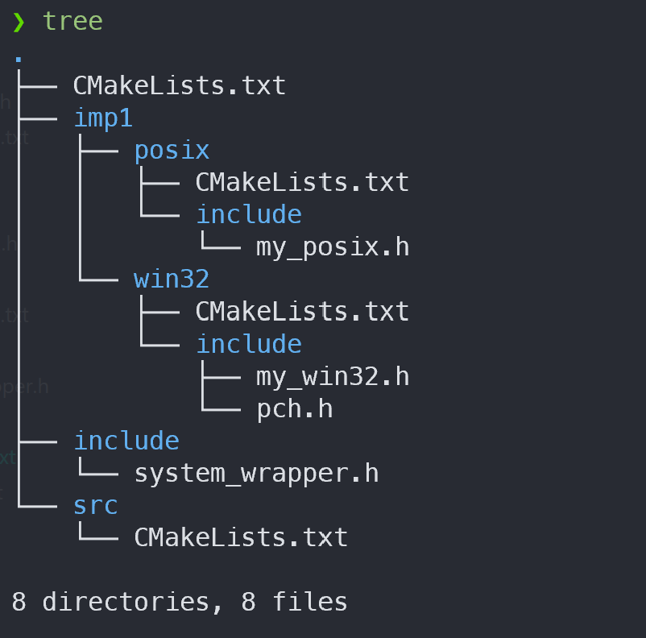
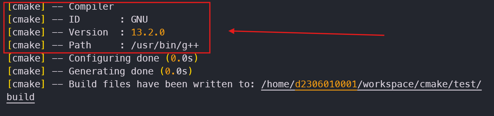
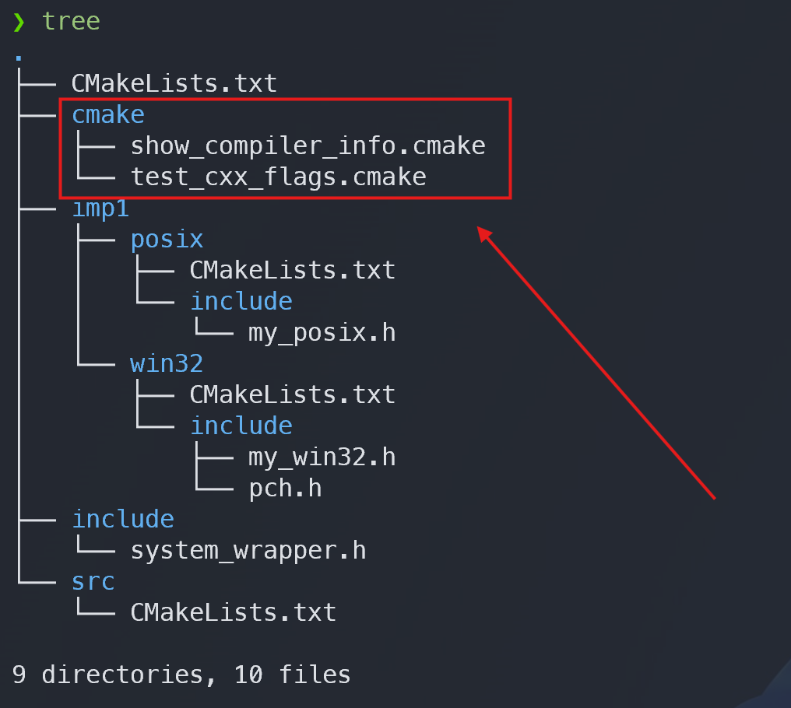
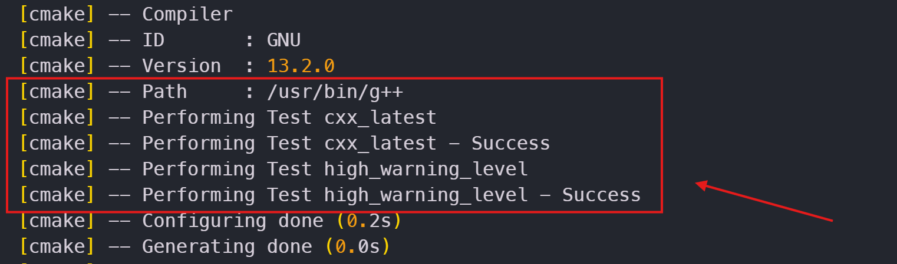

## CMake 변수

CMake에서도 변수가 있으며, 단순한 Boolean, 문자열, 파일 경로, 리스트 등을 표현할 수 있다.

### set / unset

변수는 `set`을 사용해서 생성하고, `unset`을 사용해서 제거할 수 있다. 변수는 문자열 기반이며, `bash` 쉘 프로그래밍처럼 사용할 수 있다.

```cmake
set(CMAKE_BUILD_TYPE Debug)

# CMAKE_BUILD_TYPE
message(STATUS CMAKE_BUILD_TYPE)
# Debug
message(STATUS ${CMAKE_BUILD_TYPE})
# Configuration: Debug
message(STATUS "Configuration: ${CMAKE_BUILD_TYPE}")
```

변수의 값을 사용하기 위해 `${}`를 사용한 점을 주의깊게 보자. `message`는 문자열을 출력하므로 변수를 그대로 주지 않고 한번 참조하여 문자열로 변환한 것이다.

## 조건부 처리

### if / elseif / else / endif

플랫폼이 다르면 System API, 혹은 같은 API더라도 구현 형태나 지원 범위가 상이할 수 있다. 조건부 분기문을 사용해 플랫폼에 맞게 미리 작성된 라이브러리를 선택하도록 하면 상대적으로 부담이 줄어들 것이다.

`CMake`는 플랫폼 관련 변수들을 제공하고 있으며, Android 혹은 iOS로 크로스 컴파일을 하기 위해 `CMake ToolChain`을 사용한 경우, 그 값을 참고해 처리를 다르게 할 수 있다.

```cmake
if(WIN32)
    add_subdirectory(external/winrt)
    add_subdirectory(impl/win32)
elseif(APPLE)
    add_subdirectory(impl/posix)
    add_subdirectory(impl/macos)
elseif(UNIX)
    add_subdirectory(impl/posix)
    if(${CMAKE_SYSTEM} MATCHES "Linux")
        add_subdirectory(impl/linux)
    endif()
else()
    # 지원하지 않음
    if(ANDROID OR IOS)
        message(FATAL_ERROR "Not supported platform")
    endif()
endif()
```

가장 윗 줄에 주석으로 적은 것처럼 *현재 시스템*을 변수로 알려준다. 크로스 컴파일을 위한 라이브러리라면 변수를 검사하는 순서, 조건문에 주의를 기울여야 한다.

## 접근법

구현이 다르더라도 공통된 인터페이스(헤더파일)가 있다면 이들을 한곳에 모아놓는 것이 타당할 것이다. 

### [target_include_directories](https://cmake.org/cmake/help/latest/command/target_include_directories.html)

헤어 파일들이 위치한 폴더는 제각기 다를 수 있다. `C` 혹은 `C++` 프로젝트에서 외부에 공개되는 헤더파일과 공개되지 않는 헤더파일이 다른 위치에 배치되는 것은 흔한 일이다.

`target_include_directories`는 `target`에서 헤더파일을 찾기 위해 사용하는 폴더를 지정하는 함수이며, 이곳에 위치한 헤더파일들은 `#include <my_interface.h>`와 같이 `< >` 형태로 include하는 것이 가능하다.

아래와 같은 프로젝트 구조를 보자.

{: width="500" }

우선 `win32` 하위 프로젝트에 있는 `CMakeLists.txt`부터 살펴보자.

```cmake
# test/impl/win32/CMakeLists.txt

add_library(my_win32_wrapper src/my_win32.cpp)
add_library(wrapper::system ALIAS my_win32_wrapper)

target_include_directories(my_win32_wrapper
	PUBLIC
    ${CMAKE_SOURCE_DIR}/include
        # CMAKE_SOURCE_DIR은 최상위 CMakeLists.txt가 위치한 폴더를 의미
        # 해당 프로젝트에서는 test/
  PRIVATE
    ${CMAKE_CURRENT_SOURCE_DIR}/include
        # CMAKE_CURRENT_SOURCE_DIR은 현재 해석중인 CMakeLists.txt가 위치한 폴더를 의미
        # 즉, 경로는 test/impl/win32
)
```

`POSIX` API에 맞춘 프로젝트의 `CMakeList.txt`는 다음과 같이 작성할 수 있다.

```cmake
# test/impl/posix/CMakeLists.txt

add_library(my_posix_wrapper src/my_posix.cpp)
add_library(wrapper::system ALIAS my_posix_wrapper)

target_include_directories(my_posix_wrapper
	PUBLIC
    	${CMAKE_SOURCE_DIR}/include
        	# win32와 header 파일들을 공유한다.
            # 이를테면, test/include에 위치한 system_wrapper.h
    PRIVATE
    	include 	# include 폴더를 상대경로 접근
        			# 즉, test/impl/posix/include를 의미
)
```

예시에서 본 것과 같이 `target_include_directories` 함수는 `target_link_libraries` 처럼 `PUBLIC`, `PRIVATE`을 지정할 수 있으며 `PUBLIC`에 위치한 폴더들은 경로가 자동으로 전파된다.

```cmake
# test/src/CMakeLists.txt

add_executable(my_system_utility
	some.cpp
    source.cpp
    files.cpp
)

target_link_libraries(my_system_utility
	PRIVATE
    	wrapper::system 	# wrapper 라이브러리들의 ALIAS
        					# target_include_directories에 PUBLIC으로 명시된
                            # ${CMAKE_SOURCE_DIR}/include 폴더를 자동 접근할 수 있다.
)
```

### [target_sources](https://cmake.org/cmake/help/latest/command/target_sources.html)

`add_executable`과 `add_library`의 한계는 소스 파일 목록을 한번에 결정해서 전달해야 한다는 점이다. 이는 `target`들이 `CMakeLists.txt` 파일의 끝부분에 나타나게 만들며, `2.x` 버전 `CMake`들이 사용했던 방법처럼 `List` 변수를 사용해 소스파일 목록을 만들어야 하는 불편함이 있다.

`CMake 3.x`에서는 `target`에 소스파일을 `추가`할 수 있도록 `target_sources`를 사용할 수 있다.

```cmake
# preview가 구현된 소스파일을 추가할 지 결정하는 변수
set(USE_PREVIEW true)

# target: my_program
add_executable(my_program
	main.cpp
    feature1.cpp
)

# ...
# add_dependencies
# set_target_properties
# target_include_directories
# target_link_libraries
# ...

target_sources(my_program
	PRIVATE
    	feature2.cpp
)

if(USE_PREVIEW)
	target_sources(my_program
    PRIVATE
    	feature3_preview.cpp
    )
else()
```

## 컴파일러 대응

플랫폼이 달라지면 컴파일러도 달라질 수 있다. 컴파일러가 달라지면 프로그램 생성에 사용할 수 있는 컴파일 옵션들이 달라지게 된다. 

### 컴파일러 검사

`컴파일러`와 관련해 미리 지정된 변수들이 `CMake`에 존재한다.

- `CMAKE_CXX_COMPILER_ID`
  - 컴파일러의 이름
- `CMAKE_CXX_COMPILER_VERSION`
  - 컴파일러의 버전
- `CMAKE_CXX_COMPILER`
  - 컴파일러 실행 파일의 경로

```cmake
message(STATUS "Compiler")
message(STATUS "ID      \t: ${CMAKE_CXX_COMPILER_ID}")
message(STATUS "Version \t: ${CMAKE_CXX_COMPILER_VERSION}")
message(STATUS "Path    \t: ${CMAKE_CXX_COMPILER}")
```



아래와 같이 `CMake` 내에서 컴파일러에 따라 처리를 다르게 할 수 있다.

```cmake
# Microsoft Visual C++ Compiler
if(MSVC)
	# ...
elseif(${CMAKE_CXX_COMPILER_ID} MATCHES clang) 	# clang or ApplieClang
	# ...
elseif(${CMAKE_CXX_COMPILER_ID} MATCHES GNU) 	# GNU C Compiler
	# ...
endif()
```

> `CMake` 파일들을 간결히 유지하려면 플랫폼에 따라서 특정 컴파일러만을 지원하는 것이 타당할 것이다.

### 컴파일 옵션 사용

컴파일러를 식별할 수 있게 되었다. 이제 컴파일러 옵션을 지정해줄 차례이다. 하지만 그 전에 컴파일러가 해당 옵션을 지원하는 지 검사가 필요한 경우도 있다.
`CMake`의 기본 모듈들 중에는 이를 지원하는 `CheckCXXCompilerFlag` 라는 모듈이 있다.

```cmake
include(CheckCXXCompilerFlag)
```

`CMake Module`은 간단히 말하자면 미리 작성된 `CMake` 파일이라고 생각할 수 있다. 이런 파일들은 각 `project` 들마다 각각 `cmake` 폴더를 만들어 배치하는 경우가 많다.

{: width="500" }

`test_cxx_flags.cmake` 파일의 내용은 아래와 같다. 

```cmake
# test_cxx_flags.cmake
#
# `include(cmake/check-compiler-flags.cmake)` from the root CMakeList
#
include(CheckCXXCompilerFlag)

# Test latest C++ Standard and High warning level to prevent mistakes
if(MSVC)
    check_cxx_compiler_flag(/std:c++latest  cxx_latest          )
    check_cxx_compiler_flag(/W4             high_warning_level  )
elseif(${CMAKE_CXX_COMPILER_ID} MATCHES Clang)
    check_cxx_compiler_flag(-std=c++2a      cxx_latest          )
    check_cxx_compiler_flag(-Wall           high_warning_level  )
elseif(${CMAKE_CXX_COMPILER_ID} MATCHES GNU)
    check_cxx_compiler_flag(-std=gnu++2a    cxx_latest          )
    check_cxx_compiler_flag(-Wextra         high_warning_level  )
endif()
```

이 같이 내용을 추가하여 `CMake`를 실행하면 다음과 같은 내용이 나타날 것이다. 



[check_cxx_compiler_flag](https://cmake.org/cmake/help/v3.13/module/CheckCXXCompilerFlag.html) 는 해당 컴파일 옵션을 사용할 수 있으면, 두번째 인자에 사용한 일므으로 변수를 생성한다.

위와 같은 경우, `GNU C++` 컴파일러는 `-std=gnu++2a`, `-Wextra`를 모두 사용할 수 있으므로 `cxx_latest`, `high_warning_level` 변수는 모두 `true(1)` 값을 가질 것이다. 
따라서 특정 컴파일 옵션을 사용할 수 없는 경우, 경고하거나 우회하는 `CMakeLists.txt` 파일을 작성할 수 있다.

### [target_compile_options](https://cmake.org/cmake/help/latest/command/target_compile_options.html)

이제 컴파일 옵션을 사용할 준비가 되었으므로, 간단한 `target`에서 사용할 컴파일 옵션을 지정하는 예를 살펴보자.

```cmake
if(MSVC)
    target_compile_options(my_modern_cpp_lib
        PUBLIC
            # MSVC가 식별 가능한 옵션 지정
            /std:c++latest /W4 
    )
else() # clang or GCC
    target_compile_options(my_modern_cpp_lib
        PUBLIC
            # gcc/clang이 식별 가능한 옵션 지정
            -std=c++2a -Wall
        PRIVATE
            -fPIC
            -fno-rtti
    )
endif()
```

`PUBLIC`, `PRIVATE`으로 컴파일 옵션을 전파시킬 수 있다. 즉, my_modern_cpp_lib를 `target_link_libraries`로 사용하는 모든 `target`들은 `c++ latest`, `Wall` 옵션으로 빌드가 수행된다.

## 매크로 선언

### [target_compile_definitions](https://cmake.org/cmake/help/latest/command/target_compile_definitions.html)

최신 `C++`에서는 `Macro`를 대체할 방법으로 `enum class`, `constexpr` 등이 있다. 하지만 여전히 `Macro`에 의존하고 있는 코드가 많은 것 또한 사실이다.
수십 혹은 수백개의 소스 파일에 `Macro`를 선언하려면 시간이 많이 소요될 뿐 아니라 이후에 수정하기도 번거로울 것이다.

```cmake
if(MSVC)
    # 암묵적으로 #define을 추가한다. (컴파일 시간에 적용)
    target_compile_definitions(my_modern_cpp_lib
        PRIVATE
            WIN32_LEAN_AND_MEAN
            # numeric_limits를 사용할 때 방해가 되는 max(), min() 매크로를 제거한다.
            NOMINMAX
            _CRT_SECURE_NO_WARNINGS
    )
endif()
```

물론 여기에도 `PUBLIC`, `PRIVATE`이 있다. 

> CMake 매크로 선언으로 추가하는 `Macro`들을 소스코드에 보이지 않는다. 따라서 프로젝트를 가져다 사용하는 개발자가 찾아내기 어려울 수 있으므로 주의해야 한다.

---

## 🔗 References

- [CMake할 때 쪼오오금 도움되는](https://gist.github.com/luncliff/6e2d4eb7ca29a0afd5b592f72b80cb5c)
