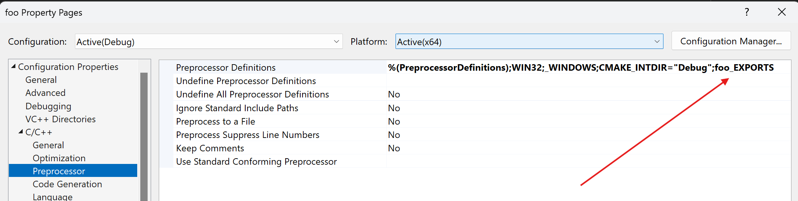
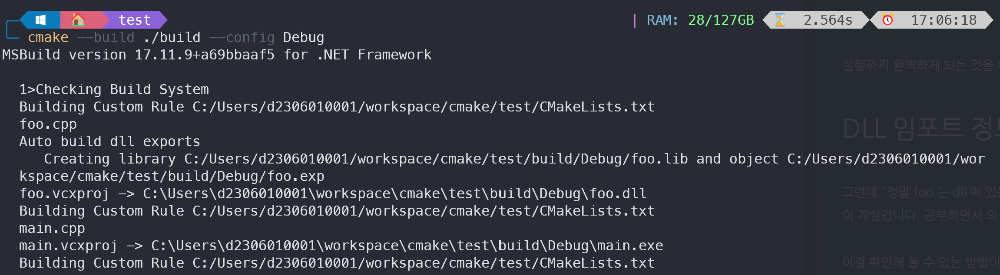
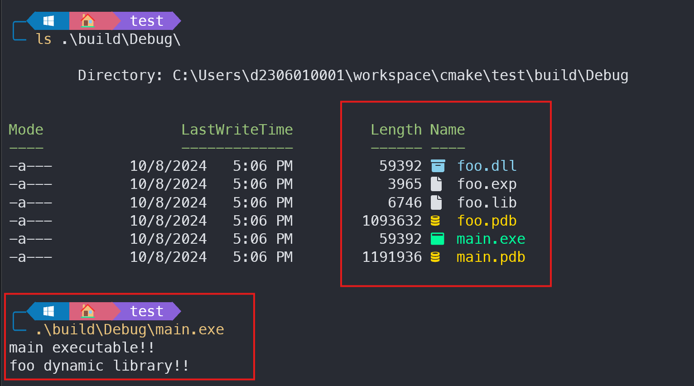
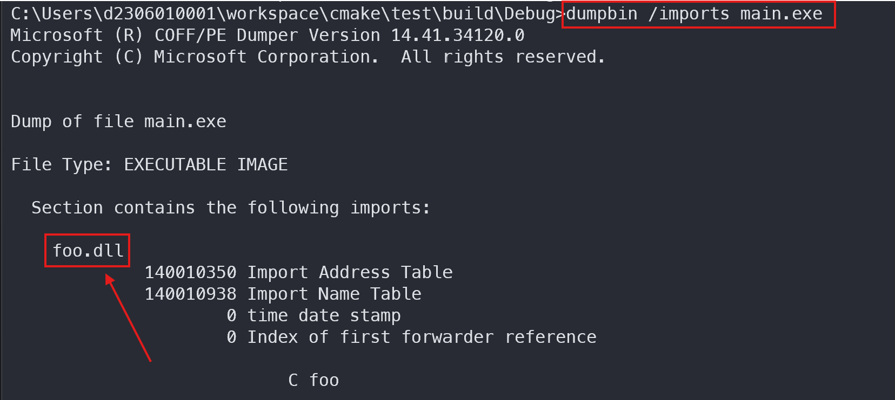

## SHARED 란?

`SHARED` 라이브러리는 동적으로 링크되고 런타임에 로드되는 라이브러리를 의미한다.

`SHARED` 라이브러리는 `import library`와 연관되어있다. `import library`는 구현은 제외한 `심볼` 정보만 가지고 있는 라이브러리이며, `.lib` 확장자를 가진다.

`SHARED` 바이너리 타겟을 만들려면, `CMakeLists.txt`에 다음과 같은 명령을 입력하면 된다.

```cpp
add_library(<name> SHARED
	[EXCLUDE_FROM_ALL]
    [<source>...]
```

`<name>`은 바이너리 타겟의 이름이며, `SHARED`는 동적 라이브러리를 만들겠다는 지시어이다. 그리고 `[<source>...]`는 소스 파일들의 목록이다. 따로 출력 파일의 이름을 지정하지 않는다면, `<name>.dll` 과 `<name>.lib`가 만들어진다. `lib`는 `import library`이다.

`SHARED` 타겟을 만들면, 해당 타겟을 만들 때 자동으로 `<name>_EXPORTS`라는 `전처리기 매크로 (preprocessor macro)`를 만들어준다는 것이다. 이것은 추후 `__declspec(dllexport/dllimport)`를 지정할 때 중요하다.

이렇게 `add_library()`를 통해 `SHARED` 타겟을 생성하면, 그것이 산출한 `<name>.lib`를 `executable` 타겟에 링크해줘야 한다. 

```cpp
target_link_libraries(<target> ... <item>... ...)
```

## 소스 트리 구성

```terminal
test
  foo
    foo.h
    foo.cpp
  main.cpp
  CMakeLists.txt
```

`동적 라이브러리`들은 어떤 심볼들을 `익스포트(export)`할 지 결정할 필요가 있다. 자체한 사항은 [이곳](https://learn.microsoft.com/ko-kr/cpp/build/walkthrough-creating-and-using-a-dynamic-link-library-cpp?view=msvc-170)을 살펴보면 좋을 것이다.

```cpp
// foo.h

#pragma once

#if defined(foo_EXPORTS)
	#define FOO_API __declspec(dllexport)
#else	// NOT defined(foo_EXPORTS)
	#define FOO_API __declspec(dllimport)
#endif

extern "C" FOO_API void foo();
```

```cpp
// foo.cpp

#include <iostream>

extern "C" void foo() {
	std::cout << "foo dynamic library!!" << std::endl;
}
```

```cpp
// main.cpp

#include <iostream>
#include "foo/foo.h"

int main() {
	std::cout << "main executable!!" << std::endl;

	foo();

	return 0;
}
```

`SHARED` 타겟은 자동으로 `<name>_EXPORTS`라는 전처리기 매크로를 삽입해 준다. 그것을 이용햏서 `SHARED` 타겟 내에서는 `dllexport`로, 밖에서는 `dllimport`로 해석하라고 지정하였다.

`extern "C"`는 컴파일러에게 익스포트할 때 [C++ 네임 맹글링(name magling)](https://www.ibm.com/docs/ko/i/7.5?topic=linkage-name-mangling-c-only)을 수행하지 말라고 알려주는 것이다.

> C++ 네임 맹글링이란?
>
> C++에는 `함수 오버로딩` 기능이 있다. 이는 같은 함수명이라고 하더라도 전달받은 타입이 다르면, 서로 다른 함수로 인식되는 기능이다.
> `int func(int a)`라는 함수와 `int func(double a)`라는 함수를 둘 다 선언하고 정의하더라도 문제가 없게 된다는 것이다. 하지만 이렇게 했을 시, `func`라는 함수명만으로 해당 함수들을 구별하는 것이 불가능해진다.
> 따라서 C++ 컴파일러들은 각 컴파일러마다 자신들의 규칙으로 함수 이름을 변경한다. 이것을 ***네임 맹글링 (Name Mangling)***이라고 한다.

`test.sln`, `main.vcxproj`, `foo.vcxproj` 파일들을 만드는 것이 목표이다. `foo.vcxproj` 파일은 `foo.cpp`로부터 `foo.dll`과 `foo.lib`를 만들고, `main.vcxproj`는 `foo.lib`와 `main.cpp`로부터 `main.exe`를 만든다.
`foo.dll`은 `main.exe`가 실행될 때 자동으로 로드된다.

## CMakeLists.txt 작성

```cmake
cmake_minimum_required(VERSION 3.8)

project("test")

set(CMAKE_WINDOWS_EXPORT_ALL_SYMBOLS ON)

add_library(foo SHARED ./foo/foo.cpp)

add_executable(test main.cpp)
target_link_libraries(test PRIVATE foo)
```

## 빌드 트리 생성

```terminal
cmake -S . -B build -G "Visual Studio 17 2022" -A x64
```



`foo_EXPORTS`라는 전처리기 매크로가 제대로 들어간 것을 확인할 수 있다.

### 빌드

```terminal
cmake --build ./build --config Debug
```



다음은 `build/Debug` 디렉토리의 파일 리스트와 `main.exe`를 실행 한 모습이다.



## DLL 임포트 정보 확인

`foo.dll` 라이브러리가 `main.exe`에 자동으로 로드되어서 잘 사용중인지 확인해보자.

`Visual Studio 개발자 명령 프롬프트`를 열어서 `main.exe`를 다음과 같이 열어보자.

```terminal
cd <main.exe 디렉토리 경로>
dumpbin /imports main.exe
```



`foo.dll`로부터 `foo`라는 심볼을 임포트했다고 포여주고 있다.

만약, `CUI`가 불편하다면 [Denpendency Walker](https://www.dependencywalker.com/)라는 프로그램을 사용해 `GUI`로 볼 수 있다. 

`depends.exe` 파일을 실행한 후 `main.exe`를 드래그&드롭하면, `종속성 정보`가 출력된다.

> 참고로 `dependency walker`는 어떤 `실행 파일`이 실행되지 못하고 그냥 종료될 때, 로드되지 않는 `dll`이 뭐가 있는지 알아내는 용도로 사용한다.
{: .prompt-info }

---

## 📒 정리

- `add_library()`에 `SHARED` 인자를 넣으면, `SHARED` 바이너리 타겟이 생성된다.
- `add_library()`에 `SHARED` 인자를 지정하면, `<name>_EXPORTS` 전처리기 매크로가 삽입된다.
- `add_library()`에 `SHARED` 인자를 지정하면, `<name>.lib`와 `<name>.dll` 파일들이 생성된다.
- `target_link_libraries()`를 통해 `import library`를 다른 타겟에 링크할 수 있다.
