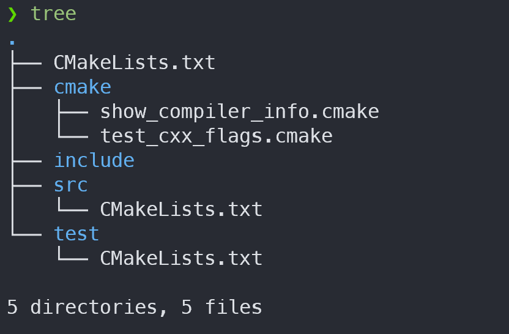

## CMake Module 디렉토리 생성

`CMake`는 전용 확장자가 없다. 최소의 `Root CMakeLists.txt` 호출이나 `add_subdirectory`는 `CMakeLists.txt` 파일을 사용하지만, 그렇지 않은 경우라면 보통 `.cmake` 파일을 사용하게 된다.

{: width="500" }

위와 같은 프로젝트를 가졍해보자. 

`add_subdirectory`는 기본적으로 `함수(서브루틴)`처럼 동작한다고 볼 수 있다. 독립적으로 CMake 변수들을(유효범위) 가지고, 별도로 지시하지 않는 한 상위 `CMakeLists.txt`의 변수를 변경하지 않는다. `sub_project`에서 벗어나면 그 변수들은 사라진다.

반면, `include`는 C++ 코드에서 `inline`을 지정하는 것과 유사하다. `include`를 통해 실행되는 `CMake`는 ***현재 CMakeLists.txt 파일의 변수들에 그대로 접근*** 할 수 있다. 그리고 새로운 변수를 추가할 수도 있다.

```cmake
# Root/CMakeLists.txt
project(my_new_project)

# .cmake의 내용을 복사-붙여넣기 한 것처럼 동작한다
include(cmake/check-compiler-flags.cmake) 
#
# include(CheckCXXCompilerFlag) # 또다른 CMake 기본 모듈을 가져온다
#
# if(MSVC)
#    check_cxx_compiler_flag(/std:c++latest  cxx_latest          )
#    check_cxx_compiler_flag(/W4             high_warning_level  )
# elseif(${CMAKE_CXX_COMPILER_ID} MATCHES Clang)
#    check_cxx_compiler_flag(-std=c++2a      cxx_latest          )
#    check_cxx_compiler_flag(-Wall           high_warning_level  )
# elseif(${CMAKE_CXX_COMPILER_ID} MATCHES GNU)
#    check_cxx_compiler_flag(-std=gnu++2a    cxx_latest          )
#    check_cxx_compiler_flag(-Wextra         high_warning_level  )
# endif()
#

if(cxx_latest)  # include 파일 내에서 설정한 변수를 사용 가능하다
    target_compile_options(...)
endif()

message(STATUS ${CMAKE_SOURCE_DIR})         # -- Root
message(STATUS ${CMAKE_CURRENT_SOURCE_DIR}) # -- Root

add_subdirectory(src)
    # src/CMakeLists.txt를 실행하기 전에 일부 변수들이 새로 설정된다
    #
    #   message(STATUS ${CMAKE_SOURCE_DIR})         # -- Root
    #   message(STATUS ${CMAKE_CURRENT_SOURCE_DIR}) # -- Root/src
    #

add_subdirectory(test)
    #
    #   message(STATUS ${CMAKE_SOURCE_DIR})         # -- Root
    #   message(STATUS ${CMAKE_CURRENT_SOURCE_DIR}) # -- Root/test
    #

# ...
```

### [CMAKE_MODULE_PATH](https://cmake.org/cmake/help/latest/variable/CMAKE_MODULE_PATH.html)

위의 `include`를 위해 다음과 같이 `cmake` 모듈의 상대 경로를 사용했다.

```cmake
include(cmake/check_compiler_flags.cmake)
```

경로를 참조할 때 특정 경로를 참고하도록 지시할 수도 있다. `CMAKE_MODULE_PATH`를 사용하면, 파일 이름만으로 `include`하는 것이 가능하다. 

> `CMAKE_MODULE_PATH`는 시스템 환경 변수 `PATH`와 유사하다.

```cmake
# 현재 프로젝트를 기준으로 cmake 폴더를 CMAKE_MODULE_PATH에 추가한다.
list(APPEND CMAKE_MODULE_PATH ${CMAKE_CURRENT_SOURCE_DIR}/cmake)

# 위치한 디렉토리. ".cmake" 확장자를 생략해도 상관없다.
include(check_compiler_flags)
```

> `CMake`에서 미리 제공하는 모듈들은 [이곳](https://cmake.org/cmake/help/latest/manual/cmake-modules.7.html)에서 확인할 수 있다.

---

## 설치 (Install)

### 설치 경로 지정

실행파일은 `exe`와 `dll (혹은 so)`와 같은 binary만 있으면 되지만, 라이브러리는 조금 다르다. 엄밀히 말해 빌드된 `라이브러리 파일 (lib, dll, a, so, dylib, ...)`과 함께 **링킹을 위한 symbol 정보**가 함께 제공되어야 하기 때문이다.
원래라면 `exp (export)`파일을 사용하는 것이 맞겠지만, 개발자의 편의를 생각하면 `.h .hpp`파일을 넘어서기 어려울 것이다.

#### [install](https://cmake.org/cmake/help/latest/command/install.html)

`CMake`에서는 `install` 명령으로 `헤더파일`, `CMake Target`, 그리고 필요하다면 디렉토리를 지정된 위치에 `설치 (copy)`하는 방법을 제공한다.

```cmake
# 단일 파일을 지정된 디렉토리에 설치
install(FILE LICENSE DESTINATION ./install)	# readme 및 라이브러리와 함께 배포되어야 하는 파일들

# 디렉토리 전체를 설치
install(DIRECTORY include DESTINATION ./install) # 헤더 파일들을 통째로 옮긴다.

# 빌드 결과물을 설치
install(TARGETS my_lib DESTINATION ./install) # add_library, add_executable에 사용했던 이름
```

보통 `CMake` 프로젝트에서 설치의 대상은 다음 3가지가 있다. 엄밀히 말하면 `.cmake` 파일을 설치하는 경우도 있기 때문에 더 많은 종류가 있다고 할 수 있다.

- [Program](https://cmake.org/cmake/help/latest/command/install.html#targets)
- [File](https://cmake.org/cmake/help/latest/command/install.html#installing-files)
- [Directory](https://cmake.org/cmake/help/latest/command/install.html#installing-directories)

#### [CMAKE_INSTALL_PREFIX](https://cmake.org/cmake/help/latest/variable/CMAKE_INSTALL_PREFIX.html)

하지만 하위 프로젝트들도 제각기 설치 경로를 가지고 있다면 정리하기 어려울 것이다. 이를 위해 `CMake`에서는 **지정 설치 경로**를 의미하는 `CMAKE_INSTALL_PREFIX` 변수가 있다.

하위 프로젝트에서 설치 경로를 지정할 때, 이 변수를 사용하도록 하면 상위 프로젝트에서 일괄적으로 함께 배포하는데 도움을 줄 수 있다.

```cmake
# 설치를 CMakeLists.txt 파일 기준으로 하지 않고, CMAKE_INSTALL_PREFIX를 기준으로 수행한다.

# 하나의 파일을 옮기는 경우
install(FILE LICENSE DESTINATION ${CMAKE_INSTALL_PREFIX}/install)

# 특정 디렉토리를 옮기는 경우
install(DIRECTORY ${CMAKE_CURRENT_SOURCE_DIR}/include DESTINATION ${CMAKE_INSTALL_PREFIX}/install)

# add_library, add_executable에 사용한 이름을 설치하는 경우
install(TARGETS my_lib DESTINATION ${CMAKE_INSTALL_PREFIX/install)
```

`CMAKE_INSTALL_PREFIX` 변수는 특히 커맨드라인에서 자주 지정하는 변수이기도 하다. 아래와 같이 설정이 다른 경우 설치 디렉토리를 분리해서 배포, 경로 참조를 쉽게 한다.

```bash
cmake /path/to/CMakeLists.txt \
	-DCMAKE_INSTALL_PREFIX=~/install/debug/static \ # debug, static library
    -DCMAKE_BUILD_TYPE=Debug \
    -DBUILD_SHARED_LIBS=false;
    
cmake /path/to/CMakeLists.txt \
	-DCMAKE_INSTALL_PREFIX=~/install/debug/dynamic \ # debug, dynamic library
    -DCMAKE_BUILD_TYPE=Debug \
    -DBUILD_SHARED_LIBS=true;
    
cmake /path/to/CMakeLists.txt \
	-DCMAKE_INSTALL_PREFIX=~/install/release/static \ # release, static library
    -DCMAKE_BUILD_TYPE=Release \
    -DBUILD_SHARED_LIBS=false;
    
cmake /path/to/CMakeLists.txt \
	-DCMAKE_INSTALL_PREFIX=~/install/release/dynamic \ # release, dynamic library
    -DCMAKE_BUILD_TYPE=Release \
    -DBUILD_SHARED_LIBS=true;
```

위와 같이 실행하고 나면 `~/install` 경로에는 아래와 같이 설치가 될 것이다.

```bash
install
	- LICENSE
    - include
    	- my_lib.h
    - release
    	- static
        	- my_lib.a
        - dynamic
        	- my_lib.so
    - debug
    	- static
        	- my_lib.a
        - dynamic
        	- my_lib.so
```

빌드 산출물이 여러 종류라면 `install(TARGETS)` 에 아래와 같이 `DESTINATION` 들을 보다 구체적으로 지정하는 것이 좋다.

```cmake
install(TARGETS foo_lib bar_exe
				header_only_lib
	INCLUDES DESTINATION ${CMAKE_INSTALL_PREFIX}/include
    RUNTIME  DESTINATION ${CMAKE_INSTALL_PREFIX}/bin
    LIBRARY  DESTINATION ${CMAKE_INSTALL_PREFIX}/lib
    ARCHIVE  DESTINATION ${CMAKE_INSTALL_PREFIX}/lib
```

## 🔗 References

- https://gist.github.com/luncliff/6e2d4eb7ca29a0afd5b592f72b80cb5c
