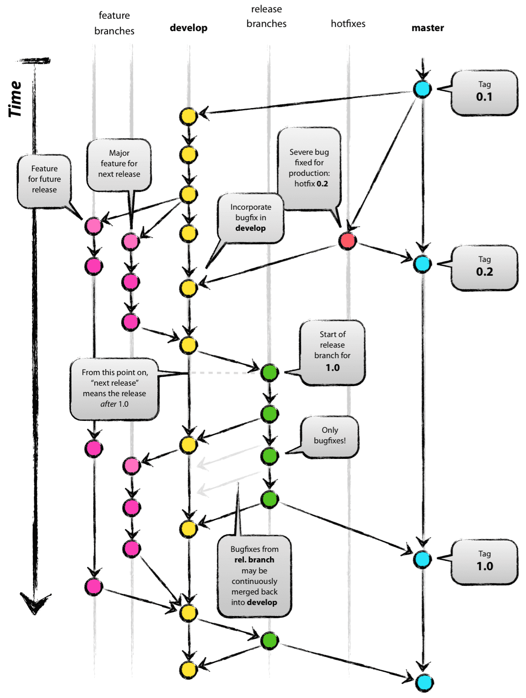

git을 이용한 협업은, 다르게 말하면 **브랜칭 생성 규칙을 공유하는 것**으로 말할 수 있다.  
git의 장점인 '자유롭고 무제한 브랜칭'에 규칙을 정하는 것으로 협업의 틀이 완성된다.



---

## Flow 비교 요약

| 요소 / 플랫폼 | 데스크탑 애플리케이션 | 웹 | 모바일 앱 | 게임 (패키지) | 게임 (라이브 서비스) |
|---|---|---|---|---|---|
| **특징** | 배포 후 유지보수가 힘듦 | 배포와 개발의 구분이 없음 | 배포 이후 지속적인 업데이트 가능 | 패키지 게임과 동일 | 지속적인 라이브 업데이트 |
| **프로젝트 마감** | 최초 배포 시 | 해당 없음 | 버전마다 | 최초 배포 시 | 해당 없음 |
| **배포 단위** | 최초 한 번. 업데이트는 패치로 제공 | 해당 없음. 무결절성(seamless) | 버전마다 | 최초 한 번. 업데이트는 패치로 제공 | 해당 없음. 무결절성(seamless) |
| **배포 시기 조절 가능 여부** | ㉮ 가능 | 해당 없음 | ㉯ 불가능 | ㉮ 가능 | ㉯ 불가능 (콘솔의 경우) |
| **추천 Flow** | git-flow | github-flow | gitlab-flow | git-flow | gitlab-flow |

> ㉮ 배포 시기를 개발하는 쪽에서 완전하게 가져갈 수 있는지를 뜻한다.  
> ㉯ 대부분은 앱 스토어나 마켓 등을 통해 승인되어야 배포되므로, 배포 시기를 조절하는 것이 불가능하다고 볼 수 있다.

---

## 각 Flow 개요

### git-flow

```
main ─────────────────────────────────────────────────────►
      ↑ merge(release)              ↑ hotfix
develop ──────────────────────────────────────────────────►
         ↑ feature/A  ↑ feature/B
```

| 브랜치 | 역할 |
|---|---|
| `main` | 배포 가능한 상태만 유지 |
| `develop` | 다음 릴리즈를 위한 통합 브랜치 |
| `feature/*` | 기능 개발. `develop`에서 분기 후 병합 |
| `release/*` | 배포 준비 (QA, 버전 태깅). `develop`에서 분기, `main`·`develop`에 병합 |
| `hotfix/*` | 운영 긴급 수정. `main`에서 분기, `main`·`develop`에 병합 |

**적합한 경우**
- 명확한 릴리즈 주기가 있는 프로젝트
- 여러 버전을 동시에 유지보수해야 하는 경우
- 팀 규모 5인 이상

**주의할 점**
- 브랜치 수가 많아 소규모 팀에서는 오버엔지니어링이 될 수 있다.
- `release` 브랜치를 관리할 담당자(또는 규칙)가 명확해야 한다.

---

### github-flow

```
main ────────────────────────────────────────────────────►
          ↑ PR & merge   ↑ PR & merge
feature/A ──────────►
                    feature/B ──────────────►
```

| 브랜치 | 역할 |
|---|---|
| `main` | 항상 배포 가능한 상태 |
| `feature/*` | 기능 개발. `main`에서 분기, PR 후 즉시 병합 및 배포 |

**적합한 경우**
- 지속적 배포(CD)가 구축된 웹 서비스
- 소규모 팀 (1~4인)
- 단일 버전만 운영하는 경우

**주의할 점**
- `main`이 곧 프로덕션이므로, **PR 리뷰와 CI가 반드시 갖춰져야** 한다.
- 핫픽스도 `feature` 브랜치와 동일한 흐름을 따른다.

---

### gitlab-flow

```
main ────────────────────────────────────────────────────►
      ↓ promote            ↓ promote
staging ────────────────────────────────────────────────►
           ↓ promote              ↓ promote
production ─────────────────────────────────────────────►
```

| 브랜치 | 역할 |
|---|---|
| `main` | 개발 통합 브랜치 |
| `staging` | QA / 사전 검증 환경 |
| `production` | 실제 배포 환경 |

> 환경 브랜치의 명칭과 단계 수는 팀의 배포 파이프라인에 따라 자유롭게 조정한다.

**적합한 경우**
- 배포 환경이 여럿인 경우 (dev / staging / production)
- 모바일 앱처럼 배포 승인 단계가 외부에 있는 경우
- 라이브 서비스 게임 (서버·클라이언트 배포 타이밍이 다른 경우)

**주의할 점**
- 브랜치 간 promote 규칙을 문서화해두지 않으면 혼란이 생긴다.
- github-flow보다 약간 복잡하므로, 파이프라인 자동화와 함께 사용하는 것이 좋다.

---

## Trunk-based Development (참고)

위 세 Flow와 별개로, **CI/CD 파이프라인이 잘 갖춰진 팀**에서 점점 주류가 되고 있는 방식이다.

- 모든 개발자가 `main`(trunk)에 **하루에도 여러 번 소규모 커밋**
- 장수 브랜치(long-lived branch)를 원칙적으로 금지
- Feature Flag로 미완성 기능을 숨긴 채 배포

github-flow보다도 단순하지만, 자동화된 테스트와 배포 인프라가 전제되지 않으면 운용이 어렵다.

---

## 팀 규모별 권장

| 팀 규모 | 권장 Flow | 이유 |
|---|---|---|
| 1 ~ 3인 | github-flow | git-flow는 오버엔지니어링. 단순함이 속도 |
| 4 ~ 8인 | github-flow 또는 gitlab-flow | 배포 환경 복잡도에 따라 선택 |
| 9인 이상 | git-flow 또는 gitlab-flow | 브랜치 체계로 병렬 작업 충돌 최소화 |

---

## 📒 정리

표의 기준을 따라 기계적으로 결정할 수는 없다. 하지만 **프로젝트의 배포 주기, 배포 시기 통제 가능 여부, 팀 규모**를 함께 고려하면 어울리는 협업 흐름이 자연스럽게 좁혀진다.

Flow 선택보다 더 중요한 것은 **팀 내에서 규칙을 명문화하고 일관되게 지키는 것**이다.

---

## 🔗 References

- [git-flow / github-flow / gitlab-flow 비교](https://ujuc.github.io/2015/12/16/git-flow-github-flow-gitlab-flow/)
- [Trunk Based Development](https://trunkbaseddevelopment.com/)
- [GitHub Flow 공식 문서](https://docs.github.com/en/get-started/using-github/github-flow)
- [](https://ujuc.github.io/2015/12/16/git-flow-github-flow-gitlab-flow/)
