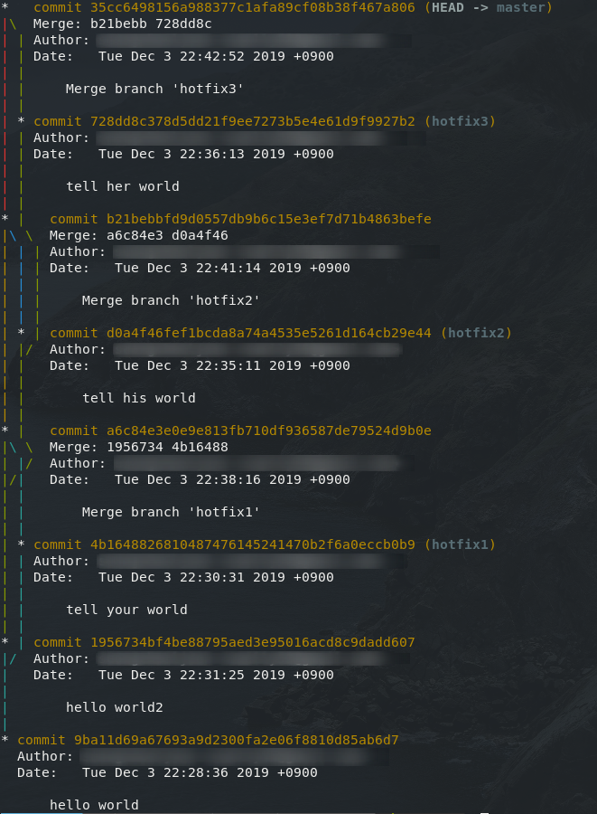
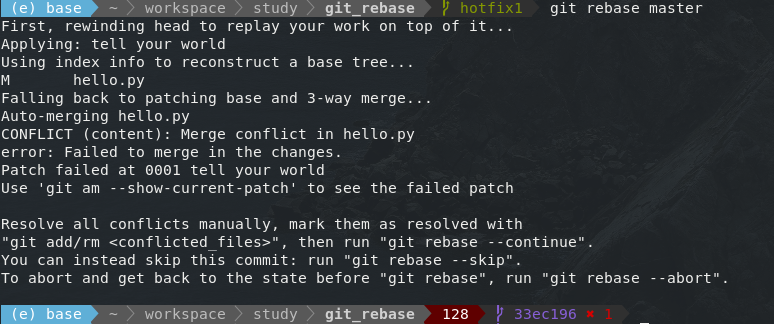
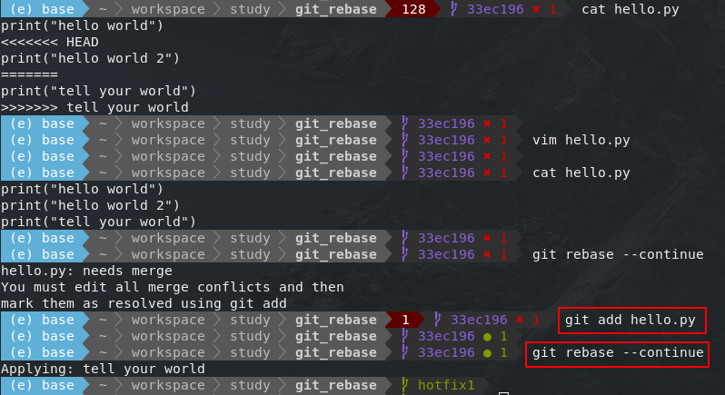
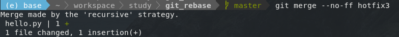
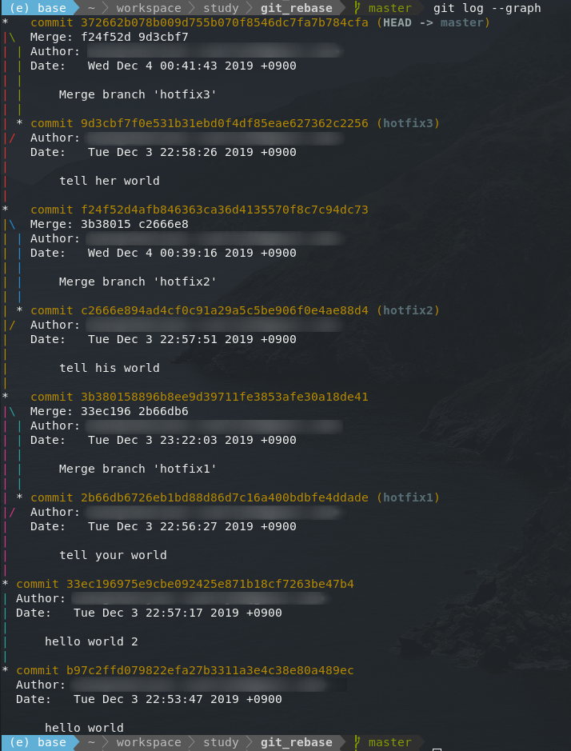
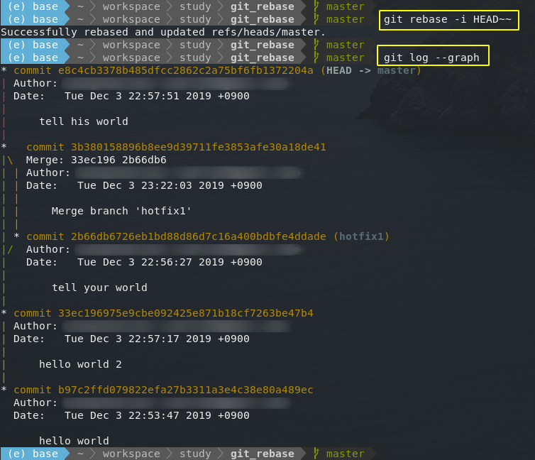

## Git 기본 명령어 

| 목표 | 명령어 | 설명 |
|:------|:--------|:------|
| 사용자 이름 설정 | `git config --global user.name "<사용자 이름>"` | 입력한 사용자 이름으로 정보 설정 |
| 사용자 이메일 주소 설정 | `git config --global user.email "<사용자 이메일 주소>"` | 입력한 사용자 이메일 주소로 정보 설정. (github의 이메일 주소와 동일한 주소로 하는 것이 좋음) |
| 저장소 생성 | `git init` | 실행한 위치를 git 저장소로 초기화 |
| 저장소에 파일 추가 | `git add <파일 이름>` | 해당 파일을 git이 추적할 수 있도록 저장소에 추가 |
| 저장소에 수정 내역 제출 | `git commit` | 변경된 파일을 저장소에 제출 |
| 저장소에 모든 수정 내역 제출 | `git commit -a[m] [commit 메세지]` | 변경된 저장소 파일 모두를 commit. 옵션 m을 붙이면 commit 메세지를 함께 적을 수 있다. |
| 저장소 상태 확인 | `git status` | 현재 저장소의 상태를 출력 |
| 저장소 브랜치 리스트 확인 | `git branch` | 현재 저장소의 브랜치들을 출력 (`*` 문자가 앞에 있는 것이 현재 브랜치) |
| 저장소에 브랜치 추가 | `git branch <이름>` | '이름'의 브랜치를 생성 |
| 저장소에 브랜치 삭제 | `git branch -d <이름>` | '이름'의 브랜치를 삭제 |
| 작업 중인 브랜치 변경 | `git checkout [-b] <브랜치 이름>` | 현재 작업 중인 브랜치를 변경. `-b` 옵션을 주면 브랜치를 생성하면서 변경 |
| 브랜치 병합 | `git merge <브랜치 이름>` | 현재 작업 중인 브랜치에 '브랜치 이름'의 브랜치를 끌어와 병합 |
| 저장소와 연결 상태 | `git remote -v` | 현재 저장소와의 연결 상태를 알려준다 |
| 저장소와의 연결 끊기 | `git remote remove <원격저장소별칭>` | 현재 로컬 저장소와 원격 저장소와의 연결을 끊는다 |


## Git 고급 명령어

| 명령어 | 설명 |
|:--------|:------|
| `git tag` | 커밋을 참조하기 쉽도록 알기 쉬운 이름을 붙인다. |
| `git commit --amend` | 같은 브랜치 상에 있는 최종 커밋을 취소하고 새로운 내용을 추가하거나 설명을 덧붙인 커밋을 할 수 있다. |
| `git revert` | 이전에 작성한 커밋을 지운다. 특정 커밋의 내용을 지우는 새로운 커밋을 만들어 지운 내역을 모든 사람이 알 수 있게 한다. |
| `git reset` | 어떤 커밋을 버리고 이전의 특정 버전으로 다시 되돌릴 때 사용한다. `git revert`와 다른 점은 지운 커밋 내역을 남기지 않는다는 점이다. |
| `git checkout HEAD --<filename>` | 아직 커밋하지 않은 변경 내역을 취소한다. |
| `git rebase` | `git merge`처럼 병합할 때 사용한다. 하지만 브랜치가 많은 경우 브랜치 이력을 확인하면서 병합한다. |
| `git rebase -i` | 서로 다른 두 개의 커밋 내역을 합친다. |

---

## git tag : 특정 커밋을 참조하는 이름 붙이기

`git tag` 명령은 저장소의 커밋에 태그를 붙이는 명령어이다. 간단하게 그냥 버전 이름 같이 이름만을 붙이는 'light weight' 태그와 태그 작성자와 간단한 메모를 함께 태그에 남기는 'annotated' 태그가 있다.

만약 가장 최근 커밋에 태그를 붙이고 싶다면 간단하게 다음 명령을 실행하면 된다.

```terminal
# 가장 최근 커밋에 태그 붙이기
git tag <태그 이름>
```

여기에서는 1.0이라는 버전 이름으로 태그를 붙였다. 그리고 태그가 붙여졌는지 확인하기 위해 다음 명령을 실행한다. 로그와 함께 태그를 볼 수 있다.

```terminal
# 태그 확인
git log --decorate -1

# 현재 저장소에 있는 태그 리스트 확인
git log -l

# 태그와 커밋 SHA-1 체크섬 값을 함께 확인
git show-ref --tags
```

### 특정 커밋에 태그를 붙이는 방법

우선 커밋 `SHA-1` 체크섬 값을 알아야 한다. 여기에서는 최근 커밋 바로 아래의 커밋에 태그를 붙인다.

```terminal
# log 확인
git log -2
```

로그를 명령을 내려 `SHA-1` 체크섬 값을 확인한다. 대략 앞의 네 자리를 기억한다. 그 후 다음 명령을 실행한다.

```terminal
# SHA-1 체크섬 값을 통해 태그 붙이기
git tag 0.9 28e3

# 태그가 붙여졌는지 확인
git show-ref --tags
```

그런데 `git tag`명령만으로는 'light weight' 태그만을 생성한다. 누가, 언제, 왜, 이 태그를 붙였는지 전혀 알 수 없다. 태그 그 자체에 대한 기록은 이름 외에 아무것도 없는 셈이다.

하지만 'annotated' 태그는 누가 언제 태그를 붙였는지를 기록하고, 추가 메세지까지 같이 저장한다. 로그를 살펴보면서 태그들을 보다가 해당 태그 시점에 태그에 대한 의문이 생기면 누구에게 질문해야 하는지 한번에 알 수 있다. 또한 커밋과 다른 시점에 붙은 버전 태그가 있다면, 언제 해당 버전이 배포되었는지 알 수 있기도 하다.

이번에는 'annotated' 태그를 붙여본다. 다시 최근 커밋을 확인하기 위해 다음 명령을 실행한다.

```terminal
# log 확인
git log -3
```

로그를 확인하여 `SHA-1` 체크섬 값을 얻어낸다. 만약 `SHA-1` 체크섬 값을 입력하지 않으면, 현재 작업 중인 브랜치의 최신 커밋에 대그를 붙이게 된다.

```terminal
# 체크섬 값을 이용하여 특정 커밋에 'annotated' 태그 붙이기
git tag -a 0.8 555e
```

명령을 실행하면, 커밋 메시지를 입력하는 것과 비슷한 vim 편집기 창이 나타난다. 태그와 같이 기록할 메시지를 입력하고 저장하면 태그 붙이기가 완료된다.

```terminal
# 태그 메시지 확인
git show <태그 이름>

git show <태그 이름> 명령을 실행해 확인하면, 누가 언제 어떤 메시지를 입력해 태그를 붙였는지 알 수 있다.
```

---

## git log : 기록 보기

프로젝트 작업을 계속하다 보면 언제 어떤 작업 후에 커밋을 했는지 헷갈리기 시작한다. 혹은 여러 사람이 저장소에 접근해서 커밋한다면 더 그럴 수 있다.   
따라서 커밋 내역을 확인 할 수 있는 기능이 필요한데 그것이 바로 `git log` 명령이다.

기본적으로 40글자의 SHA-1 체크섬 값, 커밋한 사용자, 커밋 시각, 커밋 메시지 등의 커밋 내역을 확인할 수 있다.

`--graph` 옵션의 경우, 맨 왼쪽을 살펴보면 녹색과 빨간색 세로 점선이 나누어진 것을 볼 수 있다. 이는 브랜치의 분기 내역을 보여주는 것이다.

| 옵션 | 설명 |
|------|------|
| `git log -p` | 각 커밋에 적용된 실제 변경 내용을 보여준다. |
| `git log --word-diff` | diff 명령의 실행 결과를 단어 단위로 보여준다. |
| `git log --stat` | 각 커밋에서 수정된 파일의 통계 정보를 보여준다. |
| `git log --name-only` | 커밋 정보 중에서 수정된 파일의 목록만 보여준다. |
| `git log --relative-date` | 정확한 시간을 보여주는 것이 아니라 1일 전, 1주 전처럼 상대적인 시간을 비교하는 형식으로 보여준다. |
| `git log --graph` | 브랜치 분기와 병합 내역을 아스키 그래프로 보여준다. (실제 자주 유용하게 사용하는 옵션 중 하나) |

---

## git commit --amend : 마지막 커밋 수정하기

마지막 커밋 메시지를 수정하는 명령은 간단하다.

```terminal
# 마지막 커밋 메시지 수정
git commit --amend
```

위 명령을 실행하면 마지막 커밋과 커밋하지 않은 상태에 있는 변경 내역이 서로 합쳐진 새 커밋을 만들게 된다. 만약 아무런 변경 내역을 만들지 않고 명령어를 실행하면 커밋 메시지만 변경하게 되는 것과 같은 효과를 낼 수 있다.

변경 내역을 만들었다면 변경 내역을 추가하기 위해 `git add <파일>` 명령을 실행한 후 `git commit --amend` 명령을 실행한다.

> 엄밀히 말하자면, `git commit --amend`는 **최종 커밋을 수정하는 것이 아니라 최종 커밋을 대체하는 새로운 커밋을 만드는 것이다.** 
{: .prompt-tip }

명령을 실행하기 전과 후의 커밋 `SHA-1` 체크섬 값을 비교해보면 확실하게 알 수 있다.

---

## git revert : 공개된 커밋의 변경 내역 되돌리기

이미 공개된 커밋 내역을 수정하는 것은 매우 위험하다. 할 수는 있지만 <span class="hl-red">"절대로"</span> 하면 안된다.

하지만 **안전하게 변경 내역을 되돌리는 방법이 있다.**    
커밋으로 발생한 변경 내역의 반대 커밋을 하면 된다. 즉 추가한 코드는 빼고, 지운 코드는 다시 추가하는 커밋을 하는 것이다.

```terminal
git revert <커밋 SHA-1 체크섬 값>
```

이 명령을 특정 지점의 커밋 SHA-1 체크섬 값을 입력하면 해당 지점까지 변경 내역을 취소하게 된다.

```terminal
git log -5 
```

`git log` 명령을 통해 특정 지점의 커밋 `SHA-1` 체크섬 값을 찾는다. 그 후 `git revert 523a` 명령을 실행한다. vim 편집기 창이 등장하면서 커밋 메시지를 수정하게 된다. 잘 살펴보면 원래의 커밋 메시지가 큰 따옴표로 묶여 있고 앞에 'Revert'라는 문자가 입력되어 있다.

중요한 것은 실제로 되돌리는 것이 아니라 되돌리는 것 같은 효과를 내는 것이다. 

`git revert`를 실행한 시점부터, 대상 커밋까지 변경 내역을 거꾸로 적용하는 새 커밋을 만드는 것이다.

이미 공개된 커밋 내역은 이런 안전한 방법으로 되돌려야 한다. 이제 이후에 새로운 브랜치를 만들거나 병합해서 작업할 수 있다.

---

## git reset : 이전 작업 결과를 저장한 상태로 되돌리기

`git reset` 명령은 어떤 특정 커밋을 사용하지 않게 되어 다시 되돌릴 때 사용한다.

`git revert` 명령이 이전 커밋을 남겨두는 명령이었다면 `git reset` 명령은 이전 커밋을 남기지 않고 새로운 커밋을 남긴다는 차이가 있다.

또한 `git reset` 명령은 현재 커밋인 HEAD의 위치, 인덱스, 작업하는 저장소 디렉토리 등도 함께 되돌릴지를 선택하기 위한 모드를 지정할 수 있다.

---

### git reset 명령의 모드

| 모드 | 의미 | HEAD 위치 | 인덱스 | 저장소 디렉토리 |
|------|------|-----------|--------|-----------------|
| `hard` | 완전히 되돌림 | 변경 | 변경 | 변경 |
| `mixed` (기본값) | 인덱스의 상태를 되돌림. 모드를 지정하지 않았을 때의 기본값 | 변경 | 변경 | 변경 안 함 |
| `soft` | 커밋만 되돌림 | 변경 | 변경 안 함 | 변경 안 함 |

* 인덱스(Index) 는 실제 커밋 전 변경 내역을 담는 준비 영역이다. git add 명령을 실행했을 때 이 영역으로 이동한다.
* 저장소 디렉토리는 실제 파일이 담겨있는 작업 영역을 의미한다.

#### 커밋을 취소하는 데 필요한 옵션 ( git reset 명령의 옵션 )

| 옵션 | 설명 |
|------|------|
| `^` 혹은 `~` | `~`은 커밋 내역 하나를 의미한다. 표시한 수 만큼 커밋을 되돌린다. 하나면 최종 커밋 내역일 것이고 두 개면 최종 커밋 내역과 바로 전 커밋 내역이 된다. |
| `ORIG_HEAD` | `git reset` 명령을 실행했을 때 지운 커밋 내역을 보관한다. 해당 명령을 통해 `git reset` 명령으로 지운 커밋을 되돌릴 수 있다. |

#### 예) 최근 커밋의 세 번째 커밋까지, 그리고 커밋만 되돌리기

```terminal
# 최근 다섯 개의 커밋 내역을 확인
git log -5

# 커밋만 되돌리기 위해 soft 모드 사용
git reset --soft HEAD~~~
```

`git log -3` 명령을 실행해보면 가장 최근 커밋이 바뀐 것을 확인할 수 있다.

#### 예) 원래 상태대로 되돌리기

```terminal
git reset --soft ORIG_HEAD
```

`git log -5` 명령을 실행해보면 원 상태로 돌아온 것을 확인할 수 있다.

```terminal
# 파일의 내용까지 변경
git reset --hard HEAD~~~

# 되돌리기
git reset --hard ORIG_HEAD
```

---

## git checkout HEAD -- filename : 특정 파일을 최종 커밋 시점으로 되돌리기

파일 하나를 대상으로 변경 내역을 통째로 원래대로 (변경 직전의 최종 커밋 시점으로) 되돌릴 때 사용한다.

```terminal
git checkout HEAD -- 파일이름
```

위 명령을 실행하면 파일이름 파일의 내용이 최종 커밋 시점 (`HEAD` 대신 다른 커밋 `SHA-1` 체크섬 값을 입력하면 해당 커밋 시점으로 되돌림) 으로 되돌아가게 된다.

`--` 는 포함하는 것이 좋다. `git checkout` 명령에 뒤따라 오는 것이 파일이라는 것을 확실하게 해주는 것이다.   
만약 `--` 가 없다면, 파일이름이 브랜치 이름과 같을 경우 해당 브랜치로 체크아웃하거나, 특정 커밋 시점으로 저장소 전체가 되돌아갈 수 있다.

```terminal
# example
git checkout HEAD -- README.md
```

`cat README.md` 명령을 실행하면 파일 내용이 원래대로 돌아갔음을 확인할 수 있다.

> `git checkout -- 파일이름` 명령은 `git add 파일이름` 명령을 실행한 후 추가 수정 사항이 있을 때 `git add 파일이름` 명령을 실행한 상태로 되돌리는 명령이다.
{: .prompt-info }

`git reset 명령` 역시 파일 하나를 되돌릴 수 있는 것처럼 보인다. 하지만 결정적으로 다른 부분이 있다.

`git reset 명령`은 `hard` 모드가 아니라면 저장소 디렉토리의 파일 내용은 명령을 실행한 시점 그대로 남는다. `git reset 명령`으로 되돌린 다음 필요한 부분만 수정 작업하고 다시 커밋할 수 있다.

하지만 `git checkout`은 파일을 완전하게 대상 커밋의 시점으로 되돌린다. 파일의 내용이 대상 커밋 시점으로 완전하게 되돌아가게 되는 것이다.

즉, `git reset 명령`의 `hard` 모드를 실행한 것처럼 인덱스와 작업 전부를 되돌리게 되는 것이다.

---

## git rebase : 브랜치 이력을 확인하면서 병합하기

`git`을 이용한 버전 관리 시스템의 작업 흐름은 평소에는 여러 개의 브랜치와 커밋 내역을 만들고, 마지막에 작업 내역을 확인하고 올바른 작업물만 병합하는 것이다.

`git`의 특징 중 하나는 커밋 내역을 수정할 수 있다는 것이다. 하지만 수정할 수 있다고 해서 **이미 원격 저장소에 푸시가 끝난 커밋 내역을 수정하는 것은 정말 특별한 상황이 아닌 이상 <span class="hl-red">절대로</span> 권장할만한 일이 아니다.**

푸시하기 전에 `git merge` 명령을 이용해서 병합하면 충돌 해결 커밋이나, `--no-ff` 로 만든 병합 커밋을 남기게 된다. 

이는 작업 흐름을 일관되게 파악하는 데는 깔끔하지 않다. 따라서 할 수 있다면 로컬 저장소에 있던 커밋을 깔끔하게 정리해서 푸시하는 것이 좋다.

그런 정리를 가능하게 하는 것이 `git rebase` 명령이다. 


_log 그래프가 상당히 복잡해 알아보기가 어렵다._

프로젝트 멤버가 세 명 이상이면 혹은 동시에 개발 중인 기능이 여러 개라면 브랜치가 세 개 이상으로 생성되는 일은 매우 흔한 상황일 것이다.    
**그럴 때마다 각자의 코드를 `master` 브랜치에 반영하면 커밋 내역 그래프가 매우 알아보기 어려울 것이다.**

하지만 `git rebase` 명령을 사용하면 이를 깔끔하게 정리할 수 있다. 

> `rebase`는 단어 그대로 다시 `base`를 정리하는 것.
{: .prompt-tip }


_충돌 상태를 해결하기 위해 git rebase 명령은 3가지 옵션을 제공한다._

`master`가 아닌 `hotfix1` 브랜치에서 `rebase` 명령을 실행하는 이유는 `(hotfix) rebase (onto) master` 라는 것이다.

> "현재 작업 중인 브랜치의 base를 master로 다시 설정하라" 는 말이다.

### git rebase 명령의 세 가지 옵션

| 명령 | 설명 |
|------|------|
| `git rebase --continue` | 충돌 상태를 해결한 후 계속 작업을 진행할 수 있게 한다. |
| `git rebase --skip` | 병합 대상 브랜치의 내용으로 강제 병합을 실행한다. 즉, 명령을 실행하면 master 브랜치를 강제로 병합한 상태가 된다. 또한 해당 브랜치에서는 다시 `git rebase` 명령을 실행할 수 없다. |
| `git rebase --abort` | `git rebase` 명령을 실행 취소한다. 다시 `git rebase` 명령을 실행할 수 있다. |


_git rebase --continue 명령으로 충돌을 해결한 모습_

명령을 실행하면 `master` 브랜치의 공통 부모까지의 `hotfix1` 브랜치의 커밋을 `master` 브랜치의 뒤에 차례대로 적용한다.

여기까지만이라면 단순하게 `hotfix1`과 `master` 브랜치가 따로따로 있는 것에 불과하게 된다. 말 그대로 `hotfix1`의 `base`를 `다시(re)` 설정한 것과 같은 효과이다.

병합해야만 비로소 `master` 브랜치에 `hotfix1` 브랜치가 반영된다. 

그런데 `git rebse` 명령을 실행하면 무조건 `fast-forward`가 가능하지만, 이런 경우 병합 커밋을 남기는 것이 좋다.

`git merge <브랜치> --no-ff` 명령을 실행해 `fast-forward`를 하지 말라는 옵션을 주어 병합을 실행한다.

> `no fast-forward` 는 일반적인 병합 시에도 해주면 좋다. 병합한 흔적을 명시적으로 커밋 그래프에 남기는 셈이니까
{: .prompt-tip }


_master 브랜치에서 rebase 된 브랜치 merge_


_git rebase 명령으로 커밋 내역을 정리한 모습_

### git rebase -i (커밋 내역 합하기)

`git rebase` 명령에는 활용도가 높은 옵션 `-i` 가 있다. `i` 는 `interactive` 의 `i` 이다. 한마디로 말하면 상호 작용하면서 리베이스할 커밋을 고르는 것이다.

위의 커밋 그래프도 꽤 완성도 높은 그래프이다. 그런데 커밋 내역과 작업 내역을 모두 합하면 더 깔끔하게 정리할 수 있다.


_커밋, 작업 내역을 합친 모습_

```terminal
# 가장 최근 커밋 내역 두 개 합치기
git rebase -i HEAD~~
```

#### 수정할 때의 원칙

- 남기는 커밋 메시지 앞에는 접두어로 `pick`을 붙인다.
- 없애는 커밋 메시지 앞에는 접두어로 `fixup`을 붙인다.
- 커밋 `SHA-1` 체크섬 값은 꼭 남겨두어야 한다.
- 기존의 커밋 메시지를 새롭게 수정할 수는 없다.

커밋 `SHA-1` 체크섬 값이 새롭게 바뀐 것을 확인할 수 있다.

즉, 여러 개 커밋 중에서 필요한 것을 고른 후에 새롭게 커밋하게 되는 것이다.

---

## no fast-forward 전역 속성 추가

git merge 명령을 실행할때마다 --no-ff 옵션을 주었다. 이유는 커밋 내역을 남기기 위함이다.

그런데 git의 전역 속성으로 추가하면 굳이 옵션을 따로 안주어도 된다.

```terminal
git config --global --add merge.ff false
```
