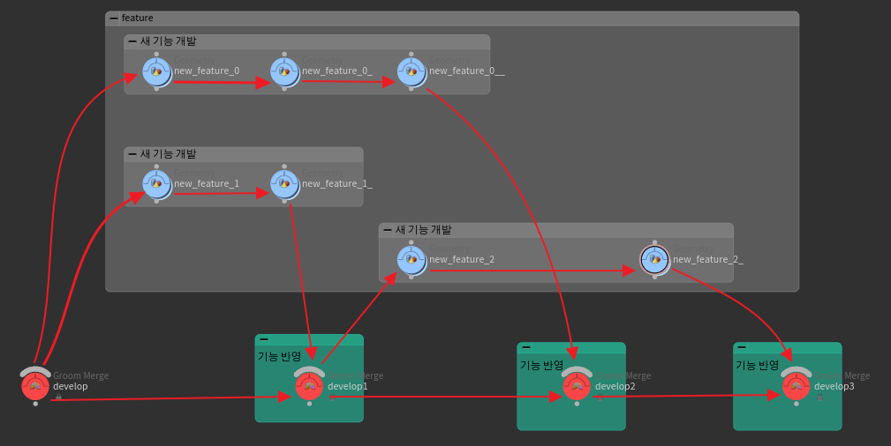
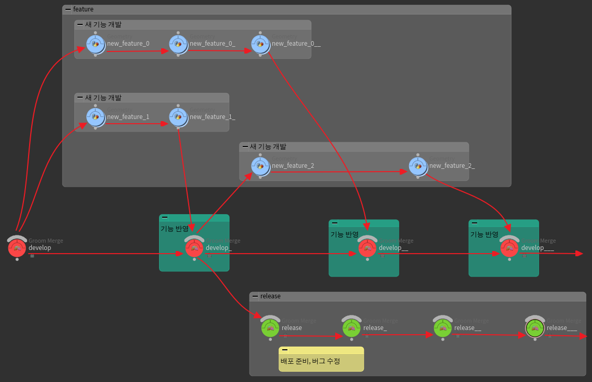
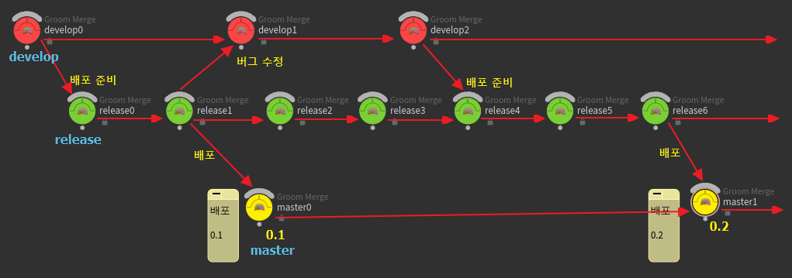
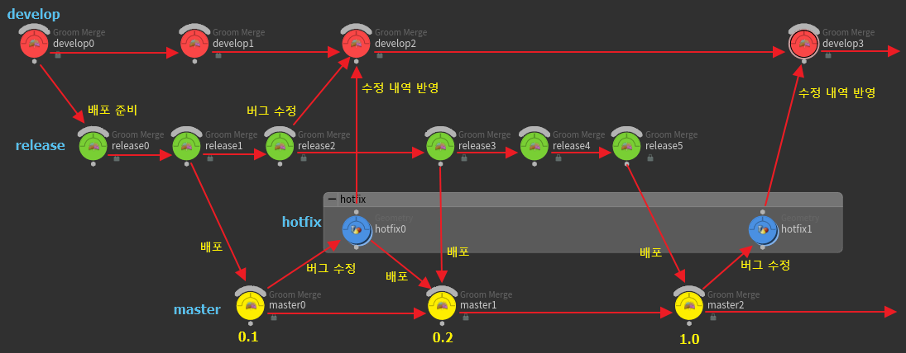

## git-flow 작업 흐름

데스트탑 애플리케이션은 한번 배포된 후에는 유지보수가 쉽지 않다. 사용 환경이 오프라인일 경우, 도중에 실행을 중단할 수 없는 경우, 사용자가 유지보수에 관심을 가지지 않을 경우 등 다양한 이유로 유지보수가 쉽지 않기 때문이다. 이런 애플리케이션은 매우 견고하게 만들어져야 하며, 견고함을 유지하기 위해 프로젝트 작업 흐름 또한 여러 가지 결함을 최소화하고 결함이 있다고 해도 빠른 시간 안에 감지해 수정할 수 있는 모델이어야 한다.

이런 조건을 만족하는 것으로 빈센트 드라이센(Vincent Driessen)이 제안한 작업 흐름 모델인 `A successful Git brancing model` 이 있다.

<https://nvie.com/posts/a-successful-git-branching-model/>

이 작업 흐름 모델은 브랜치 그룹에 역할을 부여하고 각 브랜치의 상호작용을 엄격하고 제한한다.

이 작업 모델은 브랜치를 다섯 가지의 역할로 나눈다.

- `develop` 브랜치
- `feature` 브랜치
- `release` 브랜치
- `master` 브랜치
- `hotfix` 브랜치

## develop 브랜치

`develop` 브랜치는 하나만 존재한다. 여기에서 모든 개발이 시작된다. 하지만 절대로 `develop` 브랜치에 곧바로 커밋하지 않는다. 

이 브랜치에 병합되는 것은 `feature` 브랜치와 `release` 나 `hotfix` 의 버그 수정이다. 이 브랜치는 오직 병합 커밋만 할 수 있다.

## feature 브랜치

`feature` 브랜치는 여러 개가 존재할 수 있다. 여기에 속하는 브랜치는 `develop` 브랜치를 기반에 두고 브랜치되어 새로운 기능 개발이나 버그 수정을 담당한다. 그리고 각각의 브랜치는 하나의 기능(의도)만을 맡는다. 따라서 브랜치의 이름을 제대로 짓는 것이 중요하다.

_git-flow의 feature와 develop 브랜치의 관계_

feature 브랜치들은 오직 develop 브랜치에 병합될 때만 관계성이 생긴다. 갈라져 나오는 것도 다시 병합하는 것도 오직 develop 브랜치와만 한다.

## release 브랜치

`release` 브랜치는 `develop` 브랜치에서 갈라져 나와서 배포 준비를 하는 브랜치이다. 이 브랜치는 새로운 기능 추가는 더 하지 않고 오로지 버그 수정만 한다. 즉 배포본의 완성도를 높이는 브랜치이다.

당연히 수정된 버그는 `develop` 브랜치로 병합되어야 한다.

_git-flow의 feature, develop, release 브랜치의 관계_

## master 브랜치

`master` 브랜치는 실제 배포되는 버전이 있는 브랜치이다. 이 브랜치는 오직 `release`와 `hotfix` 브랜치하고만 관계를 맺는다.

_git-flow의 develop, release, master 브랜치의 관계_

그리고 develop 브랜치와 마찬가지로 오직 병합 커밋만 할 수 있다.

## hotfix 브랜치

`hotfix` 브랜치는 `master` 브랜치, 즉 현재 배포 중인 코드에 버그가 있어 급히 수정할 때만 사용하는 브랜치이다. 

`hotfix` 브랜치로 수정한 내용은 `master` 와 `develop` 브랜치에만 반영한다.

_git-flow의 develop, release, master, hotfix 브랜치의 관계_

## 📒 정리

`develop` 브랜치를 중심으로 `feature` 브랜치들을 통해 기능을 추가하고, `release` 브랜치를 통해 배포 준비와 코드의 버그를 수정하며, `master`로 배포하고, `hotfix`로 배포된 버전의 버그를 수정해 `master`와 `develop` 브랜치에 반영하는 것을 반복하는 것이 `git-flow` 작업 흐름이다. 순서를 매겨 나열해보면 이렇다.

1. `develop` 브랜치를 기반에 두고 `feature` 브랜치 생성
2. `feature` 브랜치에서 기능 개발 시작
3. 기능 개발이 완료되면 `develop` 브랜치로 풀 리퀘스트 혹은 병합
4. 배포 시기가 되면 `develop` 브랜치를 기반에 두고 `release` 브랜치 생성
5. `release` 브랜치에서 이미 알려진 버그 수정에 주력. 수정된 버그는 `develop` 브랜치에 반영
6. 배포 시기가 되면 `release` 브랜치를 기반에 두고 `master` 브랜치를 생성하여 배포
7. `master` 브랜치에서(=배포된 버전에서) 버그가 발견되면 `hotfix` 브랜치를 생성
8. `hotfix` 브랜치에서 버그 수정이 끝나면 `develop` 브랜치와 `master` 브랜치에 반영

하지만 이 작업 흐름은 주기적으로 작업 결과를 배포하는 프로젝트의 경우에 적합한 방식이다. 

즉, 매우 견고한 코드를 생산하면서 배포 간격이 충분히 긴 프로그램이나 솔루션을 다루는 프로젝트에 적합하다. 빠른 개발과 배포에는 알맞지 않다. 예를 들어 하루에도 몇 번씩 작업 결과를 배포해야 하는 웹 서비스 등에는 알맞지 않다.
