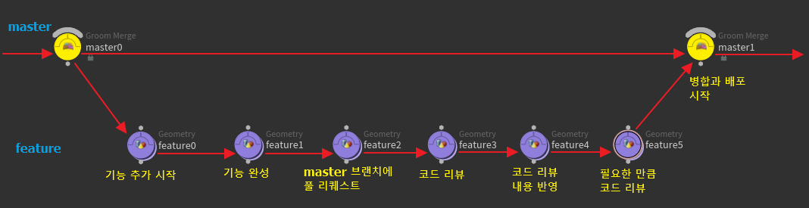

`git-flow`의 단점을 해결하고자 `github`에서 사용하는 `github-flow`가 있다.

이름에서 알 수 있듯이 이 작업 흐름은 `github`에서 사용 중인 작업 흐름이다.

<https://guides.github.com/introduction/flow/index.html>

이 작업 흐름에서는 다음 두 종류의 브랜치만이 존재한다.

- `master` 브랜치
- `feature` 브랜치

`git-flow`와 비교하면 매우 가벼운 프로젝트 작업 흐름 모델이다. 따라서 빠른 기능 추가와 수정이 필요한 분야에 적합하다. 대표적으로 **하루에도 몇 번씩 배포될 수 있는 웹 애플리케이션 등이 이 작업 흐름을 적용하기에 적합**하다.

## master 브랜치

`master` 브랜치는 언제나 배포할 수 있는 상태로 유지되는 브랜치이다. `master` 브랜치가 곧 배포 브랜치가 되는 셈이다. 보통은 하나만 존재한다. 오직 병합 커밋만 할 수 있다.

## feature 브랜치

`feature` 브랜치는 여러 개가 존재할 수 있다. `master` 브랜치에서 갈아져서 새 기능을 추가하거나, 버그를 수정하거나, 그외의 모든 코드 수정을 담당하는 브랜치 그룹이다. 다른 작업 흐름과 마찬가지로 한 번에 하나의 의도만을 구현하는 브랜치 그룹이며 그에 따라 이름 짓기가 중요한 브랜치 그룹이기도 하다.

_github-flow의 master, feature 브랜치의 관계_

이 작업 흐름을 이용해서 작업한다면 다음 차례로 진행됩니다.

1. `master` 브랜치를 기반에 두고 `feature` 브랜치 생성
2. `feature` 브랜치에서 기능 개발 시작
3. 기능이 완성되면 `master` 브랜치에 풀 리퀘스트
4. `feature` 브랜치에서 받는 풀 리퀘스트는 협업자들의 코드 리뷰 진행
5. 코드 리뷰를 반영해 `feature` 브랜치에서 작업 진행
6. 3~5를 필요한 만큼 반복
7. `feature` 브랜치가 `master` 브랜치에 병합됨으로서 새 기능 배포 완료

`git-flow`와 비교하면 상당히 간단하고 기능의 추가 완료와 배포가 바로 연동되는 가볍고 빠른 작업 흐름이다.

하루에도 몇 번씩 배포가 되는 웹 애플리케이션에 이 작업 흐름이 적합하다.
