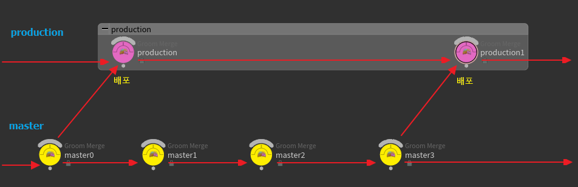
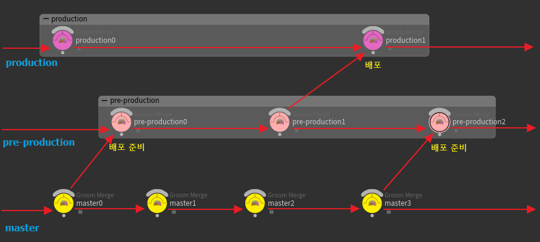

`git-flow`와 `github-flow`는 `git`을 이용한 작업 흐름 방식의 양 극단에 있는 작업 흐름이다. 

`git-flow`는 복잡하거나 견고하고 브랜치 사이의 엄격한 상호 작용 규칙에 따라야 하는 작업 흐름이다. 그만큼 전체적인 **개발-주기가 긴 프로젝트에 어울린다.**

반면, `github-flow`는 개발과 배포에 필요한 최소한의 브랜치 그룹만 유지해 언제나 배포할 수 있고, 여러 가지 요구나 상황 변화에 민첩하게 대응할 수 있는 작업 흐름이다.

이 두 가지의 중간에 `gitlab-flow`가 있다. `GitLab Flow` 라는 웹 문서에서 `github-flow`를 기본으로 여러 가지 변형 형태를 `gitlab-flow`라는 이름으로 소개한다. `github-flow`를 따르지만 배포 과정을 `GitLab`에서 개선한 작업 흐름이라고 생각하면 된다.

기본적으로 `github-flow`의 부족한 점인 안정성과 배포 시기 조절 가능성을 추가 브랜치를 두어 보강하는 전략이다.

<https://about.gitlab.com/blog/2014/09/29/gitlab-flow/>

## Github-flow with Production

_gitlab-flow production_

`production` 브랜치는 배포 코드가 있는 브랜치이다.

`feature` 브랜치의 작업 결과가 `master` 브랜치로 병합되고, 배포 준비가 되면 `master` 브랜치에서 `production` 브랜치로 병합한다.   
즉, `git-flow`에서 `release` 브랜치와 비슷한 역할을 수행하는 것이다. 다만 `gitlab-flow`에서의 `production` 브랜치는 오직 배포만을 담당한다.

이 작업 흐름은 사용자의 의도대로 배포할 수 없는 환경일 때 적절하다. 앱 스토어나 구글 플레이 마켓 등으로 배포하는 모바일 앱 개발에 어울리는 흐름이다. 왜냐하면, 개발 속도가 충분히 빠르더라도 배포 시기를 정할 수는 없기 때문이다.

모바일 개발이라면 `production` 브랜치로 배포하고 외부에서 배포 승인을 기다리는 것으로 생각하면 된다. 혹은 배포 시점을 일정하게 통제하고 싶을 때 사용할 수 있다.

또한 이 작업 흐름 모델은 `github-flow`의 특징인 잦은 배포에 대한 부담을 줄이는 방법이기도 하다. 한 번의 배포가 매우 큰 일이라면 이 작업 흐름을 적용할 수 있다.

## Github-flow with Pre-production and Production

위의 Github-flow with Production 작업 흐름에 pre-production 브랜치를 추가한 작업 모델이다.

_gitlab-flow pre-production_

`pre-production` 브랜치는 테스트 브랜치다. 개발 환경에서 바로 배포하지 않고 사용 환경과 동일한 테스트 환경에서 코드를 테스트하는 것이다.

모바일 앱 개발 시 각종 하드웨어에서 제대로 실행되는지 테스트할 필요가 있다면, `production` 브랜치로 결과를 넘기기 전에 이 `pre-production` 브랜치에서 테스트하는 방식과 같은 예로 활용할 수 있다.

물론 웹 개발에서도 활용할 수 있다. 로컬 저장소에서 기능 개발을 한 다음, 테스트 서버에서 시험하는 것을 `pre-production` 브랜치를 만드는 것으로 생각할 수 있다. 그리고 실제 서비스로 배포하는 것을 `production` 브랜치에 병합하는 것으로 생각하는 것이다.

위에서 언급한 방식 외에도 프로젝트 특성상 두 단계에 걸쳐 테스트와 배포를 진행해야 할 필요가 있다면 사용할 수 있는 작업 흐름이기도 하다.
