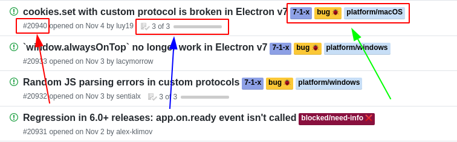
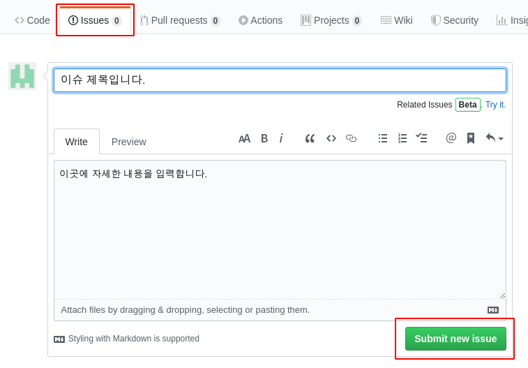
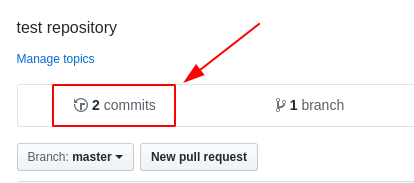
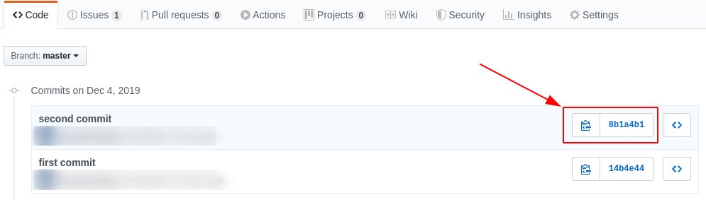
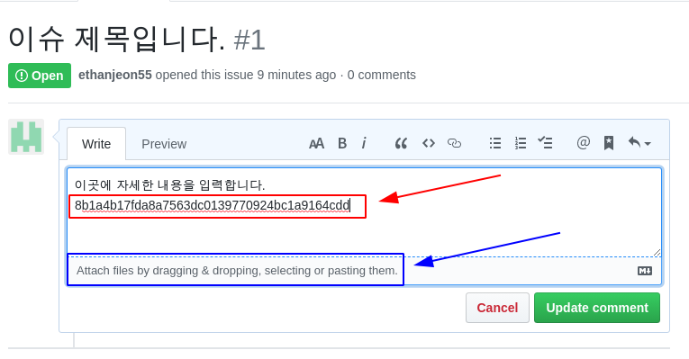
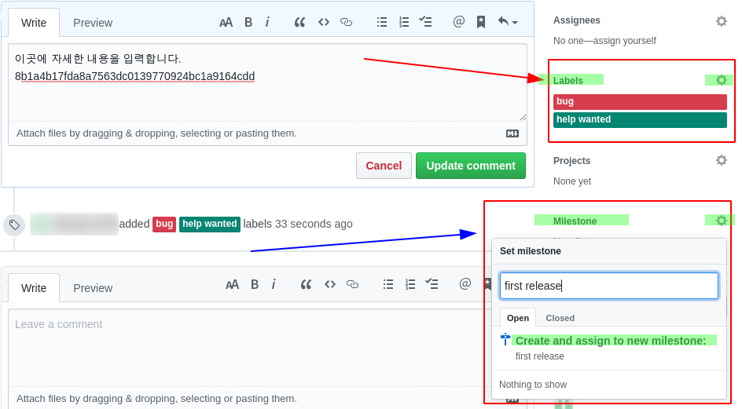
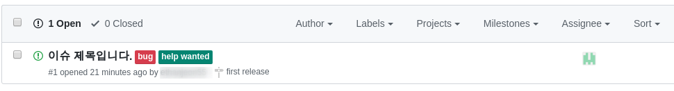
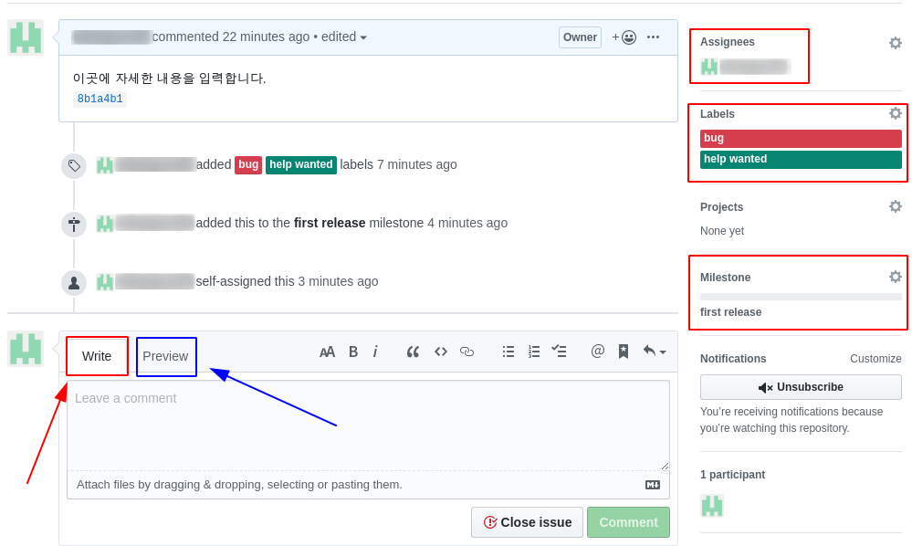
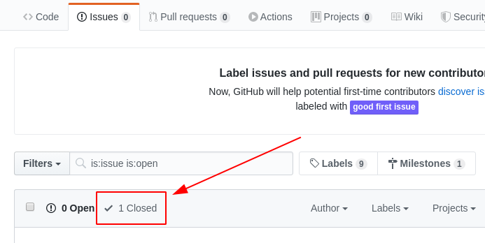
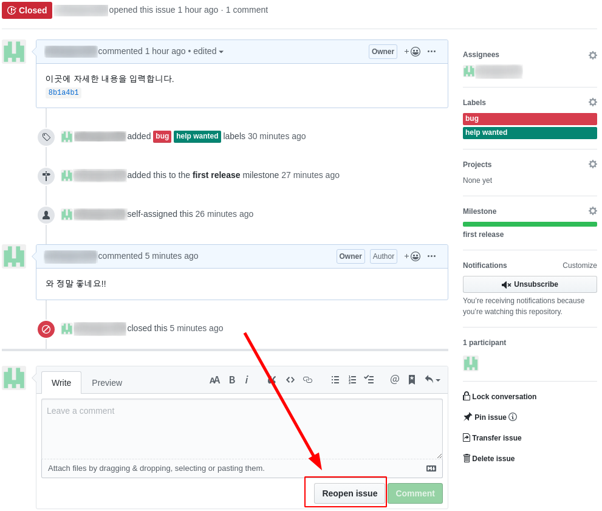

github는 단순히 원격 저장소만을 제공하는 서비스가 아니다. 프로젝트를 진행하는 데 필요한 서비스들도 같이 제공하고 있다. 따라서 github가 제공하는 여러 가지 기능을 적극적으로 이용하여 협업하는 것이 좋다.

## github 의 협업 도구

github 는 엽업을 위한 다양한 도구를 제공하고 있다. github 에서 제공하는 도구 중 필수적이라고 할 수 있는 이슈 트래커, 위키, 풀 리퀘스트, 코드 리뷰 기능등이 있다.

## 이슈 트래커

이슈 트래커는 쉽게 말하자면 게시판이다. 버그 보고, 기능 개선 건의, 그 외 프로젝트에 관련된 주제(이슈)를 등록할 수 있는 공간이다. 물론 일반적인 게시판과는 다른 점이 있다.

- 담당자: 이슈 담당자 지정 기능
- 알림: `@<name>` 형식으로 특정 그룹이나 특정 사용자에게 알림
- 라벨: 카테고리 역할의 라벨 지정 기능
- 커밋 레퍼런스: 커밋 해시를 써두면 자동으로 해당 커밋에 링크
- 마일스톤: 이슈들을 그룹으로 만드는 표식을 지정

github가 제공하는 이슈 트래커의 기능은 사용하기 단순하면서도 꽤 강력하다.

이슈를 작성할 때 라벨과 마일스톤을 지정하면 아래 그림과 같다. 이슈 넘버는 자동으로 1부터 증가한다.

_issues 게시물의 구조_

- 빨간 화살표: 이슈 넘버
- 파란 화살표: 마일스톤
- 녹색 화살표: 라벨

## 이슈 작성

`<New issue>` 를 클릭한 후 이슈를 작성한다.

_이슈 작성_

그런데 이슈는 커밋 내역을 참조할 때 의미가 있으니 커밋 내역을 참조하게 한다. 우선 커밋 목록을 살펴봐야 한다.

_commits 를 클릭하여 확인_

_아이콘을 클릭하여 커밋 SHA-1 체크섬 값을 클립보드로 복사_

_이슈를 최종 등록했을 때 자동으로 해당 커밋 내역의 링크를 표시하게 된다._

파란색 화살표가 가리키고 있는 부분(Attach files by dragging & dropping, selecting or pasting them.)을 클릭하면 그림 선택, 복사와 붙여넣기 기능을 이용해 그림을 넣을 수도 있다.

_라벨, 마일스톤, 담당자 지정_

처음에는 생성된 마일스톤이 없으니 무엇을 입력해도 새로 생성해서 할당할 수 밖에 없다. Milestone 메뉴 옆의 오른쪽 톱니바퀴 아이콘을 클릭해 입력 칸에 알맞은 이름을 입력하면 "Create and assign to new milestone" 이라는 항목이 등장한다. 이것을 선택한다.

한 이슈에는 하나의 마일스톤만 할당된다. 마일스톤이 할당되고 나면 아래의 캡처처럼 막대가 생긴다. 같은 마일스톤을 지정한 이슈가 해결될 때마다 막대의 표시가 올라간다.

마지막으로 이슈를 처리하는 권한이 있는 담당자를 지정한다. Assignees 메뉴 옆의 오른쪽 톱니바퀴 아니콘을 클릭하면 현재 저장소의 공헌자 중 한 명을 선택해서 지정할 수 있다.

_이슈가 등록되어진 그림_

_이슈가 등록되어진 그림_

이슈가 등록되면 등록된 이슈에 댓글을 남기거나 이슈가 참조하는 커밋 등을 살펴보면서 이슈를 해결하게 된다.

- Write: 댓글을 입력하는 곳이다. 이슈 작성과 마찬가지로 커밋 SHA-1 체크섬 값이나 그림을 넣을 수 있다.
- Preview: 입력한 댓글이 어떻게 보이는지 확인 할 수 있다.

이슈가 해결되었다면 <close issue> 를 클릭해 해당 이슈를 닫을 수 있다. 이슈를 닫으면 '사용자이름 closed this a 숫자 minute ago' 라고 이슈 진행 목록 안에서 이슈를 닫았다고 표시해준다.

_이슈가 닫았을 때의 그림_

닫힌 이슈라고 해도 다시 논의할 수 있다. 숫자 Closed 항목을 클릭하면 아래의 그림이 나온다. 여기서 <Reopen issue>를 클릭하면 된다.

_닫힌 이슈 다시 열기_

협업이라면 이렇게 이슈를 새로 만들고 댓글을 작성하면서 협업자가 이를 해결하는 방법이 중요하다. 적극적으로 활용하길 권장한다.
