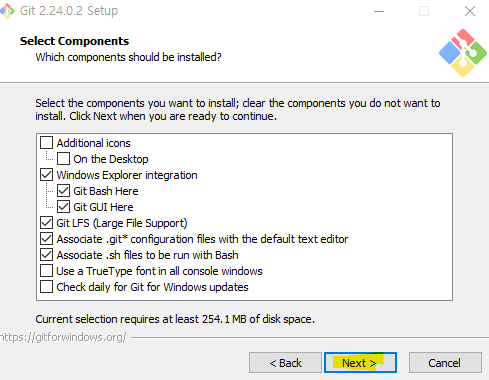
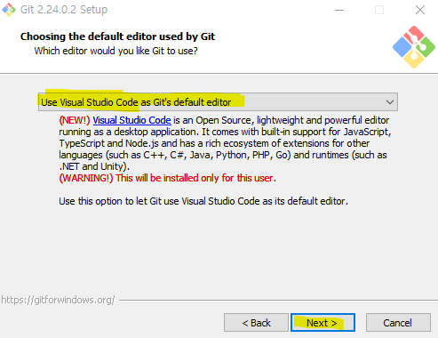
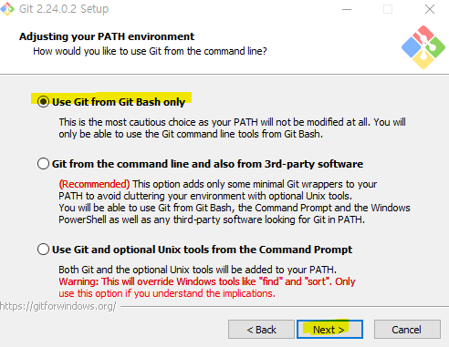
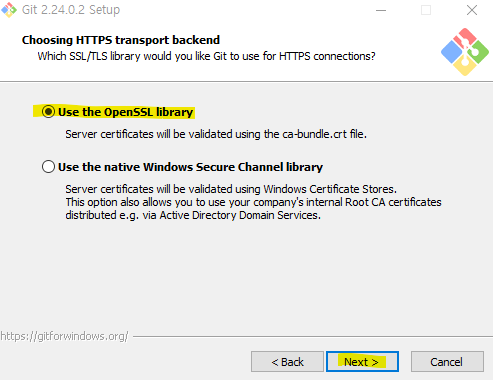
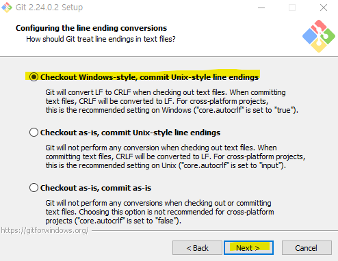
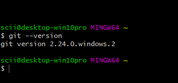

## Git이란?

버전 관리는 위한 분산 버전 관리 시스템이다.
프로젝트에 관련된 리소스 중 제일 빈번하게 생성, 삭제, 수정되는 것은 코드이다.

단 한 줄의 코드로 버그가 생기느냐, 성능이 향상되느냐가 갈리니 미세한 차이가 있는 버전들이라고 해도 그냥 넘어가지 않는다.

수많은 버전 관리 시스템들도 그 필요성을 절감하기 때문에 등장한 것이다. 

`Git`은 완벽한 분산 환경에서 빠르고 단순하게 수백 수천 개의 동시 다발적인 브랜치 작업을 수행하는 것을 목표로 하는 버전 관리 시스템이다. 그리고 git을 만든 리누스 토발즈의 의도와 같이 리눅스 커널 같은 대형 프로젝트의 버전 관리를 가능하게 하는 것 또한 목표이다.

## Git의 일반적인 특징

- 로컬 및 원격 저장소 생성
- 로컬 저장소에 파일 생성 및 추가
- 수정 내역을 로컬 저장소에 제출
- 파일 수정 내역 추적
- 원격 저장소에 제출된 수정 내역을 로컬 저장소에 적용
- master에 영향을 끼치지 않는 브랜치 생성
- 브랜치 사이의 병합(Merge)
- 브랜치를 병합하는 도중의 충돌 감지

## Git 설치
<https://git-scm.com/>
이 링크로 들어가 다운로드를 눌러 설치한다.

_추가 옵션을 설정하기 않고 Next를 클릭_

_기본 설정 그대로 진행. Next 클릭_

_기본 설정 그대로 진행. Next 클릭_

## 환경 변수 옵션

- `Use Git from Git Bash only` : 환경 변수를 변경하지 않는다. Git은 오직 Git bash 커맨드 라인 도구에서만 실행된다.
- `Use Git from the Windows Command Prompt` : 윈도우 커맨드 프롬프트에서 Git을 실행할 수 있는 최소한의 내용을 환경 변수에 추가해 설치한다. 이 옵션을 선택하면 윈도우에 내장된 명령 프롬프트에서 Git을 실행할 수 있다.
- `Use Git and optional Unix tools from the Windows Command Prompt` : Git과 부수적인 UNIX 도구들을 모두 윈도우 환경 변수에 추가한다. 이미 윈도우에 설치되어 있던 find나 sort 같은 명령어 도구들이 UNIX 도구로 대체(덮어쓰기 형식) 된다.

_기본 설정 그대로 진행. Next 클릭_

_기본 설정 그대로 진행. Next 클릭_

## 라인 엔딩 옵션

- `Checkout Windows-style, commit Unix-style line endings` : 텍스트 파일을 체크아웃할 때 CRLF가 LF로 변환된다. 텍스트 파일을 커밋할 때도 CRLF는 LF로 변환된다. 크로스 플랫폼 프로젝트의 경우에는 윈도우의 권장 설정이다.
- `Checkout as-is, commit Unix-style line endings` : 텍스트 파일을 체크아웃할 때는 어떠한 변환 작업도 하지 않는다. 텍스트 파일을 커밋할 때만 CRLF가 LF로 변환된다. 크로스 플랫폼 프로젝트의 경우에는 UNIX의 권장 설정이다.
- `Checkout as-is, commit as-is` : 체크아웃과 커밋 모두 텍스트 파일을 변환하지 않는다. 크로스 플랫폼 프로젝트를 사용하지 않을 때 선택하는 옵션이다.

_설치 완료_

## 🔗 References

- <https://wikidocs.net/273682>
