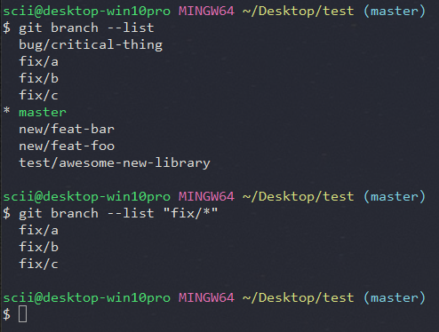
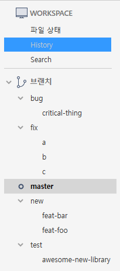

`git`을 이용해 프로젝트를 관리하는 방법에는 특별히 정해진 규칙이 없다. 언제든지 브랜치를 만들어서 새로운 기능을 시험해 볼 수 있고, 원(origin) 저장소와는 상관없는 자신만의 로컬 저장소를 만들어서 작업할 수 있는 것이 `git` 이다.

하지만 협업한다면 무엇보다도 중요한 것이 있다. 바로 **`브랜칭 규칙`**이다. 모두가 다 `master` 브랜치를 브랜칭해서 자신의 이름을 딴 브랜치에서 작업할 수도 있다. 하지만 그것보다 프로젝트 전체를 관리하는 훨씬 더 쉬운 방법이 있다.


## 커밋 단위

`커밋`에 포함될 수 있는 내용이 여러 개로 나누어질 수 있을 만큼 크다면 이를 쪼개서 `커밋`해야 한다. `커밋`의 내용을 `최소 단위(Atomic)`로 유지하는 것이다. 이를 위해 다음과 같은 규칙을 지키는 것이 좋다.

- 커밋 하나는 하나의 의도와 의미만을 가져야 한다. 
  - 한번에 여러 파일을 수정하더라도 그 의도는 단 하나여야 한다는 것이다. 그것이 버그 수정이든 새로운 기능 추가든 말이다.
- 파일을 하나만 수정하더라도 두 개 이상의 의도가 있다면 하지 말하야 한다. 
  - 버그 수정과 새 기능 추가를 동시에 하지 않아야 한다.

## 커밋 메시지 작성 규칙

`커밋` 메시지는 자유롭게 작성할 수 있지만 그렇다고 해서 정말 자유롭게 작성하면 협업에는 방해된다. `커밋` 메시지 작성에는 수많은 방식이 있지만, 처음으로 `git`을 작업에 도입하는 팀에 알맞은 간단한 커밋 메시지 작성 규칙을 소개한다.

- <https://wiki.openstack.org/wiki/GitCommitMessages>
- <https://qiita.com/itosho/items/9565c6ad2ffc24c09364>

```shell
# 간단한 커밋 메시지 작성 규칙

[category] - [simple message]

[detailed description]
```

- [catagory] 는 커밋의 성격이 무엇인지 한번에 알 수 있는 단어로 작성한다.
- [category] 작성 규칙 예시

| 카테고리 | 설명 |
|:----------|:------|
| `fix` | 잘못된 부분 수정 |
| `add` | 기능 추가 |
| `mod` | 코드 수정 |
| `rm` | 기능 삭제 |

위의 표를 보면 알겠지만 코드나 기능의 `생성`, `수정`, `삭제`를 기본으로 카테고리를 나눈다.

물론 팀 내부의 필요에 따라 유연하게 추가하거나 삭제해가면서 사용하면 될 것이다. 주의해야 할 점이 있다면 `가능하면 짧고 명확하게` 라는 것이다. 커밋 메시지 그 자체가 길어지면 오히려 본래의 목적인 알기 쉬운 메시지 작성을 달성할 수 없게 된다.

> [simple message] 는 해당 커밋에 대한 간단한 한 줄 설명을 작성하면 된다. 이때 영문 기준으로 70자 정도가 되도록 하는 것이 좋다. 일반적인 터미널에 보이는 글자 수를 고려한 것이다.
>
> [detailed description] 에 포함될 수 있는 내용은 다양하다. 커밋의 자세한 내용을 여기에 기술하면 된다. 하지만 다음 몇 가지 사항은 꼭 지켜서 작성할 것을 권장한다.
{: .prompt-info }

- 왜 커밋했는지 설명한다.
- 버그 수정의 경우 원래 어떤 문제가 있었는지 설명한다.
- 사용 중인 이슈 트래커가 있다면 해당 이슈의 하이퍼링크를 포함해야 한다.

위의 간단한 규칙을 염두에  두면서 커밋 메시지를 작성하면 작성된 커밋만 보고도 많은 정보를 얻을 수 있다. 또한 새로 협업에 참가하는 사람이 이전의 커밋 로그만을 보고도 전체적인 프로젝트 흐름을 이해하고 현재 작업에 참여하는 것이 더 쉬워질 것이다.

## 브랜치 이름 작성 규칙

<https://stackoverflow.com/questions/273695/what-are-some-examples-of-commonly-used-practices-for-naming-git-branches>

새로운 브랜치를 만들 때 어떻게 이름을 지을지를 협업자들 사이에 공유한다면, 브랜치 이름만을 보고서 어떤 목적으로 브랜치를 만들었는지를 바로 알 수 있게 된다.

자세한 설명이 없어도 사람들이 바로 알아볼 수 있어야 한다는 점에서 브랜치 네이밍 작성 규칙은 커밋 메시지 작성 규칙과 닮은 곳이 있다. 하지만 브랜치인만큼 영향을 끼치는 범위가 프로젝트 전체가 되는 것이다.

브랜치 또한 커밋 메시지와 마찬가지로 몇 가지 카테고리를 만들어서 분류하는 것이 좋다. 짧으면서 쉽게 구별할 수 있고 협업 흐름에서 권장하는 브랜칭 방식에 따라서 이름을 짓는 것이 좋다.

### 브랜치 이름 작성 규칙의 예

| 이름 | 설명 |
|:------|:------|
| `new` | 새 기능 추가가 목적인 브랜치 |
| `test` | 무언가를 테스트하는 브랜치 (새 라이브러리, 배포 환경, 실험 등) |
| `bug` | 버그 수정이 목적인 브랜치 |

이런 카테고리 이름을 접두어로 사용하면서 그 뒤에 이름을 붙인다. 이때 구분자로 `슬래시(/)` 기호를 사용하는 것을 권장한다. 이런 규칙으로 다음과 같은 브랜치 이름을 만들 수 있다.

```shell
new/feat-foo
new/feat-bar
bug/critical-thing
test/awesome-new-library
```

이렇게 해 두었으면 `git branch --list` 명령을 실행한다. 그럼 특정 브랜치만 찾아보기 쉬워진다.


_git branch 로 특정 브랜치를 찾아본 모습_

```terminal
# fix라는 특정 브랜치만 찾는다.
git branch --list "fix/*"
```

`SourceTree`를 이용할 때도 왼쪽에 `Branches` 항목에서 브랜치를 폴더처럼 관리할 수 있다.


_SourceTree 화면의 브랜치 모습_

또한 브랜치 이름을 지을 때 하지 말아햐 할 것이 몇 가지 있다.

- 사람이 한 번에 알아볼 수 없는 이름 (예: 숫자로만 된 이름)
- 너무 긴 설명조의 이름

간결하고 한 번에 알아볼 수 있는 카테고리와 이름을 짓는 것이 중요하다.


## 태그와 버전 이름 작성 규칙

프로젝트를 진행하다 보면 자연스레 버전 이름을 붙이게 될 것이다. 이러한 버전 이름은 아래의 링크를 참고해 버전 이름을 커밋에 올바르게 태깅하는 것만으로도 많은 정보를 제공할 수 있다.

<https://semver.org/lang/ko/>

간단하게 버전 x.y.z 에 대해 유의적 버전을 설명하자면 다음과 같다.

- x 는 기존과 호환이 되지 않는 변경이 발생할 때 증가시킨다.
- y 는 기존과 호환이 되며, 새로운 기능이 추가될 때 증가시킨다.
- z 는 기존과 호환이 되며, 버그 수정 등이 될 때 증가시킨다.

이 세 가지 규칙을 기억하고 필요에 따라 버전 이름 뒤에 간단한 라벨을 붙여서 부가 설명을 하면 된다.
