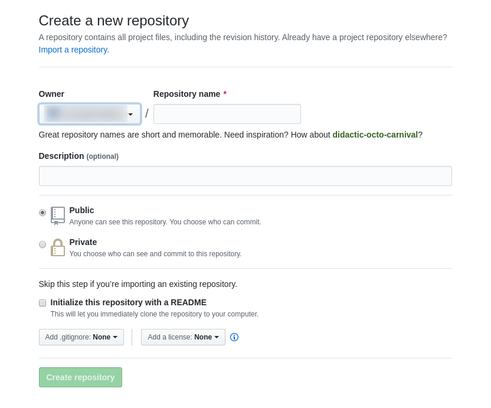

## 원격 저장소

git은 혼자만 사용하려고 배우는 것이 아니다. 물론 개인 프로젝트에도 git과 같은 버전 관리 시스템을 활용하는 의미가 있지만, git은 무엇보다도 다른 사람들과 협업을 하기 위한 도구로서의 의미가 더 크다.

협업 도구로서 git의 가장 큰 유용함은 원격 저장소(remote repository)이다. 

### 원격저장소와 [GitHub](https://github.com)

무엇보다도 협업할 때 중요한 개념이 git의 원격 저장소 부분이다. 물론 로컬 환경에서만 git을 사용해 개인 프로젝트를 관리하는 것도 git의 훌륭한 사용 방법 중 한 가지다. 하지만 git이 무엇보다 좋은 이유는 원격 저장소 때문이다. git의 핵심이라고 이야기할 정도다.

이러한 git 원격 저장소를 제공하는 대표적인 서비스가 github이다. github는 단순히 원격 저장소만을 제공하는 것이 아니라, 여러 가지 프로젝트 진행을 원활하게 하는 도구를 함께 제공한다. 따라서 git을 이용한 프로젝트 종합 관리 서비스에 더 가깝다고 생각하면 될 것이다.

### github를 사용하면 좋은 점

- 전 세계에서 진행되는 오픈 소스 프로젝트가 많이 모여 있어 이에 참여하고 오픈 소스에 기여할 수 있는 기회가 있다.
- 개발자는 github를 이용해 자신이 작성했던 코드 그 자체를 곧바로 제공할 수 있다.
- IT 개발과 관련이 많은 디자이너도 여태껏 그려왔던 작품을 포트폴리오로 준비해 이를 공개할 수 있다.
- 기획자 역시 자신이 준비했었던 기획 문서를 공개할 수 있다.

지금 이 순간에도 수많은 오픈 소스 프로젝트들이 github에 생겨나고, 진행되고 있으며 앞으로도 그럴 것이다. 오픈소스가 존재하는 이상 github 역시 계속해서 존재할 것이라고 봐도 무방할 정도이다.

개발자 또는 개발자와 같이 협업하는 사람으로서 자신의 실력을 키우고 싶다면 github를 활용하는 것이 좋다. 흔히 글을 잘 쓰고 싶다면 다독, 다작, 다상량을 하라고 한다. 즉 많이 읽고, 많이 쓰고, 많이 생각하기라는 딱 세 가지만 하면 된다는 것이다. 그야말로 왕도를 걷는 방법이다.

개발에서도 마찬가지로 더 좋은 코드를 작성하고 싶다면 다른 사람의 코드를 읽어보고, 코드를 많이 작성해보고, 내 코드와 다른 사람의 코드로 말미암아 많은 생각을 해보는 것. 이 세 가지만 잘하면 된다.

그 세 가지를 할 수 있는 기회를 펼칠 곳이 바로 github이다. 이와 같이 github는 많은 장점이 있는 훌륭한 공간이다.

github는 개발뿐만이 아니라 일반적인 여러 활동에도 사용할 수 있는 협업 플랫폼이라고 볼 수 있다. 즉, '협업'이 github를 관통하는 키워드이다. 이런 github를 개인 프로젝트에만 사용하는 것은 github의 가능성을 절반도 사용하지 않는 것이다.

- 만들면서 배우는 git/github 입문 서적 중 발췌

---

## 원격 저장소 사용

<https://github.com>

위의 링크를 타고 들어가 가입한다.

지불하는 비용에 따라서 비공개 저장소를 얼마나 사용할 수 있는지가 정해진다. 무료로 이용한다면 github에서 생성하는 모든 저장소는 공개 저장소가 된다.

> Help me set up an organization next 체크 박스는 많은 사람이 협업 할 때 팀을 만들어서 활동하도록 설정하겠다는 의미이다.
{: .prompt-info }

원격 저장소(remote repository)는 단어 의미 그대로 외부에서 접속해 사용하는 저장소를 뜻한다. 즉, 로컬에서 작업한 git프로젝트 저장소가 외부에 있는 것이다.

github는 개인 사용자들에게 이러한 원격 저장소를 제공한 후 여러 가지 기능을 사용할 수 있도록 한다.

- 포크(fork): 다른 사람의 저장소를 복사하는 기능
- 풀 리퀘스트(pull request): 포크한 저장소를 수정해 다시 원본 저장소에 병합해달라는 요청을 보내 사용자 사이의 상호 작용을 일으키게 하는 기능
- 이슈(issues): 저장소 안에서 사용자들 사이의 문제를 논의하는 기능
- 위키(wiki): 저장소와 관련된 체계적인 기록을 남기는 기능

개인 사용자들은 서로의 원격 저장소를 읽거나 쓸 수 있다. github에서 오픈 소스 프로젝트가 활발하게 이뤄지는 이유는 바로 이 원격 저장소의 활용과 공유가 편리하기 때문이다.



- owner: 사용자 아이디가 표시된다. 협업 환경에서는 다른 사용자의 아이디를 지정할 수도 있다.
- repository name: 새로 생성할 원격 저장소의 이름을 입력. 가능하면 로컬 환경에서 작업할 git 프로젝트 디렉토리 이름과 같게 하는 것이 좋다. 같지 않아도 상관은 없지만 사람이 실수할 가능성이 너무나 커지므로 같은 이름을 사용한다.
- description: 꼭 작성할 필요는 없는 항목이지만 생성한 원격 저장소가 어떤 역할을 하는지를 간단하게 적어두면 원격 저장소가 많아졌을 때 구분하는 데 도움이 된다.
- public/private: 원격 저장소의 공개 여부를 선택하는 옵션. 무료 사용자는 public만 선택할 수 있다.
- initialize this repository with a README: 기본적으로 체크 표시를 해준다. 체크하면 github에서 생성한 원격 저장소를 바로 로컬 저장소에 복사해서 가져올 수 있다. 또한 '저장소 이름'과 'description' 항목의 내용을 담은 README.md 파일을 생성한다.
- add .gitignore: 원격 저장소에 포함하지 않을 파일들의 목록을 만들 때 사용. 
- add a license: 원격 저장소에 저장할 프로젝트가 어떤 라이센스에 속할지를 선택한다.

### github 원격 저장소의 구조

- watch: 해당 버튼을 클릭하면 원격 저장소의 활동 내역을 사용자에게 알려준다. 댓글이나 이슈 등에서 언급될때만 알려주는 Not Watching, 모든 활동 내역을 알려주는 Watching, 모든 알림을 무시하는 Ignoring을 선택할 수 있다. 오른쪽 숫자는 현재 활동 내역을 보고 있는 사람의 수이다.
- star: 해당 원격 저장소에 관심이 있을 때 클릭하면 된다. 오른쪽 숫자는 관심이 있는 사람의 수를 나타낸다.
- fork: 해당 버튼을 클릭하면 원격 저장소를 포크한다. 오른쪽은 포크한 사람의 수를 나타낸다.
- description: 원격 저장소를 설명하는 메세지를 나타낸다.
- commits: 원격 저장소의 총 커밋 수를 나타낸다.
- branches: 원격 저장소의 브랜치 수를 나타낸다.
- releases: 원격 저장소의 태그수를 나타낸다. 주로 특정 버전에 표식을 주고 싶을 때 사용한다. 이 표식을 통해서 특정 버전을 다운로드할 수 있다.
- contributor: 원격 저장소에 커밋 혹은 풀 리퀘스트가 받아들여진 사용자 수이다. 이 저장소가 오픈 소스라면 이 오픈 소스에 공헌한 사람의 수라고 생각하면 된다. 유명하고 많은 사람이 참여하는 프로젝트일수록 이 숫자가 클 것이다.

### 브랜치 관련 메뉴

- compare, review, create a pull request: 브랜치 사이의 차이를 비교하거나 리뷰할 때 사용한다. 원하는 브랜치를 선택해서 리뷰할 수 있다.
- current branch: compare, review, create a pull request 옆에 있다.원하는 브랜치를 선택하는 기능이다.
- path: 현재 열려 있는 저장소 화면의 경로이다. 맨 왼쪽이 최상위 경로이다. 이 기준으로 경로 이름을 선택하면 해당 경로로 바로 이동할 수 있다.
- fork this project and create a new file: '+' 기호로 표시된 링크이다. 현재 경로에 새로운 파일을 추가할 수 있다. 단, github의 특성상 해당 원격 저장소의 관리자가 아니라면 추가하려는 사용자의 원격 저장소로 포크한 후 파일을 추가한다.

특히 current brach에서 브랜치를 선택하면 해당 브랜치로 체크아웃해서 github에서 볼 수 있다.

### 저장소 메뉴

- code: 해당 원격 저장소의 루트 디렉토리로 이동한다. 어떤 경로에 있더라도 루트 디렉토리로 이동한다.
- issues: 해당 원격 저장소의 주요 이슈 사항을 기재한 후 관리한다. 게시판 형태이며 댓글 형태로 토론이 이뤄지기도 한다. 이슈로는 무엇이든 다룰 수 있지만 보통은 문제점이나 개선점을 얘기한다고 생각하면 된다.
- pull requests: 풀 리퀘스트 전체 목록을 모아서 보여준다. issues와 마찬가지로 목록마다 댓글 형태로 토론할 수 있다. 보통 왼쪽에 있는 숫자는 현재 요청이 온 풀 리퀘스트를 받아들일 것인지에 대한 논의가 몇개인지 알려주는 것이다.
- wiki: 공유할 정보나 개발 문서, 참고 자료 등을 작성하기 위한 기능이다. 위키백과를 떠올리면 된다. 마크 다운과 위치위키 문법을 사용한다.
- pulse: 해당 원격 저장소의 최근 변경 내역을 확인할 수 있다. 최대 한 달까지의 변경 내역을 확인할 수 있으며 풀 리퀘스트 몇 개중에 몇 개가 받아들여졌나, 이슈는 몇 개가 있고 몇 개가 해결되었나, 해당 풀 리퀘스트와 이슈에 관련된 활동을 볼 수 있다.
- graphs: 공헌자의 공헌 내역, 커밋 수 등 해당 저장소의 활동 내역을 그래프화해서 보여준다.
- settings: 해당 원격 저장소의 관리자라면 저장소의 각종 설정을 변경할 수 있다.
- HTTPS clone URL: 원격 저장소를 클론할 때 사용하는 주소 정보를 알려준다. 문장의 링크를 클릭해서 HTTPS 이외에 SSH, 서브버전에 맞는 주소로 변경할 수 있다.
- Clone Desktop: github 전용 클라이언트 프로그램을 사용해 클론할 때 클릭한다.
- download ZIP: 원격 저장소의 전체 파일을 압축 파일 형태로 다운로드할 수 있다. 만약 어떤 프레임워크의 전체 파일을 담은 저장소라면 다운로드해서 다양한 곳에 응용해 사용할 수 있다.
- 

---

## 원격 저장소의 특징

github는 기본적으로 각 사용자가 원격 저장소를 만들고 해당 원격 저장소를 다른 사용자와 공유하는 개념이다. 따라서 원격 저장소의 관리는 사용자 관리와 밀접한 관련이 있다.

이러한 관리를 세분화하기 위해 github는 공개(public) 원격 저장소와 비공개(private) 원격 저장소로 나뉜다.

### 비공개 원격 저장소와 공개 원격 저장소 특징

#### 공개 원격 저장소

| # | 특징 |
|:---|:------|
| 1 | 저장소 관리자, 협업자(collaborators) 이외에는 쓰기 권한이 없다. |
| 2 | github 사용자라면 누구나 읽기 권한과 포크 권한이 있다. |
| 3 | github 사용자 누구에게든 소유권을 이전할 수 있다. |

#### 비공개 원격 저장소

| # | 특징 |
|:---|:------|
| 1 | 관리자가 지정한 협업자만 접근해서 다룰 수 있다. |
| 2 | 지정한 협업자에게만 포크 기능이 열려있다. |
| 3 | 유료 사용자에게만 소유권을 이전할 수 있다. |

### 원격 저장소의 사용자별 권한

| 사용자 유형 | 특징 |
|:-------------|:------|
| 저장소 관리자 | 원격 저장소 읽기 및 쓰기 가능. 협업자 초대와 소유권 이전 가능 |
| 협업자 | 원격 저장소 읽기 및 쓰기 가능 |
| 일반 사용자 | 원격 저장소 읽기만 가능. 쓰기 권한이 없으므로 포크를 하여 작업해야 함 |

> 참고로 포크하지 않고 다른 사람의 원격 저장소를 클론한 일반 사용자는 저장소 관리자가 협업자로 지정하거나 소유권을 이전하지 않는 한 원격 저장소에 관한 권한이 없습니다. 또한 소유권을 이전하게 되면 소유권을 이전한 원래 원격 저장소 관리자는 공헌자(contributor)가 된다.
{: .prompt-info }

---

## 원격 저장소와 git

분산 버전 관리 시스템은 다른 사람과의 협업을 염두에 둔 것이다. 결국 원격 저장소와 로컬 저장소 사이를 얼마나 효율적으로 관리하느냐가 관건이다.

관리는 위해 git에서는 원격 저장소와 소통하기 위한 기능을 제공한다. 원격 저장소의 내용을 로컬 저장소로 가져오거나, 로컬 저장소를 원격 저장소와 연결하고 보내거나, 수정된 내역을 확인하고 병합하는 등의 과정을 제공한다.

| 명령어 | 기능 |
|:--------|:------|
| `git clone` | 원격 저장소의 모든 내용을 로컬 저장소로 복사 |
| `git remote` | 로컬 저장소를 특정 원격 저장소와 연결 |
| `git push` | 로컬 저장소의 내용을 보내거나 로컬 저장소의 변경 사항을 원격 저장소로 보낸다 |
| `git fetch` | 로컬 저장소와 원격 저장소의 변경 사항이 다를 때 이를 비교 대조하고 `git merge` 명령어와 함께 최신 데이터를 반영하거나 충돌 문제 등을 해결 |
| `git pull` | `git remote` 명령을 통해 서로 연결된 원격 저장소의 최신 내용을 로컬 저장소로 가져오면서 병합한다. `git push`와 반대 성격의 명령 |

github 안에서 원격 저장소를 복사하는 작업을 포크(fork)라고 한다면, github에서 로컬 환경으로 복사하는 작업은 클론(clone)이라고 한다.

### 클론의 정의

- 내가 생성한 원격 저장소를 내 컴퓨터와 연결해서 데이터를 복사하는 작업
- 포크한 원격 저장소를 내 컴퓨터와 연결해서 데이터를 복사하는 작업

참고로 다른 사람의 공개 원격 저장소난 비공개 원격 저장소를 포크하지 않은 상태에서 직접 내 컴퓨터와 연결해서 데이터를 복사할 수 있다. 이러한 작업도 클론이라고 말할 수 있다.

---

## git remote: 로컬 저장소와 원격 저장소 연결

기본적으로 여러 사람과 협업할 때는 빈 원격 저장소를 만들고 협업을 책임지는 사람이 기본 프로젝트 구조를 만든 후, 이를 관리하고 협업하는 사람 모두가 빈 원격 저장소를 클론해서 본인이 해야 하는 작업을 진행하면 된다.

그러면 협업을 책임지는 사람이 기존에 이미 작업해놓은 로컬 저장소가 있고 이를 원격 저장소와 연결한다고 생각해보자. 빈 원격 저장소를 클론하고 기존에 작업하던 파일들을 옳기는 것도 가능하겠지만 번거롭기도 하고 뭔가 이치에도 맞지 않는다.

그래서 git에서는 로컬 저장소를 빈 원격 저장소와 연결하는 명령이 있다. git remote 이다.

이 명령은 원격 저장소와 연결하는 것은 물론 원격 저장소와의 연결 상태를 확인하거나 원격 저장소의 긴 주소를 병칭으로 지어 줄여주기까지 한다.

* git clone을 하게되면, 기본적으로 클론한 저장소 이름을 origin으로 짓는다.

```terminal
git remote add 저장소별칭 https://github.com/사용자이름/원격저장소이름.git
```

> 저장소 별칭은 기본적으로 git 명령어와 상관없는 어떠한 이름이라도 입력해도 된다. 하지만 master 브랜치처럼 가장 원본이 된다는 의미에서 origin 이라는 별칭을 사용한다. 다른 사용자라면 본인이 원하는 별칭을 사용해도 큰 문제는 없다.
>
> 하지만 관례로 origin 을 사용하니 다른 사람들과 협업할 때는 그 점을 염두에 두고 원격 저장소 이름을 지어주는 것이 좋다.
{: .prompt-tip }

원격 저장소와 연결되었는지 확인하려면 `git remote -v` 명령을 사용

---

## git push: 로컬 작업 내역을 원격 저장소에 올리기

git push 명령은 기본적으로 커밋들을 원격 저장소의 master 브랜치에 업로드하며, 다양한 옵션을 통해 특정 브랜치의 내용을 업데이트하거나 태그(tag)를 푸시하는 등의 작업을 한다.

```terminal
git push origin --all
```

위의 명령은 일반화하자면

```terminal
git push 원격저장소별칭 로컬브랜치이름
```

--all 옵션은 origin 저장소에 로컬의 모든 브랜치를 푸시하는 것이다. git은 원격 저장소에 로컬 저장소의 브랜치와 같은 이름의 브랜치가 있다면 해당 브랜치를 변경하고 없다면 새 브랜치를 원격 저장소에 만든다.

단, 주의할 점은 같은 이름의 브랜치가 있는데 서로의 내역이 다르다면 푸시를 거부한다. 즉, 백지상태인 원격 저장소에 로컬 저장소에서 작업한 것을 푸시해야 한다.

---

## git fetch, git pull: 원격 저장소와 로컬 저장소의 간격 메꾸기

원격 저장소를 이용하다 보면 다른 누군가가 커밋할 경우가 있다. 예를 들면, 로컬 저장소에서 작업하는 도중에 다른 협업자가 원격 저장소를 먼저 변경할 수 있는 것 등이다.

이런 경우 git은 푸시를 허용하지 않는다. 로컬 저장소의 커밋들을 원격 저장소와 맞춰야 한다. 이럴 때 하는 것이 페치(fetch) 이다.

fetch 는 원격 저장소와 커밋들을 로컬 저장소로 가져온다. 사용자는 로컬로 가져온 커밋들을 자신이 여태까지 한 로컬 저장소의 작업과 적절히 병합해서 원격 저장소에 제출해야 한다.

원격 저장소의 커밋들을 로컬 저장소로 가져와 합하는 방법은 git fetch 와 git pull 크게 두 가지가 있다.

git pull 명령은 원격 저장소의 정보를 가져오면 자동으로 로컬 브랜치에 병합까지 수행하는 것이다. 하지만 풀(pull)을 이용해서 페치와 병합을 동시에 수행하는 것은 큰 단점이 있다. 어떤 내용이 병합되면서 바뀌게 뒤었는지를 알 수 없는 것이다. 물론 병합 시 어느 파일이 몇 줄 바뀌고 어떤 충돌이 발생했는지는 표시해주긴 하지만, 프로젝트의 세세한 부분이 어떻게 바뀌었는지는 전혀 파악할 수 없게 된다. 때문에 풀을 이용한 원격 저장소의 커밋 가져오기는 추천하지 않는다.

대신 페치를 이용해서 원격 저장소의 커밋을 가져오고, 로컬 저장소에서 이를 확인한 다음 수동으로 병합하는 방법을 추천한다.

### git fetch 작업 흐름

| 단계 | 위치 | 작업 |
|:----:|------|------|
| 1 | 원격 저장소 (github) | github 상에서 파일 수정 |
| 2 | 로컬 저장소 | 로컬 저장소 내용 변경과 커밋 |
| 3 | 로컬 저장소 | 푸시 시도와 실패 |
| 4 | 로컬 저장소 | 페치 (`git fetch`) |
| 5 | 로컬 저장소 | 병합 (`git merge`) |
| 6 | 로컬 저장소 | 푸시 재시도 (`git push`) |
| 7 | 원격 저장소 (github) | github 상에서 확인 |

### github commit changes 항목의 옵션

- update 파일이름: '파일이름'의 수정 내역을 남길 커밋 메세지를 입력. 커맨드 라인에서 커밋 메세지를 입력할 때의 첫 번째 행에 해당.
- add an optional extended description: 자세한 설명을 남겨야 할 경우 추가로 커밋과 관련된 설명을 입력. 커맨드 라인에서 커밋 메세지를 입력할 때의 두 번째 이후 행에 들어가는 내용.
- commit directly to the master branch: master 브랜치에 바로 커밋할 때 선택.
- create a new branch for this commit and start a pull request: 풀 리퀘스트를 위한 새로운 브랜치를 생성할 때 선택.

원격 저장소와 로컬 저장소의 같은 브랜치가 다른 커밋을 가지고 있으면 아래와 같은 에러가 발생한다.

```output
! [rejected]        master -> master (fetch first)
error: failed to push some refs to 'https://github.com/사용자이름/저장소이름.git'
hint: Updates were rejected because the remote contains work that you do
hint: not have locally. This is usually caused by another repository pushing
hint: to the same ref. You may want to first integrate the remote changes
hint: (e.g., 'git pull ...') before pushing again.
hint: See the 'Note about fast-forwards' in 'git push --help' for details.
```

힌트에서는 git pull 명령을 사용해보라고 알려주지만 git pull 보다는 git fetch, git merge를 이용하는 것이 안전하다.

이렇게 에러가 발생한다. git fetch 명령을 실행해 원격 저장소의 커밋 정보를 로컬 저장소에 가져온다. 원격 저장소의 master 브랜치와 로컬 저장소의 master 브랜치를 병합한 후 다시 푸시해야 한다.

```terminal
# 현재 로컬 저장소의 모든 브랜치들을 볼 수 있다. remote한 저장소의 브랜치들까지도
git branch -a
```

로컬 저장소의 master 브랜치에 원격 저장소의 origin/master 브랜치를 병합하면 된다.

```terminal
# 충돌 발생
git merge origin/master
```

원격 저장소와 로컬 저장소에있는 파일이 같은 부분에서 다른 수정 사항이 있으므로 서로 충돌 발생

충돌 발생하여 수정해야 한다. 이럴 때 git diff 명령을 활용하여 변경 사항을 정확히 확인할 수 있다.

git diff 명령은 로컬 저장소의 브랜치와 원격 저장소 브랜치 사이에 어떤 차이점이 있는 지 미리 알아보는 명령이다. 이를 통해서 변경 사항을 정확하게 확인한 후 병합을 실행할 수도 있다.

만약, git pull 명령을 이용했다면 페치와 병합을 자동으로 수행해버려서 어떤 변경 사항이 있는 지 알기가 매우 어려워진다.

git diff 명령으로 파일을  수정한 후, git commit -a -m "커밋 메세지" 명령을 한다. 그 후 다시 git push origin master 명령을 실행하면 푸시 명령을 완료할 수 있다.

```terminal
# 추천하지 않는다.
git pull origin master
```

git pull 명령을 내리면 변경 내용을 가져오고 자동으로 병합한다. 자동으로 되기때문에 확인 힘듦.
