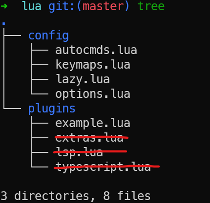

## 🧱 [LazyVim](https://www.lazyvim.org/) 이란?

`LazyVim`은 [folke](https://github.com/folke)가 만든 [Neovim](https://neovim.io/) 설정 프레임워크로, `lazy.nvim` 플러그인 매니저를 기반으로 동작한다.

> `lazy.nvim`, `which-key.nvim`, `tokyonight.nvim` 등 유명 플러그인들이 모두 같은 개발자(folke)의 작품이다.

**핵심 철학**: *"IDE처럼 동작하는 Neovim 환경을 최소한의 설정으로"*

- 기본으로 잘 다듬어진 설정을 제공하고, 사용자는 **덮어쓰는 방식(override)** 으로 커스터마이징한다.
- **Extras** 시스템으로 언어별/기능별 플러그인 번들을 선택적으로 활성화할 수 있다.
- 기본 컬러스킴은 `tokyonight-night`.
- `<leader>` 키 기본값은 `Space`.

---

## Neovim

`LazyVim`을 사용하기 위해서는 먼저 `Neovim`을 설치해야 한다.

### Linux

리눅스 패키지 매니저로 설치하면 최신의 `Neovim`이 아닌 구버전이 설치되므로 아래와 같이 최신으로 설치한다.

```terminal
# Neovim Install

# 기존 apt neovim 제거 (있다면)
sudo apt remove neovim -y

# 최신 stable tarball 다운로드
curl -LO https://github.com/neovim/neovim/releases/latest/download/nvim-linux-x86_64.tar.gz

# /opt에 설치
sudo rm -rf /opt/nvim-linux-x86_64
sudo tar -C /opt -xzf nvim-linux-x86_64.tar.gz

# 정리
rm nvim-linux-x86_64.tar.gz
```

```terminal
echo 'export PATH="$PATH:/opt/nvim-linux-x86_64/bin"' >> ~/.zshrc
source ~/.zshrc
```

```terminal
nvim --version
```

```terminal
sudo apt install git gcc unzip curl ripgrep fzf fd-find pipx
pipx install cmakelint
```

> `fd`는 `Ubuntu`에서 `fdfind`로 설치됨. `LazyVim`이 `fd`를 찾으므로 심볼릭 링크 필요:

```terminal
mkdir -p ~/.local/bin
ln -sf $(which fdfind) ~/.local/bin/fd
# ~/.zshrc에 ~/.local/bin이 PATH에 있는지 확인
```

### Windows

```console
choco install neovim
```

---

## 🚀 LazyVim Install

내가 미리 어느 정도 설정한 것이 있다. 이것을 이용하면 `C++`, `Python`, `Rust`, `TypeScript`, `CMake` 등의 플러그인들을 따로 설치할 필요 없다.

### Prerequisites

#### Linux

```terminal
sudo apt install ripgrep fzf fd-find pipx
pipx install cmakelint
```

#### MacOS

```terminal
brew install ripgrep fzf fd pipx
pipx install cmakelint
```

#### Windows

```console
choco install ripgrep fzf fd python tree-sitter
pip install pipx
pipx install cmakelint

# MinGW-w64 배포판 설치
winget install --id=BrechtSanders.WinLibs.POSIX.UCRT -e
```

### Clone

각 OS에 맞게 Prerequisites를 설치한 후 다음과 같이 git clone 받으면 끝이다.

```bash
# Linux / macOS
git clone https://github.com/seongcheoljeon/LazyVimSettings ~/.config/nvim

# Windows (PowerShell)
git clone https://github.com/seongcheoljeon/LazyVimSettings $env:LOCALAPPDATA\nvim
```

처음 Neovim을 실행하면 `lazy.nvim`이 자동으로 모든 플러그인을 설치한다. 설치가 완료될 때까지 잠시 기다리면 된다.

---

## 🗂️ 설정 파일 구조

초기 구성 파일의 트리 구조는 다음과 같다.



```
~/.config/nvim/
├── init.lua              ← 진입점: 클립보드 설정 + lazy.nvim 부트스트랩
├── lazyvim.json          ← 활성화할 LazyVim Extras 목록
├── lazy-lock.json        ← 플러그인 버전 고정 파일 (자동 생성)
├── stylua.toml           ← Lua 코드 포맷터 설정
└── lua/
    ├── config/
    │   ├── lazy.lua      ← lazy.nvim 초기화 (건드릴 필요 없음)
    │   ├── keymaps.lua   ← 커스텀 키맵 추가 (LazyVim 기본값 위에 추가됨)
    │   ├── options.lua   ← 커스텀 옵션 추가 (LazyVim 기본값 위에 추가됨)
    │   └── autocmds.lua  ← 커스텀 자동 명령
    └── plugins/
        ├── lsp.lua       ← LSP 서버 세부 설정 (예: Ruff를 mason 없이 사용)
        ├── typescript.lua← TypeScript 테스트 어댑터 (Vitest / Jest)
        └── extras.lua    ← 추가 플러그인 (highlight-undo, neogit 등)
```

**`lua/config/`** 경로의 파일들은 LazyVim이 로드하는 고정 경로이므로 이름을 바꾸면 안 된다.

**`lua/plugins/`** 경로는 자유롭게 분리할 수 있다. 예를 들어 `lua/plugins/typescript.lua`처럼 언어별로 파일을 나눠 관리하면 된다.

> LazyVim은 기존 플러그인 설정을 **완전히 교체하지 않고**, 사용자가 작성한 `opts`를 **병합(merge)** 하는 방식으로 동작한다. 따라서 필요한 부분만 덮어쓰면 된다.

---

## 🔌 LazyVim Extras

LazyVim의 가장 강력한 기능 중 하나인 **Extras** 시스템이다. 언어별 LSP, 린터, 포맷터, 디버거, 테스트 어댑터를 한 번에 묶어서 활성화할 수 있다.

`lazyvim.json` 파일에 활성화할 extras를 나열하거나, `<leader>l` → LazyVim → Extras 메뉴에서 GUI로 선택할 수 있다.

현재 활성화된 Extras (19개):

| 카테고리 | Extra | 설명 |
|---------|-------|------|
| **언어** | `lang.clangd` | C / C++ (clangd LSP, clang-format) |
| **언어** | `lang.cmake` | CMake (cmake-tools.nvim, cmakelint) |
| **언어** | `lang.docker` | Docker / Dockerfile |
| **언어** | `lang.git` | Git 파일 구문 강조 |
| **언어** | `lang.json` | JSON + SchemaStore |
| **언어** | `lang.markdown` | Markdown 미리보기 + 렌더링 |
| **언어** | `lang.python` | Python (pyright LSP, ruff, venv 선택) |
| **언어** | `lang.rust` | Rust (rustaceanvim, crates.nvim) |
| **언어** | `lang.toml` | TOML |
| **언어** | `lang.typescript` | TypeScript / JavaScript |
| **언어** | `lang.yaml` | YAML + SchemaStore |
| **에디터** | `dap.core` | DAP 디버거 (nvim-dap + UI) |
| **에디터** | `editor.aerial` | 코드 아웃라인 사이드바 |
| **에디터** | `editor.fzf` | FZF 퍼지 파인더 통합 |
| **에디터** | `editor.overseer` | 태스크 러너 |
| **에디터** | `formatting.prettier` | Prettier 포맷터 |
| **에디터** | `linting.eslint` | ESLint 린터 |
| **에디터** | `test.core` | Neotest 테스트 프레임워크 |
| **에디터** | `vscode` | VSCode Neovim 확장 호환 |

---

## ⌨️ 자주 사용하는 키

> `<leader>` = `Space` (기본값)

### 파일 / 버퍼 탐색

| 키 | 설명 |
|----|------|
| `<leader>ff` | 파일 찾기 (Find Files) |
| `<leader>fg` | git tracked 파일 찾기 (git-files) |
| `<leader>fb` | 열린 버퍼 목록 |
| `<leader>/` | 현재 프로젝트에서 grep |
| `<leader>e` | 파일 탐색기 토글 |
| `<leader>E` | 파일 탐색기 토글 (cwd) |
| `` <leader>` `` | 이전 버퍼로 전환 |
| `<leader>bb` | 버퍼 전환 |
| `<leader>bd` | 현재 버퍼 닫기 |

### 코드 탐색 (LSP)

| 키 | 설명 |
|----|------|
| `gd` | 정의로 이동 (Go to Definition) |
| `gD` | 선언으로 이동 (Go to Declaration) |
| `gr` | 참조 목록 (Go to References) |
| `gI` | 구현으로 이동 (Go to Implementation) |
| `gy` | 타입 정의로 이동 |
| `K` | 호버 문서 (Hover Documentation) |
| `<leader>ca` | 코드 액션 (Code Action) |
| `<leader>cr` | 심볼 이름 변경 (Rename) |
| `<leader>cf` | 코드 포맷 (Format) |
| `<leader>cs` | 코드 심볼 아웃라인 (Aerial) |
| `]d` / `[d` | 다음/이전 진단(Diagnostic) |
| `<leader>cd` | 현재 위치 진단 보기 |

### Flash 점프 (빠른 커서 이동)

| 키 | 설명 |
|----|------|
| `s` | Flash 점프 (화면 내 원하는 위치로 즉시 이동) |
| `S` | Flash Treesitter 선택 |
| `r` (operator-pending) | Flash Remote |

### Git

| 키 | 설명 |
|----|------|
| `<leader>gg` | Neogit 열기 (Git UI) |
| `<leader>gc` | Git 커밋 로그 |
| `<leader>gs` | Git 상태 |
| `<leader>gB` | 브라우저에서 Git 파일 열기 (GitHub 등) |
| `]h` / `[h` | 다음/이전 변경 hunk |
| `<leader>ghp` | Hunk 미리보기 |
| `<leader>ghb` | 현재 줄 Git blame |
| `<leader>ghd` | Hunk diff 보기 |
| `<leader>ghs` | Hunk 스테이징 |
| `<leader>ghr` | Hunk 되돌리기 |

### 디버깅 (DAP)

| 키 | 설명 |
|----|------|
| `<leader>db` | 브레이크포인트 토글 |
| `<leader>dB` | 조건부 브레이크포인트 |
| `<leader>dc` | 디버깅 시작 / 계속 (Continue) |
| `<leader>di` | Step Into |
| `<leader>do` | Step Out |
| `<leader>dO` | Step Over |
| `<leader>dl` | 마지막 디버깅 세션 재실행 |
| `<leader>dr` | REPL 토글 |
| `<leader>du` | DAP UI 토글 |
| `<leader>de` | 표현식 평가 (Eval) |

### 테스트 (Neotest)

| 키 | 설명 |
|----|------|
| `<leader>tr` | 가장 가까운 테스트 실행 |
| `<leader>tt` | 현재 파일 테스트 실행 |
| `<leader>tT` | 전체 테스트 파일 실행 (cwd) |
| `<leader>ts` | 테스트 요약 패널 토글 |
| `<leader>to` | 테스트 출력 보기 |
| `<leader>tl` | 마지막 테스트 다시 실행 |

### 기타 유용한 키

| 키 | 설명 |
|----|------|
| `<C-/>` | 터미널 토글 (프로젝트 루트 디렉토리) |
| `<leader>l` | Lazy.nvim 플러그인 매니저 열기 |
| `<leader>cm` | Mason 패키지 매니저 열기 |
| `<leader>L` | LazyVim Changelog 보기 |
| `gcc` | 현재 줄 주석 토글 |
| `gc` (visual) | 선택 영역 주석 토글 |
| `<leader>st` | TODO 목록 보기 (Telescope) |
| `]t` / `[t` | 다음/이전 TODO 이동 |
| `<leader>fn` | 새 파일 생성 |
| `<leader>ur` | 화면 리프레시 (redraw) |

---

## 🔌 주요 플러그인

### LSP & 자동완성

| 플러그인 | 설명 |
|---------|------|
| `nvim-lspconfig` | LSP 서버 연결 설정 |
| `blink.cmp` | 최신 자동완성 엔진 (nvim-cmp 대체) |
| `mason.nvim` | LSP / DAP / Linter / Formatter 패키지 매니저 |
| `mason-lspconfig.nvim` | Mason과 lspconfig 연동 |
| `lazydev.nvim` | Lua 개발 시 Neovim API 자동완성 |

### 파일 탐색 & 검색

| 플러그인 | 설명 |
|---------|------|
| `telescope.nvim` | 퍼지 파인더 (파일, 텍스트, 버퍼 등 검색) |
| `fzf-lua` | FZF 기반 고속 검색 |
| `flash.nvim` | `s` 키로 화면 내 어디든 즉시 이동 |
| `grug-far.nvim` | 프로젝트 전체 Find & Replace |

### Git

| 플러그인 | 설명 |
|---------|------|
| `neogit` | Git UI (Emacs magit 스타일) |
| `gitsigns.nvim` | 거터(gutter)에 변경 hunk 표시 |
| `diffview.nvim` | 파일 diff / merge conflict 뷰어 |

### UI & 테마

| 플러그인 | 설명 |
|---------|------|
| `tokyonight.nvim` | 기본 컬러스킴 |
| `lualine.nvim` | 상태바 |
| `bufferline.nvim` | 버퍼 탭 |
| `noice.nvim` | cmdline / 메시지 / notify UI 개선 |
| `which-key.nvim` | `<leader>` 입력 후 키맵 힌트 팝업 표시 |
| `highlight-undo.nvim` | undo/redo 시 변경된 텍스트를 300ms 동안 하이라이트 |
| `todo-comments.nvim` | `TODO:`, `FIXME:`, `NOTE:` 등 하이라이트 |
| `aerial.nvim` | 코드 구조(함수/클래스) 아웃라인 사이드바 |

### 코드 품질

| 플러그인 | 설명 |
|---------|------|
| `conform.nvim` | 코드 포맷터 통합 (Prettier, stylua, shfmt 등) |
| `nvim-lint` | 린터 통합 (ESLint, flake8, shellcheck 등) |
| `nvim-treesitter` | 구문 분석 기반 정확한 문법 강조 |

### 디버깅 & 테스트

| 플러그인 | 설명 |
|---------|------|
| `nvim-dap` | Debug Adapter Protocol 클라이언트 |
| `nvim-dap-ui` | DAP용 UI 패널 |
| `nvim-dap-virtual-text` | 브레이크포인트 옆에 변수값 인라인 표시 |
| `neotest` | 테스트 프레임워크 |
| `neotest-python` | Python (pytest/unittest) 어댑터 |
| `neotest-vitest` | Vitest 어댑터 |
| `neotest-jest` | Jest 어댑터 |

---

## 🖥️ 언어별 개발 환경

### C / C++

- **LSP**: `clangd` (코드 완성, 정의 이동, 진단)
- **확장**: `clangd_extensions.nvim` (인레이 힌트, 메모리 사용량 등)
- **포맷터**: `clang-format`
- **디버거**: `codelldb` (DAP via mason)

> `compile_commands.json` 또는 `CMakeLists.txt`가 있는 프로젝트에서 clangd가 자동으로 인식된다.

### Python

- **LSP**: `pyright` (타입 체킹 + 자동완성)
- **린터**: `ruff` (flake8 + isort + 기타 규칙을 하나로 통합)
- **디버거**: `nvim-dap-python` (debugpy 기반)
- **테스트**: `neotest-python` (pytest)
- **가상환경**: `venv-selector.nvim` (`<leader>cv`로 venv 선택)

> 이 설정에서는 `ruff`를 mason이 아닌 시스템 pip으로 설치한 것을 사용한다 (`mason = false`).

### Rust

- **LSP + 기능**: `rustaceanvim` (rust-analyzer 기반, cargo 명령 통합)
- **Cargo.toml 도우미**: `crates.nvim` (최신 버전 확인, 의존성 관리)
- **디버거**: `codelldb`

### TypeScript / JavaScript

- **LSP**: `ts_ls` (TypeScript Language Server)
- **린터**: `eslint` (포맷은 Prettier에 위임)
- **포맷터**: `prettier`
- **테스트**: `neotest-vitest` (Vitest), `neotest-jest` (Jest, npx jest 사용)

### CMake

- **통합**: `cmake-tools.nvim` (빌드, 실행, 테스트 명령 통합)
- **린터**: `cmakelint` (pipx로 설치)

---

## 📋 클립보드 설정

`init.lua`에 다음 설정이 들어 있다.

```lua
vim.opt.clipboard:append("unnamedplus")
```

이 설정을 하면 Neovim의 기본 레지스터(`"`), yank 레지스터(`0`)가 **시스템 클립보드**와 동기화된다. 즉, Neovim에서 복사한 내용을 다른 앱에서 붙여넣기 할 수 있고, 반대로도 가능하다.

### WSL 환경 추가 설정

WSL(Windows Subsystem for Linux)에서 사용할 경우 `win32yank.exe`가 필요하다.

`choco install neovim`으로 Neovim을 설치하면 `win32yank.exe`가 번들로 자동 포함된다.

```
C:\tools\neovim\nvim-win64\bin\win32yank.exe
```

WSL에서 Neovim이 이 경로를 자동으로 감지하므로 별도 설치나 추가 설정은 필요 없다.

---

## 🔍 Mason으로 LSP / 도구 관리

`<leader>cm`으로 Mason을 열면 설치된 도구 목록을 확인하고 추가로 설치할 수 있다.

현재 설치된 주요 도구:

| 도구 | 종류 | 용도 |
|------|------|------|
| `stylua` | Formatter | Lua 코드 포맷 |
| `shellcheck` | Linter | Shell 스크립트 린팅 |
| `shfmt` | Formatter | Shell 스크립트 포맷 |
| `flake8` | Linter | Python 린팅 |
| `codelldb` | DAP | C/C++/Rust 디버거 |

---

## 💡 Tips

**`which-key` 활용**

`<leader>`를 누르고 잠깐 기다리면 사용 가능한 키맵이 팝업으로 표시된다. 키맵을 외울 필요 없이 탐색하며 사용할 수 있다.

**플러그인 업데이트**

```
<leader>l   → Lazy.nvim 메뉴 열기
U           → 모든 플러그인 업데이트
```

**플러그인 비활성화**

`lua/plugins/` 아래 파일에서 해당 플러그인에 `enabled = false` 추가:

```lua
return {
  { "플러그인/이름", enabled = false },
}
```

**커스텀 키맵 추가**

`lua/config/keymaps.lua`에 추가:

```lua
local map = vim.keymap.set
map("n", "<leader>xx", "<cmd>SomeCommand<cr>", { desc = "설명" })
```
