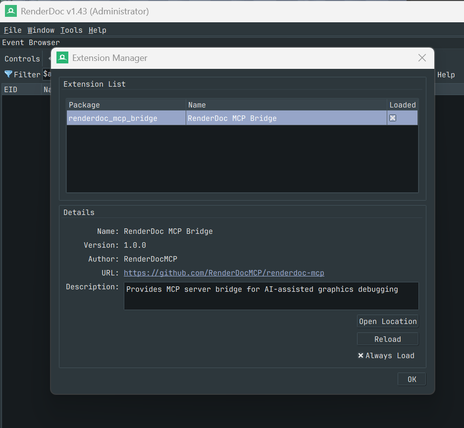
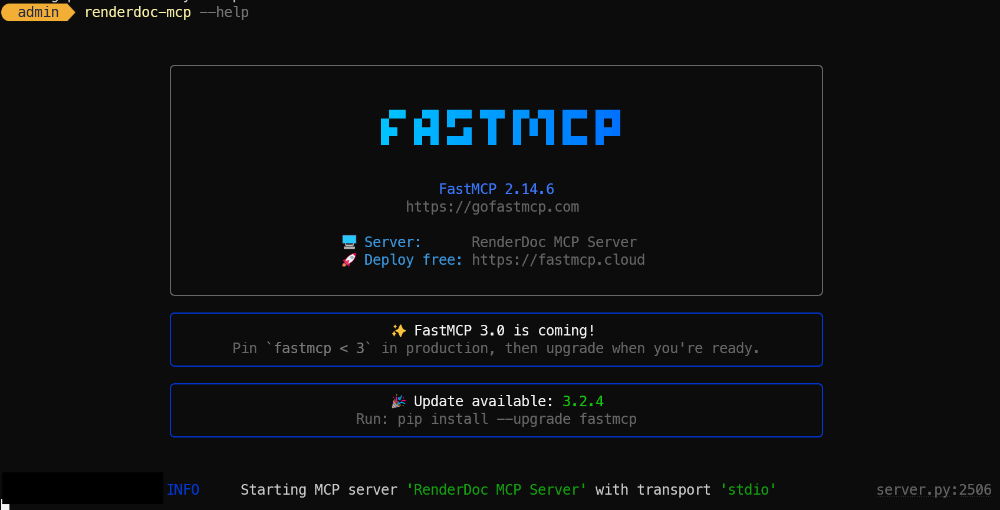

## 들어가며

RenderDoc은 GPU 프레임을 캡처해서 드로우콜 단위로 추적할 수 있는 강력한 그래픽스 디버깅 도구다. 하지만 캡처 하나를 열면 수백~수천 개의 드로우콜이 쏟아지고, 각 패스가 뭘 하는지 파악하려면 셰이더를 디컴파일해서 읽어야 하고, 그 셰이더가 어떤 렌더링 기법인지 이해하려면 또 다른 배경지식이 필요하다. 진입 비용이 상당하다.

[halby24/RenderDocMCP](https://github.com/halby24/RenderDocMCP)는 MCP(Model Context Protocol)를 통해 AI가 RenderDoc을 직접 제어하고 데이터를 읽을 수 있게 해주는 프로젝트다. AI에게 프레임 분석을 요청하면, AI가 스스로 이벤트 목록을 탐색하고 셰이더를 디컴파일하고 각 패스의 역할을 정리해준다.

이 글에서는 RenderDocMCP의 아키텍처, 설치 방법, 그리고 실제 프레임 분석 워크플로우까지 다룬다.

> 참고: [techartnomad - RenderDoc MCP AI 프레임 분석 워크플로우](https://techartnomad.tistory.com/716) 글에서 Unity 환경에서의 실전 활용 사례를 확인할 수 있다.
{: .prompt-info }

## 아키텍처

RenderDocMCP는 세 계층으로 구성된다.

```
Claude / AI Client (stdio)
        │
        ▼
MCP Server Process (Python + FastMCP 2.0)
        │ File-based IPC (%TEMP%/renderdoc_mcp/)
        ▼
RenderDoc Process (Extension)
```

RenderDoc 내장 Python에는 `socket` 모듈이 없기 때문에, MCP 서버와 RenderDoc 확장 기능 사이의 통신은 파일 기반 IPC(`%TEMP%/renderdoc_mcp/`)로 이루어진다.

핵심 구성 요소는 다음과 같다.

- **MCP Server**: `renderdoc-mcp` 커맨드로 실행되는 Python 프로세스. FastMCP 2.0 기반이며, Claude 등 AI 클라이언트와 stdio로 통신한다.
- **RenderDoc Extension**: RenderDoc의 확장 기능으로 등록되어, MCP 서버가 요청한 캡처 데이터를 RenderDoc API를 통해 추출한다.
- **File-based IPC**: 두 프로세스 사이를 연결하는 중간 계층. 요청/응답을 파일로 주고받는다.

## 환경 요구사항

| 항목 | 요구사항 |
|------|----------|
| **Python** | 3.10+ |
| **RenderDoc** | 1.20+ |
| **uv** | Python 패키지 매니저 ([astral.sh/uv](https://docs.astral.sh/uv/)) |
| **OS** | Windows (검증 완료), Linux/macOS (미검증) |
| **Graphics API** | DirectX 11 (검증 완료), Vulkan/OpenGL (미검증) |

## 설치

### RenderDocMCP 저장소 클론

```bash
git clone https://github.com/halby24/RenderDocMCP.git
cd RenderDocMCP
```

### uv 설치 확인

```bash
uv --version
```

설치되어 있지 않다면:

```bash
# Windows (PowerShell)
powershell -ExecutionPolicy ByPass -c "irm https://astral.sh/uv/install.ps1 | iex"

# Linux / MacOS
curl -LsSf https://astral.sh/uv/install.sh | sh
```

### RenderDoc 확장 기능 설치

```bash
python scripts/install_extension.py
```

확장 기능은 아래 경로에 설치된다.

```
%APPDATA%\qrenderdoc\extensions\renderdoc_mcp_bridge
```
{: .filepath}

설치 후 RenderDoc에서 활성화해야 한다.

1. RenderDoc 실행
2. **Tools > Manage Extensions**
3. **"RenderDoc MCP Bridge"** 항목을 찾아서 활성화



### MCP 서버 설치

```bash
# 안정 버전 설치
uv tool install .

# 또는 개발 모드 (소스 수정 시 즉시 반영)
uv tool install --editable .
```

PATH 갱신 후 셸을 재시작한다.

```bash
uv tool update-shell
```

설치 확인:

```bash
renderdoc-mcp --help
```

위의 명령을 실행 후, 서버 정보가 출력되면 설치 완료다.



### MCP 클라이언트 설정

AI 클라이언트에 RenderDoc MCP 서버를 등록한다.

**Claude Code** — 프로젝트 루트의 `.mcp.json`:

```json
{
  "mcpServers": {
    "renderdoc": {
      "command": "renderdoc-mcp"
    }
  }
}
```

**Claude Desktop** — `claude_desktop_config.json`:

```json
{
  "mcpServers": {
    "renderdoc": {
      "command": "renderdoc-mcp"
    }
  }
}
```

## MCP 툴 목록

RenderDocMCP가 AI에게 제공하는 도구 목록이다. AI는 이 도구들을 조합해서 프레임을 분석한다.

| 툴 | 설명 |
|----|------|
| `get_capture_status` | 캡처 파일 로드 상태 확인 |
| `get_draw_calls` | 드로우콜 목록을 계층 구조로 조회 |
| `get_draw_call_details` | 특정 드로우콜의 상세 정보 조회 |
| `get_shader_info` | 셰이더 소스코드 및 상수 버퍼 값 조회 |
| `get_pipeline_state` | 특정 이벤트의 파이프라인 상태 조회 |
| `get_buffer_contents` | 버퍼 내용 조회 (Base64) |
| `get_texture_info` | 텍스처 메타데이터 조회 |
| `get_texture_data` | 텍스처 픽셀 데이터 조회 (Base64) |

### 사용 예시

```python
# 드로우콜 전체 목록 (하위 포함)
get_draw_calls(include_children=true)

# 특정 이벤트의 Pixel Shader 정보
get_shader_info(event_id=123, stage="pixel")

# 파이프라인 상태
get_pipeline_state(event_id=123)

# 텍스처 데이터 — 2D 텍스처의 mip 0
get_texture_data(resource_id="ResourceId::123")

# 큐브맵 특정 면 (0=X+, 1=X-, 2=Y+, 3=Y-, 4=Z+, 5=Z-)
get_texture_data(resource_id="ResourceId::456", slice=3)

# 버퍼 부분 읽기 — offset 256부터 512바이트
get_buffer_contents(resource_id="ResourceId::123", offset=256, length=512)
```

## 실전 워크플로우

전체 흐름은 다음과 같다.

### 1단계: 프레임 캡처

분석 대상 애플리케이션에서 RenderDoc으로 프레임을 캡처한다. UE5의 경우 에디터에서 RenderDoc 플러그인을 활성화하고 뷰포트에서 캡처하면 된다.

### 2단계: MCP 연결 확인

Claude Code(또는 Claude Desktop)에서 RenderDocMCP 연결 상태를 확인한다. 캡처 파일이 RenderDoc에 로드되어 있어야 AI가 데이터에 접근할 수 있다.

### 3단계: AI에게 분석 요청

프롬프트 예시:

```
RenderDocMCP 연결 확인 후, 현재 캡처된 프레임의 렌더링 파이프라인을 분석해줘.
```

AI는 `get_draw_calls`로 전체 이벤트 목록을 가져온 뒤, 주요 패스별로 `get_shader_info`, `get_pipeline_state` 등을 호출하면서 파이프라인 구조를 파악한다.

### 4단계: 심화 분석

특정 패스에 대해 더 깊게 들어가고 싶으면 추가 지시를 한다.

```
이벤트 ID 245의 셰이더를 디컴파일해서 어떤 라이팅 모델을 쓰는지 분석해줘.
```

```
Shadow Map 패스에서 사용하는 텍스처 포맷과 해상도를 확인해줘.
```

## 트러블슈팅

### `renderdoc-mcp` 명령어를 찾을 수 없는 경우

`uv tool update-shell` 실행 후 셸 재시작. 그래도 안 되면 직접 PATH에 추가한다.

```bash
# Linux/macOS
export PATH="$HOME/.local/bin:$PATH"

# Windows PowerShell
$env:PATH = "$env:USERPROFILE\.local\bin;$env:PATH"
```

### RenderDoc에서 확장 기능이 보이지 않는 경우

`install_extension.py`를 다시 실행한 뒤 RenderDoc을 재시작한다.

### MCP 서버와 RenderDoc이 통신하지 않는 경우

- RenderDoc에서 확장 기능이 활성화되어 있는지 확인
- `%TEMP%\renderdoc_mcp\` 디렉토리가 존재하는지 확인
- RenderDoc에 캡처 파일이 로드되어 있는지 확인

## 마무리

RenderDocMCP는 그래픽스 디버깅의 진입 장벽을 크게 낮춰주는 도구다. 셰이더 디컴파일 결과를 직접 읽고 해석하는 대신, AI에게 맥락을 넘기고 구조적인 분석을 받을 수 있다.

다만 AI가 분석한 결과를 그대로 신뢰하기보다는, AI가 정리해준 구조를 기반으로 직접 검증하는 습관이 중요하다. AI는 분석의 출발점을 잡아주는 역할이고, 최종 판단은 본인이 해야 한다.

## 참고 자료

- [halby24/RenderDocMCP — GitHub](https://github.com/halby24/RenderDocMCP)
- [techartnomad — RenderDoc MCP AI 프레임 분석 워크플로우](https://techartnomad.tistory.com/716)
- [RenderDoc 공식 문서](https://renderdoc.org/docs/)
- [MCP(Model Context Protocol) 공식 사이트](https://modelcontextprotocol.io/)
