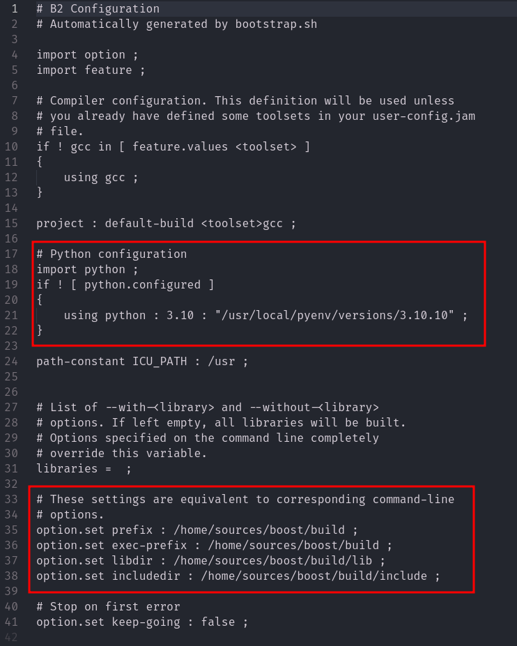
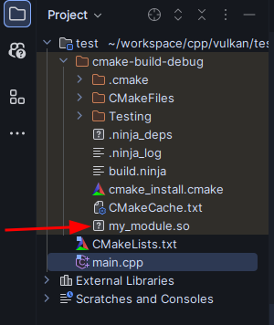
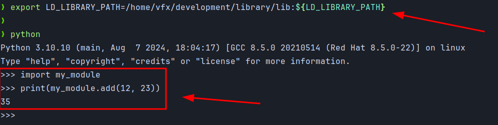
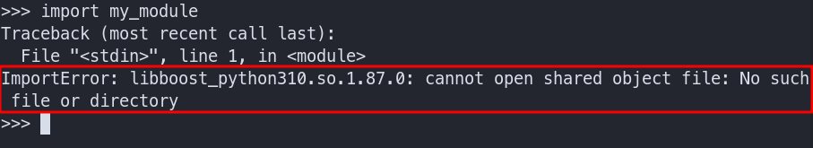
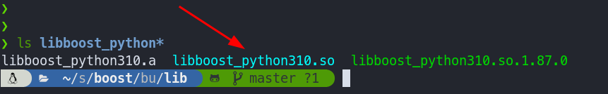
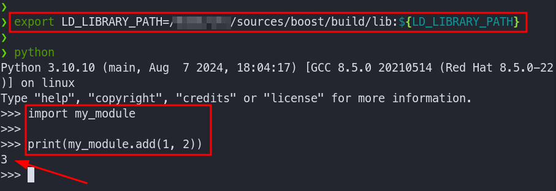

## Summary

`Boost`를 이용하여 `C++`함수를 `Wrapping`하여 `.pyd`로 만들어, `Python`에서 사용하는 일이 생겼다. 그래서 이곳에 정리하면서 진행한다.

`Boost Python Library`는 `Python`과 `C++`를 인터페이스하기 위한 프레임워크이다. 이를 사용하면 특별한 도구 없이 `C++` 컴파일러만 사용하여 `C++` 클래스 함수와 개체를 `Python`에 빠르고 원활하게 노출할 수 있으며 그 반대의 경우도 마찬가지이다. 

`C++` 인터페이스를 방해하지 않게 `wrapping`하도록 설계되었으므로 `wrapping`하기 위해 `C++` 코드를 전혀 변경할 필요가 없으므로, `Boost.Python`은 타사 라이브러리를 `Python`에 노출하는 데 이상적이다. 

라이브러리는 고급 메타프로그래밍 기술을 사용하여 사용자를 위한 구문을 단순화하므로  `wrapping code`는 일종의 선언적 인터페이스 정의 언어(`IDL`)처럼 보인다.

## Boost Python Library의 예

```cpp
char const* greet()
{
  return "Hello, World!";
}
```

`Boost.Python Wrapper`를 작성하여 `Python`에 노출시킬 수 있다.

```cpp
#include <boost/python.hpp>

BOOST_PYTHON_MODULE(hello_ext)
{
  using namespace boost::python;
  def("greet", greet);
}
```

끝이다! 이제 이것을 `공유 라이브러리 (shared library)`로 만들 수 있다. 만들어진 `DLL`은 이제 `Python`에서 나타난다. 

다음은 `Python`에서 활용하는 예이다.

```python
import hello_ext

print(hello_ext.greet())

# 결과
# Hello, World!
```

[boost python](https://www.boost.org/doc/libs/1_85_0/libs/python/doc/html/tutorial/index.html)이 무엇인지 더 궁금하다면 공식 사이트를 참조하면 된다.

## 개발 환경

- `OS`
  - RockyLinux 9
- `Compiler`
  - gcc 11.2.1
- `Boost Library`
  - 1.86.0
- `Python`
  - 3.10

## Python

우선 [Python](https://www.python.org/downloads/windows/)을 설치해야 한다. 나는 [pyenv](https://github.com/pyenv/pyenv)로 설치했다.

### Python 환경 확인

`Boost` 빌드에서 사용할 `Python`의 경로와 버전을 확인한다.

```terminal
python3 -c "import sys; print(sys.executable)"
python3 -c "import sysconfig; print(sysconfig.get_path('include'))"
python3-config --ldflags
```

이 정보들은 `Python`읜 설치 경로, 헤더 파일, 라이브러리 위치를 파악하는 데 도움이 된다.

## Boost

[Boost Library](https://www.boost.org/)를 다운 받은 후 압축 해제를 진행한다.

혹은 `git`을 이용하여 다운 받아도 된다.

```terminal
git clone --recurse-submodules https://github.com/boostorg/boost.git
cd boost
# 서브 모듈 최신으로 업데이트
git submodule update --init --recursive
```

그 후, 터미널을 실행 한후 다음의 명령을 수행한다.

```terminal
./bootstrap.sh --with-python=python3.10 --prefix=/home/sources/boost/build
```

위의 명령을 수행하면 `b2`, `project-config.jam` 파일이 생성된다. 

### project-config.jam 

위의 명령을 수행하면 다음과 같은 상태일 것이다. 경로가 확실하게 맞는지 체크하자.



`3.10`는 `python`의 버전이다. 그리고 `python` 설치 경로를 입력해준다.

해당 설정을 완료했다면 `b2`를 실행할 차례이다.

```terminal
# 만약 python만 빌드하고 싶다면 다음과 같이 수행한다.
./b2 install --prefix=/home/sources/boost/build --with-python -j$(nproc)

# 만약 "모든 라이브러리"를 빌드하고 싶다면 다음과 같이 수행한다.
./b2 install --prefix=/home/sources/boost/build -j$(nproc)
```

참고로, 시간이 조금 걸린다... ⏳

온전하게 실행이 완료되었다면, `/home/sources/boost/build` 경로에 `lib`, `include`, `share` 디렉토리가 생성되었을 것이다.

## 환경 변수 설정 [option]

`boost`의 설치 위치를 시스템에서 인식할 수 있도록 환경 변수를 설정한다. `.terminalrc`나 `.zshrc` 파일에 다음을 추가한다.

```terminal
export LD_LIBRARY_PATH=<boost 빌드 경로>/lib:${LD_LIBRARY_PATH}
```

## Boost.Python을 사용한 C++ 코드

```cpp
// main.cpp

#include <boost/python.hpp>

using namespace boost::python;

int add(int a, int b)
{
    return a + b;
}

BOOST_PYTHON_MODULE(my_module)
{
    def("add", add);
}
```

위의 코드를 해석하면 다음과 같다.

### Boost.Python 헤더 파일

`C++` 코드에서 `Boost.Python` 헤더를 포함시킨다.

```cpp
#include <boost/python.hpp>

using namespace boost::python
```

### C++ 함수 정의 및 Wrapping

`Python`에서 호출할 수 있는 `C++` 함수를 정의하고 이를 `wrapping` 한다.

```cpp
int add(int a, int b)
{
    return a + b;
}

BOOST_PYTHON_MODULE(my_module)
{
    def("add", add);
}
```

- `BOOST_PYTHON_MODULE`
  - `C++` 코드를 `Python` 모듈로 `wrapping`하는 매크로이다.
- `add`
  - `Python`에서 사용할 함수의 이름이다.
  - `add` 함수는 실제 `C++` 함수이다.

### C++ 코드 컴파일

`C++` 코드를 컴파일하여 `Python` 모듈을 생성해야 한다. 컴파일할 때, `Boost`와 `Python` 라이브러리를 링크해야 한다. 다음은 `g++`를 사용하여 컴파일하는 명령이다.

```terminal
g++ -I/home/sources/boost/build/include -I/usr/local/pyenv/versions/3.10.10/include/python3.10 -L/home/sources/boost/build/lib -lboost_python310 -shared -fPIC main.cpp -o my_module.so
```

- `-I` 옵션 (Include)
  - `Boost` 헤더 파일과 `Python` 헤더 파일의 경로를 지정
- `-L` 옵션 (Library)
  - `Boost` 라이브러리 경로를 지정
- `-lboost_python310` (link)
  - `Boost.Python` 라이브러리를 링크
  - `310`은 Python 버전
- `-shared -fPIC`
  - 공유 라이브러리를 생성하기 위한 옵션
- `main.cpp`
  - 컴파일할 C++ 소스 파일
- `my_module.so`
  - 생성된 `Python` 모듈

## 🎆 CMake로 라이브러리 생성 (with CLion)

```cpp
// main.cpp

#include <boost/python.hpp>
#include <iostream>

using namespace boost::python;

int add(int a, int b){
    return a + b;
}

BOOST_PYTHON_MODULE(my_module){
    def("add", add);
}
```

```cmake
// CMakeLists.txt

cmake_minimum_required(VERSION 3.29)
project(my_module)

set(CMAKE_CXX_STANDARD 17)
option(Boost_DEBUG "Enable verbose output from Boost" ON)

# python 라이브러리 경로 찾기
find_package(Python3 REQUIRED COMPONENTS Development)

# boost 라이브러리 설정
list(APPEND CMAKE_PREFIX_PATH "/home/vfx/development/library")
set(BOOST_ROOT "/home/vfx/development/library")
set(BOOST_INCLUDEDIR "/home/vfx/development/library/include")
set(BOOST_LIBRARYDIR "/home/vfx/development/library/lib")
set(Boost_NO_SYSTEM_PATHS ON)

set(Boost_USE_STATIC_LIBS OFF)
set(Boost_USE_MULTITHREADED ON)
set(Boost_USE_STATIC_RUNTIME OFF)

find_package(Boost 1.82.0 REQUIRED COMPONENTS python310)

# 공유 라이브러리 생성
add_library(${PROJECT_NAME} SHARED main.cpp)

target_include_directories(${PROJECT_NAME} PRIVATE
        ${Boost_INCLUDE_DIRS}
        ${Python3_INCLUDE_DIRS}
)
target_link_libraries(${PROJECT_NAME} PRIVATE
        ${Boost_LIBRARIES}
        ${Python3_LIBRARIES}
)

# Python 모듈 이름 지정
set_target_properties(${PROJECT_NAME} PROPERTIES PREFIX "")
```

빌드를 하면, 아래와 같이 잘 나온 것을 확인할 수 있다.



그리고 생성된 곳에서 Python 인터프리터를 생성해서 확인해보면 결과가 잘 나오는 것을 볼 수 있다.



## Python에서 모듈 사용

컴파일이 완료되면, `Python` 스크립트에서 해당 모듈을 임포트하여 사용할 수 있다.

그러기 위해서는 `my_module.so`파일이 `Python` 스크립트가 위치한 경로나 `PYTHONPATH`에 존재해야 한다.

> **⚠️ 주의 사항**
>
> `Boost.Python`을 사용할 때, 컴파일러와 `Python` 해석기(인터프리터)의 `ABI (Application Binary Interface)`가 일치해야 한다. 즉, 동일한 컴파일러 버전과 동일한 Python 버전을 사용해야 한다.
>
> 또한, `Python` 버전에 맞는 `Boost.Python` 라이브러리를 사용해야 한다. 예를 들어, `Python3.10`을 사용한다면 `libboost_python310.so` 라이브러리가 필요하다.
{: .prompt-warning }

```python
import my_module
```

다음과 같이 에러가 발생할 수 있다.



이것은 `Python`이 해당 라이브러리를 찾을 수 있는 경로에 존재하지 않음을 의미한다. 

먼저, `Boost.Python`이 제대로 설치되었는지 확인해보자. `Boost`를 설치한 경로에 `libboost_python310.so` 파일이 있는지 확인한다.



만약 `libboost_python310.so` 파일이 존재하지 않는다면, `Boost` 설치가 제대로 되지 않은 것이다. 다시 설치해야 한다.

해당 라이브러리가 존재한다면, `LD_LIBRARY_PATH` 환경 변수를 설정해야 한다.



`Python`에서 `my_module`을 불러와서 `add` 함수를 호출하는 모습이다. 잘 되는 것을 볼 수 있다. 😃

만약! 이렇게 해도 문제가 발생한다면 다음과 같은 경우를 의심해 봐야 한다.

- `Python 모듈 경로 확인`
  - `my_module`이 `libboost_python310.so`를 사용할 때, 해당 모듈이 올바르게 컴파일되어 있는지 확인.
  - `C++`에서 `Python` 모듈을 작성한 경우, `boost::python`을 포함하여 `Python`을 사용할 수 있는지 검토.
- `Python 버전 확인`
  - `Python` 버전과 `Boost.Python`이 일치하는지 확인.
  - (❗️) `libboost_python310.so`는 `Python 3.10` 전용이다. 만약 다른 버전의 `Python`을 사용하고 있다면, 해당 `Python` 버전에 맞는 `Boost.Python` 라이브러리를 설치해야 한다.
- `모듈 재컴파일`
  - 위의 모든 것을 확인했는데도 문제가 해결되지 않는다면, `my_module`을 다시 컴파일해 보자.
  - `CMakeLists.txt` 또는 `Makefile`에서 `Boost.Python` 라이브러리를 올바르게 링크하고 있는지 확인.

요약하자면 다음과 같다.

1. `Boost.Python` 라이브러리가 설치되어 있는지 확인
2. `LD_LIBRARY_PATH`를 설정하여 라이브러리 경로 추가
3. `Python` 모듈이 올바르게 컴파일되었는지 확인
4. 사용하는 `Python` 버전과 `Boost.Python`의 호환성 확인
5. `Python` 가상 환경에서 경로 설정 확인
6. 문제가 지속되면 모듈 재컴파일

이러한 단계를 따르면, `ImportError` 문제를 해결할 수 있을 것이다.
