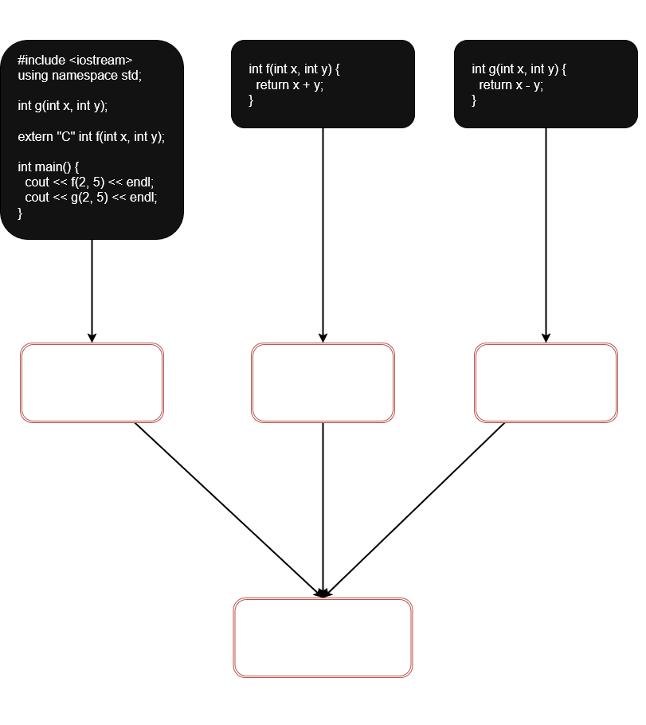
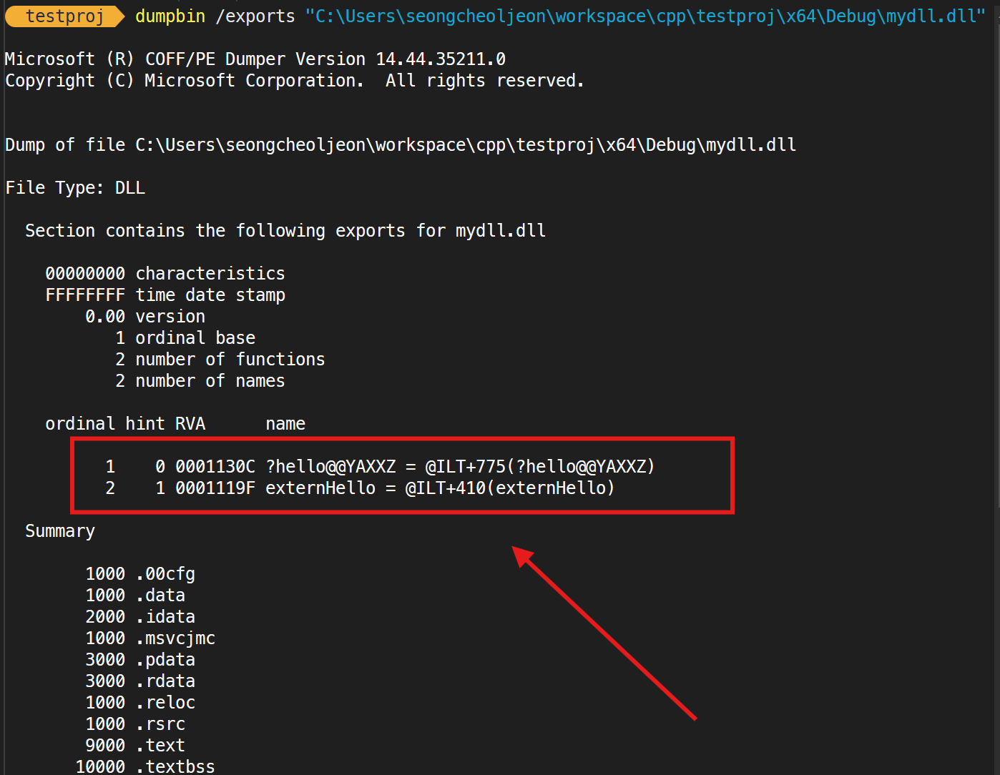

C언어의 역사가 오래된 만큼 C언어로 작성된 많은 라이브러리와 소스 코드가 존재하며, 지금도 C언어는 여러 분야에서 활발히 사용되고 있다. 현재 많은 C++ 프로그램 개발자들이 기존에 작성된 C 소스 코드를 이용하거나 C 라이브러리를 사용하고 있기 때문에, C++ 프로그램에서 C 코드를 연결하여 사용하는 방법을 알아둘 필요가 있다.
서로 다른 언어로 작성된 프로그램을 연결하여 사용하는 것은 어렵고 복잡하지만, ***C++ 언어는 C 언의 확장이기 때문에 상대적으로 쉽다.***

## C/C++ 컴파일러의 이름 규칙

모든 컴파일러는 소스 코드를 컴파일하여 `목적 코드(obj 파일)`를 만들 때, 소스 코드에 있는 `변수`, `함수`, `클래스`의 이름을 변형하여 저장한다. 이를 흔히 **`이름 규칙(naming mangling)`** 이라고 부른다. `C 컴파일러`와 `C++ 컴파일러`는 서로 다른 이름 규칙을 가지고 있다.

C언어와 C++언어의 이름 규칙을 제대로 알아야, C언어로 작성된 함수를 호출하거나 C 전역 변수를 사용하는 C++ 프로그램의 링킹을 제대로 이해할 수 있다. 다음은 `비주얼 C/C++`의 대한 이름 규칙이다.

### C 컴파일러의 이름 규칙

`C 컴파일러`는 C 소스 코드를 컴파일하여 `목적 코드(obj파일)`를 만들 때 함수 이름 앞에 `밑줄표시문자(_)`를 붙인다. 예를 들어 다음 C 함수를 컴파일한다고 해보자.

```c
int f(int x, int y)
int main()
```

C 컴파일러는 이 두 함수가 사용되는 C 소스 코드의 모든 곳에 다음과 같이 이름을 변경하여 목적 파일에 저장한다.

```
_f
_main
```

C 컴파일러의 이름 규칙은 매개 변수의 존재나 리턴 타입은 전혀 반영하지 않는다. 

> 📌 **C 언어에서 함수 중복이 불가능한 이유**
>
> C 언어에서 함수 중복이 불가능한 이유는 바로 ***C 컴파일러의 이름 규칙의 한계 때문이다.***
> `int f(int x)`나 `int f(int x, int y)` 함수 모두 매개 변수의 존재 여부와 관계없이 `_f`라는 이름으로 컴파일되어, 같은 이름의 함수 `_f`가 목적 코드에 2개 존재하게 되므로 컴파일 오류나 링크 오류가 발생한다.
{: .prompt-info }

### C++ 컴파일러의 이름 규칙

`C++ 컴파일러`의 이름 규칙은 `C 컴파일러`와 다르다. C++ 컴파일러는 목적 코드를 만들 때 ***함수의 매개 변수 개수와 타입, 리턴 타입 등을 참조*** 하여 복잡한 `기호`를 포함하는 이름을 붙인다.
이렇게 함으로써 `중복 함수(overloaded function)`들이 목적 파일 내에서 구분된다. 예를 들어 다음과 같은 이름의 C++ 함수가 있다고 해보자.

```cpp
int f(int x, int y)
int f(int x)
int f()
int main()
```

`C++ 컴파일러`는 이 4개의 함수들을 컴파일하여 목적 코드 내에 다음과 같은 이름을 붙인다.

```cpp
?f@@YAHHH@Z // int f(int x, int y)의 이름 f를 변환한 이름
?f@@YAXH@Z  // int f(int x)의 이름 f를 변환한 이름
?f@@YAHXZ   // int f()의 이름 f를 변환한 이름
_main       // int main()의 이름 main을 변환한 이름
```

3개의 f() 함수가 매개 변수 타입과 개수, 리턴 타입을 반영하여 서로 다른 이름으로 변형되어 있음을 알 수 있다. 그러나 예외적으로 `main()` 함수만은 항상 `_main`으로 이름을 붙인다. 

### C++ 프로그램에서 C 함수 호출시 링크 오류가 발생하는 경우

C 언어로 작성된 함수를 C++ 프로그램에서 그냥 호출하면 `링크 오류`가 발생한다. 그 이유는 위에서 설명한 바와 같이 `C`와 `C++` 컴파일러 사이의 **이름 규칙이 서로 다르기 때문**이다.

`C++ 컴파일러`는 `main.cpp`를 컴파일할 때, C++ 이름 규칙을 사용하여 함수 `f()`가 등장하는 모든 곳에 아래 이름으로 `main.obj`에 기록한다.

```
?f@@YAHHH@Z
```

한편, `f.c`는 `C 컴파일러`에 의해 컴파일되고, 함수 `f()`의 이름이 다음과 같이 `f.obj` 파일에 기록된다.

```
_f
```

이제, `main.obj`와 `f.obj`를 링킇갈 때, `링커`는 `main.obj`에서 호출하는 `?f@@YAHH@Z` 이름의 함수를 `f.obj`에서 발견할 수 없기 때문에 `링크 오류`를 발생시킨다.

> 📌 **이름 규칙의 표준**
>
> `이름 규칙(naming mangling)`에는 표준이 없다. 컴파일러마다 목적 코드에 함수의 이름을 붙이는 방법이 서로 다르다. 그러므로 서로 다른 컴파일러로 컴파일된 목적 파일들은 링크되지 않는다. 예를 들어 `볼랜드 C++`로 컴파일한 목적 코드를 `비주얼 C++`에서 작성한 목적 코드에서 링크하여 사용할 수 없다.
{: .prompt-tip }

--- 

## 정상적인 링킹, extern "C"

`C++ 컴파일러`에게 `main.cpp` 안의 등장하는 함수 `f()`가 `C 언어`로 작성된 것임을 알려주어, `f()` 이름에 대해서만 ***C 언어의 이름 규칙으로 컴파일*** 하도록 지시하면 `링크 오류`를 해결할 수 있다.

```cpp
extern "C" int f(int x, int y);
```

이 지시문에 의해 `C++ 컴파일러`는 함수 `f()`의 이름을 `C 이름 규칙`으로 `컴파일`한다.
만일 `C 언어`로 작성된 함수가 여러 개 있다면 다음과 같이 *묶어서 선언*해도 된다.

```cpp
extern "C" {
  int f(int x, int y);
  void g();
  char s(int []);
}
```

혹은 다음과 같이 여러 개의 `C 함수 원형`이 선언된 *헤더 파일을 통째로 지정*할 수 있다. 

👏 ** 실제로 `C++ 표준 라이브러리`의 헤더 파일은 이런 지시문을 많이 사용하고 있다.**

```cpp
extern "C" {
  #include "MyCLangFunc.h"
```

`extern "C"` 지시문을 사용하여 `C++` 프로그램에서 `C 함수`를 호출할 때 링크 오류가 발생하지 않는 코드 사례이다. 
아래 그림에서 `int f(int x, int y)`는 `f.c`에 작성된 `C 언어` 함수이므로, `main.cpp`에는 `int f(int x, int y)` 함수만을 `extern "C"`로 선언하였다. 그 결과 `main.obj`에는 `f()` 함수와 `g()` 함수의 이름이 각각 다음과 같이 컴파일 된다.

```
_f
?g@@YAHHH@Z
```

`링커`는 `main.obj`에서 찾고자 하는 함수 `_f`와 `?g@@YAHHH@Z`를 `f.obj`와 `g.obj`에서 정확히 찾을 수 있기 때문에, **링크가 성공적으로 이루어진다.**



---

다음의 예제를 보자.

```cpp
#include "pch.h"
#include <iostream>

using namespace std;

void __declspec(dllexport) hello()
{
    cout << "Hello World!" << endl;
}

extern "C"
{
    void __declspec(dllexport) externHello()
    {
        cout << "Hello World!" << endl;
    }
}
```

라이브러리를 빌드 후, [dumpbin](https://learn.microsoft.com/ko-kr/cpp/build/reference/dumpbin-reference?view=msvc-170)을 활용하여 `dll` 파일을 확인해 보면 아래와 같이 `extern "C"`와 그렇지 않은 함수 이름의 차이를 알 수 있다.



* `1`은 `extern "C"`를 적용하지 않은 함수로써 외부에서 호출하려면 `?hello@@YAXXZ`로 호출해야 한다.
* `2`는 `extern "C"`를 적용한 함수로써 `C언어` 환경에서처럼 `externHello` 함수 이름으로 호출이 가능하다.

실행파일을 만들어서 직접 확인해보자! `extern "C"`가 적용되지 않은 `hello()` 함수를 호출하면 아래의 결과와 같이 호출이 불가능하다. 그 이유는 `name mangling`이 적용된 함수이기 때문이다.

```cpp
#include <iostream>
#include <Windows.h>

using namespace std;

//typedef void (*helloPtr)();
using helloPtr = void(*)();

//typedef void (*externHelloPtr)();
using externHelloPtr = void(*)();


int main()
{
    HINSTANCE hInst;
    helloPtr helloFuncPtr;
    externHelloPtr externHelloFuncPtr;


    // library load
    hInst = LoadLibrary(L"C:\\Users\\seongcheoljeon\\workspace\\cpp\\testproj\\x64\\Debug\\mydll.dll");

    if (hInst == nullptr)
    {
        return 0;
    }

/* function load
    // 이것을 호출 가능!
    helloFuncPtr = (helloPtr)GetProcAddress(hInst, "?hello@@YAXXZ");

    // 아래는 name mangling으로 인하여, 함수 이름이 변경되어 hello 함수를 찾지 못하여 호출 불가!
*/
    helloFuncPtr = (helloPtr)GetProcAddress(hInst, "hello");

    if (helloFuncPtr == nullptr)
    {
        cout << "function load failed. <hello()>" << endl;
    }
    else
    {
        helloFuncPtr();
    }

    // extern "C"로 선언된 함수는 name mangling이 되지 않으므로, 아래와 같이 호출 가능!
    externHelloFuncPtr = (externHelloPtr)GetProcAddress(hInst, "externHello");

    if (externHelloFuncPtr == nullptr)
    {
        cout << "function load failed. <externHello()>" << endl;
    }
    else
    {
        externHelloFuncPtr();
    }

    // library unload
    FreeLibrary(hInst);

    return 0;
}

/* 결과
function load failed. <hello()>
Hello World!
*/
```

이번에는 `hello()` 함수가 name mangling이 진행된 이름으로 호출해 보자.

```cpp
#include <iostream>
#include <Windows.h>

using namespace std;

using helloPtr = void(*)();

using externHelloPtr = void(*)();


int main()
{
    HINSTANCE hInst;
    helloPtr helloFuncPtr;
    externHelloPtr externHelloFuncPtr;


    // library load
    hInst = LoadLibrary(L"C:\\Users\\seongcheoljeon\\workspace\\cpp\\testproj\\x64\\Debug\\mydll.dll");

    if (hInst == nullptr)
    {
        return 0;
    }

    helloFuncPtr = (helloPtr)GetProcAddress(hInst, "?hello@@YAXXZ");

    if (helloFuncPtr == nullptr)
    {
        cout << "function load failed. <hello()>" << endl;
    }
    else
    {
        helloFuncPtr();
    }

    // extern "C"로 선언된 함수는 name mangling이 되지 않으므로, 아래와 같이 호출 가능!
    externHelloFuncPtr = (externHelloPtr)GetProcAddress(hInst, "externHello");

    if (externHelloFuncPtr == nullptr)
    {
        cout << "function load failed. <externHello()>" << endl;
    }
    else
    {
        externHelloFuncPtr();
    }

    // library unload
    FreeLibrary(hInst);

    return 0;
}

/* 결과
Hello World!
Hello World!
*/
```

Mangled Name인 `?hello@@YAXXZ`로 호출하니까 정상적으로 `dll`에 구현된 `hello()` 함수가 호출되어 `Hello World!`가 출력되는 것을 확인해볼 수 있다.
