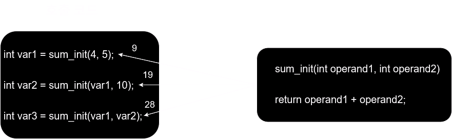
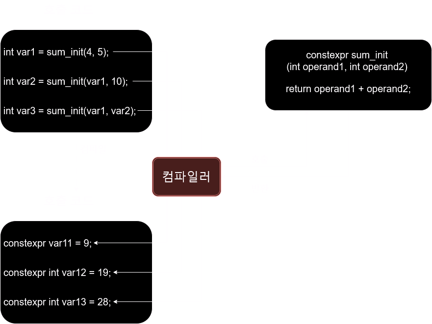

`모던 C++`에서는 변수나 함수를 `상수 표현식(constant express)`으로 만들어 주는 `constexpr` 키워드를 제공한다. `모던 C++`이전에도 변수를 변경할 수 없도록 상수로 지정하는 `const`가 있었지만, ***`constexpr`은 변수나 함수를 컴파일 타임에 상수 표현식으로 만들어 준다.***

> 함수가 `컴파일 시점`에 `상수 표현식`이 되면, `실행 시점`에 함수 호출이 이뤄지지 않고 `상수`로 대체된다.

## constexpr 변수 선언

변수에 `constexpr`을 사용하는 방법은 `const`와 매우 유사하다. `const` 변수처럼 값을 초기화한 후에 변경할 수 없다. 

`constexpr`로 선언한 변수를 변경하려고 시도하면, `const` 변수처럼 컴파일 오류가 발생한다. 다만, `const` 변수는 `런타임`에 결정되지만 `constexpr` 변수는 `컴파일 타임`에 결정된다.

> 값이 `컴파일 타임`에 결정된다는 것은 프로그램이 메모리에 적재되지 않더라도 소스 코드상에서 변수의 초기값이 결정돼야 한다는 의미이다.

다음 코드는 `const`와 `constexpr` 변수의 초기값이 결정되는 시점을 비교한 예이다. 잘못된 초기화 때문에 오류가 발생하는데, 그 원인을 확인해보자.

```cpp
// const와 constexpr의 초기값 결정 비교 (컴파일 오류)
#include <iostream>

using std::cout;
using std::endl;

void sum_int(int operand1, int operand2) {
    const int var11 = 10;
    const int var12 = operand1 + 10;
    const int var13 = operand2 + operand2;

    // 컴파일 에러
    constexpr int var15 = operand1 + 15;
    constexpr int var16 = operand1 + operand2;
}

int main()
{
    const int var1 = 10;
    const int var2 = var1 + 10;
    const int var3 = var1 + var2;
    constexpr int var4 = 20;
    constexpr int var5 = var1 + 15;
    constexpr int var6 = var1 + var4;

    sum_int(var1, var4);

    return 0;
}
```

`var1`~`var6`은 `main` 함수에서 초기화된 변수를 사용하므로 오른쪽 항이 모두 `리터럴`이지만, `sum_int` 함수의 매개변수인 `operand1`, `operand2`는 프로그램이 실행되어 함수가 호출(`메모리 적재`)돼야 값을 알 수 있으므로 **리터럴이 아니다.** 

> ***즉, `컴파일 타임`에 값이 결정돼야 하는 `constexpr` 변수를 `런타임`에 결정되는 값으로 초기화했으므로 컴파일 에러가 발생한다.***

이처럼 `constexpr` 변수를 사용할 때는 **초기값이 리터럴이어야 한다는 제약**에 주의해야 한다.

## constexpr 함수 선언

`const`와 `.constexpr` 키워드는 둘 다 변수를 상수로 만들어 주지만 **중요한 차이점**이 있다. 
`const`는 변수를 상수로 변환해 읽기만 가능하지만, `constexpr`은 변수를 상수 표현식으로 치환한다. 따라서 변수에 사용할 때는 별다른 차이가 없지만, 함수에 사용할 때는 큰 차이를 보인다.

`const 멤버 함수`의 예를 먼저 살펴보자. 클래스의 멤버 함수를 선언할 때 제일 뒤에 `const`를 추가하면 이 함수에서 멤버 변수를 변경할 수 없도록 강제한다. 그리고 `const 멤버 함수`는 `const 멤법 함수`만 호출할 수 있으며, 멤버 함수가 아닌 `전역 함수`는 `const 함수`로 만들 수 없다.

```cpp
// const 함수 예
class MyClass {
public:
  void set_foo(int foo) { this->foo = foo; }
  void set_bar(int bar) { this->bar = bar; }

  int get_foo() const {
    return foo;
  }

private:
  int foo = 50;
  int bar = 33;
};
```

반면에 `constexpr`은 함수 선언 가장 앞부분에 작성하며 클래스의 멤버 함수가 아닌 일반 함수에도 사용할 수 있다. 

> `constexpr 함수`는 `컴파일 타임`에 상수 표현식으로 치환된다.

```cpp
// constexpr 함수 예
constexpr int sum_int_constexpr(int operand1, int operand2) {
  return operand1 + operand2;
}
```

일반 함수 호출과 `constexpr 함수` 호출을 비교해 보자. 먼저 일반 함수 호출 과정을 그림으로 나타내면 다음과 같다. 그림을 보면 같은 함수를 다른 인자로 3번 호출하여 반환값을 전달받는다. 함수 호출은 함수가 적재된 메모리에 접근하는 여러 가지 복잡한 과정을 거치게 된다.



이번에는 `constexpr 함수`를 호출하는 과정을 그림으로 나타내면 다음과 같다.



만약 어떤 함수가 리터럴을 전달받고 같은 값에는 항상 같은 결과를 반환한다면 이 함수 호출문을 컴파일 타임에 상수 표현식으로 변경하더라도 동작에 아무런 지장이 없다. 따라서 `constexpr`로 선언된 함수를 호출할 때 리터럴을 전달하면 컴파일러가 상수 표현식으로 치환한다. 

> 함수 호출문이 상수 표현식으로 치환되면 컴파일 시간은 조금 더 걸려도 함수 호출에 필요한 절차가 생략되므로 실행 시간이 빨라진다.
{: .prompt-tip }

```cpp
#include <iostream>

using std::cout;
using std::endl;

int sum_int(int operand1, int operand2) {
    return operand1 + operand2;
}

constexpr int sum_int_constexpr(int operand1, int operand2) {
    return operand1 + operand2;
}

int main()
{
    int var1 = sum_int(1, 2);
    int var2 = sum_int(var1, 10);
    int var3 = sum_int(var1, var2);

    constexpr int var11 = sum_int_constexpr(1, 2);
    constexpr int var12 = sum_int_constexpr(var11, 10);
    constexpr int var13 = sum_int_constexpr(var11, var12);

    return 0;
}
```

함수 호출문이 정말로 상수 표현식으로 치환되는지, `constexpr`로 선언된 함수를 호출하는 과정을 `어셈블리어`로 확인해 보면 다음과 같다. 
var1 변수에 반환값을 대입하는 sum_int 함수 호출문은 함수의 주소로 이동해서 실행하지만, var11 변수에는 값 9가 `상수 표현식`으로 직접 대입되는 것을 알 수 있다.

```cpp
int var1 = sum_int(1, 2);
  mov 	edx,2
  mov 	ecx,1
  call 	sum_int (07FF782B910E17)
  mov 	dword ptr [var1],eax
    
constexpr int var11 = sum_intconstexpr(1, 2);
  mov 	dword ptr [var11],9
```

컴파일 타임에 `상수 표현식`으로 치환되려면, 함수에 전달하는 인자와 함수가 반환하는 값은 반드시 `리터럴`이어야 한다. 생성자 함수도 이와 같은 방법으로 사용할 수 있다.

`constexpr 함수`의 `제약 조건`은 다음과 같다.

- 함수의 인자와 반환값 모두 리터럴 형식이어야 한다.
- 재귀 함수에 적용할 수 있다. 하지만 `가상 함수`에는 적용할 수 없다.
- try~cache, goto 구문을 사용할 수 없다.
- if와 switch, 범위 기반 for 문 등 모든 반복 구문을 사용할 수 있다.
- 지역 변수는 반드시 초기화하거나 리터럴 형식이어야 한다. `정적 변수`는 허용하지 않는다.

> `constexpr` 대신 `const`나 `#define`으로 정의하는 것이 더 편할까?
>
> `constexpr`과 `const`, `#define`은 사용 목적이 다르다. 
> `#define`으로 정의된 값은 의미 있는 이름으로 가독성을 높이기 위한 것이며, 변수나 상수에 적용할 수 있다. `const` 역시 고정된 값을 쉽게 활용하거나 변경할 수 없게 하는 역할을 한다.
>
> 반면에 `constexpr`은 값을 고정한다는 개념보다는 `컴파일 타임`에 소스 코드에 맞는 고정된 값을 정의하여 **함수 호출이나 변수값의 계산 시간을 줄여 주는 문법이다.**
{: .prompt-info }
