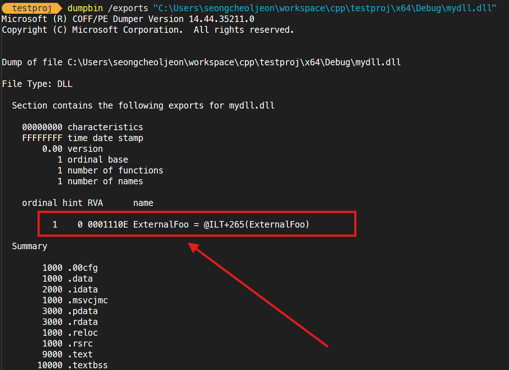
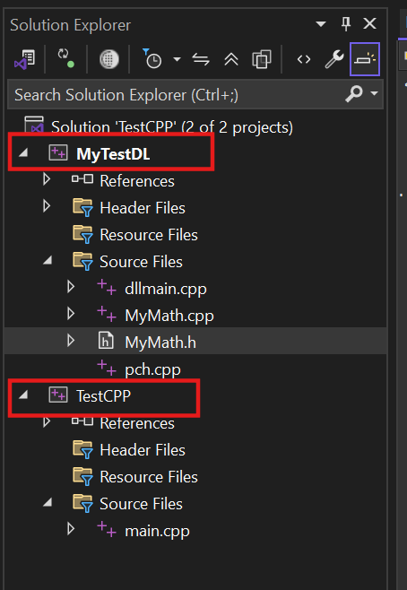
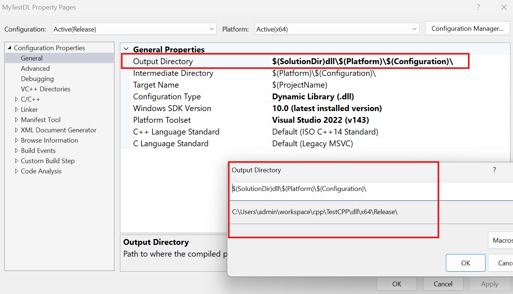
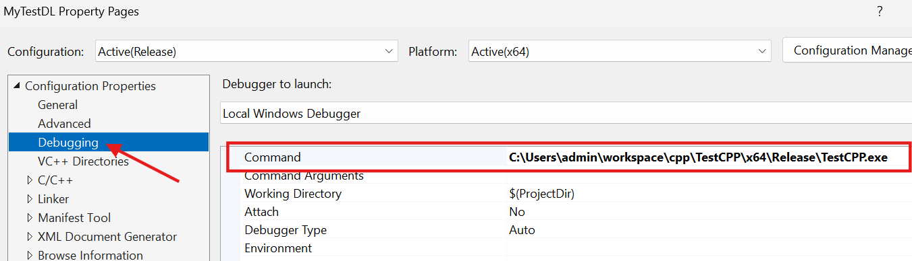
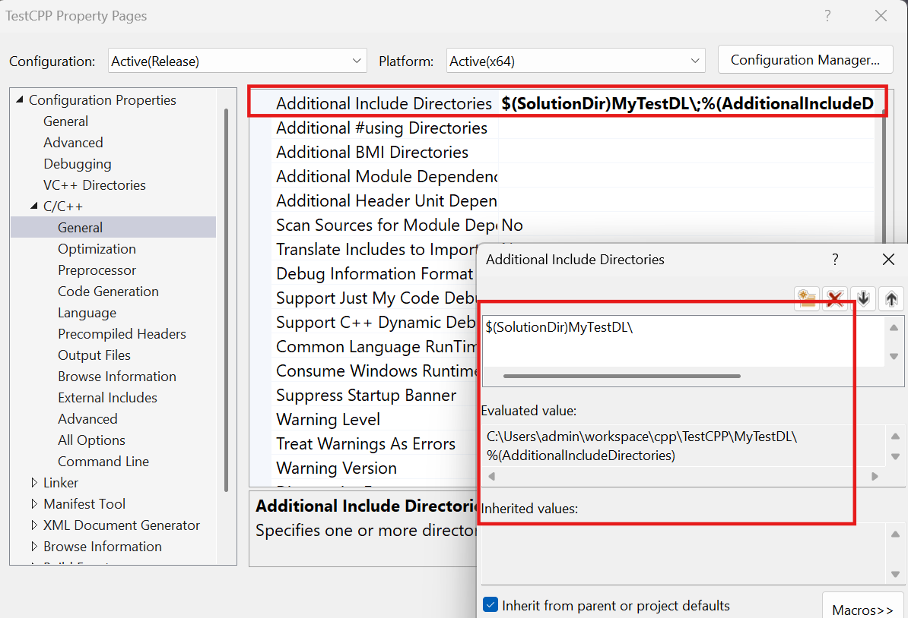
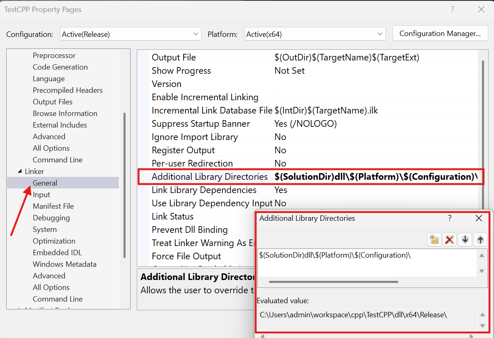
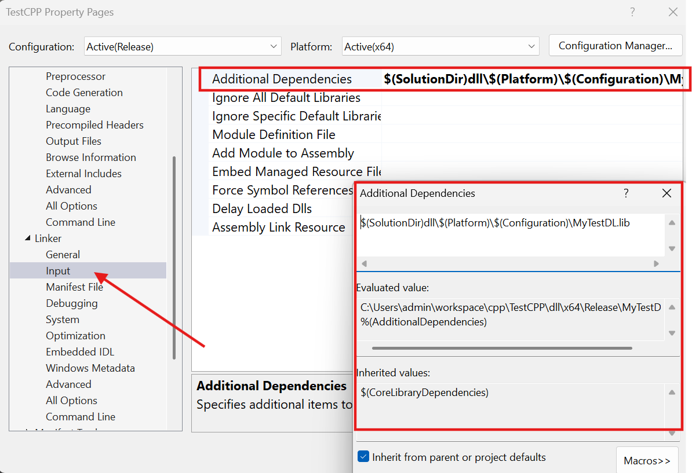
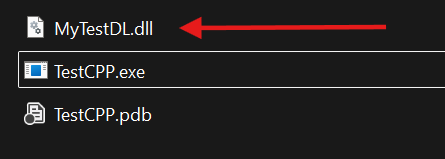
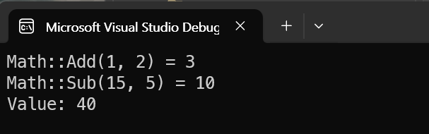

## Dynamic Library (dll) - dllexport / dllimport (MSVC)

`__declspec(dllexport)`와 `__declspec(dllimport)`는 `MSVC(Microsoft Visual C++)` 컴파일러에서 사용하는 키워드이다. `동적 라이브러리(dynamic library)`에서 `클래스`나 `메서드`, `변수`를 내보내거나 가져올 때 사용된다.

> `gcc`나 `clang`에서는 `__attribute__((visibility("default"))) 사용

```cpp
#pragma onece

#if defined(_WIN32) || defined(_WIN64)
  #ifdef MYLIB_EXPORTS
    #define MYLIB_API __declspec(dllexport)
  #else
    #define MYLIB_API __declspec(dllimport)
#elif defined(__linux__) || defined(__APPLE__)
  #ifdef MYLIB_EXPORTS
    #define MYLIB_API __attribute__((visibility("default")))
  #else
    #define MYLIB_API
  #endif
#else
  #define MYLIB_API
#endif
```

간단하게 말하면, `라이브러리`에서 `dll`을 빌드할 때는 `__declspec(dllexport)` 키워드를 클래스 이름이나 메서드 원본 앞, 멤버 변수 앞 등에 붙여서 해당 내용을 외부에서 사용하도록 내보내겠다 라는 의미이다.
반대로, `__declspec(dllimport)`는 라이브러리의 내용을 해당 프로젝트에서 사용할 것이라는 의미로 사용한다.

```cpp
#pragma once

#define MYDLL_EXPORT

#ifdef MYDLL_EXPORT
  #define MYDLL_API __declspec(dllexport)
#else
  #define MYDLL_API __declspec(dllimport)
#endif

class MYDLL_API Math
{
public:
	static int Add(const int a, const int b)
	{
		return a + b;
	}

	static int Sub(const int a, const int b)
	{
		return a - b;
	}
};
```

`동적 라이브러리` 프로젝트에서는 `MYDLL_EXPORT`를 선언해주어, `__declspec(dllexport)`로 사용하면 되고, `동적 라이브러리`를 사용하는 프로젝트에서는 이 헤더 파일을 `__declspec(dllimport)`로 사용하면 된다.

> 참고로, `dll`은 실행파일에 포함되지 않으므로 프로그램을 실행할 때 반드시 필요하다. `동적 라이브러리`는 `런타임` 때 `동적`으로 `로드` 된다는 것을 기억하자.
>
> `dll 파일` 경로를 잡아주지 않는 한, 기본적으로 `실행 파일`과 `dll 파일`은 서로 같은 경로에 있어야 한다.

## __declspec(dllexport)

`DLL (동적 라이브러리)`에 구현한 함수를 **외부에 노출** 시키려면 `__declspec(dllexport)` 키워드를 사용해야 한다.

`__declspec(dllexport)` 키워드가 붙지 않은 함수는 외부에서 호출할 수 없다.

> **[__declspec(dllimport/dllexport) 공식 문서](https://learn.microsoft.com/ko-kr/cpp/cpp/dllexport-dllimport?view=msvc-170&redirectedfrom=MSDN)**

다음의 예제를 보자.

```cpp
#include "pch.h"
#include <iostream>

using namespace std;

extern "C"
{
    void InternalFoo()
    {
        cout << "[InternalFoo] Hello World!" << endl;
    }

    void __declspec(dllexport) ExternalFoo()
    {
        cout << "[ExternalFoo] Hello World!" << endl;
    }
}
```

라이브러리 프로젝트를 빌드 후, [dumpbin](https://learn.microsoft.com/ko-kr/cpp/build/reference/dumpbin-reference?view=msvc-170)을 이용하여 `dll` 파일을 확인해보자 아래와 같이 `__declspec(dllexport)` 키워드 선언이 된 함수만 **외부에 노출** 된 것을 볼 수 있다.



해당 라이브러리를 불러와서 실행하는 프로그램을 간단히 만들어 확인해보자. 

```cpp
#include <iostream>
#include <Windows.h>

using namespace std;

using InternalFoo = void(*)();
using ExternalFoo = void(*)();

int main()
{
    HINSTANCE hInst;
    InternalFoo internalFooPtr;
    ExternalFoo externalFooPtr;

    // library load
    hInst = LoadLibrary(L"C:\\Users\\seongcheoljeon\\workspace\\cpp\\testproj\\x64\\Debug\\mydll.dll");

    if (hInst == nullptr)
    {
        return 0;
    }

    // function load
    internalFooPtr = (InternalFoo)GetProcAddress(hInst, "InternalFoo");
    externalFooPtr = (ExternalFoo)GetProcAddress(hInst, "ExternalFoo");

    if (internalFooPtr == nullptr)
    {
        cout << "[InternalFoo] function not found!" << endl;
    }
    else
    {
        internalFooPtr();
    }

    if (externalFooPtr == nullptr)
    {
        cout<< "[ExternalFoo] function not found!" << endl;
    }
    else
    {
        externalFooPtr();
    }

    // library unload
    FreeLibrary(hInst);

    return 0;
}

/* 결과
[InternalFoo] function not found!
[ExternalFoo] Hello World!
*/
```

결과를 확인해보면, `__declspec(dllexport)` 키워드가 선언된 함수만 사용 가능 한 것을 볼 수 있다.

## __declspec(dllimport)

라이브러리를 개발한다면, 라이브러리 함수를 외부로 배출(`export`)해야 하므로, 아래의 헤더처럼 `__declspec(dllexport)`로 함수를 선언하고 소스에서 정의할 수 있다.

```cpp
// [library_header.h]
static bool __declspec(dllexport) Function();
```

```cpp
// [library_source.cpp]
#include "library_header.h"
bool Function() { }
```

하지만 위의 헤더를 라이브러리 개발 프로젝트가 아닌 외부 프로젝트에서 활용할 때는, 외부 프로젝트 입장에서 라이브러리 함수를 `import` 해야 하므로 `dllimport` 개념이 적용되어야 한다.

의도에 따라 `import` 또는 `export`로 변경할 수 있어야 한다. 즉, 
`DLL_EXPORTS`가 존재하는 경우는 `DLL_API`를 `__declspec(dllexport)`로 정의하고,
`DLL_EXPORTS`가 존재하지 않는 경우는 `DLL_API`를 `declspec(dllimport)`로 정의한다.
마지막으로 함수 선언에 `__declspec(dllimport/dllexport)` 대신 `DLL_API`를 작성한다.

```cpp
// [library_header.h]

#ifdef DLL_EXPORTS
#define DLL_API __declspec(dllexport)
#else
#define DLL_API __declspec(dllimport)
#endif

static bool DLL_API Function();
```

소스파일에서는 `#define DLL_EXPORTS`로 `DLL_EXPORTS`를 `true`로 설정하여 `__declspec(dllexport)`가 작동하게 한다.

```cpp
// [library_source.cpp]

#define DLL_EXPORTS
#include "library_header.h"

bool DLL_API Function() { }
```

외부 프로젝트에서 라이브러리를 사용할 때 `헤더`를 가져오게 되면, 해당 소스에서는 `DLL_EXPORTS`가 정의되어 있지 않아 `DLL_EXPORTS`가 `false`인 상태이므로, `__declspec(dllimport)`가 작동하게 된다.

```cpp
// [project.cpp]
#include "project.h"
#include "library_header.h"

void main()
{
  Function();
}
```

---

## __declspec(dllimport), __declspec(dllexport) 예제

간단한 예제를 통해 더 자세히 알아보자.

{: width="400" }

* MyTestDL : 동적 라이브러리(dll) 프로젝트
* TestCPP : main 함수가 존재하는 exe 실행 파일 프로젝트

### 동적 라이브러리 프로젝트 설정

* `.dll` 파일이 생성되어지는 디렉토리 설정


* 만약 `디버깅`을 할 예정이면, 아래 그림처럼 실행파일을 설정한다.


다음은 라이브러리의 코드 내용이다.

```cpp
// [MyMath.h]
#pragma once

#include <iostream>

#ifdef MYDLL_EXPORTS
#define MYDLL_API __declspec(dllexport)
#else
#define MYDLL_API __declspec(dllimport)
#endif


class Math
{
public:
	MYDLL_API static int Add(const int a, const int b);
	MYDLL_API static int Sub(const int a, const int b);
};


class MYDLL_API MyClass
{
public:
	explicit MyClass();
	~MyClass() = default;
	void Print() const;

private:
	int val;
};
```

```cpp
[MyMapth.cpp]

#include "pch.h"

#define MYDLL_EXPORTS    // 중요!! 여기서 dllexport 혹은 dllimport 결정.
#include "MyMath.h"


MYDLL_API int Math::Add(const int a, const int b)
{
	return a + b;
}

MYDLL_API int Math::Sub(const int a, const int b)
{
	return a - b;
}

MyClass::MyClass()
	: val(rand() & 1000)
{
}

void MyClass::Print() const
{
    std::cout << "Value: " << val << std::endl;
}
```

빌드하여 `.dll` 파일 생성을 한다.

### 실행 파일 프로젝트 설정

* `.dll` 파일의 `header` 파일 경로 설정


* `.dll` 파일이 존재하는 디렉토리 경로 설정


* `링킹`을 위한 `.lib` 파일 설정


다음은 실행 파일 프로젝트의 코드이다.

```cpp
#include <iostream>
#include <Windows.h>

#include "MyMath.h"

using namespace std;


int main()
{
	auto add = Math::Add(1, 2);
	cout << "Math::Add(1, 2) = " << add << endl;

	auto sub = Math::Sub(15, 5);
	cout << "Math::Sub(15, 5) = " << sub << endl;

	MyClass obj;
	obj.Print();

	return 0;
}
```

빌드 후, `dll` 파일을 찾을 수 없다고 나온다면 `실행 파일`이 존재하는 디렉토리에 빌드한 `dll`파일을 복사 후 실행하면 잘 될 것이다.



이제 실행을 해보면, 다음과 같이 라이브러리를 호출한 것을 볼 수 있다.


