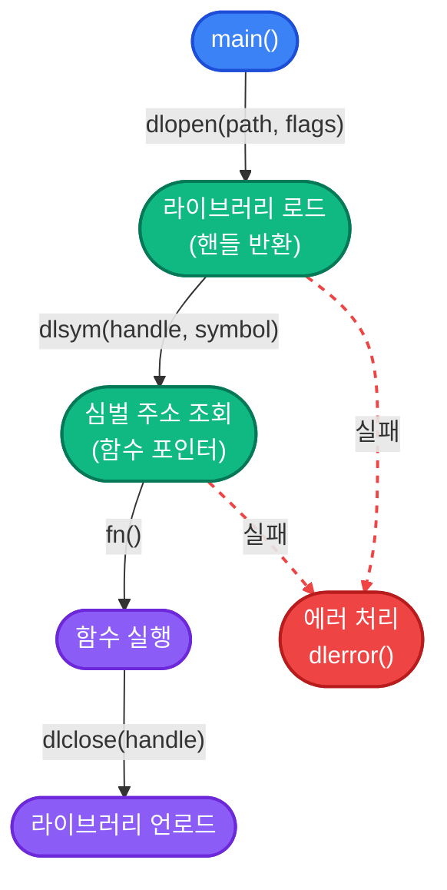

## 📌 묵시적 링킹 vs 명시적 링킹

동적 라이브러리를 사용하는 방법에는 두 가지가 있다.

| 구분 | 묵시적 링킹 (Implicit Linking) | 명시적 링킹 (Explicit Linking) |
|:----:|:------------------------------:|:------------------------------:|
| 로드 시점 | 프로그램 시작 시 OS가 자동 로드 | 코드에서 명시적으로 `dlopen()` 호출 |
| 컴파일 방법 | `gcc -l<이름>` | 링크 옵션 불필요 (`-ldl` 만 추가) |
| 라이브러리 부재 시 | 프로그램 시작 실패 | 런타임에 에러 처리 가능 |
| 사용 사례 | 일반적인 라이브러리 의존성 | 플러그인, 조건부 기능 로드 |

**명시적 링킹**은 `dlopen` / `dlsym` / `dlclose` API를 사용하며,  
실행 중에 라이브러리를 동적으로 로드하고 언로드할 수 있다.  
**플러그인 시스템**, **모듈형 아키텍처**, **스크립트 언어의 C 확장** 등에서 핵심적으로 사용된다.

> Windows에서는 `LoadLibrary` / `GetProcAddress` / `FreeLibrary` 가 동일한 역할을 한다.  
> 이 포스트의 후반부에서 Windows 대응 코드를 다룬다.
{: .prompt-info }

---

## 🔧 POSIX API: `dlfcn.h`

```cpp
#include <dlfcn.h>
```

컴파일 시 반드시 `-ldl` 옵션을 추가해야 한다.

```terminal
gcc main.c -ldl -o main.out
```

### API 개요

| 함수 | 시그니처 | 설명 |
|------|----------|------|
| `dlopen` | `void* dlopen(const char* filename, int flags)` | 라이브러리 로드. 핸들 반환 |
| `dlsym` | `void* dlsym(void* handle, const char* symbol)` | 심벌(함수/변수) 주소 조회 |
| `dlclose` | `int dlclose(void* handle)` | 라이브러리 언로드 |
| `dlerror` | `char* dlerror()` | 마지막 에러 메시지 반환 |

---

## 📂 `dlopen` — 라이브러리 로드

```cpp
void* handle = dlopen("libcalories.so", RTLD_LAZY);
if (!handle) {
    fprintf(stderr, "dlopen 실패: %s\n", dlerror());
    return 1;
}
```

### `flags` 옵션

| 플래그 | 설명 |
|:------:|------|
| `RTLD_LAZY` | 심벌을 **실제 사용 시점**에 해석. 로드 속도 빠름 |
| `RTLD_NOW` | 로드 시점에 **모든 심벌을 즉시 해석**. 미해결 심벌 즉시 에러 |
| `RTLD_GLOBAL` | 이후 로드되는 라이브러리에서 이 라이브러리의 심벌을 참조 가능 |
| `RTLD_LOCAL` | 심벌을 외부에 노출하지 않음 (기본값) |
| `RTLD_NOLOAD` | 실제로 로드하지 않고, 이미 로드되어 있는지만 확인 |

> **일반적인 권장 조합:**  
> - 개발/디버깅: `RTLD_NOW` — 미해결 심벌을 즉시 발견할 수 있다  
> - 배포/플러그인: `RTLD_LAZY | RTLD_LOCAL` — 성능과 심벌 격리 모두 확보
{: .prompt-tip }

`dlopen`에 `NULL`을 전달하면 현재 실행 파일 자신의 핸들을 반환한다.

```cpp
// 자기 자신의 심벌 조회
void* self = dlopen(NULL, RTLD_LAZY);
```

---

## 🔍 `dlsym` — 심벌 조회

```cpp
// 함수 포인터 타입 정의
typedef void (*DisplayCaloriesFn)(float, float, float);

// 심벌 조회
DisplayCaloriesFn display_calories =
    (DisplayCaloriesFn)dlsym(handle, "display_calories");

// 에러 확인 — dlsym은 NULL이 유효한 값일 수 있으므로 dlerror로 확인
const char* error = dlerror();
if (error) {
    fprintf(stderr, "dlsym 실패: %s\n", error);
    dlclose(handle);
    return 1;
}
```

> `dlsym()` 은 심벌을 찾지 못하면 `NULL`을 반환한다.  
> 그런데 **`NULL`이 유효한 심벌 값**인 경우도 있으므로,  
> 반드시 `dlerror()`로 에러 여부를 확인해야 한다.
{: .prompt-warning }

### C++에서의 형변환 문제

C++ 표준은 `void*`를 함수 포인터로 직접 캐스트하는 것을 허용하지 않는다.  
`-pedantic` 경고를 피하려면 아래 패턴을 사용한다.

```cpp
// 방법 1: union 사용 (POSIX 권장 패턴)
union {
    void*            raw;
    DisplayCaloriesFn fn;
} alias;
alias.raw = dlsym(handle, "display_calories");
DisplayCaloriesFn display_calories = alias.fn;

// 방법 2: memcpy 사용
void* raw = dlsym(handle, "display_calories");
DisplayCaloriesFn display_calories;
memcpy(&display_calories, &raw, sizeof(raw));
```

---

## 🗑️ `dlclose` — 라이브러리 언로드

```cpp
dlclose(handle);
```

- 내부적으로 **참조 카운트**를 사용한다. `dlopen`을 두 번 호출하면 `dlclose`도 두 번 호출해야 실제로 언로드된다.
- 언로드 후 해당 핸들로 얻은 함수 포인터를 호출하면 **Undefined Behavior**이다.

---

## ⚠️ `dlerror` — 에러 처리

`dlerror()`는 마지막 에러 메시지를 반환하고, **호출 즉시 내부 에러 상태를 초기화**한다.  
따라서 에러 확인 패턴을 정확히 지켜야 한다.

```cpp
// ✅ 올바른 패턴
dlerror();  // 이전 에러 초기화
void* sym = dlsym(handle, "my_func");
const char* err = dlerror();
if (err) {
    fprintf(stderr, "에러: %s\n", err);
}

// ❌ 잘못된 패턴 — dlerror()를 두 번 호출하면 두 번째는 항상 NULL
if (dlsym(handle, "my_func") == NULL && dlerror()) { ... }
```

---

## 💡 완전한 예제 — 플러그인 로더

### 공통 인터페이스 헤더 (`plugin.h`)

```cpp
// plugin.h
#ifndef __PLUGIN_H__
#define __PLUGIN_H__

#ifdef __cplusplus
extern "C" {
#endif

// 모든 플러그인이 구현해야 하는 인터페이스
const char* plugin_name(void);
void        plugin_execute(void);

#ifdef __cplusplus
}
#endif

#endif  // __PLUGIN_H__
```

### 플러그인 구현 (`plugin_hello.c`)

```cpp
#include <stdio.h>
#include "plugin.h"

const char* plugin_name(void) {
    return "Hello Plugin";
}

void plugin_execute(void) {
    printf("[Hello Plugin] 안녕하세요!\n");
}
```

```terminal
# 플러그인 빌드
gcc -shared -fPIC plugin_hello.c -o plugin_hello.so
```

### 플러그인 로더 (`main.c`)

```cpp
#include <stdio.h>
#include <dlfcn.h>
#include "plugin.h"

typedef const char* (*PluginNameFn)(void);
typedef void        (*PluginExecuteFn)(void);

int load_and_run(const char* path) {
    // 1. 라이브러리 로드
    void* handle = dlopen(path, RTLD_NOW | RTLD_LOCAL);
    if (!handle) {
        fprintf(stderr, "로드 실패 [%s]: %s\n", path, dlerror());
        return -1;
    }

    // 2. 심벌 조회
    dlerror();  // 에러 초기화

    PluginNameFn    name_fn    = (PluginNameFn)dlsym(handle, "plugin_name");
    PluginExecuteFn execute_fn = (PluginExecuteFn)dlsym(handle, "plugin_execute");

    const char* err = dlerror();
    if (err) {
        fprintf(stderr, "심벌 조회 실패: %s\n", err);
        dlclose(handle);
        return -1;
    }

    // 3. 실행
    printf("플러그인 이름: %s\n", name_fn());
    execute_fn();

    // 4. 언로드
    dlclose(handle);
    return 0;
}

int main(void) {
    load_and_run("./plugin_hello.so");
    return 0;
}
```

```terminal
gcc main.c -ldl -o main.out
./main.out
```

```output
플러그인 이름: Hello Plugin
[Hello Plugin] 안녕하세요!
```

---

## 🪟 Windows 대응 — `LoadLibrary` / `GetProcAddress` / `FreeLibrary`

Windows는 `dlfcn.h` 를 지원하지 않는다. `<windows.h>` 의 WinAPI를 사용한다.

| POSIX | Windows | 설명 |
|:-----:|:-------:|------|
| `dlopen` | `LoadLibraryA` / `LoadLibraryW` | 라이브러리 로드 |
| `dlsym` | `GetProcAddress` | 심벌 주소 조회 |
| `dlclose` | `FreeLibrary` | 라이브러리 언로드 |
| `dlerror` | `GetLastError` + `FormatMessage` | 에러 메시지 획득 |

```cpp
// Windows 플러그인 로더
#include <windows.h>
#include <stdio.h>

typedef const char* (*PluginNameFn)(void);
typedef void        (*PluginExecuteFn)(void);

int load_and_run(const char* path) {
    // 1. 라이브러리 로드
    HMODULE handle = LoadLibraryA(path);
    if (!handle) {
        fprintf(stderr, "LoadLibrary 실패: %lu\n", GetLastError());
        return -1;
    }

    // 2. 심벌 조회
    PluginNameFn    name_fn    = (PluginNameFn)GetProcAddress(handle, "plugin_name");
    PluginExecuteFn execute_fn = (PluginExecuteFn)GetProcAddress(handle, "plugin_execute");

    if (!name_fn || !execute_fn) {
        fprintf(stderr, "GetProcAddress 실패: %lu\n", GetLastError());
        FreeLibrary(handle);
        return -1;
    }

    // 3. 실행
    printf("플러그인 이름: %s\n", name_fn());
    execute_fn();

    // 4. 언로드
    FreeLibrary(handle);
    return 0;
}
```

> Windows DLL에서 심벌을 export하려면 `__declspec(dllexport)` 선언이 필요하다.  
> `extern "C"` 와 함께 사용하는 것이 일반적이다.
{: .prompt-info }

```cpp
// Windows 플러그인 구현 시
#ifdef _WIN32
#  define PLUGIN_EXPORT __declspec(dllexport)
#else
#  define PLUGIN_EXPORT
#endif

PLUGIN_EXPORT const char* plugin_name(void)    { return "Hello Plugin"; }
PLUGIN_EXPORT void        plugin_execute(void)  { printf("안녕하세요!\n"); }
```

### 크로스 플랫폼 래퍼 패턴

```cpp
// dynlib.h — 크로스 플랫폼 동적 로딩 래퍼
#pragma once

#ifdef _WIN32
#  include <windows.h>
   typedef HMODULE DynLib;
#  define dynlib_open(path)        LoadLibraryA(path)
#  define dynlib_sym(lib, name)    ((void*)GetProcAddress(lib, name))
#  define dynlib_close(lib)        FreeLibrary(lib)
#else
#  include <dlfcn.h>
   typedef void*  DynLib;
#  define dynlib_open(path)        dlopen(path, RTLD_NOW | RTLD_LOCAL)
#  define dynlib_sym(lib, name)    dlsym(lib, name)
#  define dynlib_close(lib)        dlclose(lib)
#endif
```

---

## 📝 정리



| 단계 | 함수 | 주의사항 |
|:----:|------|----------|
| ① 로드 | `dlopen(path, flags)` | 반환값 `NULL` 확인 필수 |
| ② 에러 초기화 | `dlerror()` | `dlsym` 호출 직전에 반드시 호출 |
| ③ 심벌 조회 | `dlsym(handle, name)` | `dlerror()`로 에러 확인 |
| ④ 실행 | 함수 포인터 호출 | `dlclose` 후 호출 금지 |
| ⑤ 언로드 | `dlclose(handle)` | 참조 카운트 기반 |

| 플래그 | 권장 상황 |
|:------:|----------|
| `RTLD_NOW` | 디버깅, 미해결 심벌 조기 발견 |
| `RTLD_LAZY` | 배포, 플러그인 성능 최적화 |
| `RTLD_LOCAL` | 심벌 충돌 방지 (기본 사용 권장) |
| `RTLD_GLOBAL` | 플러그인 간 심벌 공유가 필요할 때 |
