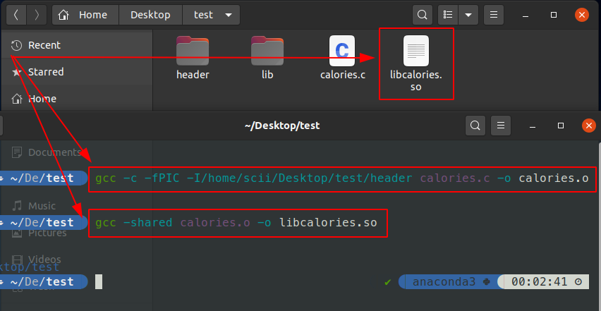
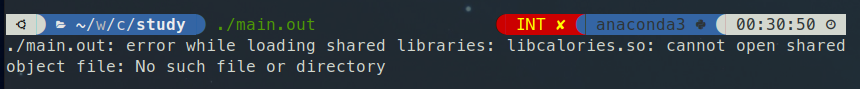
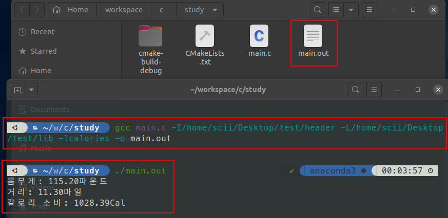
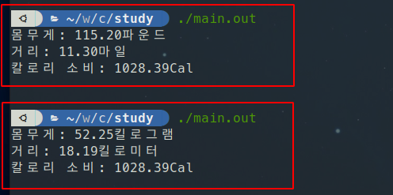

## 📌 정적 라이브러리 vs 동적 라이브러리

오브젝트 파일 또는 정적 라이브러리를 링크하여 빌드하면 **정적 프로그램**이 된다.  
모든 오브젝트 코드가 실행 파일 하나에 뭉쳐지므로, 코드를 바꾸려면 **반드시 재컴파일이 필요**하다.

**동적 라이브러리**는 이 문제를 해결한다.  
프로그램이 실행될 때 비로소 연결되는 별도의 파일이므로, **재컴파일 없이 라이브러리 파일만 교체**하여 프로그램을 갱신할 수 있다.

| 구분 | 정적 라이브러리 (`.a` / `.lib`) | 동적 라이브러리 (`.so` / `.dll` / `.dylib`) |
|:----:|:------------------------------:|:------------------------------------------:|
| 링크 시점 | 컴파일 타임 | 런타임 |
| 실행 파일 크기 | 상대적으로 큼 | 상대적으로 작음 |
| 실행 속도 | 빠름 (코드가 내장됨) | 약간 느림 (런타임 로딩 오버헤드) |
| 라이브러리 갱신 | 재컴파일 필요 | 파일 교체만으로 가능 |
| 여러 프로그램 공유 | 불가 (각 실행 파일에 복사) | 가능 (메모리에서 공유) |
| 배포 | 단일 실행 파일로 배포 가능 | `.so` / `.dll` 함께 배포 필요 |

> 정적 라이브러리는 이동하기 쉬운 단일 실행 파일을 만든다.  
> 동적 라이브러리는 실행 시 환경을 유연하게 바꿀 수 있다.  
> **어떤 것이 더 좋은가는 상황에 따라 다르다.**
{: .prompt-info }

---

## 🔨 오브젝트 파일 생성

동적 라이브러리로 만들 소스 파일을 먼저 오브젝트 파일로 컴파일한다.

```terminal
gcc -c -fPIC -I<헤더 디렉토리> calories.c -o calories.o
```

| 옵션 | 설명 |
|:----:|------|
| `-c` | 링크하지 않고 컴파일만 수행 |
| `-fPIC` | 위치 독립 코드(Position-Independent Code) 생성 |


_동적 라이브러리용 오브젝트 파일 생성_

---

## 📍 위치 독립 코드 (Position-Independent Code, PIC)

**위치 독립 코드**란 메모리의 어느 위치에 로드되더라도 올바르게 실행될 수 있는 코드를 말한다.

일반 코드는 특정 메모리 주소를 **절대 주소**로 참조하는 경우가 있다.  
예를 들어 "라이브러리가 로드된 위치에서 500바이트 떨어진 전역 데이터를 참조한다"고 하면, 운영체제가 다른 메모리 위치에 라이브러리를 로드할 경우 잘못된 주소를 참조하게 된다.

`-fPIC` 옵션을 사용하면 컴파일러가 **상대 주소** 기반으로 코드를 생성하여 이 문제를 방지한다.

> **Windows** 는 동적 라이브러리 로드 시 **메모리 매핑(Memory Mapping)** 기법을 사용하므로  
> 모든 코드가 본질적으로 위치 독립적이다.  
> Windows에서 gcc로 컴파일하면 `-fPIC` 옵션이 불필요하다는 경고가 출력된다.
{: .prompt-info }

---

## 📂 플랫폼별 동적 라이브러리

동적 라이브러리는 플랫폼마다 확장자와 명칭이 다르다.

| 플랫폼 | 명칭 | 확장자 | 명령 예시 |
|:------:|------|:------:|-----------|
| Linux / Unix | Shared Object File | `.so` | `gcc -shared calories.o -o libcalories.so` |
| Windows | Dynamic Link Library | `.dll` | `gcc -shared calories.o -o calories.dll` |
| macOS | Dynamic Library | `.dylib` | `gcc -shared calories.o -o libcalories.dylib` |

```terminal
# Linux / Unix
gcc -shared calories.o -o libcalories.so

# Windows
gcc -shared calories.o -o calories.dll

# macOS
gcc -shared calories.o -o libcalories.dylib
```

> `-shared` 옵션은 오브젝트 파일을 동적 라이브러리로 변환하도록 gcc에 지시한다.  
>
> 컴파일러는 동적 라이브러리를 만들 때 **라이브러리 이름을 파일 안에 저장**한다.  
> 따라서 나중에 파일 이름만 바꿔도 내부에 저장된 라이브러리 이름은 바뀌지 않는다.  
> 라이브러리 이름을 바꾸려면 **새로운 이름으로 다시 컴파일**해야 한다.
{: .prompt-warning }

---

## 🔗 프로그램 컴파일

정적 라이브러리와 동일한 명령어를 사용하지만, 컴파일러의 동작이 다르다.

```terminal
gcc main.c -I<헤더 디렉토리> -L<라이브러리 디렉토리> -lcalories -o main.out
```

- **정적 라이브러리**: 컴파일러가 라이브러리 코드를 실행 파일 안에 **복사**
- **동적 라이브러리**: 컴파일러가 실행 파일에 라이브러리를 **연결하기 위한 참조 정보만** 포함, 실행 시에 실제 링크

---

## 🚀 프로그램 실행 — 플랫폼별 라이브러리 검색

동적 라이브러리는 런타임에 로드되므로, 운영체제가 라이브러리 파일의 **위치를 알고 있어야** 한다.

| 플랫폼 | 검색 순서 | 비표준 경로 지정 방법 |
|:------:|----------|----------------------|
| Linux / Unix | 표준 라이브러리 디렉토리 (`/usr/lib`, `/usr/local/lib`) | `LD_LIBRARY_PATH` 환경변수 |
| Windows | 실행 파일과 같은 디렉토리 → `PATH` 환경변수 | `PATH` 환경변수에 추가 |
| macOS | 컴파일 시 기록된 경로 (절대 경로) | `DYLD_LIBRARY_PATH` 환경변수 |

### Linux / Unix

컴파일러가 파일 이름만 기록하고 경로는 기록하지 않는다.  
라이브러리가 표준 디렉토리에 없으면 아래와 같이 에러가 발생한다.


_calories 라이브러리를 찾지 못해 에러 발생_

`LD_LIBRARY_PATH` 환경변수에 라이브러리 경로를 추가하면 해결된다.

```shell
# 표준 디렉토리(/usr/lib 등)에 있으면 설정 불필요
export LD_LIBRARY_PATH=$LD_LIBRARY_PATH:/home/scii/libs
```

### Windows

현재 디렉토리를 먼저 검색하고, 없으면 `PATH` 환경변수의 디렉토리를 순서대로 검색한다.

```shell
# MinGW 사용 환경
PATH="%PATH%;C:\libs"
```

### macOS

컴파일 시 라이브러리 경로(`/libs/libcalories.dylib`)가 실행 파일 안에 저장된다.  
따라서 별도 환경변수 설정 없이 프로그램을 실행하면 된다.

> 동적 라이브러리를 사용하는 대부분의 프로그램은 라이브러리를 **표준 디렉토리**에 설치한다.  
> - Linux / macOS: `/usr/lib`, `/usr/local/lib`  
> - Windows: 실행 파일과 같은 디렉토리  
> 표준 디렉토리를 사용하면 환경변수 설정 없이 동작하므로 배포가 단순해진다.
{: .prompt-tip }

---

## 📄 사용한 소스 코드

### `calories.h`

```cpp
#ifndef __CALORIES_H__
#define __CALORIES_H__

void display_calories(float weight, float distance, float coeff);

#endif
```

### `calories.c` — 미국 단위 기준

```cpp
#include <stdio.h>
#include "calories.h"

void display_calories(float weight, float distance, float coeff) {
    printf("몸무게: %3.2f파운드\n", weight);
    printf("거리:   %3.2f마일\n", distance);
    printf("칼로리 소비: %4.2fCal\n", coeff * weight * distance);
}
```

### `calories.c` — 한국 단위 기준 (교체 버전)

```cpp
#include <stdio.h>
#include "calories.h"

void display_calories(float weight, float distance, float coeff) {
    printf("몸무게: %3.2f킬로그램\n", weight / 2.2046);
    printf("거리:   %3.2f킬로미터\n", distance * 1.609344);
    printf("칼로리 소비: %4.2fCal\n", coeff * weight * distance);
}
```

### `main.c`

```cpp
#include <stdio.h>
#include "calories.h"

int main(void) {
    display_calories(115.2, 11.3, 0.79);
    return 0;
}
```

> 두 `calories.c` 의 핵심은 **함수 시그니처가 동일**하다는 점이다.  
> 동적 라이브러리 파일만 교체하면 `main.c`를 재컴파일하지 않고도 동작이 바뀐다.
{: .prompt-tip }


_미국 단위 기준 빌드 및 실행_


_동적 라이브러리 파일(한국 단위 기준)만 교체 후 재실행_

---

## 🔍 의존 라이브러리 확인

빌드한 실행 파일이 어떤 동적 라이브러리에 의존하는지 확인하는 것은 디버깅과 배포에서 매우 중요하다.

| 플랫폼 | 명령어 | 설명 |
|:------:|--------|------|
| Linux | `ldd <실행파일>` | 의존 라이브러리 및 실제 로드 경로 출력 |
| macOS | `otool -L <실행파일>` | 의존 라이브러리 목록 출력 |
| Windows | `dumpbin /dependents <실행파일>` | 의존 DLL 목록 출력 |

```terminal
# Linux — 의존 라이브러리 확인
ldd main.out
```

```output
        linux-vdso.so.1 (0x00007ffd3e1d3000)
        libcalories.so => /home/scii/libs/libcalories.so (0x00007f4a1c000000)
        libc.so.6 => /lib/x86_64-linux-gnu/libc.so.6 (0x00007f4a1be00000)
        /lib64/ld-linux-x86-64.so.2 (0x00007f4a1c200000)
```

각 행의 의미는 다음과 같다.

| 행 | 의미 |
|----|------|
| `linux-vdso.so.1 (0x...)` | **Virtual Dynamic Shared Object** — 커널이 메모리에 자동 매핑하는 가상 라이브러리. 디스크에 파일이 존재하지 않으며 `syscall` 등 커널 인터페이스를 가속하기 위해 사용된다. `=>` 경로가 없는 것이 정상 |
| `libcalories.so => /home/scii/libs/libcalories.so (0x...)` | `=>` 왼쪽은 실행 파일이 기록하고 있는 **라이브러리 이름(soname)**, 오른쪽은 런타임 링커가 실제로 찾아낸 **디스크 경로**. 괄호 안은 해당 라이브러리가 로드된 **가상 메모리 주소** |
| `libc.so.6 => /lib/x86_64-linux-gnu/libc.so.6 (0x...)` | C 표준 라이브러리. `printf` 등 C 런타임 함수가 여기에 있다. 거의 모든 실행 파일이 의존한다 |
| `/lib64/ld-linux-x86-64.so.2 (0x...)` | **동적 링커(Dynamic Linker / ELF Interpreter)** 자체. 프로그램 실행 시 다른 모든 라이브러리를 로드하는 주체이며, `=>` 없이 절대 경로로 표시된다 |

```terminal
# macOS — 의존 라이브러리 확인
otool -L main.out
```

```terminal
# Windows (Visual Studio Developer Command Prompt)
dumpbin /dependents main.exe
```

> `=> not found` 로 표시되는 행이 있으면 해당 라이브러리를 런타임에 찾지 못하는 것이다.  
> 프로그램 실행 시 즉시 종료되며, `LD_LIBRARY_PATH` 또는 `ldconfig` 설정을 확인해야 한다.
{: .prompt-warning }

### nm — 심벌 목록 확인

라이브러리가 어떤 심벌(함수, 전역 변수)을 export하는지 확인할 때 사용한다.

```terminal
# 동적 라이브러리의 심벌 목록 확인
nm -D libcalories.so
```

```output
                 U printf
0000000000001149 T display_calories
```

| 심벌 타입 | 의미 |
|:---------:|------|
| `T` | 코드 섹션에 정의된 함수 (export됨) |
| `U` | 정의되지 않음 — 외부에서 링크 필요 |
| `D` | 초기화된 전역 데이터 |
| `B` | 초기화되지 않은 전역 데이터 (BSS) |

---

## 🔤 C++에서 동적 라이브러리 — `extern "C"`

### Name Mangling 문제

C++ 컴파일러는 **함수 오버로딩**을 지원하기 위해 함수 이름을 내부적으로 변형(mangling)한다.

```cpp
// 소스 코드
void display_calories(float weight, float distance, float coeff);
```

```output
# nm으로 확인한 실제 심벌 이름 (C++ 컴파일 시)
_Z16display_caloriesfff
```

심벌 이름이 변형되므로, `dlsym()` 으로 심벌을 찾거나 C에서 C++ 라이브러리를 사용할 때 **이름을 찾지 못하는 문제**가 발생한다.

### 해결책: `extern "C"`

`extern "C"` 는 C++ 컴파일러에게 **C 방식(name mangling 없이)** 으로 링크하라고 지시한다.

```cpp
// calories.h
#ifndef __CALORIES_H__
#define __CALORIES_H__

#ifdef __cplusplus
extern "C" {
#endif

void display_calories(float weight, float distance, float coeff);

#ifdef __cplusplus
}  // extern "C"
#endif

#endif  // __CALORIES_H__
```

`#ifdef __cplusplus` 가드를 사용하면 C 컴파일러와 C++ 컴파일러 **모두에서 동일한 헤더**를 사용할 수 있다.

```cpp
// calories.cpp — C++로 구현, C 심벌 이름으로 export
#include <cstdio>
#include "calories.h"

extern "C" void display_calories(float weight, float distance, float coeff) {
    printf("몸무게: %3.2f킬로그램\n", weight / 2.2046f);
    printf("거리:   %3.2f킬로미터\n", distance * 1.609344f);
    printf("칼로리 소비: %4.2fCal\n", coeff * weight * distance);
}
```

```terminal
# C++로 컴파일 (-shared 추가)
g++ -c -fPIC calories.cpp -o calories.o
g++ -shared calories.o -o libcalories.so

# nm으로 확인 — mangling 없이 C 이름 그대로 export됨
nm -D libcalories.so
```

```output
0000000000001149 T display_calories
```

> C++ 라이브러리를 외부에 공개하는 API에는 **항상 `extern "C"`를 사용**하는 것이 좋다.  
> `dlsym()`을 사용한 명시적 로딩, 타 언어(Python, C 등)와의 바인딩 모두 이 규칙에 의존한다.
{: .prompt-tip }

---

## 🏷️ soname과 버전 관리 (Linux)

실제 배포 환경에서는 동적 라이브러리에 **버전 정보**를 포함하여 관리한다.
Linux는 세 가지 이름 체계를 사용한다.

### 세 가지 이름 체계

| 이름 | 예시 | 용도 |
|------|------|------|
| **Real Name** | `libcalories.so.1.2.3` | 실제 라이브러리 파일. `<major>.<minor>.<patch>` 버전 포함 |
| **soname** | `libcalories.so.1` | major 버전만 포함. 실행 파일이 링크 시 기록하는 이름 |
| **Linker Name** | `libcalories.so` | 컴파일 시 `-lcalories` 로 찾는 심링크 |


### 버전 포함하여 빌드

```terminal
# 1. soname을 지정하여 동적 라이브러리 빌드
gcc -shared -fPIC -Wl,-soname,libcalories.so.1 \
    calories.o -o libcalories.so.1.2.3

# 2. symlink 생성
ln -s libcalories.so.1.2.3 libcalories.so.1   # soname symlink
ln -s libcalories.so.1     libcalories.so      # linker name symlink
```

| 옵션 | 설명 |
|------|------|
| `-Wl,-soname,<soname>` | 링커에 soname 전달. 빌드된 `.so` 파일 내부에 soname이 기록됨 |
| `ln -s` | 심링크 생성 |

```terminal
# soname 확인
readelf -d libcalories.so.1.2.3 | grep soname
```

```output
 0x000000000000000e (SONAME) Library soname: [libcalories.so.1]
```

각 필드의 의미는 다음과 같다.

| 필드 | 값 | 의미 |
|------|----|------|
| `0x000000000000000e` | 태그 번호 | ELF 동적 섹션의 태그 ID. `0xe` = `DT_SONAME` |
| `(SONAME)` | 태그 이름 | 이 엔트리가 soname 정보임을 나타냄 |
| `Library soname:` | 레이블 | 출력 형식의 고정 문자열 |
| `[libcalories.so.1]` | **실제 soname 값** | 이 라이브러리에 내장된 soname. 실행 파일이 이 라이브러리에 링크될 때 이 이름이 실행 파일 안에 기록된다 |

> soname이 `libcalories.so.1` 로 기록되었으므로, 이 라이브러리를 링크한 실행 파일은 런타임에 `libcalories.so.1` 이라는 이름(symlink)을 찾는다.  
> 따라서 `libcalories.so.1.2.3` → `libcalories.so.1.3.0` 으로 업그레이드해도 symlink만 교체하면 실행 파일을 재컴파일할 필요가 없다.
{: .prompt-info }

### `ldconfig` — 시스템 캐시 갱신

표준 디렉토리에 라이브러리를 설치한 후 `ldconfig` 를 실행하면 soname symlink 생성 및 캐시 갱신이 자동으로 이루어진다.

```terminal
# 표준 디렉토리에 설치 후
sudo cp libcalories.so.1.2.3 /usr/local/lib/
sudo ldconfig

# 결과 확인
ldconfig -p | grep calories
```

```output
        libcalories.so.1 (libc6,x86-64) => /usr/local/lib/libcalories.so.1.2.3
```

각 필드의 의미는 다음과 같다.

| 필드 | 값 | 의미 |
|------|----|------|
| `libcalories.so.1` | **soname** | 런타임 링커가 검색하는 이름. 실행 파일 안에 기록된 soname과 일치해야 한다 |
| `(libc6,x86-64)` | 호환성 정보 | `libc6` = glibc 기반 시스템, `x86-64` = 64비트 아키텍처용 라이브러리임을 나타냄 |
| `=>` | 매핑 화살표 | soname이 실제 파일 경로로 해석됨을 의미 |
| `/usr/local/lib/libcalories.so.1.2.3` | **Real Name 경로** | 실제 라이브러리 파일의 절대 경로. `ldconfig`가 캐시에 등록한 결과 |

> **버전 관리의 핵심 규칙**  
> - API가 **하위 호환**되는 변경(버그 수정, 기능 추가)이면 **minor** 또는 **patch** 버전만 올린다.  
> - API가 **하위 호환되지 않는** 변경(함수 시그니처 변경, 삭제)이면 **major** 버전을 올린다.  
> major 버전이 바뀌면 soname이 바뀌므로, 기존 실행 파일은 이전 버전 라이브러리를 그대로 사용할 수 있다.
{: .prompt-info }

---

## 📝 정리


| 단계 | 명령어 | 결과물 |
|:----:|--------|--------|
| ① 컴파일 | `gcc -c -fPIC source.c -o source.o` | 오브젝트 파일 (`.o`) |
| ② 라이브러리 생성 | `gcc -shared source.o -o libname.so` | 동적 라이브러리 |
| ③ 프로그램 컴파일 | `gcc main.c -L<경로> -lname -o app` | 실행 파일 |
| ④ 경로 설정 (Linux) | `export LD_LIBRARY_PATH=...` | 런타임 검색 경로 등록 |
| ⑤ 갱신 | 동적 라이브러리 파일 교체 | 재컴파일 불필요 |

| 핵심 옵션 | 의미 |
|:---------:|------|
| `-fPIC` | 위치 독립 코드 생성. 메모리 어디에든 로드 가능 |
| `-shared` | 오브젝트 파일을 동적 라이브러리로 변환 |
| `-L<경로>` | 라이브러리 검색 경로 추가 |
| `-l<이름>` | `lib<이름>.so` 파일 링크 |
