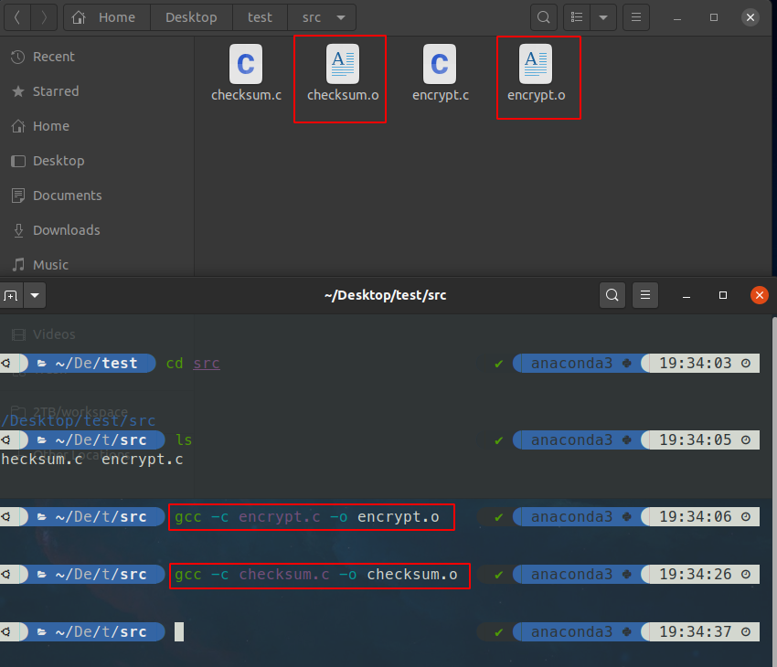
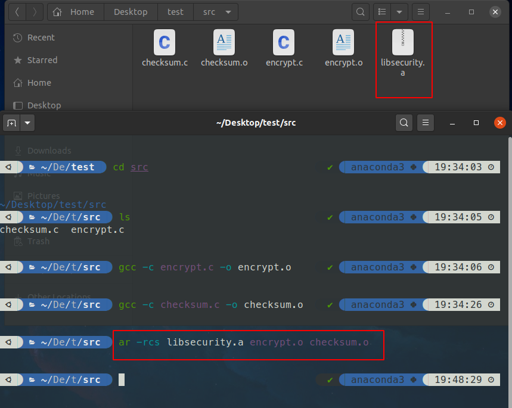
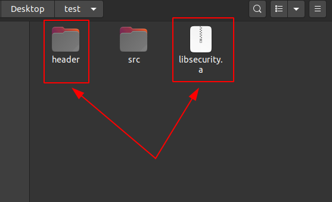
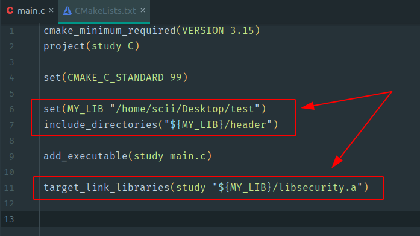
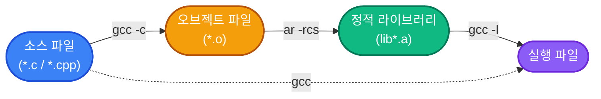

## 📦 오브젝트 파일 vs 정적 라이브러리

빌드 시 오브젝트 파일(`.o`)을 직접 링크하면, 그 파일 안의 함수를 **단 하나만 사용하더라도** 파일 전체가 실행 파일에 포함된다.

반면, 오브젝트 파일들을 **정적 라이브러리(`.a`, `.lib`)** 로 묶으면 실제로 사용하는 오브젝트 코드만 선택적으로 링크된다.

| 구분 | 오브젝트 파일 직접 링크 | 정적 라이브러리 링크 |
|:----:|:----------------------:|:--------------------:|
| 링크 범위 | 파일 전체 포함 | 사용된 코드만 포함 |
| 실행 파일 크기 | 상대적으로 큼 | 상대적으로 작음 |
| 관리 편의성 | 파일 수가 많아지면 번거로움 | 단일 `.a` 파일로 관리 |
| 재사용성 | 낮음 | 높음 (다른 프로젝트에서도 사용 가능) |

> **오브젝트 파일을 직접 링크하면** 사용하지 않는 코드까지 모두 포함되어 실행 파일이 불필요하게 커진다.  
> 공유할 오브젝트 파일이 많다면 반드시 **정적 라이브러리**로 묶어서 사용하자.
{: .prompt-tip }

---

## 🔨 오브젝트 파일 생성

소스 파일을 컴파일하여 오브젝트 파일을 생성한다.


_오브젝트 파일 생성_

오브젝트 파일이 여러 개라면 아래처럼 컴파일 시 직접 나열할 수 있다.

```terminal
gcc -I<헤더파일 디렉토리 경로> test_code.c encrypt.o checksum.o -o test_code
```

하지만 공유할 오브젝트 파일이 많아질수록 이 방법은 복잡하고 번거로워진다.  
이럴 때 오브젝트 파일들을 하나의 **아카이브(Archive)** 로 묶으면 한꺼번에 컴파일러에 전달할 수 있다.

---

## 🗂️ 아카이브 (Archive)

아카이브는 **여러 오브젝트 파일을 하나의 파일로 묶어 놓은 것**이다.  
`.zip`, `.tar` 와 마찬가지로, `.a` 파일도 이러한 묶음 파일의 한 형태다.

단 하나의 아카이브 파일로 다른 프로젝트에 코드를 훨씬 쉽게 공유할 수 있다.

> `nm` 명령으로 아카이브 내부를 확인할 수 있다.
> ```terminal
> nm libmyfunc.a
> ```
{: .prompt-tip }

> **`ar -s` 와 `ranlib` 은 동일한 역할이다.**  
> `ranlib libname.a` 은 아카이브에 심벌 색인을 추가하는 독립 명령으로, 과거 `ar -s` 를 지원하지 않던 시스템에서 사용했다.  
> 현재는 `ar -rcs` 로 통합되었지만, `-s` 없이 아카이브를 만들면 링크 시 `symbol not found` 오류가 발생할 수 있다.
{: .prompt-info }

---

## ⚙️ ar 명령으로 아카이브 생성

`ar` 명령(Archive)은 여러 오브젝트 파일을 하나의 아카이브 파일로 저장한다.

```terminal
ar -rcs libsecurity.a encrypt.o checksum.o
```

### ar 옵션

| 옵션 | 설명 |
|:----:|------|
| `-r` | 아카이브가 이미 존재하면 갱신, 없으면 새로 생성 |
| `-c` | 아카이브 생성 시 화면에 메시지를 출력하지 않음 |
| `-s` | 아카이브 파일 앞에 **색인(index)** 을 생성 — 링크 속도 향상 |

> ⚠️ **아카이브 이름 규칙: `lib<이름>.a`**  
> 이 형식을 따르지 않으면 컴파일러가 아카이브를 찾지 못한다.  
> 예: `libsecurity.a`, `libmyfunc.a`  
> 정적 라이브러리는 반드시 `lib` 으로 이름이 시작되어야 한다.
{: .prompt-danger }


_ar 명령으로 생성된 아카이브 파일_

---

## 🔗 아카이브를 사용하여 컴파일

아카이브를 만드는 궁극적인 목적은 **다른 프로그램에서 재사용하기 위한 것**이다.

### 표준 디렉토리에 설치한 경우

아카이브를 `/usr/lib` 같은 표준 디렉토리에 설치했다면 `-l` 옵션만으로 링크할 수 있다.

```terminal
gcc test_code.c -lsecurity -o test_code
```

### 외부 디렉토리에 있는 경우

아카이브가 표준 디렉토리가 아닌 곳에 있다면 `-L` 옵션으로 경로를 명시해야 한다.

```terminal
gcc test_code.c -L/my_lib -lsecurity -o test_code
```

### gcc 링크 옵션 정리

| 옵션 | 설명 |
|:----:|------|
| `-I<경로>` | 헤더 파일 검색 경로 추가 |
| `-L<경로>` | 라이브러리 파일 검색 경로 추가 (표준 경로 외) |
| `-l<이름>` | `lib<이름>.a` 파일을 찾아 링크 |

> `-l` 옵션은 소스 파일보다 **뒤에** 위치해야 한다.  
> 링커는 왼쪽에서 오른쪽으로 처리하므로, 소스 파일이 먼저 나열되어야 미해결 심벌을 라이브러리에서 올바르게 찾는다.
{: .prompt-warning }

> `-lsecurity` 는 컴파일러에게 `libsecurity.a` 를 찾으라고 알려준다.  
> 따라서 `libtest.a` 라면 `-ltest` 로 링크한다.
{: .prompt-info }

---

## 📄 사용한 소스 코드

### `encrypt.h`

```cpp
#ifndef __ENCRYPT_H__
#define __ENCRYPT_H__

void encrypt(char* message);

#endif  // __ENCRYPT_H__
```

### `encrypt.c`

```cpp
#include "encrypt.h"

void encrypt(char* message) {
    while (*message) {
        *message = *message ^ 31;   // XOR 31로 암호화/복호화 (같은 함수로 역연산)
        ++message;
    }
}
```

### `checksum.h`

```cpp
#ifndef __CHECKSUM_H__
#define __CHECKSUM_H__

int checksum(char* message);

#endif  // __CHECKSUM_H__
```

### `checksum.c`

```cpp
#include "checksum.h"

int checksum(char* message) {
    int c = 0;
    while (*message) {
        c += (int)*message;
        ++message;
    }
    return c;
}
```

> `encrypt()` 는 XOR 연산을 사용하므로 **같은 함수를 두 번 호출하면 원문이 복원**된다.  
> `checksum()` 은 각 문자의 ASCII 값을 단순 합산하여 반환한다.
{: .prompt-info }

---

## 🛠️ CMake를 이용한 정적 라이브러리 연동


_정적 라이브러리 헤더 파일 디렉토리와 libsecurity.a_


_CMakeLists.txt에 헤더 파일 디렉토리 및 라이브러리 파일 지정_

아래는 `libsecurity.a` 의 `encrypt()`, `checksum()` 함수를 사용하는 예제 코드다.

```cpp
// main.c
#include <stdio.h>

#include "encrypt.h"
#include "checksum.h"

int main(void) {
    char s[] = "Hello, World!!";

    encrypt(s);
    printf("암호 문장:   %s\n", s);
    printf("체크섬:      %d\n", checksum(s));

    encrypt(s);
    printf("복호화 문장: %s\n", s);
    printf("체크섬:      %d\n", checksum(s));

    return 0;
}
```

```output
암호 문장:   Wzssp3?Hpms{>>
체크섬:      699838
복호화 문장: Hello, World!!
체크섬:      334257
```

gcc로 직접 컴파일할 경우:

```terminal
gcc -I<헤더파일 디렉토리> test_code.c -L<라이브러리 디렉토리> -lsecurity -o test_code
```

> 정적 라이브러리는 링크 시 실행 파일 안에 **복사**된다.  
> 따라서 배포 시 `.a` 파일을 함께 제공하지 않아도 된다.
{: .prompt-info }

---

## 📤 아카이브에서 오브젝트 파일 꺼내기

아카이브 안에 있는 특정 오브젝트 파일을 꺼낼 때는 `-x` 옵션을 사용한다.

```terminal
# 특정 오브젝트 파일 추출
ar -x libsecurity.a encrypt.o

# 아카이브 내 파일 목록 확인
ar -t libsecurity.a
```

| 옵션 | 설명 |
|:----|:------|
| `-x` | 아카이브에서 오브젝트 파일 추출 |
| `-t` | 아카이브에 포함된 파일 목록 출력 |

---

## 📝 정리



| 단계 | 명령어 | 결과물 |
|:----:|--------|--------|
| ① 컴파일 | `gcc -c source.c -o source.o` | 오브젝트 파일 (`.o`) |
| ② 아카이브 생성 | `ar -rcs libname.a *.o` | 정적 라이브러리 (`.a`) |
| ③ 링크 | `gcc main.c -L<경로> -lname -o app` | 실행 파일 |
| ④ 심벌 확인 | `nm libname.a` | 심벌 목록 출력 |
| ⑤ 파일 목록 확인 | `ar -t libname.a` | 아카이브 내 파일 목록 |
| ⑥ 파일 추출 | `ar -x libname.a file.o` | 오브젝트 파일 |

### nm 출력 예시

```terminal
nm libsecurity.a
```

```output
encrypt.o:
0000000000000000 T encrypt

checksum.o:
0000000000000000 T checksum
                 U strlen
```

| 심벌 타입 | 의미 |
|:---------:|------|
| `T` | 코드 섹션에 정의된 함수 (export됨) |
| `U` | 정의되지 않음 — 외부(libc 등)에서 링크 필요 |
| `D` | 초기화된 전역 데이터 |
| `B` | 초기화되지 않은 전역 데이터 (BSS) |

> `T` 심벌이 보이면 해당 함수가 라이브러리에 정상적으로 포함된 것이다.  
> 링크 시 `undefined reference to 'xxx'` 오류가 발생하면 `nm` 으로 해당 심벌이 라이브러리에 존재하는지 먼저 확인한다.
{: .prompt-tip }
