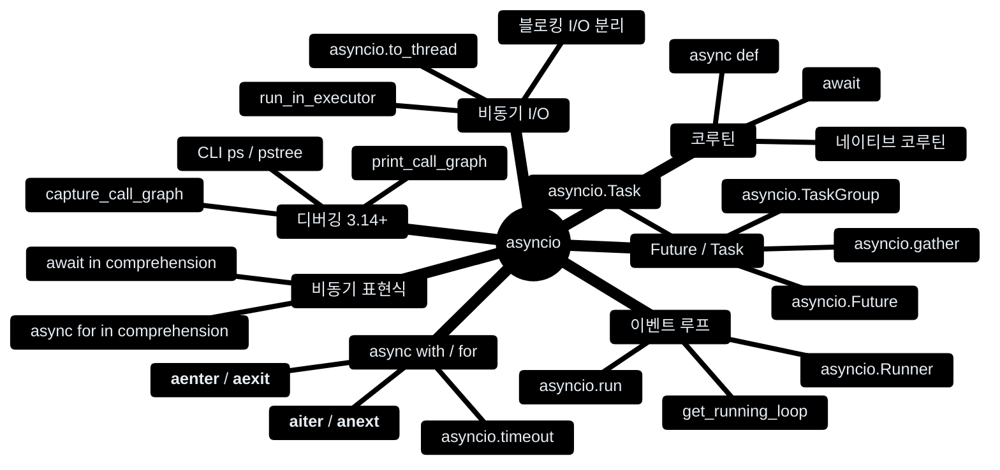
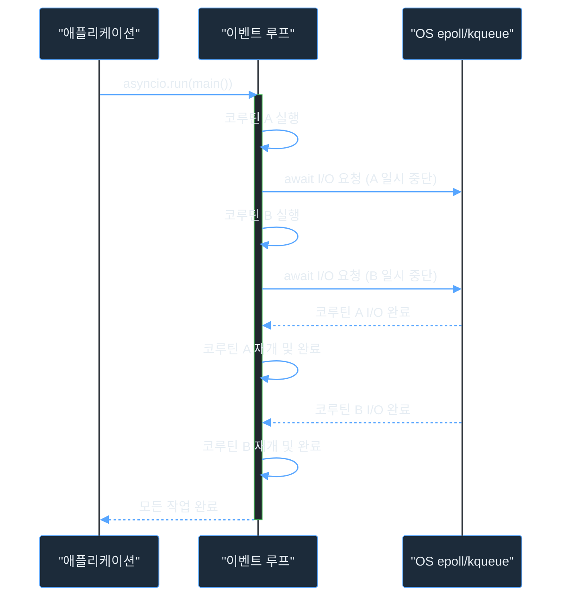
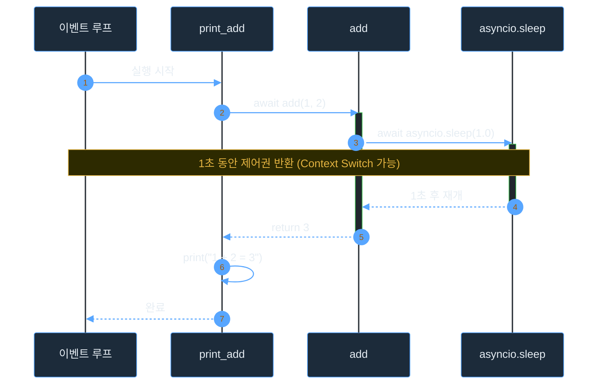
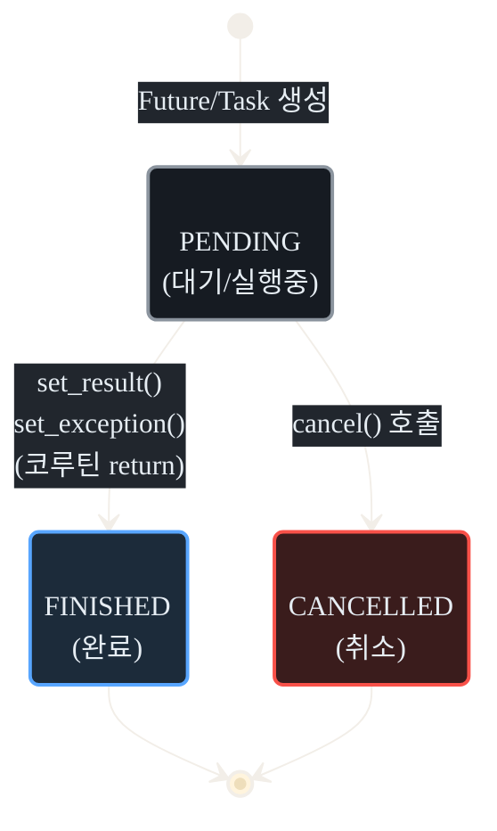
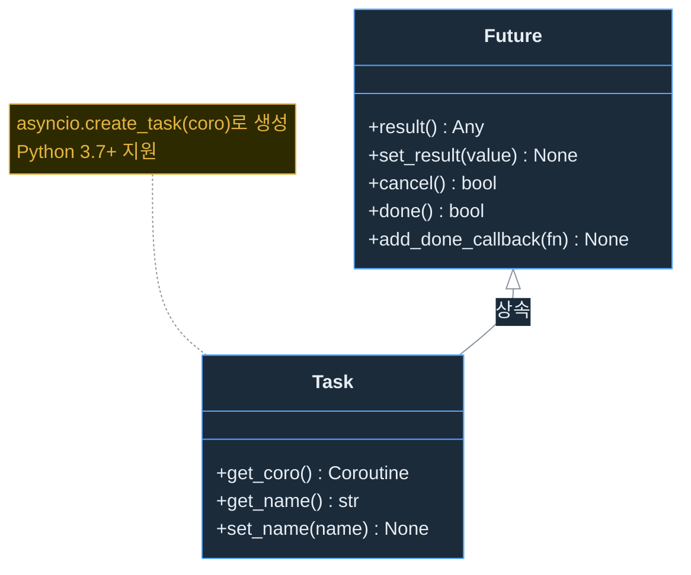
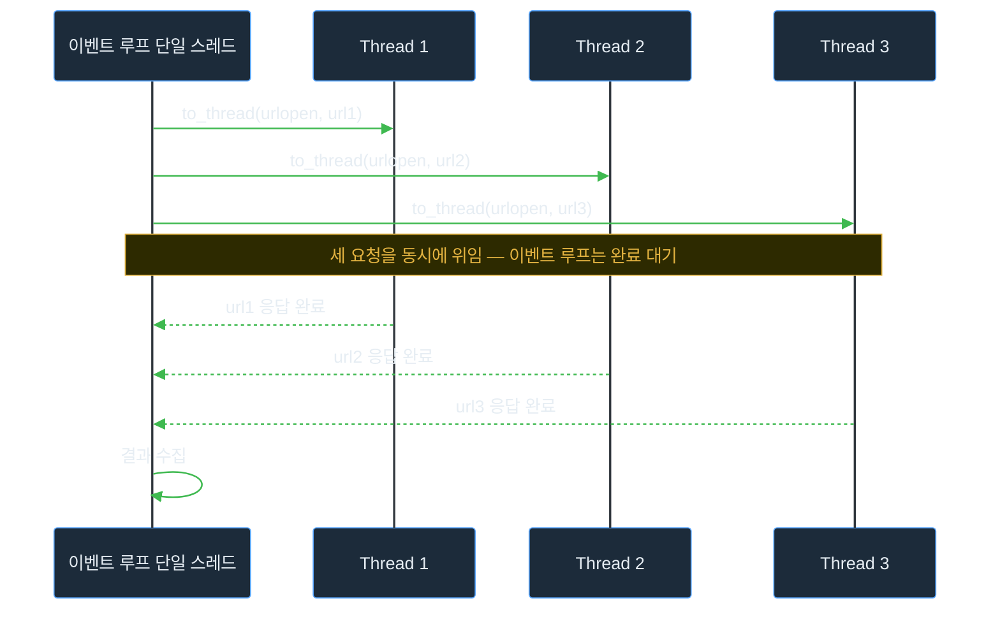
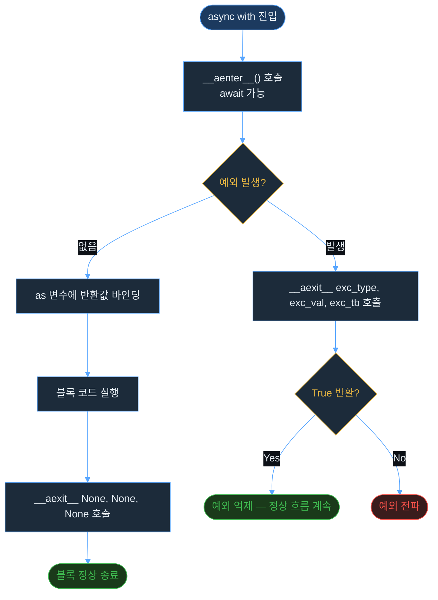
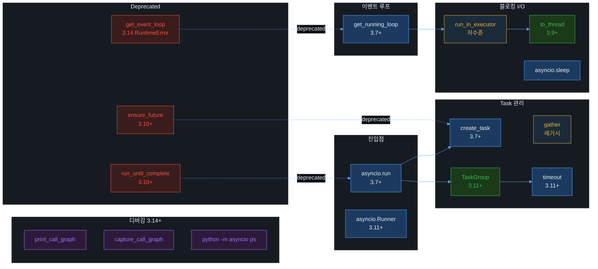

`asyncio`는 **단일 스레드** 위에서 이벤트 루프(Event Loop)를 통해 I/O 작업을 *협력적(cooperative)*으로
병렬 처리하는 Python 표준 라이브러리다.

> 이 글에서 다루는 **asyncio 구성 요소**는 다음과 같다.
{: .prompt-info }



> **Python 버전 기준**  
> 이 글은 **Python 3.14+** 기준으로 작성되었다.  
> 버전별 API 변천사는 각 섹션에서 `Added in 3.x` / `Deprecated in 3.x` 형태로 병기한다.
{: .prompt-tip }

---

## ⚡ 동기 vs 비동기

| 방식 | 설명 | 특징 |
|------|------|------|
| **동기 (Synchronous)** | 작업 A → 완료 → 작업 B → 완료 | 순차 처리, 대기 시간 낭비 |
| **비동기 (Asynchronous)** | 작업 A 예약 → 작업 B 예약 → 완료 시 결과 수집 | I/O 대기 중 다른 작업 수행 가능 |

다음은 3개의 I/O 작업을 처리할 때 **동기 방식**과 **비동기 방식**의 타임라인 차이다:

```mermaid
%%{init: {"theme": "base", "themeVariables": {"background": "#0d1117", "primaryColor": "#1c3a5f", "primaryTextColor": "#e6edf3", "primaryBorderColor": "#58a6ff", "lineColor": "#30363d", "sectionBkgColor": "#161b22", "altSectionBkgColor": "#0d1117", "sectionBkgColor2": "#1c2b3a", "taskBkgColor": "#1c3a5f", "taskBorderColor": "#58a6ff", "activeTaskBkgColor": "#1a3a1a", "activeTaskBorderColor": "#3fb950", "doneTaskBkgColor": "#21262d", "doneTaskBorderColor": "#30363d", "gridColor": "#21262d", "todayLineColor": "#e3b341", "taskTextColor": "#e6edf3", "taskTextOutsideColor": "#e6edf3", "taskTextLightColor": "#e6edf3", "taskTextDarkColor": "#e6edf3"}}}%%
gantt
    title 동기 vs 비동기 I/O 처리 비교
    dateFormat X
    axisFormat %s초

    section 동기 Sequential
    작업1 I/O 대기 포함 : 0, 2
    작업2 I/O 대기 포함 : 2, 4
    작업3 I/O 대기 포함 : 4, 6

    section 비동기 Concurrent
    작업1 시작 : 0, 1
    작업2 시작 : 0, 1
    작업3 시작 : 0, 1
    작업1 완료 : active, 1, 2
    작업2 완료 : active, 1, 2
    작업3 완료 : active, 1, 2
```



> asyncio는 **멀티스레드가 아니다**.  
> 단일 스레드에서 코루틴이 협력적으로 제어권을 양보(`await`)하는 구조다.  
> CPU-bound 작업에는 효과가 없으며, **I/O-bound 작업에 특화**되어 있다.
{: .prompt-warning }

---

## 🧵 이벤트 루프 (Event Loop) 동작 원리

asyncio의 핵심은 **이벤트 루프**다. 이벤트 루프는 코루틴들을 큐에 등록하고,
특정 코루틴이 I/O 대기(`await`) 상태가 되면 다른 코루틴을 실행한다.
내부적으로 OS의 `select`/`epoll`/`kqueue` 같은 I/O 멀티플렉싱[^multiplex] 위에서 동작한다.



> **Python 3.14 변경**: 이벤트 루프 내부 자료구조가 **lock-free**로 재구현되었다.  
> per-thread 상태 저장 방식으로 전환되어 free-threaded 빌드(no-GIL)에서도 선형으로 성능이 확장된다.  
> 단일 스레드 asyncio 기준으로도 **10~20%** 성능 향상이 측정되었다.[^freethreaded]
{: .prompt-info }

---

## 🔧 네이티브 코루틴 만들기

`async def`로 정의한 함수는 **네이티브 코루틴(Native Coroutine)**이다.  
호출해도 즉시 실행되지 않고 **코루틴 객체**를 반환한다. 이벤트 루프에 스케줄링해야 실제로 실행된다.

> 파이썬에서는 `yield`를 활용한 **제네레이터 기반 코루틴**(`@asyncio.coroutine`)과 구분하기 위해  
> `async def`로 만든 코루틴을 **네이티브 코루틴**이라 부른다.  
> 제네레이터 기반 코루틴은 Python 3.11에서 완전히 제거되었다.
{: .prompt-info }

```python
async def 함수이름():
    코드
```

### 기본 예제

```python
import asyncio

async def hello():
    print('hello, world!')

# ✅ Python 3.7+ / 3.14 권장 방식
asyncio.run(hello())
```

```output
hello, world!
```

`asyncio.run()`은 새 이벤트 루프를 생성하고 코루틴 실행 후 루프를 자동으로 닫아준다.  
항상 **프로그램의 진입점(entry point)**에서만 호출해야 한다.

| API | 버전 | 상태 |
|-----|------|------|
| `asyncio.run(coro)` | 3.7+ | ✅ 권장 |
| `asyncio.get_event_loop()` | — | ❌ 3.14에서 루프 없으면 `RuntimeError` |
| `loop.run_until_complete(coro)` | — | ⚠️ 3.10 deprecated |
| `loop.close()` | — | ⚠️ `asyncio.run()`이 자동 처리 |

> **Python 3.14 Breaking Change**: `asyncio.get_event_loop()`는 실행 중인 루프가 없을 경우 이전과 달리
> **경고 없이 즉시 `RuntimeError`를 발생**시킨다.  
> 반드시 `asyncio.get_running_loop()`(루프 안에서) 또는 `asyncio.run()`(진입점)으로 전환해야 한다.
{: .prompt-danger }

### 복수 실행이 필요한 경우: asyncio.Runner

`asyncio.run()`은 호출마다 루프를 새로 생성하고 닫는다.  
**블로킹 코드와 async 코드를 번갈아 실행**해야 하는 복잡한 시나리오에서는 `asyncio.Runner`를 사용한다.

```python
import asyncio

# ✅ Python 3.11+ asyncio.Runner
with asyncio.Runner() as runner:
    runner.run(operation_one())
    blocking_code()              # 동기 코드 삽입 가능
    runner.run(operation_two())
    # 루프는 with 블록을 벗어날 때 자동으로 닫힌다
```

> `asyncio.Runner`는 `asyncio.run()`을 루프 재사용 없이 여러 번 호출하는 패턴을 대체한다.  
> _Added in Python 3.11_
{: .prompt-tip }

---

## ⏳ await로 네이티브 코루틴 실행하기

`await`는 코루틴 내부에서 awaitable 객체가 완료될 때까지 **현재 코루틴을 일시 중단**하고
이벤트 루프에 제어권을 반환한다. `await`는 **반드시 `async def` 함수 내부**에서만 사용할 수 있다.

`await` 대상이 될 수 있는 **Awaitable** 객체:

| 타입 | 설명 |
|------|------|
| **코루틴 객체** | `async def` 함수 호출 결과 |
| **`asyncio.Future`** | 미래의 결과를 나타내는 저수준 객체 |
| **`asyncio.Task`** | `Future`의 서브클래스, 코루틴을 감싼 고수준 객체 |

```python
변수 = await 코루틴객체
변수 = await 퓨처객체
변수 = await 태스크객체
```

### 예제: 두 수를 더하는 비동기 함수

```python
import asyncio

async def add(a, b):
    print(f'{a} + {b}')
    await asyncio.sleep(1.0)    # 1초 대기 (이벤트 루프에 제어권 반환)
    return a + b

async def print_add(a, b):
    res = await add(a, b)       # await로 다른 코루틴 실행 후 반환값 저장
    print(f'{a} + {b} = {res}')

asyncio.run(print_add(1, 2))
```

```output
1 + 2
1 + 2 = 3
```

실행 흐름을 시퀀스 다이어그램으로 나타내면 다음과 같다:



> `asyncio.sleep(delay)`는 이벤트 루프에 제어권을 반환하며 대기한다.  
> 일반 `time.sleep()`은 **전체 스레드를 블로킹**하므로 비동기 코드 내부에서는 절대 사용하지 않는다.
{: .prompt-danger }

---

## 🔮 Future와 Task

### asyncio.Future

`asyncio.Future`는 아직 완료되지 않은 연산의 결과를 나타내는 **저수준(low-level) 객체**다.
일반적으로 직접 생성하기보다 라이브러리 내부에서 사용된다.



| 메서드 | 설명 |
|--------|------|
| `result()` | 결과 반환 (완료 전 호출 시 `InvalidStateError`) |
| `set_result(value)` | 결과 설정 및 완료 상태로 전환 |
| `cancel()` | 취소 요청 |
| `done()` | 완료 여부 반환 |
| `add_done_callback(fn)` | 완료 시 호출할 콜백 등록 |

### asyncio.Task

`asyncio.Task`는 `asyncio.Future`의 서브클래스로, **코루틴을 이벤트 루프에 스케줄링**한다.
태스크는 생성 즉시 이벤트 루프에 등록되어 실행 준비 상태가 된다.



```python
# ✅ Python 3.7+
task = asyncio.create_task(코루틴객체)

# ❌ Python 3.10+ deprecated
task = asyncio.ensure_future(코루틴객체)
```

> Task를 생성한 뒤 **강한 참조(strong reference)를 반드시 유지**해야 한다.  
> 이벤트 루프는 Task를 약한 참조(weak reference)로만 보관하므로, 참조가 사라지면 실행 중에 GC가 수거할 수 있다.
{: .prompt-warning }

```python
# ✅ fire-and-forget 패턴: 강한 참조 유지
background_tasks = set()

task = asyncio.create_task(some_coro())
background_tasks.add(task)
task.add_done_callback(background_tasks.discard)  # 완료 후 자동 제거
```

---

## 🌐 비동기로 웹 페이지 가져오기

### 동기 방식 (순차적)

`urllib.request`의 `urlopen`으로 웹 페이지를 순차적으로 가져오는 예제다:

```python
from time import time
from urllib.request import Request, urlopen

urls = ['https://www.google.co.kr/search?q=' + i
        for i in ['apple', 'pear', 'grape', 'pineapple', 'orange', 'strawberry']]

begin = time()
result = []
for url in urls:
    request = Request(url, headers={'User-Agent': 'Mozilla/5.0'})  # User-Agent 없으면 403 에러
    response = urlopen(request)
    page = response.read()
    result.append(len(page))

print(result)
end = time()
print(f'실행 시간: {end - begin:.3f}초')
```

```output
[74443, 137795, 84429, 327409, 65139, 154872]
실행 시간: 4.865초
```

### 비동기 방식 — asyncio.to_thread (3.9+, 권장)

Python 3.9+에서 추가된 `asyncio.to_thread()`는 블로킹 함수를 스레드 풀에서 실행하는
`run_in_executor`의 **더 간결한 고수준 대체제**다:

```python
import asyncio
from time import time
from urllib.request import Request, urlopen

urls = ['https://www.google.co.kr/search?q=' + i
        for i in ['apple', 'pear', 'grape', 'pineapple', 'orange', 'strawberry']]

async def fetch(url):
    request = Request(url, headers={'User-Agent': 'Mozilla/5.0'})
    # ✅ asyncio.to_thread: 블로킹 함수를 스레드 풀에 위임 (3.9+)
    response = await asyncio.to_thread(urlopen, request)
    page = await asyncio.to_thread(response.read)
    return len(page)

async def main():
    # ✅ TaskGroup: gather의 현대적 대체 (3.11+)
    results = []
    async with asyncio.TaskGroup() as tg:
        tasks = [tg.create_task(fetch(url)) for url in urls]
    results = [t.result() for t in tasks]
    print(results)

begin = time()
asyncio.run(main())
end = time()
print(f'실행 시간: {end - begin:.3f}초')
```

```output
[72734, 119950, 84669, 79735, 65231, 154872]
실행 시간: 1.484초
```

> asyncio 적용 결과 **4초대 → 1초대**로 단축되었다. (**약 3.3배 속도 향상**)
{: .prompt-tip }

---

### 🔍 블로킹 I/O 처리 방식 비교

`urlopen`, `response.read` 같은 **블로킹 I/O(Blocking I/O)** 함수는 결과가 나올 때까지
현재 스레드 실행을 완전히 중단(block)시킨다. 이런 함수를 코루틴 안에서 직접 호출하면
**이벤트 루프 전체가 블로킹**된다.

| API | 도입 | 설명 | 권장 여부 |
|-----|------|------|-----------|
| `asyncio.to_thread(func, *args)` | 3.9+ | 블로킹 함수를 기본 스레드 풀에서 실행 | ✅ 권장 |
| `loop.run_in_executor(None, func, *args)` | — | 동일하지만 저수준 | 가능, 저수준 |
| `loop.run_in_executor(executor, func, *args)` | — | 커스텀 executor 지정 가능 | 커스텀 필요 시 |

```python
# asyncio.to_thread — 키워드 인수 바로 전달 가능 ✅
await asyncio.to_thread(some_func, arg1, keyword=value)

# run_in_executor — 키워드 인수 불가, functools.partial 필요 ⚠️
await loop.run_in_executor(None, functools.partial(some_func, arg1, keyword=value))
```

`run_in_executor`와 스레드 풀의 동작 원리:



> `asyncio.to_thread()`는 내부적으로 `loop.run_in_executor(None, ...)`를 호출하되,
> `contextvars.copy_context()`로 현재 컨텍스트를 자동 전파한다.  
> 단순 블로킹 I/O에서는 항상 `to_thread`를 우선 사용하자.
{: .prompt-info }

---

### asyncio.TaskGroup (3.11+, 권장)

`asyncio.TaskGroup`은 `asyncio.gather`의 **구조적 동시성(Structured Concurrency)** 대체제다.  
하나의 태스크가 예외를 발생시키면 그룹 내 **나머지 태스크를 자동으로 취소**하는 안전 보장을 제공한다.

```python
async def main():
    async with asyncio.TaskGroup() as tg:
        task1 = tg.create_task(fetch(urls[0]))
        task2 = tg.create_task(fetch(urls[1]))
        task3 = tg.create_task(fetch(urls[2]))
    # async with 블록을 벗어날 때 모든 태스크 완료를 묵시적으로 await
    results = [task1.result(), task2.result(), task3.result()]
```

`gather` vs `TaskGroup` 비교:

| 항목 | `asyncio.gather` | `asyncio.TaskGroup` (3.11+) |
|------|------------------|-----------------------------|
| 예외 발생 시 | 다른 태스크 계속 실행 (`return_exceptions=False`면 즉시 전파) | 나머지 태스크 **자동 취소** |
| 취소 안전성 | 수동 처리 필요 | 자동 보장 |
| 결과 수집 | 반환 리스트 | 각 `task.result()` 호출 |
| 예외 타입 | 첫 번째 예외 그대로 | `ExceptionGroup` (except* 사용) |
| 권장 여부 | ⚠️ 레거시 코드 | ✅ 현대적 권장 |

```python
# ✅ TaskGroup — 예외가 발생하면 나머지 태스크를 안전하게 취소
try:
    async with asyncio.TaskGroup() as tg:
        tg.create_task(task_a())
        tg.create_task(task_b())   # 이 태스크가 예외를 발생시키면
        tg.create_task(task_c())   # task_a, task_c 자동 취소
except* ValueError as eg:          # except* 문법으로 ExceptionGroup 처리
    for exc in eg.exceptions:
        print(exc)
```

### asyncio.gather (레거시 호환)

`asyncio.gather`는 여러 awaitable 객체를 **동시에 실행**하고 모두 완료될 때까지 기다린 뒤
결과를 **입력 순서와 동일한 순서**로 리스트에 담아 반환한다.

```python
결과리스트 = await asyncio.gather(코루틴1, 코루틴2, 코루틴3)
결과리스트 = await asyncio.gather(*tasks)   # 리스트 언패킹
```

> `asyncio.gather`의 결과 순서는 **입력 순서와 동일**하게 보장된다. 실행 완료 순서와는 무관하다.  
> 신규 코드에서는 `asyncio.TaskGroup`을 우선 사용하자.
{: .prompt-warning }

---

### functools.partial로 키워드 인수 전달

`run_in_executor`는 키워드 인수를 직접 받지 못한다. 이 경우 `functools.partial`을 사용한다.

```python
import asyncio, functools

async def hello():
    loop = asyncio.get_running_loop()
    await loop.run_in_executor(
        None, functools.partial(print, 'hello', 'python', end=' ')
    )

asyncio.run(hello())
```

> **Python 3.9+ 권장**: `asyncio.to_thread()`는 키워드 인수를 직접 지원하므로  
> `functools.partial`이 필요 없다.  
> `await asyncio.to_thread(print, 'hello', 'python', end=' ')`
{: .prompt-tip }

---

## ⏱️ 타임아웃 처리: asyncio.timeout (3.11+)

비동기 작업에 타임아웃을 걸 때는 `asyncio.timeout()`을 사용한다:

```python
import asyncio

async def main():
    try:
        # ✅ Python 3.11+ asyncio.timeout
        async with asyncio.timeout(5.0):
            result = await long_running_task()
    except TimeoutError:
        print('타임아웃 발생')
```

`asyncio.timeout_at()`을 사용하면 절대 시각(deadline)으로 지정할 수 있다:

```python
deadline = asyncio.get_event_loop().time() + 5.0
async with asyncio.timeout_at(deadline):
    result = await long_running_task()
```

> Python 3.11 이전에는 `asyncio.wait_for(coro, timeout=5.0)`를 사용했다.  
> `asyncio.timeout`은 컨텍스트 매니저이므로 블록 내 여러 `await` 문에 걸쳐 단일 타임아웃을 적용할 수 있다.
{: .prompt-info }

---

## 🔄 async with와 async for

### async with

비동기 컨텍스트 매니저. `async with`로 동작하는 클래스는 다음 두 메서드를 구현해야 한다.
반드시 `async def`를 사용한다:

| 메서드 | 역할 |
|--------|------|
| `__aenter__(self)` | `async with` 블록 진입 시 호출, 반환값이 `as` 변수에 바인딩됨 |
| `__aexit__(self, exc_type, exc_val, exc_tb)` | `async with` 블록 종료 시 호출 (예외 처리 포함) |

`async with` 실행 흐름:



다음은 1초 뒤에 덧셈 결과를 반환하는 비동기 컨텍스트 매니저 예제다:

```python
import asyncio

class AsyncAdd:
    def __init__(self, a, b):
        self.a = a
        self.b = b

    async def __aenter__(self):
        await asyncio.sleep(1.0)
        return self.a + self.b      # 반환값이 as 변수에 바인딩됨

    async def __aexit__(self, exc_type, exc_val, exc_tb):
        pass                        # 정리 작업 없으면 pass (메서드 생략 시 AttributeError)

async def main():
    async with AsyncAdd(1, 2) as result:
        print(result)

asyncio.run(main())
```

```output
3
```

> `__aexit__`는 예외가 발생해도 반드시 호출된다. `exc_type`이 `None`이면 정상 종료를 의미한다.  
> `True`를 반환하면 예외가 억제(suppress)된다.
{: .prompt-info }

---

### async for

비동기 이터레이터. `async for`로 동작하는 클래스는 다음 두 메서드를 구현해야 한다:

| 메서드 | 역할 | 정의 방식 |
|--------|------|-----------|
| `__aiter__(self)` | 비동기 이터레이터 객체 반환 | 일반 `def` 또는 `async def` |
| `__anext__(self)` | 다음 값 반환, 완료 시 `StopAsyncIteration` 발생 | 반드시 `async def` |

다음은 1초마다 숫자를 생성하는 비동기 반복자 예제다:

```python
import asyncio

class AsyncCounter:
    def __init__(self, stop):
        self.current = 0
        self.stop = stop

    def __aiter__(self):
        return self

    async def __anext__(self):
        if self.current < self.stop:
            await asyncio.sleep(1.0)
            r = self.current
            self.current += 1
            return r
        else:
            raise StopAsyncIteration    # ✅ StopIteration이 아닌 StopAsyncIteration

async def main():
    async for i in AsyncCounter(3):
        print(i, end=' ')

asyncio.run(main())
```

```output
0 1 2 
```

> 반복 종료 시 반드시 `StopAsyncIteration`을 발생시켜야 한다.  
> `StopIteration`을 사용하면 `RuntimeError`가 발생한다 (PEP 479[^pep479]).
{: .prompt-danger }

---

## 🔁 제네레이터 방식으로 비동기 이터레이터 만들기

`async def` + `yield` 조합으로 **비동기 제네레이터(Async Generator)**를 만들 수 있다.  
클래스 기반(`__aiter__`/`__anext__`)보다 훨씬 간결하다.

```python
import asyncio

async def async_counter(stop):
    n = 0
    while n < stop:
        yield n
        n += 1
        await asyncio.sleep(1.0)

async def main():
    async for i in async_counter(3):
        print(i, end=' ')

asyncio.run(main())
```

```output
0 1 2 
```

> 비동기 제네레이터는 `StopAsyncIteration`을 명시적으로 발생시킬 필요 없다.  
> `yield`할 값이 없으면 자동으로 종료된다.
{: .prompt-tip }

클래스 기반 vs 제네레이터 기반 비교:

| 항목 | 클래스 기반 | 제네레이터 기반 |
|------|------------|----------------|
| 구현 복잡도 | 높음 (`__aiter__`, `__anext__` 필요) | 낮음 (`async def` + `yield`) |
| 상태 관리 | 인스턴스 변수로 명시적 관리 | 함수 프레임이 자동 관리 |
| 적합한 경우 | 복잡한 상태/리소스 관리 필요 시 | 단순한 값 생성 시 |

---

## 📝 비동기 표현식 (Async Comprehension)

`async`와 `await`를 표현식(Comprehension) 안에서도 사용할 수 있다.
**반드시 `async def` 내부**에서만 사용 가능하다. (PEP 530[^pep530])

| 표현식 | 문법 |
|--------|------|
| 리스트 | `[변수 async for 변수 in 비동기이터레이터()]` |
| 딕셔너리 | `{키: 값 async for 키, 값 in 비동기이터레이터()}` |
| 세트 | `{변수 async for 변수 in 비동기이터레이터()}` |
| 제네레이터 | `(변수 async for 변수 in 비동기이터레이터())` |

```python
async def main():
    a = [i async for i in AsyncCounter(3)]
    print(a)    # [0, 1, 2]
```

표현식 안에서 `await`로 코루틴 결과를 직접 받을 수도 있다:

```python
async def async_one():
    return 1

async def main():
    coroutines = [async_one, async_one, async_one]
    a = [await co() for co in coroutines]
    print(a)    # [1, 1, 1]
```

> `[await co() for co in coroutines]`는 각 `await`가 **순차적으로** 실행된다.  
> **병렬로** 실행하려면 `asyncio.TaskGroup` 또는 `asyncio.gather`를 사용해야 한다.
{: .prompt-warning }

---

## 🔬 Call Graph Introspection (Python 3.14+)

Python 3.14에서 asyncio에 **런타임 비동기 콜 그래프 인트로스펙션** 기능이 추가되었다.  
실행 중인 프로그램을 **중단하지 않고** 태스크 상태와 코루틴 체인을 시각화할 수 있다.

### 코드 내부에서 사용

```python
import asyncio

async def worker():
    await asyncio.sleep(10)

async def main():
    async with asyncio.TaskGroup() as tg:
        tg.create_task(worker(), name='worker-1')
        tg.create_task(worker(), name='worker-2')
        # 현재 태스크의 콜 그래프를 stdout에 출력
        asyncio.print_call_graph()

asyncio.run(main())
```

```output
* Task(name='Task-1', id=0x...)
  + Call stack:
  | File 'main.py', line 10, in async main()
  + Awaited by:
    * Task(name='worker-1', ...)
    * Task(name='worker-2', ...)
```

| API | 설명 |
|-----|------|
| `asyncio.print_call_graph(future=None)` | 현재 태스크(또는 지정 Future)의 콜 그래프를 출력 |
| `asyncio.capture_call_graph(future=None)` | 콜 그래프를 객체로 캡처하여 반환 |
| `asyncio.format_call_graph(future=None)` | 콜 그래프를 문자열로 반환 |

### CLI에서 실행 중인 프로세스 인트로스펙션

```bash
# 플랫(flat) 태스크 목록 출력
python -m asyncio ps <PID>

# 계층적 트리 형태로 출력
python -m asyncio pstree <PID>
```

```output
# pstree 출력 예시
└── (T) Task-1
    └── main
        ├── (T) worker-1
        │   └── sleep
        └── (T) worker-2
            └── sleep
```

> `python -m asyncio pstree <PID>`는 **실행 중인 서버나 장기 실행 프로그램**을 재시작 없이
> 인트로스펙션할 수 있어 프로덕션 디버깅에 매우 유용하다.  
> macOS에서는 `sudo`가 필요할 수 있다.
{: .prompt-tip }

---

## 🗺️ asyncio 주요 API 요약



| API | 버전 | 설명 | 상태 |
|-----|------|------|------|
| `asyncio.run(coro)` | 3.7+ | 코루틴 실행 진입점 | ✅ 권장 |
| `asyncio.Runner` | 3.11+ | 루프 재사용 가능한 진입점 | ✅ 권장 |
| `asyncio.TaskGroup` | 3.11+ | 구조적 동시성, 안전한 태스크 그룹 | ✅ 권장 |
| `asyncio.create_task(coro)` | 3.7+ | Task 생성 및 스케줄링 | ✅ 권장 |
| `asyncio.to_thread(func, ...)` | 3.9+ | 블로킹 함수를 스레드 풀에서 실행 | ✅ 권장 |
| `asyncio.timeout(delay)` | 3.11+ | 비동기 타임아웃 컨텍스트 매니저 | ✅ 권장 |
| `asyncio.gather(*aws)` | — | 여러 awaitable 병렬 실행 | ⚠️ TaskGroup 권장 |
| `asyncio.sleep(delay)` | — | 비동기 대기 | ✅ |
| `asyncio.get_running_loop()` | 3.7+ | 실행 중인 루프 반환 | ✅ 권장 |
| `asyncio.print_call_graph()` | 3.14+ | 비동기 콜 그래프 출력 | ✅ 신규 |
| `asyncio.capture_call_graph()` | 3.14+ | 비동기 콜 그래프 캡처 | ✅ 신규 |
| `loop.run_in_executor(...)` | — | 블로킹 함수를 스레드 풀에서 실행 | ⚠️ to_thread 권장 |
| `asyncio.get_event_loop()` | — | 이벤트 루프 반환 | ❌ 3.14 RuntimeError |
| `asyncio.ensure_future(coro)` | — | Task 생성 | ❌ 3.10 deprecated |
| `loop.run_until_complete(coro)` | — | 코루틴 완료까지 실행 | ❌ 3.10 deprecated |

---

## 📚 더 알아보기

asyncio는 다루는 범위가 매우 방대하다. 이 글에서는 핵심 기본 개념만 다뤘다.
더 깊이 학습하려면 공식 문서와 PEP를 참고하자.

- 📖 [Python asyncio 공식 문서](https://docs.python.org/3/library/asyncio.html)
- 📖 [asyncio Call Graph Introspection (3.14)](https://docs.python.org/3/library/asyncio-graph.html)
- 📖 [PEP 492 – Coroutines with async and await syntax](https://peps.python.org/pep-0492/)
- 📖 [PEP 525 – Asynchronous Generators](https://peps.python.org/pep-0525/)
- 📖 [PEP 530 – Asynchronous Comprehensions](https://peps.python.org/pep-0530/)
- 📖 [PEP 654 – Exception Groups and except*](https://peps.python.org/pep-0654/)

---

[^multiplex]: **I/O 멀티플렉싱**: 단일 스레드에서 여러 I/O 소켓을 동시에 감시하는 OS 커널 기능.  
  Linux의 `epoll`, macOS/BSD의 `kqueue`, 구형 Unix의 `select`가 대표적이다.  
  asyncio는 플랫폼에 맞는 구현을 자동으로 선택한다.

[^freethreaded]: **Python 3.14 Free-threaded asyncio**: Kumar Aditya가 구현.  
  이벤트 루프 내부 자료구조를 lock-free + per-thread 저장 방식으로 재작성하여,  
  GIL 없는(free-threaded) 빌드에서 여러 이벤트 루프가 병렬 실행될 때 선형으로 성능이 확장된다.  
  GIL 빌드에서도 단일 스레드 asyncio 성능이 10~20% 향상되었다.

[^pep479]: **PEP 479**: 제네레이터 안에서 발생한 `StopIteration`이 외부로 전파되는 버그를 막기 위해,  
  Python 3.7부터 제네레이터 내부의 `StopIteration`은 자동으로 `RuntimeError`로 변환된다.  
  비동기 이터레이터는 `StopAsyncIteration`을 사용해야 한다.

[^pep530]: **PEP 530**: Python 3.6에서 도입된 비동기 표현식(Asynchronous Comprehensions) 스펙.  
  리스트, 딕셔너리, 세트, 제네레이터 표현식 안에서 `async for`와 `await`를 사용할 수 있도록 정의한다.
