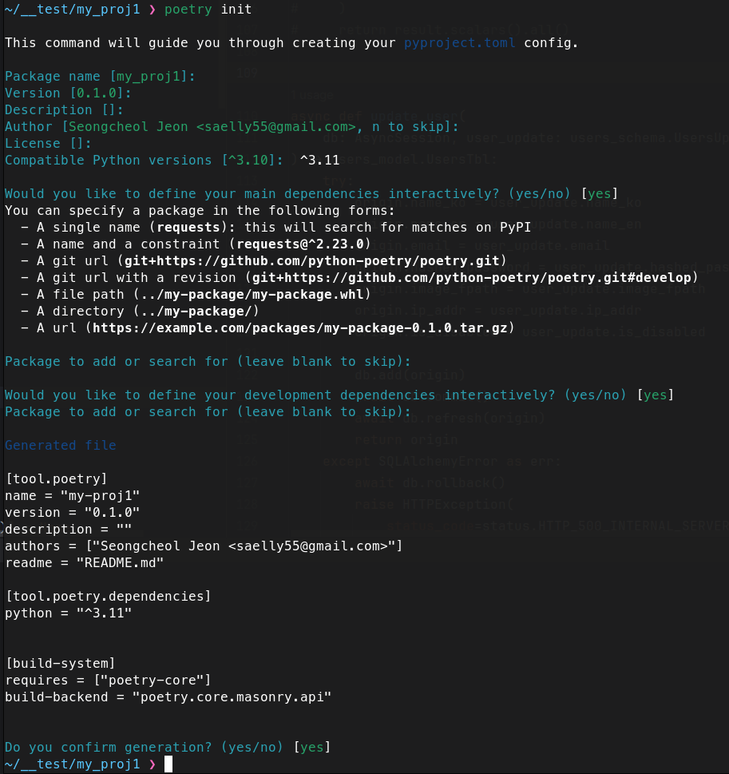
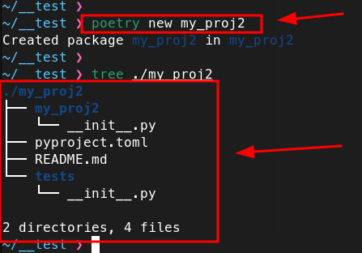
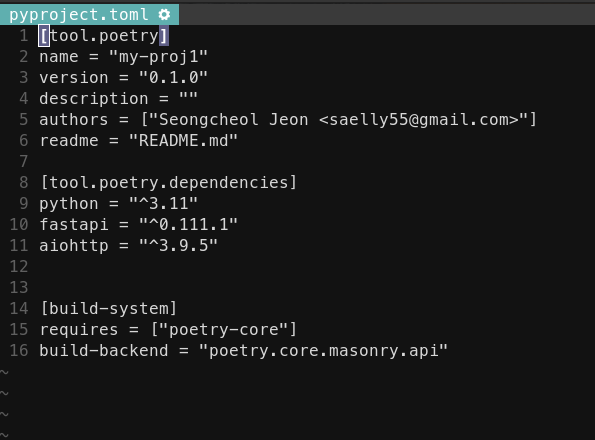
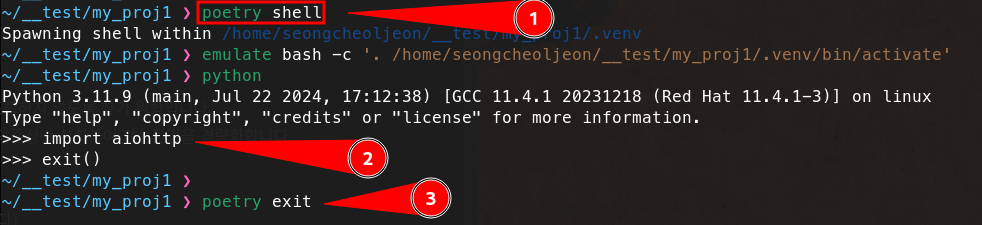
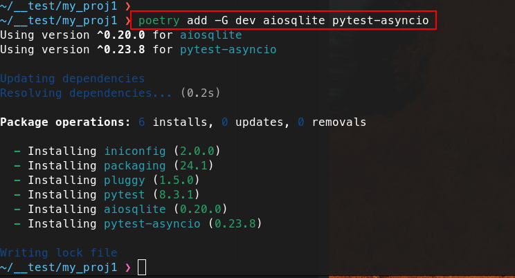
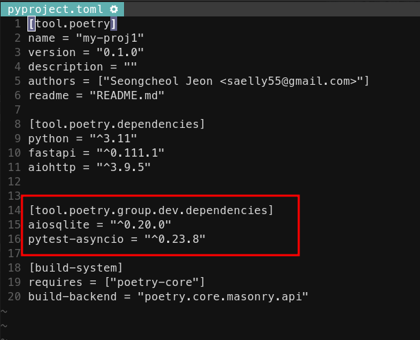

## poetry란?

[poetry](https://github.com/python-poetry/poetry) 는 `Python`프로젝트의 의존성을 관리하고, 패키지를 빌드 및 배포할 수 있도록 도와주는 도구이다.

poetry는 `pyproject.toml`파일을 사용하여 프로젝트의 의존성, 패키지 메타데이터 그리고 빌드 시스템을 정의한다.

[poetry 공식 사이트의 설치](https://python-poetry.org/docs/#installing-with-the-official-installer)

## poetry 장점 및 사용하는 이유

- __단순성__
  - 의존성 관리와 패키지 배포를 쉽게 설정하고 관리할 수 있다.
- __가상 환경 관리__
  - 별도의 도구 없이 프로젝트에 맞는 가상 환경을 자동으로 생성한다.
  - `virtualenv`를 생성하여 격리된 환경에서 빠르게 개발을 진행할 수 있다.
- __일관성__
  - `pyproject.toml`과 `poetry.lock`을 통해 일관된 개발 및 배포 환경을 유지한다.
  - `pyproject.toml`파일로 인하여 여러 프로젝트의 `config`를 명시적으로 관리할 수 있다.
- __배포__
  - 기존 파이썬 패키지 관리 도구에서 지원하지 않는 `build`, `publish`가 가능하다.
  - `dependency resolver`로 복잡한 의존성들의 버전 충돌을 방지한다.
  
## poetry의 주요 기능

- __의존성 관리__
  - `poetry add` 명령어를 사용하여 패키지를 추가하고, `poetry remove` 로 패키지를 제거한다.
- __가상 환경 관리__
  - poetry는 프로젝트마다 별도의 가상 환경을 자동으로 생성하고 관리한다. 이를 통해 패키지 간의 충돌을 방지하고, 일관된 개발 환경을 유지할 수 있다.
  - `poetry shell` 명령어를 사용하여 프로젝트의 가상 환경에 진입할 수 있다.
- __패키지 빌드 및 배포__
  - poetry는 프로젝트를 패키징하고 배포하는 데 필요한 기능을 제공한다. `poetry build` 명령어로 패키지를 빌드하고, `poetry publish` 로 `PyPi`(또는 다른 패키지 인덱스)로 패키지를 배포할 수 있다.
- __Dependency Locking__
  - `poetry.lock` 파일을 생성하여, 의존성 버전과 해시를 고정한다. 이를 통해 환경에 따라 일관된 패키지 버전을 보장한다.
- __환경 설정__
  - 프로젝트 설정 및 패키지 메타데이터는 `pyproject.toml` 파일에 정의된다. 이 파일은 PEP 518 및 PEP 621 표준에 기반하여 다양한 도구와 호환된다.
  
---

## poetry 설치

`pip`를 통해 설치

```terminal
pip install poetry
```

`shell`을 통해 설치 ([poetry 공식 설치 방법](https://python-poetry.org/docs/#installing-with-the-official-installer))

```terminal
// Linux, MacOS, Windows (WSL)
curl -sSL https://install.python-poetry.org | python3 -

// Windows (Powershell)
(Invoke-WebRequest -Uri https://install.python-poetry.org -UseBasicParsing).Content | py -
```

설치가 완료되었다면, 다음과 같은 명령어들을 실행하여 확인해보자.
```terminal
poetry --version
poetry self update
```

### poetry uninstall

poetry uninstall은 다음과 같다 (공식 문서에도 나와 있음).
```terminal
curl -sSL https://install.python-poetry.org | python3 - --uninstall
curl -sSL https://install.python-poetry.org | POETRY_UNINSTALL=1 python3 -
```

### shell에서 poetry 자동 완성 기능 설정 
```terminal
// bash
poetry completions bash >> ~/.bash_completion

// terminal
poetry completions terminal > ~/.zfunc/_poetry

// oh-my-terminal
mkdir $terminal_CUSTOM/plugins/poetry
poetry completions terminal > $terminal_CUSTOM/plugins/poetry/_poetry

// oh-my-terminal은 .terminalrc파일안의 plugins에 추가해야 한다.
plugins (
  poetry        <-- 추가한 부분
  ...
)
```

---

## 프로젝트 생성

```terminal
poetry new <my-project>
```

해당 명령어는 기본 디렉토리 구조와 파일이 포함된 새 프로젝트를 생성한다. 즉, 백지 상태에서 시작할 때 사용하는 명령어이다. 이 명령어는 새로운 프로젝트 디렉토리와 파일 구조를 자동으로 만들어주기 때문이다.

```terminal
poetry init
```

기존의 python 프로젝트 디렉토리에서 poetry를 설정하는 데 사용된다. 즉, 기존의 python 프로젝트를 `pyproject.toml`파일로 의존성 관리할 수 있도록 해준다. 
참고로 `poetry init`을 사용하면 대화 형식으로 패키지를 설치할 수 있다.

`poetry new`, `poetry init` 모두 프로젝트를 시작하는 데 유용하지만, 새로 시작하는 프로젝트에는 `poetry new`를 사용하고, 기존 프로젝트에 poetry를 적용하고자 할 때는 `poetry init`을 사용하면 된다.

### poetry로 프로젝트 셋팅

#### poetry init 사용


필수가 아닌 이상 엔터로 기본 값을 설정하면 된다.

`python = "^3.11"`의 의미는 python3.11 버전보다 높은 버전은 다 허용한다는 의미이다 (3.11이상 4.0미만).

#### poetry new 사용


`poetry new`명령을 사용하면 위와 같은 디렉토리 구조와 파일들을 자동으로 만들 수 있다. `poetry new`명령의 결과를 보면 알 수 있듯, 아무것도 없는 백지 상태에서 사용하면 좋을 명령이다.

`poetry init`명령은 기존 프로젝트를 `poetry`로 관리하고 싶을 때 사용하면 좋은 명령이다.

---

## 의존성 추가

poetry로 파이썬 패키지를 추가하는 것은 다음과 같다.

```terminal
poetry add fastapi aiohttp
```

위의 명령을 실행하면 `pyproject.toml`에 자동으로 추가된다.



`poetry shell`로 진입하여 패키지가 잘 설되었는지 확인할 수 있다.


### 개발 환경과 배포 환경의 분리

만약 개발 환경과 배포 환경을 따로따로 분리하고 싶다면 다음과 같은 명령으로 분리시킬 수 있다.


```terminal
poetry add -G dev aiosqlite pytest-asyncio
```
`poetry add -G dev` 명령에서 `-G`옵션은 그룹을 만들라는 옵션이다. 이 옵션으로 인하여 다음과 같은 라인들이 `pyproject.toml`파일에 입력된다.



이것으로 인하여 배포 환경에서는 aiosqlite, pytest-asyncio 모듈들을 ㅁ설치되지 않고 개발 환경에서만 해당 패키지들을 설치할 수 있다. 그래서 더 가볍게 배포 환경을 만들 수 있는 이점이 된다.

```terminal
poetry add <package name>
```

패키지를 프로젝트의 의존성으로 추가한다.

의존성을 추가할 때 버전 명시를 할 수 있다. 그 예는 다음과 같다.

```terminal
// 1.0.0 이상, 2.0.0 미만
poetry add numpy@^1.0.0

// 1.0.0 이상, 1.1.0 미만
poetry add numpy~1.0.0

// 버전을 명확히 명시
poetry add numpy==1.0.0

// 해당하는 버전 이상 (1.0.0 이상의 버전 제한 없음)
poetry add numpy>=1.0.0

// 최신 버전
poetry add numpy@latest

// git 저장소에 있는 패키지 설치
poetry add git+https://github.com/abc/abc.git

// 로컬에 위치한 디렉토리나 파일로 설치
poetry add ./my-packages/
poetry add ../my-package/dist/my-package-0.1.0.tar.gz
```

### 개발 환경에서만 사용할 패키지 추가

`--dev`, `-D` 옵션을 통해 개발 환경에서만 사용할 패키지를 추가할 수 있다.

```terminal
poetry add --dev numpy
```

`-G <group name>` 옵션을 통해 개발 환경에서만 사용할 패키지를 그룹에 추가할 수 있다.

```terminal
poetry add -G dev numpy
```

### requirements.txt에서 dependency 추가

```terminal
poetry add $(cat requirements.txt)
```

```terminal
xargs poetry add < requirements.txt
```

---

## 의존성 설치

다음의 명령은 `poproject.toml`에 정의된 모든 의존성을 설치한다.

```terminal
poetry install
```

- __options__
  - `--no-dev`
    - 개발환경의 라이브러리는 빼고 설치
  - `--no-cache`
    - 캐쉬를 저장하지 않는다.
  - `--no-root`
    - 현재 작업중인 코드와 관련된 패키지 설치를 건너뛰고, 오직 `pyproject.toml`에 명시된 외부 라이브러리만 설치

---

## 의존성 업데이트

```terminal
poetry update
```

denpendencies를 최신 버전으로 업데이트하고, `poetry.lock` 파일을 최신화한다. 즉, lock파일을 삭제한 후 다시 install 해 준다.

```terminal
poetry update pandas numpy
```
이렇게하면 해당 패키지의 의존성만 업데이트 해준다.

---

## 패키지 제거

```terminal
poetry remove <package name>
```
설치된 패키지를 제거한다.

```terminal
poetry remove -D <package name>
```
`--dev`, `-D` 옵션을 통해 개발 환경에서 설치된 패키지를 제거한다.

```terminal
poetry remove -G dev <package name>
```
`-G dev` 옵션을 통해 설치된 패키지를 제거한다.

---

## 패키지 출력

```terminal
poetry show
```
사용 가능한 모든 패키지를 출력한다.

- __options__
  - `--tree`
    - 패키지 의존성을 tree 형태로 출력
  - `--only main`
    - 메인 패키지만 출력

---

## poetry 속성

```terminal
poetry config --list
```
config를 출력한다.

```terminal
poetry config [options] [setting-key] [setting-value1] ... [setting-valueN]
```
config를 변경한다.

```terminal
poetry config virutalenvs.in-project true
```
프로젝트 내부에 가상환경이 잡히도록 설정한다.

```terminal
poetry config virtualenvs.path "./.venv"
```
가상환경 경로가 현재 프로젝트의 `.venv`로 잡히도록 설정한다.

---

## virtualenv 명령

```terminal
poetry run python -V
```
virtualenv 내의 존재하는 명령을 실행한다.

---

## 패키지 검색

```terminal
poetry search
```
사용 가능한 패키지를 찾는다.

```terminal
poetry search numpy pandas
```
위의 예는 numpy, pandas를 찾는 예이다.

---

## lock 파일 내보내기

```terminal
poetry export
```
poetry의 `.lock`파일을 다른 형식으로 변환하여 내보낸다.

- __options__
  - `-f`
    - -f 옵션으로 format을 지정 (default: requirements.txt) 하여 내보낸다.
    - `poetry export -f requirements.txt --output requirements.txt`

---

## 패키지 빌드

```terminal
poetry build
```
프로젝트를 패키징하여 배포 가능한 형식으로 만든다.

---

## 가상 환경 진입

```terminal
poetry shell
```
프로젝트의 가상 환경으로 들어간다.

---

## 패키지 배포

```terminal
poetry publish --repository pypi
```
PyPi에 패키지를 배포한다.

---

## poetry 가상 환경 명령어

```terminal
poetry env info
```
현재 활성화된 가상환경에 대한 정보를 얻는다.

```terminal
poetry env use <python 경로>
```
poetry로 가상환경을 생성한다.
만약 파이썬이 path에 잡혀있다면, 다음 명령어만 입력하여 가상환경을 생성할 수 있다.
```terminal
poetry env use python3.11
```

```terminal
poetry env list
```
가상 환경 리스트를 출력한다.

```terminal
poetry env remove <가상 환경 이름>
```
가상 환경을 제거한다.

---

## 🚨 이슈

### poetry add로 패키지 추가 시 작동이 멈추는 현상

`poetry init`이나 `poetry add`로 패키지를 추가할 때 작동이 멈추는 현상이 나타나면 다음과 같이 환경 변수를 설정한 후, `poetry add`를 시도해보자.

```terminal
export PYTHON_KEYRING_BACKEND=keyring.backends.null.Keyring
```

### VSCode에서 poetry 가상환경 인터프리터가 잡히지 않는 현상

생성되는 `virtualenv`환경을 프로젝트 폴더 내부에 생성(.venv)되게 설정하면 된다.

```terminal
// config 변경
poetry config virtualenvs.in-project true
poetry config virtualenvs.path "./.venv"
```
