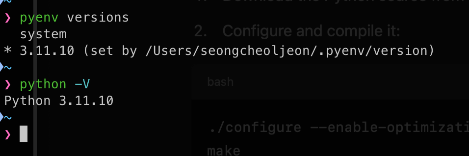

[pyenv](https://github.com/pyenv/pyenv)는 OS상에서 여러 버전의 `Python`을 안전하게 설치할 수 있도록 도와주는 open-source 라이브러리이다.

- __여러 Python 버전 관리__
  - 하나의 시스템에서 다양한 Python 버전을 동시에 설치하고 사용할 수 있다. 프로젝트별로 각기 다른 Python 버전을 요구할 때 매우 유용하다.
- __Global/Local Python 버전 설정__
  - 시스템 전체에서 사용할 기본 Python 버전을 설정하거나, 특정 프로젝트 디렉토리 안에서만 사용하는 로컬 Python 버전을 따로 설정할 수 있다. 이렇게 하면 프로젝트별로 다른 Python 버전을 손쉽게 사용할 수 있다.
- __독립적인 환경 구성__
  - 프로젝트마다 독립적인 환경을 구성할 수 있어, 다른 프로젝트 간에 충돌을 방지하고 의존성 문제를 해결하는데 도움이 된다.
- __Python 버전 설치 및 업그레이드 용이__
  - pyenv는 다양한 Python 버전을 자동으로 다운로드 및 설치할 수 있는 간단한 명령어를 제공한다. 최신 버전으로 손수비게 업그레이드하거나, 특정 과거 버전을 빠르게 설치할 수 있다.
- __기존 시스템 Python 손상 방지__
  - pyenv는 기존 시스템에 설치된 Python 버전과 충돌하지 않으며, 이를 덮어쓰지 않는다. 따라서 시스템 Python에 의존하는 프로그램을 안전하게 유지할 수 있다.
- __다양한 Python 배포판 지원__
  - pyenv는 CPython뿐만 아니라 PyPy, Anaconda등 다양한 Python 배포판을 관리할 수 있다.
- __플러그인 지원__
  - pyenv는 `pyenv-virtualenv`등의 플러그인을 통해 가상 환경 관리도 가능하게 해 준다. 가상 환경을 프로젝트별로 생성하고 관리할 때 유용하다.
  
pyenv는 특히 여러 프로젝트를 관리해야 하거나 다양한 라이브러리 및 툴과 호환성을 고려해야 할 때, pyenv는 훌륭한 선택이다. Mac이나 Linux 환경에서도 설치와 사용이 매우 수월해, 개발자들에게 많이 추천되는 도구이다.

---

## MacOS

이것을 MacOS에서 사용해보자. 

### pyenv 설치

```terminal
brew install pyenv
```

mac 사용자라면 보통 terminal을 사용할 것이다. pyenv를 설치했다면 ~/.terminalrc에 다음의 환경설정을 구성하자.

```shell
export PYENV_ROOT="${HOME}/.pyenv"
[[ -d ${PYENV_ROOT}/bin ]] && export PATH="${PYENV_ROOT}/bin:${PATH}"
eval "$(pyenv init --path)"
eval "$(pyenv init -)"
```

저장한 후 터미널을 다시 실행하여 아래의 명령어를 통해 pyenv의 버전을 확인해본다.

```terminal
pyenv --version
```

### pyenv plugin 설치

pyenv의 필수적인 플러그인들을 설치하자.

#### virtualenv

virtualenv는 pyenv를 통해 가상 환경을 만드는 플러그인이다.

```terminal
git clone https://github.com/pyenv/pyenv-virtualenv.git $(pyenv root)/plugins/pyenv-virtualenv
```

#### update

update는 pyenv 자체를 업데이트하는 플러그인이다. 이 플러그인을 통해 새로운 파이썬 버전 패키지들을 갱신하여 설치할 수 있다.

```terminal
git clone https://github.com/pyenv/pyenv-update.git $(pyenv root)/plugins/pyenv-update
```

### pyenv update

```terminal
pyenv update
```

위의 명령으로 최신 버전들을 갱신하자. 그 후 `pyenv install -l` 명령을 통해 현재 어떤 패키지들을 설치할 수 있는지를 확인할 수 있다.

#### 새 버전을 찾을 수 없는 경우 pyenv 업데이트

python의 새 버전이 나오지 않는다면 pyenv 자체를 업데이트해야 한다. 이때 pyenv-update 플러그인이 필요하다. 이 플러그인을 이용하면 쉽게 업데이트 할 수 있다.

### 특정 버전의 python 설치

```terminal
pyenv install <version>
```

해당 명령을 통해 원하는 버전의 파이썬을 설치하자. 만약 `3.11.10` 버전의 파이썬을 설치하고 싶다면 다음과 같이 명령하면 된다.

```terminal
pyenv install 3.11.10
```

이렇게 설치된 파이썬 버전을 시스템 전반적으로 적용하고 싶다면 아래의 명령을 통해 적용할 수 있다.

```terminal
pyenv system 3.11.10
```

잘 적용되었는지 확인은 `pyenv versions` 혹은 `pyenv version` 명령을 통해 확인할 수 있다. 아니면 `python -V` 로 현재 파이썬 버전을 확인하면 된다.

### 특정 버전의 python 제거

```terminal
pyenv uninstall <version>
```

### python 설치 시 에러 😢

만약 pyenv를 통해 python을 설치할 때, 다음과 같은 에러가 발생한다면...

```output
ModuleNotFoundError: No module named '_lzma'
WARNING: The Python lzma extension was not compiled. Missing the lzma lib?
```

아래의 명령을 실행 한 후 다시 시도해보자.

```terminal
brew install xz
```



위의 모습은 pyenv를 통해 python을 설치한 후 적용한 모습이다.

### pyenv를 사용하여 python 버전 전환

pyenv는 시스템 전체, 디렉토리 단위로 버전 지정이 가능하다. 다만, 시스템 전체를 바꾸어 버리면 문제가 발생할 수 있으므로 디렉토리 단위로 설정해 운용해야 안전하다.

#### 디렉토리 단위의 파이썬 버전 지정

```terminal
$ python --version
Python 3.9.16

$ mkdir ~/sandbox-venv
$ cd ~/sandbox-venv
$ pyenv local 3.7.17

$ python --version
Python 3.7.17 		<-- 디렉토리내에서 유효한 버전
```

디렉토리 단위의 경우 `.python-version`이라는 설정 파일이 생겨 그곳에서 버전이 지정된다. 이 디렉토리 아래에서는 지정된 버전의 python이 동작하고, 디렉토리를 벗어나면 os의 python을 사용하도록 전환된다.

개발중인 디렉토리에 pyenv로 지정해두면 나머지는 버전을 의식하지 않아도되므로 상당히 편리하다. 😆

#### OS 시스템 단위의 파이썬 버전 지정

OS 전체에서 버전을 지정하려면 다음과 같이 하면 된다.

```terminal
$ pyenv global 3.7.17
$ python --version
Python 3.7.17
```

다시 원래의 시스템 파이썬 버전으로 되돌리려면 다음과 같이 명령한다.

```terminal
pyenv global system
```

#### Shell 단위의 파이썬 버전 지정

다음 명령어를 사용하면 현재 `shell` 에서만 해당 버전을 사용할 수 있다.

```terminal
pyenv shell 3.7.17
```

### pyenv-virtualenv로 파이썬 개별 환경 관리

pyenv를 사용하여 python의 버전 관리를 할 수 있게 되었다. 다만 개발 환경마다 관리하고 싶은 경우는 `pyenv-virutalenv`를 사용해야 한다.

같은 버전의 python으로 완전히 다른 프로젝트를 만들고 싶을 때는 `pyenv-virtualenv`로 환경을 나누면 패키지가 충돌되지 않고 편리하게 사용할 수 있다.

#### pyenv에서 개별 환경 설정

같은 버전의 python을 사용하는 프로젝트에 대해 두 가지 환경을 설정하는 예이다.

```terminal
$ pyenv versions
* system (set by /usr/local/pyenv/version)
  3.7.17
  
// virutalenv 만들기
$ pyenv virtualenv 3.7.17 appA-3.7.17
$ pyenv virtualenv 3.7.17 appB-3.7.17

$ pyenv versions
* system (set by /usr/local/pyenv/version)
  3.7.17
  3.7.17/envs/appA-3.7.17
  3.7.17/envs/appB-3.7.17
  appA-3.7.17
  appB-3.7.17
  
// 만든 virtualenv 사용
$ pyenv local appA-3.7.17

// 이와 같이 나누어 사용할 수 있다.
// pip list
Package    Version
__________ ________
pip        22.3
setuptools 65.5.0
```

패키지를 각각 관리할 수 있으므로, 이것을 설정해두면 프로젝트 환경을 옮길때에도 편리해진다.

#### 만약 해당 프로젝트를 다른 시스템으로 옮긴다면...

##### pyenv에서 버전 관리하는 디렉토리로 이동하여 설치된 패키지 목록 내보내기

```terminal
$ pip freeze > requirements.txt
```

다른 시스템에 프로젝트를 옮겼다는 가정하에, 동일한 python 버전을 설치한 후 버전 관리하는 디렉토리로 이동하여 `requirements.txt` 패키지를 일괄 설치

```terminal
$ pip install -r requirements.txt
```

---

## Linux

리눅스에서의 pyenv 설치방법은 다음과 같다.

```terminal
# pyenv에 필요한 패키지 설치
dnf -y install gcc bzip2 bzip2-devel openssl openssl-devel readline readline-devel sqlite-devel tk-devel git
```

```terminal
$ cd <디렉토리>
$ git clone https://github.com/pyenv/pyenv.git
$ cd pyenv
$ mkdir {versions,shims}

// pyenv plugin 설치
$ cd plugins

# pyenv-virtualenv는 프로젝트마다 개별 환경을 구축하기 위한 플러그인
$ git clone https://github.com/pyenv/pyenv-virtualenv.git

// pyenv-update는 pyenv 자체를 업데이트하는 플러그인
$ git clone https://github.com/pyenv/pyenv-update.git
```

그 후 환경 설정을 적용한다.

```shell
function _pyenv_env()
{
    export PYENV_ROOT="<pyenv가 설치된 디렉토리 경로>"

    local __PYENV_SHIMS="${PYENV_ROOT}/shims"
    local __PYENV_BIN="${PYENV_ROOT}/bin"

    [[ ":$PATH:" != *":${__PYENV_SHIMS}:"* ]] && PATH="${__PYENV_SHIMS}:${PATH}"
    [[ ":$PATH:" != *":${__PYENV_BIN}:"* ]] && PATH="${__PYENV_BIN}:${PATH}"
}

_pyenv_env
```

위의 과정을 모두 완료하였다면 다음과 같은 명령으로 pyenv를 확인할 수 있다.

```terminal
$ pyenv --version
```

---

## 🚨 pyenv와 anaconda 충돌 주의

파이썬에서 머신러닝을할 때 anaconda 패키지를 이용하여 가상 환경을 구축해 진행하는 일이 있다. 
anaconda는 올인원 패키지로 기계 학습 환경을 구축해주고 패키지를 관리해준다. anaconda 관리하에 `pip`를 사용하면 anaconda가 망가질 수 있으므로 주의해야 한다.

pyenv를 사용한다면 `pip`로 패키지를 관리해주고, anaconda라면 `conda`명령으로만 관리하는 것이 좋다.
