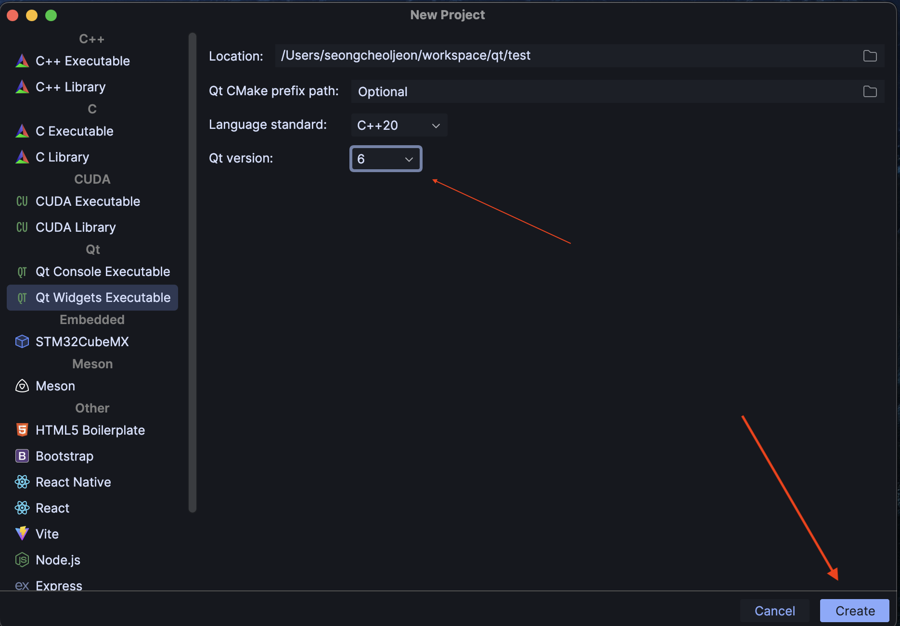
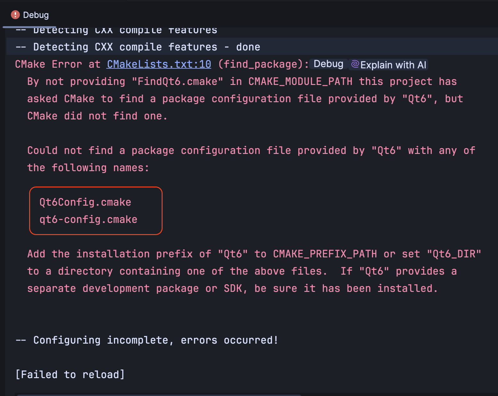
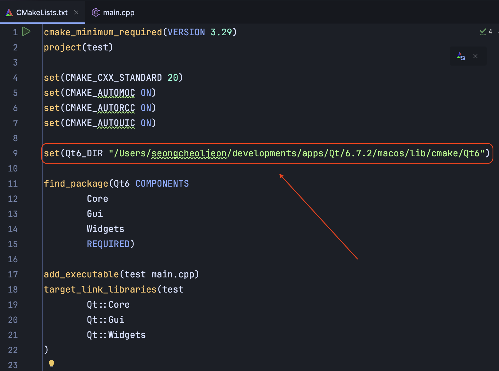
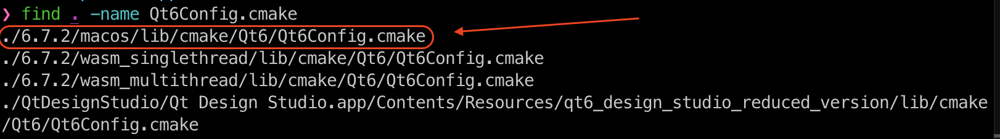
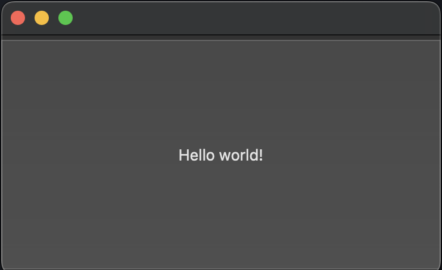

Jetbrains의 `CLion`에서 `Qt6`를 실행해보자.

우선 [Clion](https://www.jetbrains.com/ko-kr/clion/)은 설치되었다고 가정하겠다. 그러면 `Qt6`를 설치해야 한다. [여기(Qt6)](https://www.qt.io/download-qt-installer-oss?utm_referrer=https%3A%2F%2Fwww.qt.io%2Fdownload-open-source)를 클릭하여 `Qt6`를 다운받도록 하자.

`Qt6` 설치 방법은 인터넷에 많이 나와 있으니 그것들을 참고하여 설치하도록 하자.

이제 모두 설치가 되었다면, `clion`을 실행하여 `New Project`를 클릭한 후 `Qt6` 프로젝트를 생성하자.



생성하였다면, 아래의 그림과 같이 `Debug`창에 `cmake` 에러가 발생할 것이다. 그 이유는 현재의 `cmake`는 `Qt6`의 `Qt6Config.cmake` 라는 `CMakeLists.txt` 파일의 위치를 모르기 때문이다.



따라서 최상위의 `CMakeLists.txt` 파일에서 `Qt6`의 `cmake` 파일 경로를 잡아주어야 한다.



`set(Qt6_DIR "<Qt6Config.cmake 파일의 디렉토리 경로>`

`Qt6_DIR` 변수에 `Qt6Config.cmake`파일이 존재하는 `디렉토리 경로`를 대입하였다.

그 다음, `CLion`에서 `Reload CMake Project`를 실행하여 `CMakeLists.txt`파일을 갱신시키면 `Debug` 창에 에러가 사라질 것이다.

> 참고로 `Qt6Config.cmake` 파일의 위치를 모르겠다면, 다음과 같이 실행하여 찾아보자.
> ```zsh
> find <Qt6 설치 경로> -name Qt6Config.cmake
> ```



이제 `build`를 하면 아래처럼 `widget`이 나타날 것이다. 😄


