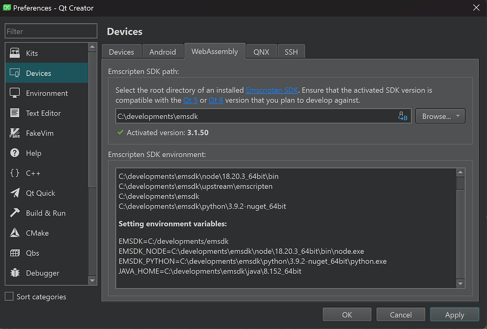
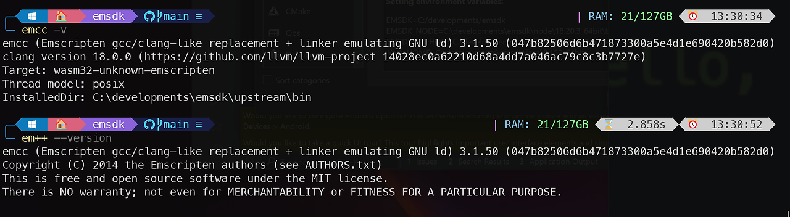

나는 Qt6.7을 설치하면서 Qt를 위한 웹어셈블리 패키지도 함께 설치하였다. 그래서 [WASM SDK](https://emscripten.org/docs/getting_started/downloads.html)를 잡아주어야 한다.

그런데 내가 설치한 Qt 버전과 호환성이 좋은 WASM 버전을 설치해야 하는데, 어는 버전을 설치하는 것이 좋을지 고민하였다. 아래는 그 질문에 대한 답이 나와 있다.

[Qt for WebAssembly](https://doc.qt.io/qt-6/wasm.html#install-emscripten) 이 사이트로 가서 확인해보면, `Qt6.7`의 경우 `SDK`의  버전은 `3.1.50`이다. 그래서 해당 버전을 설치하였다.

## Emscripten 설치

소스 다운로드
```terminal
git clone https://github.com/emscripten-core/emsdk.git
```
emsdk 설치
```terminal
cd emsdk
./emsdk install 3.1.50
./emsdk activate 3.1.50
```




## WebAssembly Build & Test

간단한 `main.cpp` 파일을 생성하자.

```cpp
#include <iostream>

int main() {
  std::cout<<"Hello World!"<<std::endl;

  return 0;
}
```

`main.cpp`를 컴파일하면, `javascript`파일이 생성된다. 이것을 `node`를 통해 실행하면 터미널에 "Hello World!"가 출력된다.

```terminal
// build
em++ main.cpp

// run
node a.out.js
```

### HTML 파일을 생성하는 방법

```terminal
// html 파일 생성
em++ main.cpp -o main.html

// run 
emrun main.html
```
