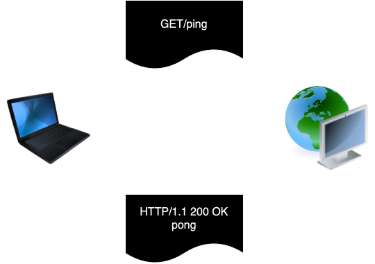
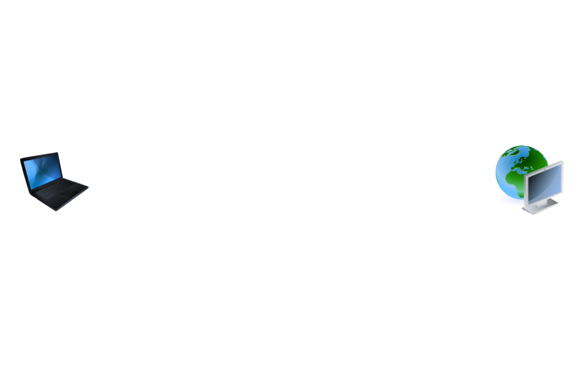

## HTTP란?

`HTTP`는 `HyperText Transfer Protocol`의 약자로서, 웹상에서 서로 다른 서버 간에 하이퍼텍스트 문서, 즉 `HTML`을 서로 주고 받을 수 있도록 만들어진 프로토콜 통신 규약이다. 
웹상에서 네트워크를 통해 서버 사이에 통신할 때 어떠한 형식으로 서로 통신하자고 규정해 놓은 `통신 형식` 혹은 `통신 구조`라고 보면 된다.

> 서버 간의 통신에서 서로 이해할 수 있도록 공통의 통신 형식이 필요하다. 이런 통신 형식을 `프로토콜(Protocol)` 이라고 한다.

프로토콜 중 가장 널리 사용되는 프로토콜이 바로 `HTTP`이다. 그래서 `Frontend` 시스템과 `Backend` API 시스템은 일반적으로 `HTTP 프로토콜`을 기반으로 통신한다. 그러므로 `HTTP`의 대해서 잘 알아야 한다.


## HTTP 통신 방식

HTTP 통신 방식에는 2가지 특징이 있다. HTTP의 `요청(request) & 응답(response)` 방식과 `stateless` 특징이다.

### HTTP 요청과 응답

HTTP는 기본적으로 `요청(request)`과 `응답(response)`의 구조로 되어 있다. HTTP를 기반으로 통신할 때 클라이언트가 먼저 HTTP 요청을 서버에 보내면 서버는 요청을 처리한 후, 결과에 따른 HTTP 응답을 클라이언트에게 보냄으로써 하나의 HTTP 통신이 된다.



그러므로 `백엔드 API 시스템`의 `엔드포인트(endpoint) 구현`도 기본적으로 `HTTP 요청`을 `input`으로 받아서 HTTP 응답을 `output`으로 반환하는 구조로 구현을 하게 된다.

### stateless

HTTP 통신은 `stateless`이다. `stateless`는 말 그대로 **`상태(state)`가 없다는 뜻**으로, HTTP 통신에서는 ***`상태(state)`라는 개념이 존재하지 않는다.***

> HTTP 통신에서는 `상태(state)` 라는 개념이 존재하지 않는다.

위에서 HTTP 통신은 `요청(request)`과 `응답(response)`의 구조로 되어 있으며, 서버가 클라이언트로부터 요청을 받고 응답을 보내는 것이 하나의 `HTTP 통신`이라고 했다. 클라이언트와 서버는 HTTP 통신을 여러 번 주고받는 것이 일반적인데, HTTP 프로토콜에서는 동일한 클라이언트와 서버가 주고받은 HTTP 통신들이라도 서로 연결되어 있지 않다. 
즉, **각각의 HTTP 통신은 `독립적`이며 그 전에 처리된 HTTP 통신에 대해서 전혀 알지 못한다.** 그렇기에 HTTP 프로토콜을 `stateless`라고 하는 것이다.

> HTTP 프로토콜이 `stateless`이기 때문에 서버 디자인이 훨씬 간단해지는 효과적인 장점이 있다. 

HTTP 통신들의 상태를 서버에서 저장할 필요가 없으므로 여러 다른 HTTP 통신 간의 진행이나 연결 상태의 처리나 저장을 구현 및 관리하지 않아도 되기 때문이다. 오직 각각의 HTTP 요청에 대해 독립적으로 응답만 보내 주면 된다.

다만, 단점은 `stateless`이기 때문에 HTTP 요청을 보낼 때는 해당 요청을 처리하기 위해 필요한 모든 데이터를 매번 포함시켜서 요청을 보내야 한다. 

예를 들어, 어떠한 HTTP 요청을 처리하기 위해서 해당 사용자가 로그인이 되어야 한다고 가정해 보자.해당 사용자가 이미 그전의 HTTP 통신을 통해서 로그인을 한 상태라고 하더라도 HTTP는 `stateless`이기 때문에 새로 보내는 HTTP 통신에서는 해당 사용자가 그전 HTTP 통신에서 로그인했다는 사실을 알지 못한다. 그러므로 HTTP 요청을 보낼 때 해당 사용자의 로그인 사실 여부를 포함시켜서 보내야 한다.

사용자의 로그인 사실 여부를 포함시켜서 HTTP 요청을 보내기 위해서는 클라이언트가 사용자의 로그인 사실 여부를 기억하고 있어야 한다. 이러한 점을 해결하기 위해서 `쿠기(cookie)`나 `세션(session)` 등을 사용하여 HTTP 요청을 처리할 때 필요한 진행 과정이나 데이터를 저장한다.

## 쿠키(cookie)와 세션(session)

`쿠키(cookie)`는 웹 브라우저가 웹사이트에서 보내온 정보를 저장할 수 있도록 하는 조그마한 `파일`을 말한다. 앞서 말한 대로 `HTTP`는 `stateless`이므로 클라이언트에서 HTTP 요청을 보낼 때 필요한 모든 정보를 포함해서 보내야 한다. 그러므로 클라이언트가 필요한 정보를 포함해서 보낼 수 있으려면 클라이언트가 정보를 저장할 수 있는 메커니즘이 필요하다. 웹 브라우저는 `쿠키(cookie)`라고 하는 파일을 사용해서 필요한 정보를 저장한다.

`세션(session)`은 `쿠키(cookie)`와 마찬가지로 HTTP 통신 상에서 필요한 데이터를 저장할 수 있게 하는 메커니즘이다. `쿠키(cookie)`와 `차이점`이라면 쿠키(cookie)는 `웹 브라우저`, 즉 클라이언트 측에서 데이터를 저장하는 반면에 `세션(session)`은 `웹 서버(Web Server)`에서 데이터를 저장한다.

> `Cookie`는 클라이언트 측에 데이터를 저장   
> `Session`은 웹 서버에 데이터를 저장
{: .prompt-info }



## HTTP 요청 구조

HTTP 통신은 요청과 그에 대한 응답으로 이루어져 있다. 그러면 HTTP 요청과 응답 메시지(message)가 어떠한 구조로 이루어져 있는지 살펴보자. 
HTTP 요청은 다음과 같은 형태로 되어 있다.

```http
POST /payment-sync HTTP/1.1

Accept: application/json
Accept-Encoding: gzip, deflate
Connection: keep-alive
Content-Length: 83
Content-Type: application/json
Host: intropython.com
User-Agent: HTTPie/0.9.5

{
    "imp_uid": "imp_12345678",
    "merchant_uid": "order_id_1234",
    "status": "paid"
}
```

HTTP 요청 메시지는 크게 다음의 세 부분으로 구성되어 있다.

1. Start Line
2. Headers
3. Body

### Start Line

이름 그대로 HTTP 요청의 시작줄이다. 예를 들어 "search" 엔드포인트에 GET HTTP 요청을 보낸다면 해당 HTTP 요청의 `start line`은 다음과 같다.

```http
GET /search HTTP/1.1
```

`start line`은 세 부분으로 구성되어 있다.

- HTTP 메서드
- Request Target
- HTTP Version

#### HTTP 메서드

`HTTP 메서드`는 해당 HTTP 요청이 의도하는 `액션(action)`을 정의하는 부분이다. 예를 들어, 서버로부터 어떠한 데이터를 받고자 한다면 GET 요청을 보내고, 서버에 새로운 데이터를 저장하고자 한다면 POST 요청을 보내는 등의 식이다. 
HTTP 메서드에는 `GET`, `POST`, `PUT`, `DELETE`, `OPTIONS` 등 여러 메서드(method)들이 있다. 하지만 그 중 `GET`과 `POST`가 가장 널리 쓰인다.

#### Request Target

`Request Target`은 해당 HTTP 요청이 전송되는 목표 `주소(address)`를 말한다. 예를 들어, "ping" 엔드포인트에 보내는 HTTP 요청의 경우 `request target`은 `/ping`이 된다.

#### HTTP Version

`HTTP Version`은 이름 그대로 해당 요청의 HTTP 버전을 나타낸다. HTTP 버전에는 현재 `1.0`, `1.1`, `2.0`이 있다. **HTTP 버전을 명시하는 이유**는 HTTP 버전에 따라 HTTP 요청 메시지의 구조나 데이터가 약간씩 다를 수 있으므로 서버가 받은 요청의 ` HTTP Version`에 맞춰서 응답을 보낼 수 있도록 하기 위함이다.

---

### Header

`start line` 다음에 나오는 부분은 `헤더(header)`이다. 헤더 정보는 HTTP 요청 그 자체에 대한 정보를 담고 있다. 예를 들어, HTTP 요청 메시지의 전체 크기(Content-Length) 같은 정보를 담고 있다.

`헤더(header)`는 Python의 Dictionary처럼 `key`와 `value`로 되어 있다. 그리고 key와 value는 `:`로 연결된다. 즉, `key:value`로 표현된다. 예를 들어, google.com에 보내는 HTTP 요청의 Host 헤더의 경우 다음과 같이 표현된다.

```http
HOST : google.com
```

- __`key`__
  - Host이다.
- __`Value`__
  - google.com이다.

HTTP 헤더는 다양한 헤더가 있는데, 그 중 자주 사용하는 헤더 정보는 다음과 같다.

- __`Host`__
  - 요청이 전송되는 target의 호스트의 URL 주소를 알려주는 헤더이다.
    - 예) Host : google.com
- __`User-Agent`__
  - 요청을 보내는 클라이언트의 대한 정보: 예를 들어, 웹 브라우저에 대한 정보.
    - 예) User-Agent: Mozilla/5.0 (Macintosh: Intel Mac OSX 10_13_5) AppleWebKit/537.36 (KHTML, like Gecko) Chrome/68.0.3440.106 Safari/537.36
- __`Aceept`__
  - 해당 요청이 받을 수 있는 응답(response) body 데이터 타입을 알려 주는 헤더.
MIME (Multipurpose Internet Mail Extensions) type이 value로 지정된다. 예를 들어, JSON 데이터 타입을 요청하는 경우에는 application/json MIME type을 value로 정해 주면 된다. 모든 데이터 타입을 다 허용하는 경우에는 `*/*` 로 지정해 주면 된다.
  - MIME type은 굉장히 다양하다. 그러나 그 중 API에서 자주 사용되는 MIME type은 `application/json`과 `application/octet-stream`, `text/csv`, `text/html`, `image/jpeg`, `image/png`, `text/plain` 그리고 `application/xml` 정도이다.
MIME type에 대한 더 자세한 정보는 Mozilla의 MIME type 페이지를 참고하자.
  - 예) Accept: `*/*`
- __`Connection`__
  - 해당 요청이 끝난 후에 클라이언트와 서버가 계속해서 네트워크 연결(connection)을 유지할 것인지 아니면 끊을 것인지에 대해 알려주는 헤더이다.
  - HTTP 통신에서 서버 간에 네트워크 연결하는 과정이 다른 작업에 비해 시간이 걸리는 부분이므로 HTTP 요청 때마다 네트워크 연결을 새로 만들지 않고 HTTP 요청이 계속되는 한 처음 만든 연결을 재사용하는 것이 선호되는데, 그에 관한 정보를 전달하는 헤더이다.
  - connection 헤더의 값이 keep-alive이면 앞으로도 계속해서 HTTP 요청을 보낼 예정이므로 네트워크 연결을 유지하라는 뜻이다.
  - connection 헤더의 값이 close라고 지정되면 더 이상 HTTP 요청을 보내지 않을 것이므로 네트워크 연결을 닫아도 된다는 뜻이다.
    - 예) Connection: keep-alive
- __`Content-Type`__
  - HTTP 요청이 보내는 메시지 body의 타입을 알려 주는 헤더이다. Accept 헤더와 마찬가지로 MIME type이 사용된다. 예를 들어, HTTP 요청이 JSON 데이터를 전송하면 Content-Type 헤더의 값은 `application/json`이 될 것이다.
    - 예) Content-Type: application/json
- __`Content-Length`__
  - HTTP 요청이 보내는 메시지 body의 총 사이즈를 알려 주는 헤더이다.
    - 예) Content-Length: 257

### Body

HTTP 요청 메시지에서 body 부분은 HTTP 요청이 전송하는 데이터를 담고 있는 부분이다. 전송하는 데이터가 없다면 body 부분은 비어 있게 된다.

--- 

## HTTP 응답 구조

HTTP 응답 메시지의 구조도 요청 메시지와 마찬가지로 크게 세 부분으로 구성되어 있다.

```http
# 첫 번째
HTTP/1.1 404 Not Found

# 두 번째
Connection: close
Content-Length: 1573
Content-Type: text/html; charset=UTF-8
DAte: Mon, 27 May 2024 22:01:55 GMT

# 세 번째
<!DOCTYPE html>
<html lang=en>
	<meta charset=utf-8>
    ...
```

1. `status line`
2. `headers`
3. `body`

HTTP 응답 메시지의 각 부분에 대해 알아보자.

### Status Line

이름 그대로 HTTP 응답 메시지의 상태를 간략하게 요약하여 알려 주는 부분이다. 다음과 같은 형태로 구성되며, HTTP 요청의 start line과 마찬가지로 status line도 다음과 같은 세 부분으로 구성되어 있다.

```
<1>       <2>  <3>
HTTP/1.1  404  Not Found
```

- HTTP Version
- Status Code
- Status Text

`HTTP Version`은 HTTP 요청 메시지의 `start line`과 마찬가지로 사용되고 있는 HTTP 버전을 나타낸다.

`status code`는 HTTP 응답 상태를 미리 지정되어 있는 숫자로 된 코드로 나타내준다. 예를 들어, HTTP 요청이 정상적으로 처리가 되었으면 응답의 `status code`는 `200`이라는 숫자로 표현된다.

`status text`는 HTTP 응답 상태를 간략하게 글로 설명해 주는 부분이다. 아무래도 숫자로 표현되어 있는 `status code`만으로는 항상 응답의 상태를 파악하기 어려울 수 있으므로 그 부분을 보완해 주는 역할을 한다고 생각하면 된다. 예를 들어, HTTP 요청이 정상적으로 처리한 HTTP 응답의 `status code`는 `200`이 되고, `status text`는 `OK`가 된다.

### Header

HTTP 응답의 헤더 부분은 HTTP 요청의 헤더 부분과 동일하다. 다만 HTTP 응답에서만 사용되는 헤더 값들이 있다. 예를 들어, HTTP 응답에는 User-Agent 헤더 대신에 Server 헤더가 사용된다.

### Body

HTTP 응답 메시지의 body도 HTTP 요청 메시지의 body와 동일하다. 그리고 요청 메시지와 마찬가지로 전송하는 데이터가 없다면 body 부분은 비어 있게 된다.

---

## 자주 사용되는 HTTP 메서드

HTTP 메소드는 HTTP 요청이 의도하는 `액션(action)`을 정의하는 부분이라고 언급하였다. API를 개발하는 데 있어서 HTTP 메소드를 잘 이해하고 적절한 HTTP 메소드를 사용하는 것이 중요하다. 다양한 HTTP 메소드들이 있는데 그 중 가장 가주 사용되는 HTTP 메소드들에 대해 알아 보자.

### GET

`GET 메소드`는 `POST 메소드`와 함께 가장 자주 사용되는 HTTP 메소드이다. GET 메소드는 이름 그대로 어떠한 데이터를 서버로부터 `요청(GET)`할 때 주로 사용하는 메소드다. 즉, 데이터의 생성이나 수정 그리고 삭제등의 변경 사항이 없이 단순히 `데이터를 받아 오는 요청`이 주로 `GET 메소드로 요청`된다.주로 데이터를 받아 올 때 사용되므로 해당 HTTP 요청의 body가 비어 있는 경우가 많다.

### POST

GET과는 다르게 데이터를 `생성`하거나 `수정` 및 `삭제` 요청을 할 때 주로 사용되는 HTTP 메소드이다.

### OPTIONS

`OPTIONS 메소드`는 주로 특정 엔드포인트에서 허용하는 메소드들이 무엇이 있는지 알고자 하는 요청에서 사용되는 HTTP 메소드이다. 엔드포인트는 허용하는 HTTP 메소드가 지정되도록 되어 있으며, 허용하지 않는 HTTP 메소드의 요청이 들어오면 `405 Method Not Allowed` 응답을 보내게 된다.
예를 들어, `ping` 엔드포인트의 경우 GET 메소드 요청만 받도록 구현되어 있다. 그러므로 만일 POST 요청을 보내면 `405 Method Not Allowed` 응답을 받는다. 그러므로 엔드포인트가 어떠한 HTTP 메소드 요청을 허용하는지 알고자 할 때 OPTIONS 요청을 보내게 된다. 

```http
HTTP/1.0 200 OK

Allow: GET, HEAD, OPTIONS
Content-Length: 0
Content-Type: text/html; charset=utf-8
Date: Tue, 28 May 2024 02:16:00 GMT
Server: Werkzeug/0.14.1 Python3.8.0
```

> OPTIONS 요청을 보내면, 응답에는 `Allow 헤더`를 통해 해당 엔드포인트가 허용하는 HTTP 메서드를 보내준다.

위의 HTTP 응답을 보면 `Allow 헤더`에 `GET`, `HEAD`, `OPTIONS`가 나열된 것을 볼 수 있다. 그 뜻은 `ping` 엔드포인트가 `GET`, `HEAD` 그리고 `OPTIONS` 메서드 요청들을 `허용`한다는 뜻이다.

### PUT

POST 메소드와 비슷한 의미를 가지고 있는 메소드이다. 즉, 데이터를 새로 생성할 때 사용되는 HTTP 메소드이다. POST와 중복되는 의미이므로 ***데이터를 새로 생성하는 HTTP 요청을 보낼 때 굳이 PUT을 사용하지 않고 모든 데이터 생성 및 수정 관련한 요청은 다 POST로 통일해서 사용하는 시스템이 많아지고 있다.***

### DELETE

이름 그대로 데이터 삭제 요청을 보낼 때 사용되는 메서드이다. `PUT`과 마찬가지로 `POST`에 밀려서 잘 사용되지 않는 메서드이다.

--- 

## 자주 사용되는 HTTP Status Code와 Text

`HTTP 요청`에는 HTTP 메소드를 잘 이해하는 것만큼 HTTP 응답에서는 `HTTP status code`와 `text`를 잘 이해하여 HTTP 응답을 보낼 때 적절한 `status code`의 응답을 보내는 것 또한 굉장히 중요하다. `HTTP status code`도 다양한 `status code`들이 있는데, 그 중 가장 자주 사용되는 `status code`와 `text`에 대해 알아 보자.

### 200 OK

가장 자주 보게 되는 status code이다. HTTP 요청이 문제 없이 성공적으로 잘 처리 되었을 때 보내는 status code이다.

### 301 Moved Permanently

HTTP 요청을 보낸 엔드포인트의 URL 주소가 바뀌었다는 것을 나타내는 status code이다. 301 status code의 HTTP 응답은 Location 헤더가 포함되는 것이 일반적인데, Location 헤더에 해당 엔드포인트의 새로운 주소가 포함되어 나온다. 301 요청을 받은 클라이언트는 Location 헤더의 엔드포인트의 새로운 주소에 해당 요청을 다시 보내게 된다. 이러한 과정을 "redirection"이라고 한다.

```http
HTTP/1.1 301 Moved Permanently
Location: http://www.example.org/index.asp
```

### 400 Bad Request

HTTP 요청이 `잘못된 요청`일 때 보내는 응답 코드이다. 주로 요청에 포함된 인풋(input) 값들이 잘못된 값들이 보내졌을 때 사용된다. 예를 들어, 사용자의 전화번호를 저장하는 HTTP 요청인데, 만일 전화번호에 숫자가 아닌 글자가 포함됐을 경우 해당 요청을 받은 서버에서는 잘못된 전화번호 값이므로 `400` 응답을 해당 요청을 보낸 클라이언트에게 보내는 것이다.

### 401 Unauthorized

HTTP 요청을 처리하기 위해서는 해당 요청을 보내는 주체(`사용자` 혹은 `클라이언트`)의 `신분(credential)` 확인이 요구되나 확인할 수 없었을 때 보내는 응답 코드이다. 주로 해당 HTTP 요청을 보내는 사용자가 로그인이 필요한 경우 `401` 응답을 보낸다.

### 403 Forbidden

HTTP 요청을 보내는 주체(`사용자` 혹은 `클라이언트`)가 해당 요청에 대한 권한이 없음을 나타내는 응답 코드이다. 예를 들어, 오직 비용을 지불한 사용자만 볼 수 있는 데이터에 대한 HTTP 요청을 보낸 사용자는 아직 비용을 지불하지 않을 상태일 경우 서버는 `403` 응답을 보낼 수 있다.

### 404 Not Found

HTTP 요청을 보내고자 하는 `URI`가 존재하지 않을 때 보내는 응답 코드이다. 어떠한 웹사이트에 잘못된 주소로 접속하려고 하면 아마 `해당 페이지를 찾을 수 없습니다.`라는 메시지가 있는 것을 본 적이 있을 것이다. 그러한 페이지를 `404` 페이지라고 한다.

### 500 Internal Server Error

내부 `서버 오류`가 발생했다는 것을 알려 주는 응답 코드이다. 즉, HTTP 요청을 받은 서버에서 해당 요청을 처리하는 과정에 `서버 오류(error)`가 나서 해당 요청을 처리할 수 없을 때 사용하는 응답 코드이다. API 개발을 하는 백엔드 개발자들이 가장 싫어하는 응답 코드일 것이다.

---

## API 엔드포인트 아키텍처 패턴

API의 엔드포이트 구조를 구현하는 방식에도 널리 알려지고 사용되는 패턴들이 있다. 크게 2가지가 있는데 하나를 REST 방식이고 다른 하나는 `GraphQL`이다. 
`REST` 방식은 가장 널리 사용되는 API 엔드포인트 `아키텍처 패턴(architecture pattern)`이다. 이미 많은 API 시스템들이 `REST` 방식으로 구현되어 있다. `GraphQL`은 페이스북이 개발한 기술이며, 비교적 최근에 나온 기술이다.

## RESTful HTTP API

`REST(Representation State Transfer)ful HTTP API`는 API 시스템을 구현하기 위한 아키텍처의 한 형식이다. (REST의 개념은 로이 필딩(Roby Fielding) 박사가 2000년 그의 박사학위 논문으로 처음 소개하였다.)
`RESTful API`는 API에서 전송하는 리소스(resource)를 `URI`로 표현하고 해당 리소스에 행하고자 하는 의도를 HTTP 메소드로 정의하는 방식이다. 각 엔드포인트는 처리하는 리소스를 표현하는 고유의 URI 주소를 가지고 있으며, 해당 리소스에 행할 수 있는 행위를 표현하는 HTTP 메소드를 처리할 수 있게 된다. 예를 들어, 사용자 정보를 리턴하는 `/users`라는 엔드포인트에서 사용자 정보를 받아 오는 HTTP 요청은 다음과 같이 표현할 수 있다.

```
HTTP GET /users
GET /users
```

새로운 사용자를 생성하는 엔드포인트는 `URI`를 `/user`로 정하고 HTTP 요청은 다음과 같이 표현할 수 있다.

```
POST /user
{
  "name" : "username",
  "email" : "username@example.com"
}
```

이러한 구조로 설계된 API를 `RESTful API`라고 한다. `RESTful API`의 장점은 몇 가지가 있는데, 그 중 가장 강한 장점은 `설명력(self-descriptiveness)`이다. 즉 엔드포인트의 구조만 보더라도 해당 엔드포인트가 제공하는 리소스와 기능을 파악할 수 있다. API를 구현하다 보면 엔드포인트의 수가 많아지면서 엔드포인트들의 역할과 기능을 파악하기가 쉽지 않을 때가 많은데, `REST` 방식으로 구현하면 구조가 훨씬 직관적이며 간단해진다.

## GraphQL

한동안 `REST` 방식이 API를 구현하는데 있어서 정석으로 여겨졌다. 그래서 많은 기업들이 API를 `REST` 방식으로 구현하였다. 그러나 `REST` 방식으로 구현해도 여전히 구조적으로 생기는 문제들이 있었다. 특히 가장 자주 생기는 문제는, API의 구조가 특정 클라이언트에 맞추어져서 다른 클라이언트에서 사용하기에 적합하지 않게 된다는 점이다.페이스북이 2012년에 모바일 앱을 개발하기 시작했을 때 기존의 API는 페이스북 사이트에 너무 맞춰어져 있어서 모바일 앱 개발에 사용하기에는 적합하지 않았고, 모바일 앱용 API를 따로 만들어야 했다. 이러한 문제가 생기는 이유는, `REST` 방식의 API에서는 클라이언트들이 API가 엔드포인트들을 통해 구현해놓은 틀에 맞추어 사용해야 하다 보니 그 틀에서 벗어나는 사용은 어려워지기 때문이다.

이러한 문제를 해결하기 위해서 페이스북은 `GraphQL`을 만들게 된다. `GraphQL`은 `REST` 방식의 API와는 다르게 엔드포인트가 오직 하나다. 그리고 엔드포인트에 클라이언트가 필요한 것을 정의해서 요청하는 식이다 .기존 `REST` 방식의 API의 반대라고 보면 된다. (서버가 정의한 틀에서 클라이언트가 요청하는 것이 아니라 클라이언트가 필요한 것을 서버에 요청하는 방식이다.) 
다음은 간단한 `GraphQL`의 예이다. 만약 ID가 1인 사용자의 정보와 그의 친구들의 이름 정보를 API로부터 받아 와야 한다고 가정해보자. 일반적인 `REST` 방식의 API에서는 다음과 같이 두 번의 HTTP 요청을 보내야 한다.

```
GET /users/1
GET /users/1/friends
```

이렇게 두 번의 요청을 한 번의 HTTP 요청으로 줄이기 위해서는 다음처럼 HTTP 요청을 보내야 한다.

```
GET /users/1?include=friends.name
```

둘 다 비효율적이고 불필요하게 복잡한 것을 볼 수 있다. 만일 사용자 정보들 중 다 필요하지 않고 이름만 필요하다던지 혹은 어떤 경우에는 친구들의 이름 외에도 친구들의 이메일도 필요하다면 HTTP 요청은 더 복잡해질 것이다. `GraphQL`을 사용하면 다음과 같이 HTTP 요청을 보내면 된다.

```
POST /graphql
{
	user(id: 1) {
    	name
        age
        friends {
        	name
        }
    }
}
```

만일 사용자 정보는 이름만 필요하고, 대신 친구들의 이름과 이메일이 필요하다면 다음과 같이 보내면 된다.

```
POST /graphql
{
	user(id: 1) {
    	name
        friends {
        	name
            email
        }
    }
}
```

`GraphQL`은 장점이 많지만, `REST`에 비해 나온 지 오래되지 않은 기술이므로 `REST`만큼 널리 사용되고 있지 않다. 그에 비해 `REST`는 알려진 지 오래되었으므로 이미 여러 시스템에서 사용되고 있다. 따라서 `REST`부터 잘 알아야 한다고 생각한다.

---

## 📒 정리

- HTTP 통신은 요청과 응답으로 이루어져 있다. 클라이언트가 HTTP 요청을 보내면 서버는 해당 요청에 대한 응답을 보내는 것이 하나의 HTTP 통신이다.
- HTTP 통신은 `stateless`이다. 클라이언트와 서버는 HTTP 통신을 여러 번 주고받는 것이 일반적인데, HTTP 프로토콜에서는 동일한 클라이언트와 서버가 주고받은 HTTP 통신들이라도 서로 연결되어 있지 않다. 즉, 각각의 HTTP 통신은 독립적이며, 그 전에 처리된 HTTP 통신에 대해서 전혀 알지 못한다.
- `HTTP 요청 메시지`는 크게 다음 세 부분으로 구성되어 있다.
  - `Start line`
  - `Header`
  - `Body`
- `HTTP 응답 메시지`도 세 부분으로 구성되어 있다.
  - `Status line`
  - `Header`
  - `Body`
- 자주 사용되는 HTTP 메소드에는 `GET`, `POST`, `OPTIONS`, `PUT`, `DELETE` 등이 있다.
- 자주 사용되는 HTTP 응답 코드와 응답 텍스트에는 `200 OK`, `301 Moved Permanently`, `400 Bad Request`, `401 Unauthorized`, `403 Forbidden`, `404 Not Found`, `500 Internal Server Error` 등이 있다.
- API 엔드포인트 아키텍처 패턴 중 가장 널리 사용되는 패턴은 `REST`이다. 
- `REST`는 엔드포인트의 `고유 주소(URI)`와 허용하는 HTTP 메소드를 통해서 제공하는 리소스와 기능을 알 수 있게 해 줌으로써 클라이언트가 API를 더 쉽게 이해하고 사용할 수 있게 해준다.
- `GraphQL`은 `REST` 방식의 API를 구현할 때 생기는 문제를 해결하기 위해 만들어진 기술로, `REST`보다 더 유연한 엔드포인트 구조를 구현할 수 있지만, `REST`보다는 아직 널리 사용되고 있지 않다.
