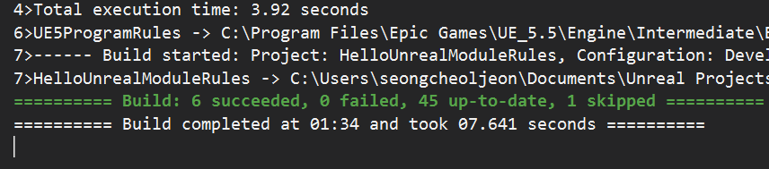
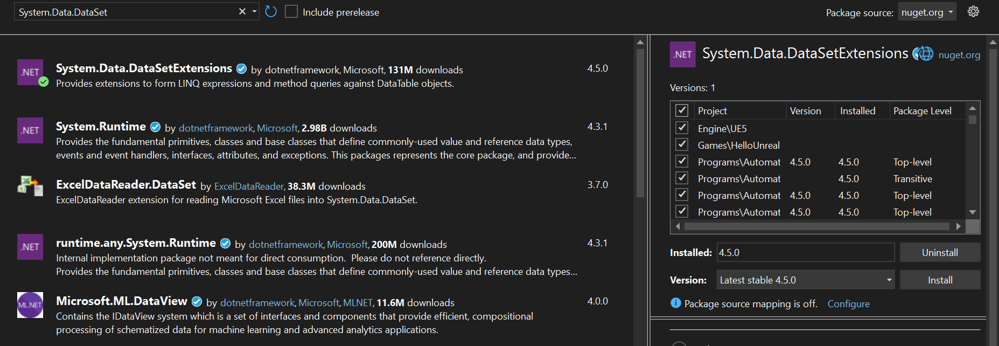
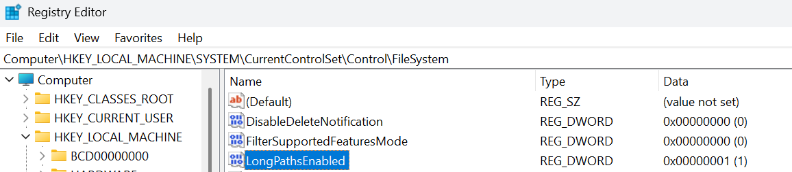
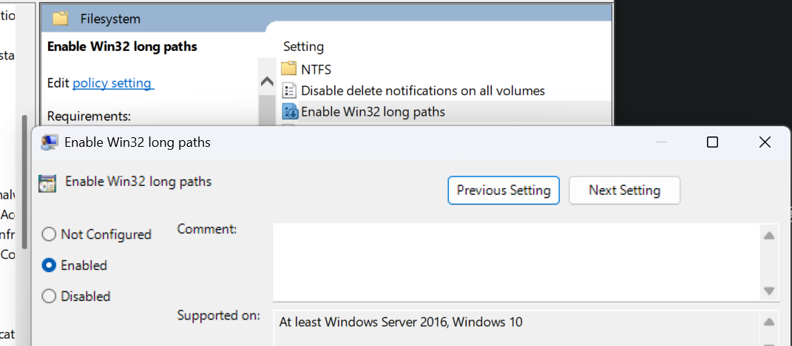
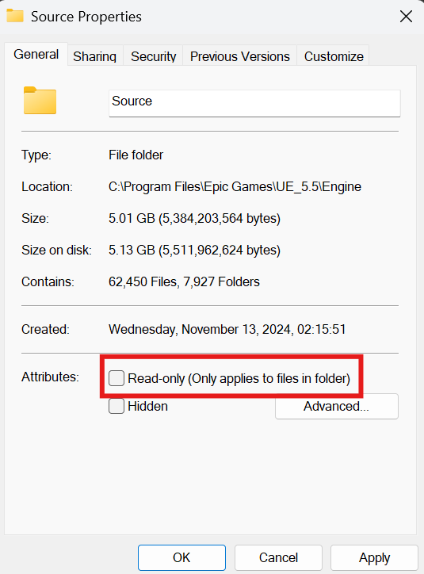

* UNREAL ENGINE: 5.5
* OS: Windows 11

C++ 소스 코드를 추가하여 `Visual Studio 2022` 에서 빌드를 진행하였다. 그런데 다음과 같은 오류가 발생하였다. 😢

```output
C:\Program Files\dotnet\sdk\9.0.100\Sdks\Microsoft.NET.Sdk\targets\Microsoft.PackageDependencyResolution.targets(266,5): error NETSDK1064: Package System.Data.DataSetExtensions, version 4.5.0 was not found. It might have been deleted since NuGet restore. Otherwise, NuGet restore might have only partially completed, which might have been due to maximum path length restrictions.

C:\Program Files\Microsoft Visual Studio\2022\Community\MSBuild\Current\Bin\amd64\Microsoft.Common.CurrentVersion.targets(5875,5): error MSB3491: Could not write lines to file "obj\Development\RunMutableCommandlet.Automation.csproj.FileListAbsolute.txt". Access to the path 'C:\Program Files\Epic Games\UE_5.5\Engine\Source\Programs\AutomationTool\Mutable\RunMutableCommandlet\obj\Development\RunMutableCommandlet.Automation.csproj.FileListAbsolute.txt' is denied.
```

이것으로 인하여 `Visual Studio`를 삭제했다가 설치했다를 몇번이고 반복하였는데... 아래의 캡쳐 사진과 같이 결국에는 잘 해결 되었다. 😀



해결한 그 과정을 적는다.

## System.Data.DataSetExtensions 패키지 관련 오류


우선 첫번째 `NuGet` 패키지 관련 오류이다. 이것은 다음과 같이 해결하였다.

`Visual Studio 2022` - `Tools` - `NuGet Package Manager` - `Manage Packages for Solution...` 을 클릭한다. 그 후, 검색창에 `System.Data.DataSetExtensions`를 입력하여 나오는 모든 패키지를 설치한다. (아래 사진 참고)



## 경로 길이 문제

### 첫번째 방법

`레지스트리 편집기`를 이용하는 방법이다. 

`Computer\HKEY_LOCAL_MACHINE\SYSTEM\CurrentControlSet\Control\FileSystem` 이곳으로 이동하여 `LongPathsEnabled`를 `1`로 설정한다. 그 후, 재부팅을 진행한다.



### 두번째 방법

`Local Group Policy Editor`를 이용하는 방법이다.

`Run`에서 `gpedit.msc`를 입력하여 `Local Group Policy Editor`를 실행시킨다.

그 후 `Computer Configuration` - `Administrative Templates` - `System` - `Filesystem` - `Enable Win32 long paths`의 속성을 `Enabled`로 변경한다.



나는 `첫번째 방법` 과 `두번째 방법` 모두를 진행하였다.

## 읽기 전용 해제

`C:\Program Files\Epic Games\UE_5.5\Engine\Source` 해당 경로의 폴더의 `읽기 전용`을 해제하자. 

{: width="400" }

그리곤 `Visual Studio`로 돌아가서 다시 `Build`를 진행하면 된다. 

혹여나 다시 한번 `권한 문제` 에러가 발생한다면, `C:\Program Files\Epic Games\UE_5.5` 해당 폴더 자체의 읽기 전용을 **해제**하면 빌드가 잘 진행될 것이다.
