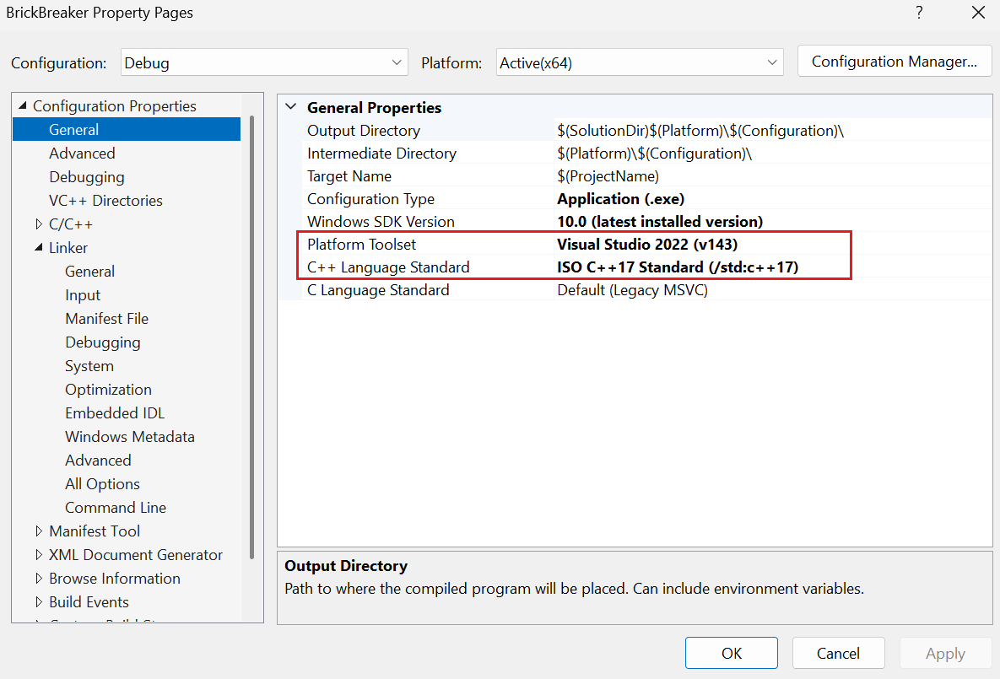
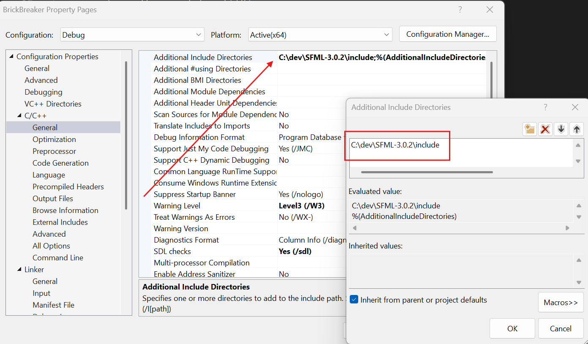
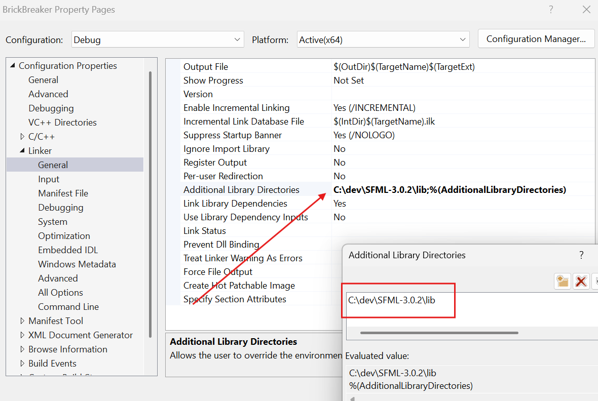
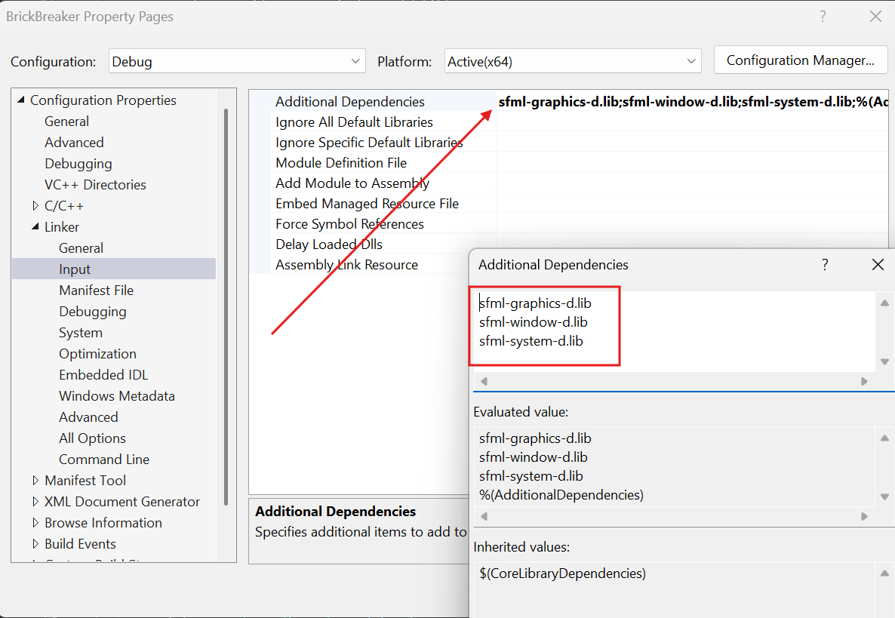
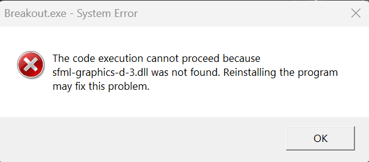
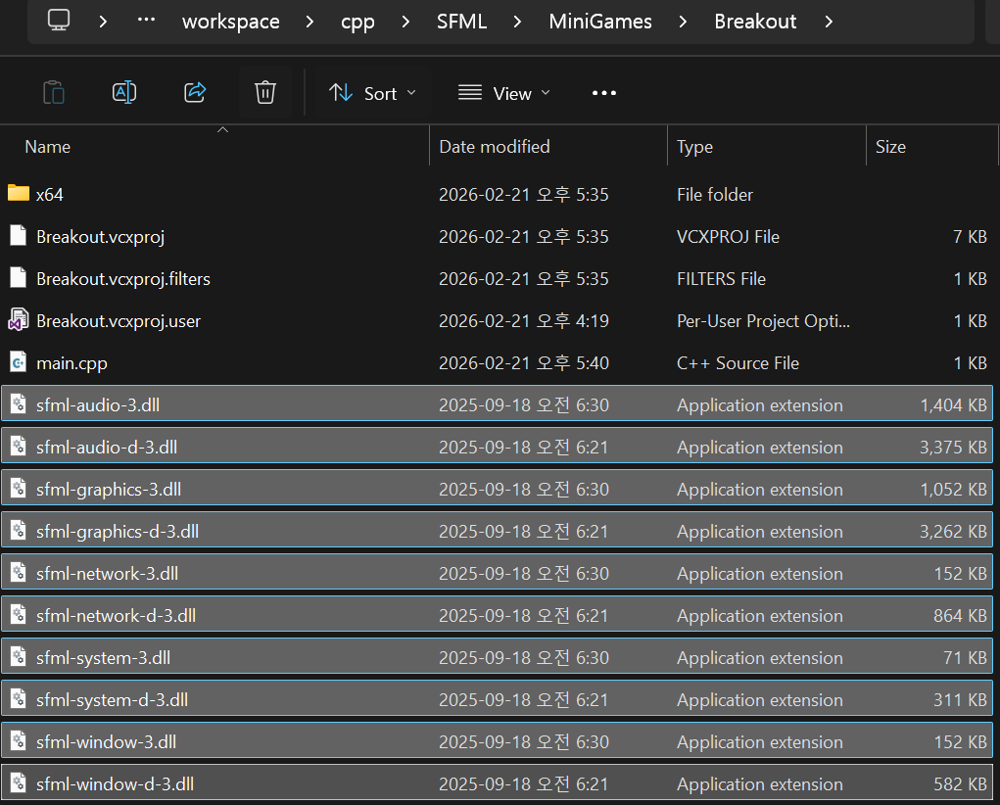
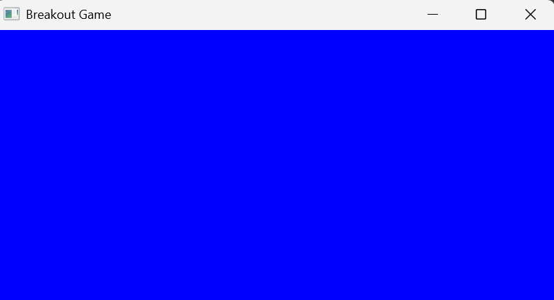
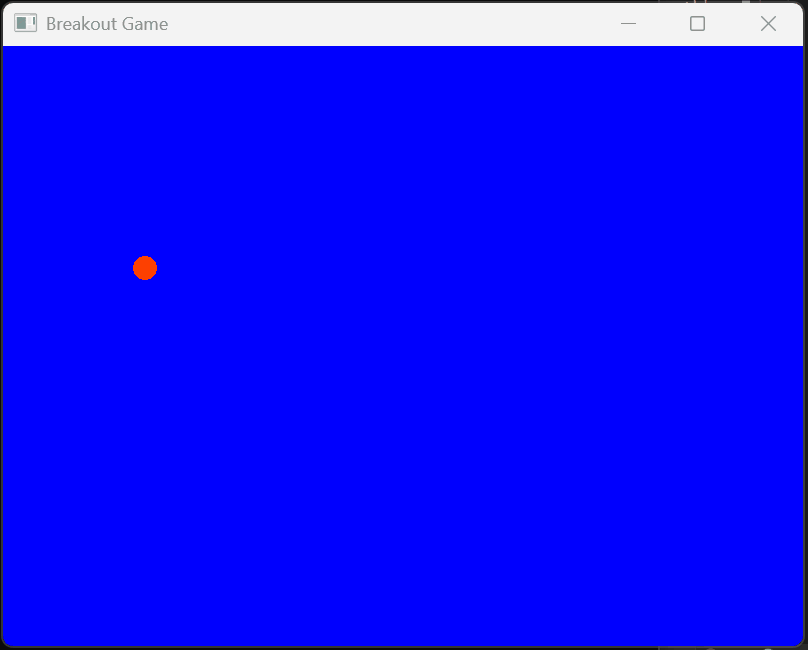

## SFML이란?

[SFML(Simple and Fast Multimedia Library)](https://www.sfml-dev.org/)은 `C++`용 크로스플랫폼 멀티미디어 라이브러리이다.

`SFML`은 `OpenGL` 위에 구축된 2D그래픽, 오디오, 네트워크, 윈도우 관리를 `추상화`한 라이브러리이다. `DirectX`, `OpenGL` 같은 저수준 API와 달리, **빠른 프로토타이핑과 학습을 목적으로 설계**되었다.

### SFML 5개의 모듈 구조
1. System
: 타이머, 스레드, 벡터 등 기반 유틸리티
2. Window
: OS 윈도우 생성, 입력(키보드/마우스) 처리
3. Graphics
: 2D 렌더링(스프라이트, 텍스처, 셰이더, RenderTexture)
4. Audio
: 사운드 재생(OpenAL 기반)
5. Network
: TCP/UDP 소켓

---

## SFML Breakout Game

### Breakout Game 시작하기에 앞서...

<details markdown="1">
<summary>Setting up and SFML Project in Visual Studio</summary>

[SFML](https://www.sfml-dev.org/download/)에 가서 라이브러리를 다운 받는다.

{: .w-50 .left}
그 후, `visual studio`에서 `Empty Project` 생성 후, `Property Pages`로 가서 다음과 같이 설정한다.

{: .w-100 .normal}
_Property -> General_
- [x] Platform Toolset -> Visual Studio 202 (v143)으로 변경
- [x] C++ Language Standard -> ISO C++ 17 Standard (/std:c++ 17)로 변경

{: .w-100 .normal}
_Property -> C/C++ -> General_
- [x] Additional Include Directories -> SFML `include` 디렉토리 추가

{: .w-100 .normal}
_Property -> Linker -> General_
- [x] Additional Library Directories -> SFML `lib` 디렉토리 추가

{: .w-100 .normal}
_Property -> Linker -> Input_
- [x] Additional Dependencies -> SFML `lib` 파일들 추가
  - sfml-graphics-d.lib
  - sfml-window-d.lib
  - sfml-system-d.lib
</details>

## 화면 작성

화면에 무엇인가를 그리려면 특수한 윈도우인 `sf::RenderWindow`를 사용하여야 한다. `sf::Window` 및 모든 기능을 상속받은 자식 윈도우이다.
모든 `sf::Window`(생성, 이벤트 처리, 프레임 속도 제어, OpenGL사용)의 기능은 `sf::RenderWindow`에서 사용할 수 있다.

`sf::RenderWindow`는 쉽게 그림을 그릴 수 있도록 `sf::Window`에 높은 수준의 기능을 추가한다.

- `clear()`
  - 선택한 색상으로 전체 윈도우를 지운다.
- `draw()`
  - 전달한 객체를 화면에 그린다.

 현재까지의 전체 소스는 다음과 같다.

 ```cpp
 #include <SFML/Graphics.hpp>


int main()
{
    sf::RenderWindow window(sf::VideoMode({
        static_cast<unsigned>(800), static_cast<unsigned>(600) }), "Breakout Game");
    window.setFramerateLimit(60);

    while (window.isOpen())
    {
        window.clear(sf::Color::Blue);

        while (const std::optional<sf::Event> event = window.pollEvent())
        {
            if (event->is<sf::Event::Closed>())
            {
                window.close();
            }
        }

        window.display();
    }

    return 0;
}
 ```

이것을 실행해 보자. 그러면 다음과 같은 에러 메시지를 볼 것이다.
{: .w-50 .normal}
_System Error_

이것은 `SFML`의 `dll`파일들이 없어서 나오는 문제이므로 해당 `dll`들을 프로젝트 디렉토리에 모두 `복사`해 주자.

{: .w-75 .normal}
_복사한 모습_

> `SFML 디렉토리/bin`{: .filepath}에 존재하는 모든 `dll`파일들을 `프로젝트 디렉토리`에 복사한다.
{: .prompt-tip}

그러면, 파란색 화면을 볼 수 있을 것이다.

{: .w-75 .normal}

## 공을 화면에 그려보자.

### 공을 `클래스`로 정의하고 객체를 생성하여 화면에 표시해 보자. 

`Ball` 클래스는 `CircleShape`이라는 클래스를 상속받아 작성한다.

```cpp
class Ball : public sf::CircleShape
{
};
```

`Ball(float x, float y)` 생성자는 외부로부터 공의 위치를 받아, 객체를 생성한다. 객체가 생성되면서 부모 클래스의 생성자인 `CircleShape(12.0)`이 호출된다. `12.0`은 공의 반지름이다.o

```cpp
Ball(float x, float y) : sf::CircleShape(12.0f)
{
    setPosition(sf::Vector2f(x, y)); // 공의 위치 설정
    setFillColor(sf::Color(255, 128, 0)); // 공의 색상 설정
    setOrigin(sf::Vector2f(0, 0)); // 공의 원점 설정 
}
```

`update()` 함수는 공의 현재 위치를 이동한다. 공이 벽에 부딪치면 공의 방향을 변경하는 코드도 가지고 있다.

```cpp
void update()
{
    move(sf::Vector2f(_speedx, _speedy)); // 공의 위치 업데이트
    if (getPosition().x < 0) // 왼쪽 벽과 충돌
    {
        _speedx = BALL_SPEED; // 오른쪽으로 이동
    }
    else if ((getPosition().x + 2 * 20) > 800) // 오른쪽 벽과 충돌
    {
        _speedx = -BALL_SPEED; // 왼쪽으로 이동
    }
    if (getPosition().y < 0) // 위쪽 벽과 충돌
    {
        _speedy = BALL_SPEED; // 아래로 이동
    } 
    else if ((getPosition().y + 2 * 20) > 600) // 아래쪽 벽과 충돌
    {
        _speedy = -BALL_SPEED; // 위로 이동
    }
}
```

현재까지의 전체 소스코드는 다음과 같다.

```cpp
#include <SFML/Graphics.hpp>

static constexpr float BALL_SPEED = 5.0f;


class Ball : public sf::CircleShape
{
public:
    Ball(float x, float y);
    void update(); // 공의 위치 업데이트

private:
    float _speedx = BALL_SPEED, _speedy = BALL_SPEED;
};

Ball::Ball(float x, float y) : sf::CircleShape(12.0f)
{
    setPosition(sf::Vector2f(x, y)); // 공의 위치 설정
    setFillColor(sf::Color(255, 64, 0)); // 공의 색상 설정
    setOrigin(sf::Vector2f(0, 0)); // 공의 원점 설정 
}

void Ball::update()
{
    move(sf::Vector2f(_speedx, _speedy)); // 공의 위치 업데이트
    if (getPosition().x < 0) // 왼쪽 벽과 충돌
    {
        _speedx = BALL_SPEED; // 오른쪽으로 이동
    }
    else if ((getPosition().x + 2 * 20) > 800) // 오른쪽 벽과 충돌
    {
        _speedx = -BALL_SPEED; // 왼쪽으로 이동
    }
    if (getPosition().y < 0) // 위쪽 벽과 충돌
    {
        _speedy = BALL_SPEED; // 아래로 이동
    } 
    else if ((getPosition().y + 2 * 20) > 600) // 아래쪽 벽과 충돌
    {
        _speedy = -BALL_SPEED; // 위로 이동
    }
}


int main()
{
    Ball ball{ 800.0 / 2, 600.0 / 2 };

    sf::RenderWindow window(sf::VideoMode(sf::Vector2u(
        static_cast<unsigned>(800), static_cast<unsigned>(600) )), "Breakout Game");
    window.setFramerateLimit(60);

    while (window.isOpen())
    {
        window.clear(sf::Color::Blue);

        while (const std::optional<sf::Event> event = window.pollEvent())
        {
            if (event->is<sf::Event::Closed>())
            {
                window.close();
            }
        }

        ball.update();
        window.draw(ball);
        window.display();
    }

    return 0;
}
```

{: .w-50 .normal}

## 패들과 벽돌을 화면에 그려보자.

패들과 벽돌은 모두 `사각형`이므로 `RectangleShape`에서 상속받자.

### Paddle

패들을 나타내는 `Paddle` 클래스를 살펴보자. 멤버 변수로는 패들의 초기 위치를 나타내는 `_init_x`, `_init_y`가 추가되었다. 

```cpp
class Paddle : public sf::RectangleShape
{
public:
    Paddle(float x, float y);
    void update(int x); // 패들의 위치 업데이트

private:
    float _init_x, _init_y;
};
```

`update()` 함수는 패들의 위치를 설정하는데 사용된다. 패들은 x방향으로만 움직이므로 마우스에서 위치를 받아 패들의 위치를 설정한다.

```cpp
void Paddle::update(int x)
{
    setPosition(sf::Vector2f(x, _init_y)); // 패들의 위치 업데이트
}
```

### Brick

벽돌을 나타내는 `Brick` 클래스도 `RectangleShape`을 상속받아 작성된다. 멤버 변수로는 `_is_destroyed`가 있는데 공이 벽돌을 맞추는 경우, 벽돌이 `소멸`되어야 하기 때문이다.

```cpp
class Brick : public sf::RectangleShape
{
public:
    Brick(float x, float y);

private:
    bool _is_destroyed = false;
};
```

중요한 코드는 바로 벽돌을 여러 개 생성하는 코드이다.

```cpp
std::vector<Brick> bricks;

for (int x = 0; x < 10; x++)
{
    for (int y = 0; y < 5; y++)
    {
        bricks.push_back(Brick(x * (60 + 3) + 20, y * (20 + 3) + 4));
    }
}
```

현재까지의 main 소스는 다음과 같다.
```cpp
#include <SFML/Graphics.hpp>
#include <vector>
#include "Ball.h"
#include "Paddle.h"
#include "Brick.h"


int main()
{
    Ball ball{ 800.0 / 2, 600.0 / 2 };
    Paddle paddle{ 800.0 / 2, 550.0 };
    std::vector<Brick> bricks;

    const int brickWidth = 60;
    const int brickHeight = 20;
    const int brickSpacing = 3;
    const int columns = 10;
    const int rows = 5;
    
    const float gridWidth = columns * brickWidth + (columns - 1) * brickSpacing;
    const float startX = (800.0f - gridWidth) / 2.0f;
    const float startY = 50.0f;

    for (int x = 0; x < columns; x++)
    {
        for (int y = 0; y < rows; y++)
        {
            bricks.push_back(Brick(startX + x * (brickWidth + brickSpacing), 
                                   startY + y * (brickHeight + brickSpacing)));
        }
    }

    sf::RenderWindow window(sf::VideoMode(sf::Vector2u(
        static_cast<unsigned>(800), static_cast<unsigned>(600) )), "Breakout Game");
    window.setFramerateLimit(60);

    while (window.isOpen())
    {
        window.clear(sf::Color::Blue);

        while (const std::optional<sf::Event> event = window.pollEvent())
        {
            if (event->is<sf::Event::Closed>())
            {
                window.close();
            }
        }

        ball.update();

        window.draw(ball);
        window.draw(paddle);

        for (const auto& brick : bricks)
        {
            window.draw(brick);
        }

        window.display();
    }

    return 0;
}
```

## 패들 이동 및 충돌 처리

### Paddle

패들을 마우스에 따라 움직이고, 공이 패들에서 반사되게 하며, 공이 벽돌에 부딪치면 벽돌이 소멸되도록 하자.

마우스의 좌표를 얻는 코드
```cpp
paddle.update(sf::Mouse::getPosition(window).x);
```

공이 패들에 반사되게 하려면 공이 패들과 `충돌`하였는지를 검사해야 한다. 게임에서 충돌 검사는 아주 중요한 부분으로 공이 감싸는 사각형과 패들을 감싸는 사각형이 겹치는 지를 검사하면 된다.

`Ball` 클래스의 멤버 함수로 `IsIntersecting()`를 작성하자. 해당 메소드는 공 객체와 패들 객체가 충돌하였는지 `getGlobalBounds().intersects()`를 호출하여 알아낸다.

- __getGlobalBounds()__
  - 객체를 감싸는 사각형 객체를 반환
- __intersects()__
  - 사각형이 겹치는 지를 판단

```cpp
bool Ball::IsIntersecting(Paddle& paddle) const
{
    return getGlobalBounds().findIntersection(paddle.getGlobalBounds()).has_value();
}
```

공이 패들과 충돌하면 반사되어야 한다.
```cpp
void Ball::HandleCollision(Paddle& paddle)
{
    if (!IsIntersecting(paddle))
    {
        return;
    }

    _speedy = -BALL_SPEED; // 공의 수직 방향 속도 반전
    _speedx = (getPosition().x < paddle.getPosition().x)
        ?  _speedx = -BALL_SPEED
        : _speedx = BALL_SPEED;
}
```

공과 패들이 충돌하면 공의 속도를 음수로 만들면 공이 위쪽으로 방향을 변경한다. 공의 x좌표와 패들의 x좌표를 비교하여 공의 x축 방향도 변경한다.

### Brick

공이 벽돌과 충돌하면 벽돌 객체는 삭제되어야 한다. 이것을 위해 벡터 안의 모든 벽돌 객체와 공과의 충돌을 검사한다.
충돌이 발생한 벽돌 객체는 `_is_destroyed` 변수가 `true`로 설정된다.

```cpp
for(auto& brick: bricks)
{
  brick.HandleCollision(ball);
}
```

이어서 `STL`알고리즘의 `remove_if()`와 `erase()` 함수를 사용한다. `remove_if()` 함수는 조건을 만족하는 객체들을 표시하고, `erase()` 함수는 이들 객체를 벡터에서 삭제한다.

```cpp
bricks.erase(std::remove_if(bricks.begin(), bricks.end()
    , [](Brick& b) -> bool
    {
        return b.IsDestroyed();
    }
), bricks.end());
```

## 최종 결과

전체 소스는 다음과 같다.

### Ball

```cpp
#pragma once

#include <SFML/Graphics.hpp>

static constexpr float BALL_SPEED = 5.0f;


class Ball : public sf::CircleShape
{
public:
    Ball(float x, float y);
    void update(); // 공의 위치 업데이트
    bool IsIntersecting(class Paddle& paddle) const;
    void HandleCollision(class Paddle& paddle);
    void ReverseSpeedX();
    void ReverseSpeedY();

private:
    float _speedx = BALL_SPEED, _speedy = BALL_SPEED;
};
```
{: file='include/Ball.h'}

```cpp
#include "Ball.h"
#include "Paddle.h"


Ball::Ball(float x, float y) : sf::CircleShape(12.0f)
{
    setPosition(sf::Vector2f(x, y)); // 공의 위치 설정
    setFillColor(sf::Color(255, 64, 0)); // 공의 색상 설정
    setOrigin(sf::Vector2f(0, 0)); // 공의 원점 설정 
}

void Ball::update()
{
    move(sf::Vector2f(_speedx, _speedy)); // 공의 위치 업데이트
    float ballDiameter = getRadius() * 2;
    
    if (getPosition().x < 0) // 왼쪽 벽과 충돌
    {
        _speedx = BALL_SPEED; // 오른쪽으로 이동
    }
    else if ((getPosition().x + ballDiameter) > 800) // 오른쪽 벽과 충돌
    {
        _speedx = -BALL_SPEED; // 왼쪽으로 이동
    }
    if (getPosition().y < 0) // 위쪽 벽과 충돌
    {
        _speedy = BALL_SPEED; // 아래로 이동
    } 
    else if ((getPosition().y + ballDiameter) > 600) // 아래쪽 벽과 충돌
    {
        _speedy = -BALL_SPEED; // 위로 이동
    }
}

bool Ball::IsIntersecting(Paddle& paddle) const
{
    return getGlobalBounds().findIntersection(paddle.getGlobalBounds()).has_value();
}

void Ball::HandleCollision(Paddle& paddle)
{
    if (!IsIntersecting(paddle))
    {
        return;
    }

    _speedy = -BALL_SPEED; // 공의 수직 방향 속도 반전
    _speedx = (getPosition().x < paddle.getPosition().x) ? -BALL_SPEED : BALL_SPEED;
}

void Ball::ReverseSpeedX()
{
    _speedx = -_speedx;
}

void Ball::ReverseSpeedY()
{
    _speedy = -_speedy;
}
```
{: file='include/Ball.cpp'}

### Paddle

```cpp
#pragma once

#include <SFML/Graphics.hpp>


class Paddle : public sf::RectangleShape
{
public:
    Paddle(float x, float y);
    void update(int x); // 패들의 위치 업데이트

private:
    float _init_x, _init_y;
};
```
{: file='include/Paddle.h'}

```cpp
#include "Paddle.h"


Paddle::Paddle(float x, float y) : _init_x(x), _init_y(y)
{
    setSize(sf::Vector2f(80.0f, 20.0f)); // 패들의 크기 설정
    setPosition(sf::Vector2f(x, y)); // 패들의 위치 설정
    setFillColor(sf::Color(0, 255, 255)); // 패들의 색상 설정
    setOrigin(sf::Vector2f(0, 0)); // 패들의 원점 설정
}

void Paddle::update(int x)
{
    setPosition(sf::Vector2f(x, _init_y)); // 패들의 위치 업데이트
}
```
{: file='include/Paddle.cpp'}

### Brick

```cpp
#pragma once

#include <SFML/Graphics.hpp>


class Brick : public sf::RectangleShape
{
public:
    Brick(float x, float y);
    bool IsIntersecting(class Ball& ball) const;
    void HandleCollision(class Ball& ball);
    bool IsDestroyed() const;

private:
    bool _is_destroyed = false;
};
```
{: file='include/Brick.h'}

```cpp
#include "Brick.h"
#include "Ball.h"


Brick::Brick(float x, float y)
{
    setSize(sf::Vector2f(60.0f, 20.0f)); // 벽돌의 크기 설정)
    setPosition(sf::Vector2f(x, y)); // 벽돌의 위치 설정
    setFillColor(sf::Color(255, 255, 0)); // 벽돌의 색상 설정
    setOrigin(sf::Vector2f(0, 0)); // 벽돌의 원점 설정
}

bool Brick::IsIntersecting(Ball& ball) const
{
    return getGlobalBounds().findIntersection(ball.getGlobalBounds()).has_value();
}

void Brick::HandleCollision(Ball& ball)
{
    if (!IsIntersecting(ball))
    {
        return;
    }

    _is_destroyed = true;

    auto ballBounds = ball.getGlobalBounds();
    auto brickBounds = getGlobalBounds();

    float ballCenterX = ballBounds.position.x + ballBounds.size.x / 2.0f;
    float ballCenterY = ballBounds.position.y + ballBounds.size.y / 2.0f;
    float brickCenterX = brickBounds.position.x + brickBounds.size.x / 2.0f;
    float brickCenterY = brickBounds.position.y + brickBounds.size.y / 2.0f;

    float overlapX = (ballBounds.size.x + brickBounds.size.x) / 2.0f - std::abs(ballCenterX - brickCenterX);
    float overlapY = (ballBounds.size.y + brickBounds.size.y) / 2.0f - std::abs(ballCenterY - brickCenterY);

    if (overlapX < overlapY)
    {
        ball.ReverseSpeedX();
    }
    else
    {
        ball.ReverseSpeedY();
    }
}

bool Brick::IsDestroyed() const
{
    return _is_destroyed; // 벽돌이 파괴되었는지 여부 반환
}
```
{: file='include/Brick.cpp'}

### Main

```cpp
#include <SFML/Graphics.hpp>
#include <vector>
#include "Ball.h"
#include "Paddle.h"
#include "Brick.h"


int main()
{
    Ball ball{ 800.0 / 2, 600.0 / 2 };
    Paddle paddle{ 800.0 / 2, 550.0 };
    std::vector<Brick> bricks;

    const int brickWidth = 60;
    const int brickHeight = 20;
    const int brickSpacing = 3;
    const int columns = 10;
    const int rows = 5;
    
    const float gridWidth = columns * brickWidth + (columns - 1) * brickSpacing;
    const float startX = (800.0f - gridWidth) / 2.0f;
    const float startY = 50.0f;

    for (int x = 0; x < columns; x++)
    {
        for (int y = 0; y < rows; y++)
        {
            bricks.push_back(Brick(startX + x * (brickWidth + brickSpacing), 
                                   startY + y * (brickHeight + brickSpacing)));
        }
    }

    sf::RenderWindow window(sf::VideoMode(sf::Vector2u(
        static_cast<unsigned>(800), static_cast<unsigned>(600) )), "Breakout Game");
    window.setFramerateLimit(60);

    while (window.isOpen())
    {
        window.clear(sf::Color::Blue);

        while (const std::optional<sf::Event> event = window.pollEvent())
        {
            if (event->is<sf::Event::Closed>())
            {
                window.close();
            }
        }

        paddle.update(sf::Mouse::getPosition(window).x);

        ball.update();
        ball.HandleCollision(paddle);
        for (auto& brick : bricks)
        {
            brick.HandleCollision(ball);
        }
        bricks.erase(std::remove_if(bricks.begin(), bricks.end()
            , [](Brick& b) -> bool
            {
                return b.IsDestroyed();
            }
        ), bricks.end());

        window.draw(ball);
        window.draw(paddle);

        for (const auto& brick : bricks)
        {
            window.draw(brick);
        }

        window.display();
    }

    return 0;
}
```
{: file='include/main.cpp'}

{: .w-75 .normal}
